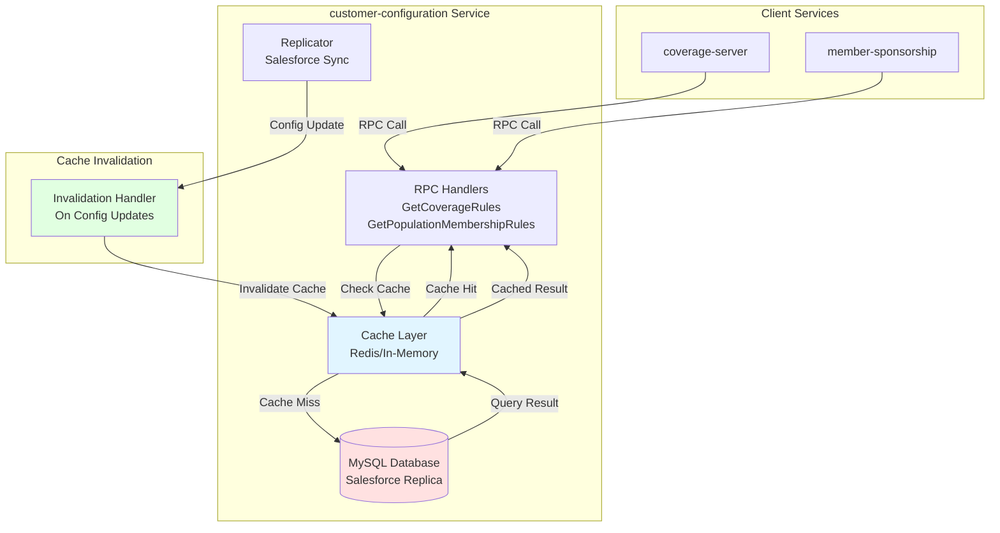

# Coverage Rules and Population Membership Rules Caching Plan

## Executive Summary

This document describes the implementation plan for **caching CoverageRules and PopulationMembershipRules** in the `customer-configuration` service to address performance issues and reduce database load.

**Problem**: 
- `GetCoverageRules` times out frequently (ACT-1385)
- `GetPopulationMembershipRules` has peak latency of 4s
- Customer-configuration has higher traffic than coverage-server
- Database queries are slow due to large result sets (3,351+ benefit contracts per enrollment channel)

**Solution**: 
- Add cache layer for `CoverageRules` and `PopulationRules` indexed by enrollment channel ID
- Cache TTL aligned with replicator frequency
- Graceful degradation on cache misses
- Cache invalidation on configuration updates

**Key Benefits**:
- **Reduced latency**: Cache hits < 10ms vs. 4s+ database queries
- **Reduced database load**: < 1000 active enrollment channels, configuration changes infrequently
- **Improved reliability**: Fewer timeout errors and client disconnects
- **Better scalability**: Handle higher RPC QPS without database pressure

**Related Issues**:
- ACT-1385: Failed to get coverage rules for enrollment channel (timeout/client disconnect)
- ACT-2027: Feature option query performance (related query performance issue)
- ACT-2219: Cache coverage rules and population membership rules (this plan)

---

## Problem Analysis

### Current State

**Service**: `customer-configuration`

**Endpoints**:
1. `GetCoverageRules` - Returns coverage rules for an enrollment channel
2. `GetPopulationMembershipRules` - Returns population membership rules

**Performance Issues**:
- `GetCoverageRules`: Frequent timeouts, especially for enrollment channels with large benefit contract lists (3,351+ contracts)
- `GetPopulationMembershipRules`: Peak latency of 4s
- Database queries fail with "Prepared statement contains too many placeholders" (Error 1390)
- Client disconnects occur when queries take too long

**Root Causes**:
1. **No Caching**: Every request hits the database
2. **Large Result Sets**: Enrollment channels can have thousands of benefit contracts
3. **High Traffic**: Customer-configuration has higher RPC QPS than coverage-server
4. **Inefficient Queries**: Fetches all resources related to enrollment channel (not just matching predicates)

**Data Characteristics**:
- **< 1000 active enrollment channels**: Small, manageable dataset
- **Configuration changes infrequently**: Salesforce configuration is relatively static
- **No read-after-write guarantees needed**: Configuration updates are not time-sensitive
- **Replicator frequency**: Configuration is replicated from Salesforce periodically (typically 5-10 minutes)

---

## Solution Design

### Architecture Overview



### Cache Strategy

**Option 1: Redis Cache (Recommended)**
- **Pros**: 
  - Shared across service instances
  - Persistent across restarts
  - Built-in TTL support
  - High performance
- **Cons**: 
  - Additional infrastructure dependency
  - Network latency (minimal)

**Option 2: In-Memory Cache**
- **Pros**: 
  - No external dependencies
  - Lowest latency
- **Cons**: 
  - Not shared across instances
  - Lost on restart
  - Higher memory usage per instance

**Recommendation**: **Redis Cache** for shared state and persistence, with in-memory fallback for resilience.

### Cache Key Design

**CoverageRules Cache Key**:
```
coverage_rules:{enrollment_channel_id}
```

**PopulationMembershipRules Cache Key**:
```
population_membership_rules:{enrollment_channel_id}
```

**Alternative**: Use population ID for population membership rules:
```
population_membership_rules:{population_id}
```

### Cache TTL Strategy

**Primary TTL**: Match replicator frequency
- **Default**: 10 minutes (600 seconds)
- **Configurable**: Via service configuration
- **Rationale**: Replicator syncs from Salesforce every 5-10 minutes, so 10-minute TTL ensures cache is refreshed after each sync

**Stale-While-Revalidate**: 
- Return stale cache while refreshing in background
- Prevents cache stampede on TTL expiration
- Improves availability during high load

### Cache Invalidation

**Automatic Invalidation**:
1. **On Replicator Sync**: Invalidate cache when replicator updates configuration
2. **On Manual Updates**: Invalidate cache when configuration is manually updated
3. **On TTL Expiration**: Cache expires naturally after TTL

**Invalidation Strategy**:
- **Pattern-based**: Invalidate all keys matching `coverage_rules:*` or `population_membership_rules:*`
- **Selective**: Invalidate specific enrollment channel IDs when updated
- **Full Invalidation**: Option to clear all cache (for emergency scenarios)

---

## Implementation Plan

### Phase 1: Cache Infrastructure Setup

**Tasks**:
1. **Add Redis Client** (if not already present)
   - Add Redis dependency to `customer-configuration`
   - Configure Redis connection (host, port, password, pool size)
   - Add health check for Redis connectivity

2. **Create Cache Interface**
   - Define `Cache` interface with methods:
     - `Get(ctx context.Context, key string) ([]byte, error)`
     - `Set(ctx context.Context, key string, value []byte, ttl time.Duration) error`
     - `Delete(ctx context.Context, key string) error`
     - `DeletePattern(ctx context.Context, pattern string) error`

3. **Implement Redis Cache**
   - Implement `Cache` interface using Redis client
   - Add connection pooling and error handling
   - Add metrics for cache operations (hits, misses, errors)

4. **Add In-Memory Fallback**
   - Implement in-memory cache as fallback when Redis is unavailable
   - Use LRU eviction policy
   - Log when fallback is used

**Files to Create/Modify**:
- `customer-configuration/app/cache/cache.go` - Cache interface
- `customer-configuration/app/cache/redis_cache.go` - Redis implementation
- `customer-configuration/app/cache/memory_cache.go` - In-memory fallback
- `customer-configuration/app/cache/metrics.go` - Cache metrics

**Estimated Time**: 2-3 days

---

### Phase 2: Cache Layer for GetCoverageRules

**Tasks**:
1. **Add Cache Wrapper**
   - Create `CachedCoverageRulesService` that wraps existing service
   - Implement cache-aside pattern:
     - Check cache first
     - On miss: query database, store in cache, return result
     - On hit: return cached result

2. **Serialization**
   - Serialize `CoverageRules` to JSON for cache storage
   - Deserialize on cache retrieval
   - Handle serialization errors gracefully

3. **Error Handling**
   - Cache misses should fall through to database query
   - Cache errors should not block requests (log and continue)
   - Database errors should not be cached

4. **Metrics and Logging**
   - Add metrics: cache hit rate, cache miss rate, cache errors
   - Log cache operations (debug level)
   - Log cache misses for monitoring

**Files to Create/Modify**:
- `customer-configuration/app/service/coverage/cached_coverage_rules.go` - Cached service wrapper
- `customer-configuration/app/service/coverage/coverage_rules.go` - Existing service (may need refactoring)

**Code Example**:
```go
type CachedCoverageRulesService struct {
    cache  cache.Cache
    db     *sql.DB
    logger *zap.Logger
}

func (s *CachedCoverageRulesService) GetCoverageRules(
    ctx context.Context,
    enrollmentChannelID string,
) (*model.CoverageRules, error) {
    // Check cache
    cacheKey := fmt.Sprintf("coverage_rules:%s", enrollmentChannelID)
    cached, err := s.cache.Get(ctx, cacheKey)
    if err == nil && cached != nil {
        var rules model.CoverageRules
        if err := json.Unmarshal(cached, &rules); err == nil {
            metrics.CacheHits.Inc()
            return &rules, nil
        }
    }
    
    // Cache miss - query database
    metrics.CacheMisses.Inc()
    rules, err := s.dbService.GetCoverageRules(ctx, enrollmentChannelID)
    if err != nil {
        return nil, err
    }
    
    // Store in cache
    if data, err := json.Marshal(rules); err == nil {
        _ = s.cache.Set(ctx, cacheKey, data, 10*time.Minute)
    }
    
    return rules, nil
}
```

**Estimated Time**: 2-3 days

---

### Phase 3: Cache Layer for GetPopulationMembershipRules

**Tasks**:
1. **Add Cache Wrapper**
   - Similar to `GetCoverageRules` cache wrapper
   - Use population ID or enrollment channel ID as cache key

2. **Serialization and Error Handling**
   - Same pattern as `GetCoverageRules`

3. **Metrics and Logging**
   - Same pattern as `GetCoverageRules`

**Files to Create/Modify**:
- `customer-configuration/app/service/population/cached_population_membership_rules.go` - Cached service wrapper
- `customer-configuration/app/service/population/population_membership_rules.go` - Existing service

**Estimated Time**: 1-2 days

---

### Phase 4: Cache Invalidation

**Tasks**:
1. **Replicator Integration**
   - Add cache invalidation hook in replicator
   - Invalidate cache when `sc_provisioning` or related tables are updated
   - Use pattern-based invalidation: `coverage_rules:*` and `population_membership_rules:*`

2. **Manual Invalidation Endpoint** (Optional)
   - Add admin endpoint to invalidate cache for specific enrollment channels
   - Add endpoint to clear all cache (for emergency scenarios)

3. **Invalidation Strategy**
   - **On Replicator Update**: Invalidate all cache (safe, TTL will refresh)
   - **On Specific Update**: Invalidate specific enrollment channel IDs
   - **On Error**: Log invalidation errors, don't block replicator

**Files to Create/Modify**:
- `customer-configuration/app/service/replicator/invalidation.go` - Cache invalidation logic
- `customer-configuration/app/handler/admin/cache.go` - Admin endpoints (optional)

**Code Example**:
```go
func (r *Replicator) InvalidateCacheOnUpdate(ctx context.Context, tableName string) error {
    switch tableName {
    case "sc_provisioning", "sc_benefit_contract", "sc_alpha_prefix_config":
        // Invalidate all coverage rules and population membership rules
        patterns := []string{
            "coverage_rules:*",
            "population_membership_rules:*",
        }
        for _, pattern := range patterns {
            if err := r.cache.DeletePattern(ctx, pattern); err != nil {
                telemetry.L(ctx).Warn("Failed to invalidate cache pattern",
                    zap.String("pattern", pattern),
                    zap.Error(err),
                )
            }
        }
    }
    return nil
}
```

**Estimated Time**: 1-2 days

---

### Phase 5: Configuration and Monitoring

**Tasks**:
1. **Configuration**
   - Add cache TTL configuration (default: 10 minutes)
   - Add Redis connection configuration
   - Add cache enable/disable flag (for gradual rollout)

2. **Metrics**
   - Cache hit rate: `cache_hits / (cache_hits + cache_misses)`
   - Cache miss rate: `cache_misses / (cache_hits + cache_misses)`
   - Cache error rate: `cache_errors / total_requests`
   - Cache latency: P50, P95, P99
   - Database query reduction: Compare query rate before/after caching

3. **Dashboards**
   - Create Grafana dashboard for cache metrics
   - Add alerts for high cache miss rates or cache errors
   - Monitor cache hit rate improvement

4. **Logging**
   - Log cache operations (debug level)
   - Log cache misses for monitoring
   - Log cache errors (warn level)

**Files to Create/Modify**:
- `customer-configuration/platform/observability.yaml` - Add cache metrics
- `customer-configuration/platform/dashboards/cache.json` - Cache dashboard
- `customer-configuration/app/config/cache.go` - Cache configuration

**Estimated Time**: 1-2 days

---

### Phase 6: Testing and Validation

**Tasks**:
1. **Unit Tests**
   - Test cache hit/miss scenarios
   - Test cache serialization/deserialization
   - Test cache invalidation
   - Test error handling (cache unavailable, serialization errors)

2. **Integration Tests**
   - Test end-to-end flow with Redis
   - Test fallback to in-memory cache
   - Test cache invalidation on replicator updates

3. **Load Testing**
   - Compare latency before/after caching
   - Verify cache hit rate under load
   - Verify database load reduction

4. **Production Validation**
   - Gradual rollout (canary deployment)
   - Monitor cache hit rate and latency
   - Verify timeout reduction (ACT-1385)
   - Verify latency improvement (4s → < 100ms)

**Estimated Time**: 2-3 days

---

## Alternative Approaches

### Option 1: Materialized Views (Per Dan Busch's Suggestion)

**Approach**: Pre-compute coverage rules and population membership rules in materialized views, refresh on replicator sync.

**Pros**:
- No cache invalidation complexity
- Always consistent with database
- Simpler architecture

**Cons**:
- Requires database schema changes
- Materialized view refresh may be slow
- Less flexible than caching

**Recommendation**: Consider for future optimization, but caching is faster to implement and provides immediate benefits.

### Option 2: Pre-computation Service

**Approach**: Separate service that pre-computes coverage rules and stores in database table, refreshed on replicator sync.

**Pros**:
- Pre-computed results ready for fast retrieval
- No cache invalidation needed

**Cons**:
- Additional service to maintain
- More complex architecture
- Still requires database queries (though faster)

**Recommendation**: Overkill for current needs. Caching is simpler and sufficient.

---

## Success Metrics

### Performance Metrics

**Target Improvements**:
- **Latency**: P95 latency < 100ms (from 4s+)
- **Timeout Rate**: Reduce timeout errors by 90%+
- **Database Load**: Reduce database queries by 80%+ (assuming 80% cache hit rate)

**Monitoring**:
- Cache hit rate: Target > 80%
- Cache miss rate: Target < 20%
- Cache error rate: Target < 0.1%
- Database query reduction: Monitor query rate before/after

### Reliability Metrics

**Target Improvements**:
- **Error Rate**: Reduce "Failed to get coverage rules" errors by 90%+
- **Client Disconnects**: Reduce client disconnect errors (ACT-1385)
- **Availability**: Maintain 99.9% availability even during cache failures

---

## Risks and Mitigations

### Risk 1: Cache Staleness

**Risk**: Cached data may be stale if configuration is updated but cache is not invalidated.

**Mitigation**:
- TTL aligned with replicator frequency (10 minutes)
- Cache invalidation on replicator updates
- Stale-while-revalidate pattern for high availability
- Monitor cache hit rate and adjust TTL if needed

### Risk 2: Cache Unavailability

**Risk**: Redis may be unavailable, causing all requests to fall through to database.

**Mitigation**:
- In-memory fallback cache
- Graceful degradation (cache errors don't block requests)
- Health checks and alerts
- Monitor cache availability

### Risk 3: Cache Stampede

**Risk**: Cache expiration may cause thundering herd of database queries.

**Mitigation**:
- Stale-while-revalidate pattern
- Random TTL jitter (±10% of base TTL)
- Singleflight pattern for concurrent cache misses

### Risk 4: Memory Usage

**Risk**: Large result sets may consume significant cache memory.

**Mitigation**:
- Monitor cache memory usage
- Set appropriate cache size limits
- Use LRU eviction if needed
- Consider compression for large values

---

## Rollout Plan

### Phase 1: Infrastructure (Week 1)
- Set up Redis infrastructure
- Implement cache interface and Redis client
- Add configuration and monitoring

### Phase 2: GetCoverageRules Caching (Week 2)
- Implement cache layer for `GetCoverageRules`
- Add metrics and logging
- Deploy to staging for testing

### Phase 3: GetPopulationMembershipRules Caching (Week 3)
- Implement cache layer for `GetPopulationMembershipRules`
- Add metrics and logging
- Deploy to staging for testing

### Phase 4: Cache Invalidation (Week 4)
- Implement cache invalidation on replicator updates
- Add admin endpoints (optional)
- Deploy to staging for testing

### Phase 5: Production Rollout (Week 5)
- Gradual rollout (canary deployment)
- Monitor metrics and adjust as needed
- Full rollout after validation

**Total Estimated Time**: 5 weeks

---

## Dependencies

### Infrastructure
- Redis cluster (if not already available)
- Monitoring and alerting infrastructure

### Code Dependencies
- `go-common` libraries (if Redis client is shared)
- Existing service implementations (no breaking changes)

### Team Dependencies
- Customer-configuration team for implementation
- Platform team for Redis infrastructure (if needed)
- Observability team for metrics and dashboards

---

## Open Questions

1. **Redis Infrastructure**: Is Redis already available for customer-configuration, or does it need to be set up?
2. **Cache Key Strategy**: Should we use enrollment channel ID or population ID for population membership rules?
3. **TTL Configuration**: What is the exact replicator frequency? Should TTL be configurable per environment?
4. **Invalidation Strategy**: Should we invalidate all cache on any update, or only specific enrollment channels?
5. **Monitoring**: What existing dashboards/alerts should we integrate with?

---

## References

- **ACT-1385**: Failed to get coverage rules for enrollment channel
- **ACT-2027**: Feature option query performance
- **ACT-2219**: Cache coverage rules and population membership rules
- **ACT_2507_TRIAGE.md**: Detailed investigation findings
- **RTE_RESEARCH.md**: Related timeout and performance research

---

## Appendix: Code Locations

### Current Implementation
- `customer-configuration/app/service/coverage/` - Coverage rules service
- `customer-configuration/app/service/population/` - Population membership rules service
- `customer-configuration/app/service/replicator/` - Replicator service

### Proposed New Files
- `customer-configuration/app/cache/cache.go` - Cache interface
- `customer-configuration/app/cache/redis_cache.go` - Redis implementation
- `customer-configuration/app/cache/memory_cache.go` - In-memory fallback
- `customer-configuration/app/service/coverage/cached_coverage_rules.go` - Cached wrapper
- `customer-configuration/app/service/population/cached_population_membership_rules.go` - Cached wrapper
- `customer-configuration/app/service/replicator/invalidation.go` - Cache invalidation
