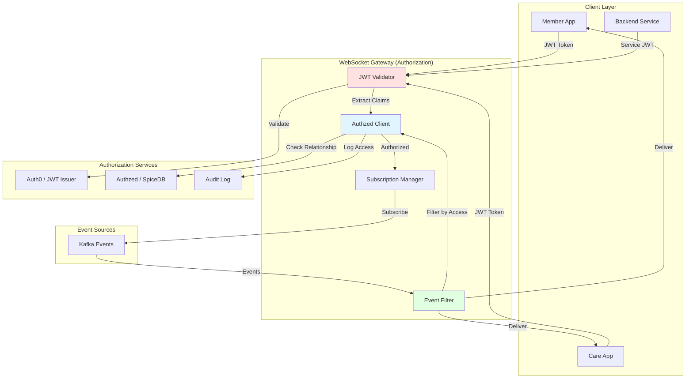

# Access Control & Authorization for Event-Driven WebSocket Gateway

## Executive Summary

This document defines the **authorization model** for the event-driven WebSocket Gateway, ensuring **HIPAA-compliant** access control for member data, care team coordination, and service-to-service communication.

**Key Principles**:
1. **Defense in depth** - Multiple authorization layers (JWT, Authzed, event annotations)
2. **Least privilege** - Users/services only see what they need
3. **Relationship-based** - Access controlled by care relationships (member, care coordinator, family)
4. **Audit trail** - All access logged for HIPAA compliance

---

## Authorization Architecture

### Overview Diagram



### Four Authorization Layers

```
┌─────────────────────────────────────────────────────────────┐
│ Layer 1: Connection Authentication (JWT)                     │
│ ✓ Validate JWT token at WebSocket handshake                  │
│ ✓ Extract claims: sub (user/service), roles, scopes          │
│ ✓ Reject invalid/expired tokens                              │
└─────────────────────────────────────────────────────────────┘
                            ↓
┌─────────────────────────────────────────────────────────────┐
│ Layer 2: Subscription Authorization (Authzed)                │
│ ✓ Check relationship: Can user subscribe to channel?         │
│ ✓ Enforce: members see own data, care teams see members      │
│ ✓ Use Zanzibar-style relationship graph                      │
└─────────────────────────────────────────────────────────────┘
                            ↓
┌─────────────────────────────────────────────────────────────┐
│ Layer 3: Event Filtering (Annotation-Based)                  │
│ ✓ Read event annotations: visibility, sensitivity             │
│ ✓ Filter events by recipient's access level                  │
│ ✓ Redact sensitive fields if needed                          │
└─────────────────────────────────────────────────────────────┘
                            ↓
┌─────────────────────────────────────────────────────────────┐
│ Layer 4: Audit Logging (HIPAA Compliance)                    │
│ ✓ Log all access: who, what, when, why                       │
│ ✓ Track denied access attempts                               │
│ ✓ Enable compliance reports                                  │
└─────────────────────────────────────────────────────────────┘
```

---

## Layer 1: Connection Authentication (JWT)

### WebSocket Handshake Flow

```typescript
// Client connects with JWT token
const ws = new WebSocket('wss://events.includedhealth.com', {
  headers: {
    'Authorization': 'Bearer <JWT_TOKEN>'
  }
});

// Server validates JWT at connection time
class WebSocketGateway {
  async handleConnection(req: Request): Promise<Connection> {
    // 1. Extract JWT from Authorization header
    const token = extractBearerToken(req.headers.authorization);
    
    // 2. Validate JWT signature (using Auth0 JWKS)
    const claims = await this.jwtValidator.validate(token);
    
    // 3. Extract identity and permissions
    const identity = {
      sub: claims.sub,                    // "member:123" or "service:rte"
      type: claims['https://includedhealth.com/type'],  // "member" | "care_coordinator" | "service"
      roles: claims['https://includedhealth.com/roles'],
      scopes: claims['scope'].split(' '),
      memberId: claims['https://includedhealth.com/member_id'],
      customerId: claims['https://includedhealth.com/customer_id'],
    };
    
    // 4. Create authenticated connection
    return new Connection({
      id: generateConnectionId(),
      identity: identity,
      authenticatedAt: Date.now(),
    });
  }
}
```

### JWT Claims Structure

**Member App Token**:
```json
{
  "iss": "https://auth.includedhealth.com",
  "sub": "member:A123456",
  "aud": ["websocket-gateway"],
  "https://includedhealth.com/type": "member",
  "https://includedhealth.com/member_id": "A123456",
  "https://includedhealth.com/customer_id": "C789",
  "https://includedhealth.com/roles": ["member"],
  "scope": "events:subscribe:self",
  "exp": 1234567890
}
```

**Care Coordinator Token**:
```json
{
  "iss": "https://auth.includedhealth.com",
  "sub": "user:CC456",
  "aud": ["websocket-gateway"],
  "https://includedhealth.com/type": "care_coordinator",
  "https://includedhealth.com/employee_id": "CC456",
  "https://includedhealth.com/roles": ["care_coordinator", "care_team_member"],
  "https://includedhealth.com/permissions": ["member:read", "member:write"],
  "scope": "events:subscribe:care_team",
  "exp": 1234567890
}
```

**Backend Service Token**:
```json
{
  "iss": "https://auth.includedhealth.com",
  "sub": "service:coverage-server",
  "aud": ["websocket-gateway"],
  "https://includedhealth.com/type": "service",
  "https://includedhealth.com/service_name": "coverage-server",
  "https://includedhealth.com/roles": ["backend_service"],
  "https://includedhealth.com/permissions": ["events:publish", "events:subscribe:all"],
  "scope": "events:publish events:subscribe",
  "exp": 1234567890
}
```

---

## Layer 2: Subscription Authorization (Authzed/Zanzibar)

### Relationship-Based Access Control

**Problem**: JWT claims alone can't express dynamic relationships:
- "Can care coordinator Alice access member Bob's events?"
- "Is member Bob part of Alice's care team?"
- "Does member Bob have family member access for member Carol?"

**Solution**: Use **Authzed** (SpiceDB) for **relationship-based authorization**.

### Authzed Schema

```zed
// Member entity
definition member {
  relation self: member
  relation care_coordinator: care_coordinator
  relation family_member: member
  relation care_team_member: care_coordinator | care_navigator
  
  // Permissions
  permission view_events = self + care_coordinator + family_member + care_team_member
  permission view_pii = self + care_coordinator
  permission view_phi = self + care_coordinator
}

// Care coordinator entity
definition care_coordinator {
  relation managed_member: member
  
  permission view_member_events = managed_member->view_events
}

// Event channel entity
definition event_channel {
  relation member: member
  relation subscriber: member | care_coordinator | service
  
  permission subscribe = subscriber & member->view_events
}
```

### Subscription Authorization Flow

```typescript
class SubscriptionManager {
  async authorizeSubscription(
    connection: Connection,
    channel: string,
  ): Promise<boolean> {
    // Parse channel: /member/:memberId/rte/*
    const { memberId, eventType } = parseChannel(channel);
    
    // Check authorization using Authzed
    const authorized = await this.authzed.check({
      resource: {
        objectType: 'event_channel',
        objectId: channel,
      },
      permission: 'subscribe',
      subject: {
        objectType: connection.identity.type,
        objectId: connection.identity.sub,
      },
    });
    
    if (!authorized) {
      this.auditLog.logDenied({
        subject: connection.identity.sub,
        resource: channel,
        action: 'subscribe',
        reason: 'No relationship found',
      });
      return false;
    }
    
    this.auditLog.logAuthorized({
      subject: connection.identity.sub,
      resource: channel,
      action: 'subscribe',
    });
    
    return true;
  }
}
```

### Example Authorization Checks

**Member subscribes to own events** ✅
```typescript
// Member A123 subscribes to /member/A123/rte/*
authzed.check({
  resource: { objectType: 'event_channel', objectId: '/member/A123/rte/*' },
  permission: 'subscribe',
  subject: { objectType: 'member', objectId: 'A123' },
});
// Result: ALLOWED (member->self relationship)
```

**Care coordinator subscribes to managed member** ✅
```typescript
// Care coordinator CC456 subscribes to /member/A123/rte/*
// (assuming CC456 has care_coordinator relationship with A123)
authzed.check({
  resource: { objectType: 'event_channel', objectId: '/member/A123/rte/*' },
  permission: 'subscribe',
  subject: { objectType: 'care_coordinator', objectId: 'CC456' },
});
// Result: ALLOWED (care_coordinator relationship exists)
```

**Unrelated member tries to subscribe** ❌
```typescript
// Member B456 tries to subscribe to /member/A123/rte/*
authzed.check({
  resource: { objectType: 'event_channel', objectId: '/member/A123/rte/*' },
  permission: 'subscribe',
  subject: { objectType: 'member', objectId: 'B456' },
});
// Result: DENIED (no relationship)
```

---

## Layer 3: Event Filtering (Annotation-Based)

### Event Annotation Schema

**Every event MUST include authorization metadata**:

```typescript
interface Event {
  // Standard event fields
  id: string;
  type: string;
  timestamp: string;
  source: string;
  
  // Authorization metadata
  authorization: {
    visibility: 'public' | 'member_only' | 'care_team' | 'internal';
    sensitivity: 'low' | 'medium' | 'high' | 'phi';
    member_id?: string;
    requires_consent?: boolean;
    redact_fields?: string[];  // Fields to redact for certain audiences
  };
  
  // Event payload
  data: {
    // ... event-specific data
  };
}
```

### Visibility Levels

| Visibility | Who Can See | Example Events |
|------------|-------------|----------------|
| `public` | Everyone (after authentication) | System maintenance notifications |
| `member_only` | Member themselves only | RTE completion with coverage details |
| `care_team` | Member + assigned care team | Care plan updates, task assignments |
| `internal` | Backend services only | Internal metrics, debug events |

### Sensitivity Levels (HIPAA)

| Sensitivity | PHI/PII? | Example Data | Redaction |
|-------------|----------|--------------|-----------|
| `low` | No | Feature flags, system status | None |
| `medium` | PII only | Member name, email | Redact for non-care-team |
| `high` | PHI | Diagnosis codes, medications | Redact for non-care-team |
| `phi` | PHI | Full medical records | Care team only, audit all access |

### Event Filtering Logic

```typescript
class EventFilter {
  async filterEvent(
    event: Event,
    connection: Connection,
  ): Promise<Event | null> {
    const { authorization } = event;
    
    // 1. Check visibility level
    const canView = await this.checkVisibility(
      authorization.visibility,
      connection.identity,
      event.authorization.member_id,
    );
    
    if (!canView) {
      return null;  // Don't deliver event
    }
    
    // 2. Check sensitivity and redact if needed
    const filteredEvent = await this.applySensitivityFilter(
      event,
      connection.identity,
    );
    
    // 3. Log access for HIPAA audit
    if (authorization.sensitivity === 'phi') {
      await this.auditLog.logPHIAccess({
        subject: connection.identity.sub,
        resource: event.id,
        memberId: event.authorization.member_id,
        eventType: event.type,
        accessedAt: Date.now(),
      });
    }
    
    return filteredEvent;
  }
  
  private async checkVisibility(
    visibility: string,
    identity: Identity,
    memberId?: string,
  ): Promise<boolean> {
    switch (visibility) {
      case 'public':
        return true;  // Anyone authenticated can see
      
      case 'member_only':
        // Only the member themselves
        return identity.type === 'member' && identity.memberId === memberId;
      
      case 'care_team':
        // Member or their care team
        if (identity.type === 'member' && identity.memberId === memberId) {
          return true;
        }
        if (identity.type === 'care_coordinator') {
          // Check Authzed relationship
          return await this.authzed.check({
            resource: { objectType: 'member', objectId: memberId },
            permission: 'view_events',
            subject: { objectType: 'care_coordinator', objectId: identity.sub },
          });
        }
        return false;
      
      case 'internal':
        // Backend services only
        return identity.type === 'service';
      
      default:
        return false;
    }
  }
  
  private applySensitivityFilter(
    event: Event,
    identity: Identity,
  ): Event {
    const { sensitivity, redact_fields } = event.authorization;
    
    // High sensitivity - redact fields for non-care-team
    if (sensitivity === 'high' || sensitivity === 'phi') {
      const isCareTeam = identity.type === 'care_coordinator' || identity.type === 'service';
      
      if (!isCareTeam && redact_fields) {
        const redactedEvent = { ...event };
        for (const field of redact_fields) {
          this.redactField(redactedEvent.data, field);
        }
        return redactedEvent;
      }
    }
    
    return event;
  }
}
```

### Example: RTE Completion Event

**Full Event (as published)**:
```json
{
  "id": "evt_123",
  "type": "rte.completed",
  "timestamp": "2025-11-13T12:00:00Z",
  "source": "realtime-eligibility",
  
  "authorization": {
    "visibility": "member_only",
    "sensitivity": "phi",
    "member_id": "A123456",
    "redact_fields": ["data.coverage.diagnosis_codes", "data.coverage.medications"]
  },
  
  "data": {
    "workflow_id": "wf_789",
    "account_id": "A123456",
    "coverage": {
      "eligible": true,
      "copay_amount": 25.00,
      "diagnosis_codes": ["E11.9", "I10"],  // PHI - diabetes, hypertension
      "medications": ["Metformin 500mg"],    // PHI
      "network_status": "in_network"
    }
  }
}
```

**Event delivered to member** ✅ (no redaction):
```json
{
  "id": "evt_123",
  "type": "rte.completed",
  "data": {
    "workflow_id": "wf_789",
    "coverage": {
      "eligible": true,
      "copay_amount": 25.00,
      "diagnosis_codes": ["E11.9", "I10"],
      "medications": ["Metformin 500mg"],
      "network_status": "in_network"
    }
  }
}
```

**Event delivered to care coordinator** ✅ (no redaction, if relationship exists):
```json
// Same as above - care team sees full PHI
```

**Event NOT delivered to unrelated member** ❌:
```
// Event filtered out entirely - no access
```

---

## Layer 4: Audit Logging (HIPAA Compliance)

### Audit Log Schema

```typescript
interface AuditLog {
  // Who
  subject: {
    id: string;           // "member:A123" or "care_coordinator:CC456"
    type: string;         // "member" | "care_coordinator" | "service"
    ip_address: string;
    user_agent: string;
  };
  
  // What
  action: 'subscribe' | 'unsubscribe' | 'event_delivered' | 'access_denied';
  resource: {
    type: 'event_channel' | 'event';
    id: string;
    member_id?: string;
  };
  
  // When
  timestamp: string;
  
  // Why (if denied)
  reason?: string;       // "No relationship" | "Token expired" | "Insufficient permissions"
  
  // PHI Access Tracking
  phi_accessed?: boolean;
  phi_type?: 'diagnosis' | 'medication' | 'treatment' | 'full_record';
  
  // Result
  result: 'allowed' | 'denied';
}
```

### Audit Log Examples

**Member subscribes to own events**:
```json
{
  "subject": {
    "id": "member:A123456",
    "type": "member",
    "ip_address": "192.168.1.1",
    "user_agent": "IncludedHealth-iOS/1.2.3"
  },
  "action": "subscribe",
  "resource": {
    "type": "event_channel",
    "id": "/member/A123456/rte/*",
    "member_id": "A123456"
  },
  "timestamp": "2025-11-13T12:00:00Z",
  "result": "allowed"
}
```

**Care coordinator accesses member PHI**:
```json
{
  "subject": {
    "id": "care_coordinator:CC456",
    "type": "care_coordinator",
    "ip_address": "10.0.1.5",
    "user_agent": "Care-App-Web/2.0.1"
  },
  "action": "event_delivered",
  "resource": {
    "type": "event",
    "id": "evt_123",
    "member_id": "A123456"
  },
  "timestamp": "2025-11-13T12:01:00Z",
  "phi_accessed": true,
  "phi_type": "diagnosis",
  "result": "allowed"
}
```

**Unauthorized access attempt**:
```json
{
  "subject": {
    "id": "member:B456",
    "type": "member",
    "ip_address": "192.168.2.1",
    "user_agent": "IncludedHealth-iOS/1.2.3"
  },
  "action": "subscribe",
  "resource": {
    "type": "event_channel",
    "id": "/member/A123456/rte/*",
    "member_id": "A123456"
  },
  "timestamp": "2025-11-13T12:02:00Z",
  "reason": "No relationship found between member:B456 and member:A123456",
  "result": "denied"
}
```

### Audit Log Storage

```typescript
class AuditLogger {
  async logAccess(log: AuditLog): Promise<void> {
    // 1. Write to high-durability storage (S3, CloudWatch Logs)
    await this.storageBackend.write({
      index: 'audit-logs',
      document: log,
    });
    
    // 2. If PHI access, send to compliance system
    if (log.phi_accessed) {
      await this.complianceSystem.recordPHIAccess(log);
    }
    
    // 3. If access denied, alert security team (if anomalous)
    if (log.result === 'denied' && this.isAnomalous(log)) {
      await this.securityAlerts.notify({
        severity: 'medium',
        message: `Unauthorized access attempt by ${log.subject.id}`,
        log: log,
      });
    }
  }
  
  private isAnomalous(log: AuditLog): boolean {
    // Detect suspicious patterns:
    // - Multiple denied attempts in short time
    // - Attempts to access many different members
    // - Attempts from unusual IP/location
    return this.anomalyDetector.check(log);
  }
}
```

---

## Channel Naming Conventions & Authorization

### Channel Patterns

| Channel Pattern | Who Can Subscribe | Example |
|-----------------|-------------------|---------|
| `/member/:memberId/rte/*` | Member (self) + care team | `/member/A123/rte/completed` |
| `/member/:memberId/video-visit/*` | Member (self) + care team | `/member/A123/video-visit/call-ended` |
| `/member/:memberId/care-plan/*` | Member (self) + care team | `/member/A123/care-plan/updated` |
| `/member/:memberId/encounter/*` | Member (self) + care team | `/member/A123/encounter/started` |
| `/care-coordinator/:ccId/tasks/*` | Care coordinator (self) | `/care-coordinator/CC456/tasks/assigned` |
| `/system/maintenance/*` | All authenticated users | `/system/maintenance/scheduled` |
| `/internal/metrics/*` | Backend services only | `/internal/metrics/rte-latency` |

### Wildcard Subscription Authorization

```typescript
class SubscriptionManager {
  async authorizeWildcard(
    connection: Connection,
    pattern: string,
  ): Promise<boolean> {
    // Parse wildcard: /member/:memberId/rte/*
    const { memberId, category } = parseWildcardPattern(pattern);
    
    // Wildcard subscriptions require broader authorization
    if (pattern.includes('*')) {
      // Members can only wildcard their own channels
      if (connection.identity.type === 'member') {
        return connection.identity.memberId === memberId;
      }
      
      // Care coordinators can wildcard if they manage the member
      if (connection.identity.type === 'care_coordinator') {
        return await this.authzed.check({
          resource: { objectType: 'member', objectId: memberId },
          permission: 'view_events',
          subject: { objectType: 'care_coordinator', objectId: connection.identity.sub },
        });
      }
      
      // Backend services can wildcard anything
      if (connection.identity.type === 'service') {
        return connection.identity.roles.includes('backend_service');
      }
      
      return false;
    }
    
    // Non-wildcard subscriptions checked per-channel
    return this.authorizeSubscription(connection, pattern);
  }
}
```

---

## Implementation Roadmap

### Phase 1: JWT Authentication (Weeks 1-2)

**Goal**: Basic connection authentication

```
✓ JWT validation at WebSocket handshake
✓ Extract identity from claims
✓ Reject invalid tokens
✓ Basic audit logging (connection attempts)
```

**Implementation**:
- Integrate with Auth0 JWKS endpoint
- Add JWT middleware to WebSocket Gateway
- Store identity in connection context

### Phase 2: Subscription Authorization (Weeks 3-4)

**Goal**: Relationship-based access control

```
✓ Integrate with Authzed/SpiceDB
✓ Define authorization schema
✓ Check relationships before subscription
✓ Log authorization decisions
```

**Implementation**:
- Set up Authzed client in WebSocket Gateway
- Define Zanzibar schema (member, care_coordinator relationships)
- Add authorization check before allowing subscription
- Write relationships from existing systems (member-sponsorship, jarvis)

### Phase 3: Event Filtering (Weeks 5-6)

**Goal**: Fine-grained event visibility

```
✓ Define event annotation schema
✓ Implement visibility checks
✓ Add field redaction logic
✓ PHI access tracking
```

**Implementation**:
- Add authorization metadata to all event types
- Implement event filter middleware
- Add redaction logic for sensitive fields
- Test with RTE and video visit events

### Phase 4: Audit Logging (Weeks 7-8)

**Goal**: HIPAA compliance

```
✓ Complete audit log schema
✓ Log all access (allowed + denied)
✓ PHI access tracking
✓ Compliance reports
```

**Implementation**:
- Set up audit log storage (CloudWatch Logs, S3)
- Integrate with compliance system
- Add anomaly detection for security alerts
- Create audit reports for compliance team

---

## Security Considerations

### 1. Token Expiration & Refresh

**Problem**: Long-lived WebSocket connections with expiring JWTs

**Solution**: Periodic re-authentication

```typescript
class WebSocketGateway {
  async monitorTokenExpiration(connection: Connection): Promise<void> {
    // Check token expiration every minute
    setInterval(async () => {
      const expiresIn = connection.identity.exp - Math.floor(Date.now() / 1000);
      
      // Warn client 5 minutes before expiration
      if (expiresIn < 300 && !connection.expirationWarned) {
        connection.send({
          type: 'auth.expiring',
          expiresIn: expiresIn,
        });
        connection.expirationWarned = true;
      }
      
      // Close connection when token expires
      if (expiresIn <= 0) {
        connection.send({
          type: 'auth.expired',
          reason: 'Token expired, please reconnect',
        });
        connection.close();
      }
    }, 60000);  // Check every minute
  }
}
```

**Client-side re-authentication**:
```typescript
ws.on('message', (message) => {
  if (message.type === 'auth.expiring') {
    // Refresh token and reconnect
    const newToken = await refreshJWT();
    reconnectWithNewToken(newToken);
  }
});
```

### 2. Rate Limiting

**Problem**: Prevent abuse and DoS attacks

**Solution**: Per-user and per-IP rate limits

```typescript
class RateLimiter {
  async checkLimit(connection: Connection, channel: string): Promise<boolean> {
    const key = `ratelimit:${connection.identity.sub}:${channel}`;
    
    // Allow 100 subscriptions per minute per user
    const count = await this.redis.incr(key);
    if (count === 1) {
      await this.redis.expire(key, 60);
    }
    
    if (count > 100) {
      this.auditLog.logDenied({
        subject: connection.identity.sub,
        resource: channel,
        action: 'subscribe',
        reason: 'Rate limit exceeded',
      });
      return false;
    }
    
    return true;
  }
}
```

### 3. Connection Limits

**Problem**: Single user shouldn't monopolize resources

**Solution**: Limit concurrent connections per user

```typescript
class ConnectionManager {
  private readonly MAX_CONNECTIONS_PER_USER = 5;
  
  async addConnection(connection: Connection): Promise<boolean> {
    const existingConns = this.getConnectionsByUser(connection.identity.sub);
    
    if (existingConns.length >= this.MAX_CONNECTIONS_PER_USER) {
      this.auditLog.logDenied({
        subject: connection.identity.sub,
        action: 'connect',
        reason: 'Connection limit exceeded',
      });
      return false;
    }
    
    this.connections.set(connection.id, connection);
    return true;
  }
}
```

### 4. Subscription Limits

**Problem**: User subscribes to too many channels

**Solution**: Limit subscriptions per connection

```typescript
class SubscriptionManager {
  private readonly MAX_SUBSCRIPTIONS_PER_CONNECTION = 50;
  
  async subscribe(connection: Connection, channel: string): Promise<boolean> {
    if (connection.subscriptions.size >= this.MAX_SUBSCRIPTIONS_PER_CONNECTION) {
      connection.send({
        type: 'error',
        message: 'Subscription limit exceeded',
      });
      return false;
    }
    
    // ... authorization checks ...
    
    connection.subscriptions.add(channel);
    return true;
  }
}
```

---

## GraphQL Subscription Integration

### GraphQL Subscription with Authorization

```graphql
type Subscription {
  # Members subscribe to own events only
  memberEvents(accountId: ID!): MemberEvent!
    @authorize(requires: MEMBER_SELF)
  
  # Care coordinators subscribe to managed members
  careTeamEvents(memberId: ID!): CareTeamEvent!
    @authorize(requires: CARE_COORDINATOR)
}

# Authorization directive
directive @authorize(requires: Role!) on FIELD_DEFINITION

enum Role {
  MEMBER_SELF
  CARE_COORDINATOR
  CARE_TEAM_MEMBER
  ADMIN
}
```

### Apollo Router Authorization

```yaml
# apollo-router.yaml
authorization:
  require_authentication: true
  
coprocessor:
  url: http://authzed:50051
  router:
    request:
      headers: true  # Pass JWT headers to coprocessor
```

### Resolver with Authzed Check

```typescript
const resolvers = {
  Subscription: {
    memberEvents: {
      subscribe: async (_, { accountId }, context) => {
        // 1. Extract identity from JWT
        const identity = context.user;
        
        // 2. Check authorization with Authzed
        const authorized = await authzed.check({
          resource: { objectType: 'member', objectId: accountId },
          permission: 'view_events',
          subject: { objectType: identity.type, objectId: identity.sub },
        });
        
        if (!authorized) {
          throw new ForbiddenError('Not authorized to subscribe to this member\'s events');
        }
        
        // 3. Subscribe to WebSocket Gateway channel
        return pubsub.asyncIterator(`member:${accountId}:events`);
      },
    },
  },
};
```

---

## ConnectRPC Streaming with Authorization

### RPC Definition with Authorization

```protobuf
service EventStreamService {
  // Requires authentication
  rpc StreamMemberEvents(StreamRequest) returns (stream Event) {
    option (google.api.http) = {
      post: "/v1/events/stream"
      body: "*"
    };
  }
}

message StreamRequest {
  string member_id = 1;
  repeated string event_types = 2;
}

message Event {
  string id = 1;
  string type = 2;
  google.protobuf.Timestamp timestamp = 3;
  google.protobuf.Struct data = 4;
  
  // Authorization metadata
  EventAuthorization authorization = 5;
}

message EventAuthorization {
  string visibility = 1;       // "public" | "member_only" | "care_team" | "internal"
  string sensitivity = 2;      // "low" | "medium" | "high" | "phi"
  string member_id = 3;
  bool requires_consent = 4;
}
```

### Server Implementation

```go
func (s *EventStreamService) StreamMemberEvents(
    req *pb.StreamRequest,
    stream pb.EventStreamService_StreamMemberEventsServer,
) error {
    // 1. Extract identity from JWT (Istio injects claims into headers)
    claims := extractJWTClaims(stream.Context())
    
    // 2. Authorize access to member events
    authorized, err := s.authzed.Check(stream.Context(), &authzedpb.CheckPermissionRequest{
        Resource: &authzedpb.ObjectReference{
            ObjectType: "member",
            ObjectId:   req.MemberId,
        },
        Permission: "view_events",
        Subject: &authzedpb.SubjectReference{
            Object: &authzedpb.ObjectReference{
                ObjectType: claims.Type,
                ObjectId:   claims.Sub,
            },
        },
    })
    
    if err != nil || !authorized {
        return status.Error(codes.PermissionDenied, "Not authorized")
    }
    
    // 3. Subscribe to Kafka and stream events
    consumer := s.kafka.Subscribe(fmt.Sprintf("member.%s.events", req.MemberId))
    
    for event := range consumer.Events() {
        // Filter event based on authorization
        filteredEvent := s.filterEvent(event, claims)
        if filteredEvent != nil {
            stream.Send(filteredEvent)
        }
    }
    
    return nil
}
```

---

## Frontend SDK Integration

### TypeScript SDK with Authorization

```typescript
// frontend-sdk/src/events/client.ts
export class EventClient {
  private ws: WebSocket;
  private token: string;
  
  constructor(config: EventClientConfig) {
    this.token = config.token;  // JWT from auth provider
  }
  
  async connect(): Promise<void> {
    // Connect with JWT in Authorization header
    this.ws = new WebSocket(this.config.url, {
      headers: {
        'Authorization': `Bearer ${this.token}`,
      },
    });
    
    this.ws.on('message', (message) => {
      const event = JSON.parse(message);
      
      // Handle auth events
      if (event.type === 'auth.expiring') {
        this.handleTokenExpiring(event.expiresIn);
      } else if (event.type === 'auth.expired') {
        this.reconnectWithNewToken();
      }
    });
  }
  
  async subscribe(channel: string, handler: EventHandler): Promise<void> {
    // Client-side validation (server also validates)
    if (!this.canSubscribe(channel)) {
      throw new Error('Not authorized to subscribe to this channel');
    }
    
    // Send subscription request
    this.ws.send(JSON.stringify({
      type: 'subscribe',
      channel: channel,
    }));
    
    this.subscriptions.set(channel, handler);
  }
  
  private canSubscribe(channel: string): boolean {
    // Parse JWT claims (client-side hint only, server enforces)
    const claims = this.parseJWT(this.token);
    
    // Member can only subscribe to own channels
    if (claims.type === 'member') {
      const memberId = claims['https://includedhealth.com/member_id'];
      return channel.startsWith(`/member/${memberId}/`);
    }
    
    // Care coordinators checked server-side
    return true;
  }
  
  private async handleTokenExpiring(expiresIn: number): Promise<void> {
    console.warn(`Token expiring in ${expiresIn} seconds, refreshing...`);
    
    // Refresh token via auth provider
    const newToken = await this.authProvider.refresh();
    this.token = newToken;
    
    // Reconnect with new token
    await this.reconnectWithNewToken();
  }
}
```

---

## Summary & Recommendations

### What We Built

✅ **Four-layer authorization model**:
1. JWT authentication at connection time
2. Authzed relationship-based subscription authorization
3. Event-level filtering with annotations
4. HIPAA-compliant audit logging

✅ **Integrations**:
- Auth0 JWT validation
- Authzed/SpiceDB for relationships
- GraphQL subscriptions
- ConnectRPC streaming

✅ **Security features**:
- Token expiration handling
- Rate limiting
- Connection limits
- Subscription limits
- PHI access tracking

### Key Decisions

| Decision | Rationale |
|----------|-----------|
| **Use Authzed (not just JWT)** | JWT claims can't express dynamic relationships (care teams, family members) |
| **Event-level annotations** | Different events have different sensitivity (RTE vs. typing indicator) |
| **Audit all access** | HIPAA compliance requires complete access logs |
| **Defense in depth** | Multiple layers prevent authorization bypass |

### Next Steps

1. **Review with Security & Compliance teams** (Week 0)
2. **Implement JWT authentication** (Weeks 1-2)
3. **Integrate Authzed** (Weeks 3-4)
4. **Add event filtering** (Weeks 5-6)
5. **Complete audit logging** (Weeks 7-8)
6. **Security audit** (Week 9)
7. **HIPAA compliance review** (Week 10)

---

## Related Documentation

- **JWT Authentication**: `platform-api/docs/guides/jwt-authentication-authorization.md`
- **Authzed Service**: `https://includedhealth.atlassian.net/wiki/spaces/ENG/pages/3596714181`
- **Member Privacy & HIPAA**: `https://includedhealth.atlassian.net/wiki/spaces/KB/pages/5115871265`
- **Care App Authorization**: `https://includedhealth.atlassian.net/wiki/spaces/ENG/pages/4241358981`

---

## Questions?

- **Authorization model**: See "Four Authorization Layers"
- **JWT structure**: See "JWT Claims Structure"
- **Authzed integration**: See "Subscription Authorization Flow"
- **Event annotations**: See "Event Annotation Schema"
- **Audit logging**: See "Audit Log Schema"
