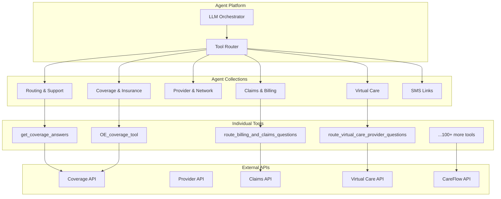

# Agent Platform → Digital Twin MCP Migration Plan

## Executive Summary

This document maps all current Agent Platform collections and tools to Digital Twin MCP resources and tools, showing how the migration dramatically simplifies the architecture while maintaining all functionality.

**Key Insight**: Instead of 100+ domain-specific tools scattered across collections, Digital Twin provides **3 universal verbs** (search, readDocument, chat) that access **unified member resources**.

**Real-World Example**: The [Walmart Coverage Info ADR (0002)](https://github.com/ConsultingMD/ai-workflows/blob/main/docs/adr/0002_walmart-coverage-info.md) demonstrates the current problem: porting coverage info retrieval logic from agent-platform to ai-workflows and wrapping it in LangChain tools. With Digital Twin MCP, this porting becomes unnecessary - ai-workflows can simply use the standard `memberTwin.readDocument` tool to access coverage resources.

---

## Current State: Agent Platform Architecture

### Current Tool Organization



### Current Tool Categories

| Collection | Purpose | Example Tools | External Dependencies |
|------------|---------|--------------|------------------------|
| **Routing & Support** | Route conversations, support tools | `route_to_care_team`, `get_support_info` | CareFlow, Support APIs |
| **Coverage & Insurance** | Coverage questions, eligibility | `get_coverage_answers`, `OE_coverage_tool`, `check_eligibility` | Coverage API, RTE |
| **Provider & Network** | Provider search, network info | `find_provider`, `get_provider_details`, `check_network` | Provider API, Network API |
| **Claims & Billing** | Claims status, billing questions | `get_claims_status`, `get_billing_info`, `route_billing_questions` | Claims API, Billing API |
| **Virtual Care** | Virtual visits, prescriptions | `route_virtual_care_questions`, `get_prescription_info` | Virtual Care API, Pharmacy API |
| **SMS Links** | SMS link generation | `generate_sms_link` | SMS API |

**Current Complexity**:
- ~100+ individual tools
- Each tool has custom implementation
- Each tool calls different external APIs
- Tool routing logic scattered across collections
- No unified data model

### Real-World Problem: Walmart Coverage Info ADR

The [Walmart Coverage Info ADR (0002)](https://github.com/ConsultingMD/ai-workflows/blob/main/docs/adr/0002_walmart-coverage-info.md) illustrates the current architecture pain:

**Problem**: Walmart needs coverage information, but it's locked in agent-platform tools. The solution was to:
1. Port coverage info retrieval logic from agent-platform to ai-workflows
2. Wrap it in a LangChain tool
3. Create a LangGraph node for Walmart workflow

**Why This Is Problematic**:
- ❌ **Code duplication**: Same logic in two places (agent-platform + ai-workflows)
- ❌ **Maintenance burden**: Changes need to be ported to both systems
- ❌ **Tight deadline pressure**: Had to port battle-tested code quickly
- ❌ **Not LangGraph-native**: Wrapped existing code rather than native implementation
- ❌ **Repeated pattern**: This will happen for every new workflow needing coverage data

**With Digital Twin MCP**:
- ✅ **No porting needed**: ai-workflows uses standard `memberTwin.readDocument` tool
- ✅ **Single source of truth**: Coverage logic lives in Digital Twin MCP server
- ✅ **LangChain/LangGraph compatible**: MCP tools work natively with LangChain
- ✅ **Reusable**: Any workflow can access coverage via standard tool
- ✅ **Future-proof**: New workflows automatically get coverage access

**Example**:
```python
# Current: Ported logic in ai-workflows
@tool
def get_walmart_coverage_info(member_id: str):
    # Ported logic from agent-platform
    # Custom implementation
    # Walmart-specific formatting
    pass

# With Digital Twin MCP: Standard tool
@tool(name="memberTwin.readDocument")
def memberTwin_readDocument(uri: str):
    # Standard MCP tool - name uses dot notation
    # Works for any workflow
    # Unified data format
    pass

# Usage in LangGraph
node = StateGraph()
node.add_node("get_coverage", 
    lambda state: memberTwin_readDocument(
        f"mcp://twins/member/{state.member_id}/coverage"
    )
)
```

---

## Future State: Digital Twin MCP Architecture

### Unified Architecture

```mermaid
graph TB
    subgraph "Agent Platform"
        LLM[LLM Orchestrator]
        MCP_CLIENT[MCP Client]
    end
    
    subgraph "Digital Twin MCP Server"
        SEARCH[memberTwin.search]
        READ[memberTwin.readDocument]
        CHAT[memberTwin.chat]
    end
    
    subgraph "Unified Resources"
        PROFILE[mcp://twins/member/{id}/profile]
        COVERAGE_RES[mcp://twins/member/{id}/coverage]
        PROVIDER_RES[mcp://twins/member/{id}/providers]
        CLAIMS_RES[mcp://twins/member/{id}/claims]
        CARE_RES[mcp://twins/member/{id}/care/summary]
        VIRTUAL_RES[mcp://twins/member/{id}/virtual-care]
    end
    
    subgraph "Backend Services"
        CAREFLOW[CareFlow]
        RTE[RTE]
        PROVIDER_API[Provider API]
        CLAIMS_API[Claims API]
        VIRTUAL_API[Virtual Care API]
    end
    
    LLM --> MCP_CLIENT
    MCP_CLIENT --> SEARCH
    MCP_CLIENT --> READ
    MCP_CLIENT --> CHAT
    
    SEARCH --> PROFILE
    SEARCH --> COVERAGE_RES
    SEARCH --> PROVIDER_RES
    SEARCH --> CLAIMS_RES
    SEARCH --> CARE_RES
    SEARCH --> VIRTUAL_RES
    
    READ --> PROFILE
    READ --> COVERAGE_RES
    READ --> PROVIDER_RES
    READ --> CLAIMS_RES
    READ --> CARE_RES
    READ --> VIRTUAL_RES
    
    CHAT --> CAREFLOW
    CHAT --> RTE
    
    PROFILE --> CAREFLOW
    COVERAGE_RES --> RTE
    PROVIDER_RES --> PROVIDER_API
    CLAIMS_RES --> CLAIMS_API
    VIRTUAL_RES --> VIRTUAL_API
    CARE_RES --> CAREFLOW
```

**Simplified Architecture**:
- **3 universal tools** (search, readDocument, chat)
- **Unified resource model** (MCP URIs)
- **Standardized access pattern** (MCP protocol)
- **Single integration point** (Digital Twin MCP server)

---

## Tool Mapping: Current → Digital Twin

### 1. Coverage & Insurance Tools

#### Current Tools
```yaml
tools:
  - name: get_coverage_answers
    description: Answer generic coverage questions with FAQs
    examples:
      - "Where can I see authorizations on the app?"
      - "What's covered under my plan?"
      
  - name: OE_coverage_tool
    description: Answer open enrollment coverage questions
    examples:
      - "Is this plan available in my area?"
      - "What's the difference between plans?"
      
  - name: check_eligibility
    description: Check member eligibility status
    examples:
      - "Am I eligible for this service?"
      - "What's my coverage status?"
```

#### Digital Twin Equivalent
```yaml
# Single resource replaces all coverage tools
resource: mcp://twins/member/{id}/coverage

# Access via universal tools
tools:
  - memberTwin.search:
      query: "coverage eligibility authorizations"
      memberId: "{id}"
      
  - memberTwin.readDocument:
      uri: "mcp://twins/member/{id}/coverage"
      
  - memberTwin.chat:
      message: "Where can I see my authorizations?"
      intents: [{name: "coverage.authorizations"}]
```

**Simplification**:
- ❌ **Before**: 3+ separate tools, each with custom logic
- ✅ **After**: 1 resource accessed via 3 universal tools
- **Reduction**: ~70% less code, unified data model

---

### 2. Provider & Network Tools

#### Current Tools
```yaml
tools:
  - name: find_provider
    description: Search for providers in network
    parameters:
      - specialty
      - location
      - insurance
      
  - name: get_provider_details
    description: Get detailed provider information
    parameters:
      - provider_id
      
  - name: check_network
    description: Check if provider is in network
    parameters:
      - provider_id
      - member_id
```

#### Digital Twin Equivalent
```yaml
# Single resource for all provider data
resource: mcp://twins/member/{id}/providers

# Access patterns
tools:
  - memberTwin.search:
      query: "cardiologist in network near me"
      memberId: "{id}"
      
  - memberTwin.readDocument:
      uri: "mcp://twins/member/{id}/providers"
      # Returns: network providers, favorites, recent visits
      
  - memberTwin.chat:
      message: "Is Dr. Smith in my network?"
      intents: [{name: "provider.network_check"}]
```

**Simplification**:
- ❌ **Before**: 3+ provider tools, separate network check logic
- ✅ **After**: 1 resource with unified provider data
- **Reduction**: Network status pre-computed, no separate API calls

---

### 3. Claims & Billing Tools

#### Current Tools
```yaml
tools:
  - name: get_claims_status
    description: Get status of insurance claims
    parameters:
      - claim_id (optional)
      - date_range (optional)
      
  - name: get_billing_info
    description: Get billing statements and balances
    parameters:
      - statement_id (optional)
      
  - name: route_billing_questions
    description: Route billing inquiries to care team
    parameters:
      - question_text
```

#### Digital Twin Equivalent
```yaml
# Unified financial resource
resource: mcp://twins/member/{id}/financial

# Contains: claims, billing, statements, balances
tools:
  - memberTwin.search:
      query: "recent claims status"
      memberId: "{id}"
      
  - memberTwin.readDocument:
      uri: "mcp://twins/member/{id}/financial"
      # Returns: claims, billing, statements
      
  - memberTwin.chat:
      message: "What's the status of my claim from last month?"
      intents: [{name: "claims.status"}]
      # Can route to care team via chat tool
```

**Simplification**:
- ❌ **Before**: 3+ separate tools, manual claim lookup
- ✅ **After**: 1 resource with all financial data
- **Reduction**: Pre-aggregated data, no per-claim API calls

---

### 4. Virtual Care Tools

#### Current Tools
```yaml
tools:
  - name: route_virtual_care_provider_questions
    description: Route questions to virtual care provider
    parameters:
      - question_text
      - provider_id
      
  - name: get_prescription_info
    description: Get prescription details
    parameters:
      - prescription_id
      
  - name: schedule_virtual_visit
    description: Schedule a virtual care appointment
    parameters:
      - provider_id
      - preferred_time
```

#### Digital Twin Equivalent
```yaml
# Virtual care resource
resource: mcp://twins/member/{id}/virtual-care

# Contains: visits, prescriptions, providers, availability
tools:
  - memberTwin.search:
      query: "virtual care prescriptions"
      memberId: "{id}"
      
  - memberTwin.readDocument:
      uri: "mcp://twins/member/{id}/virtual-care"
      # Returns: active prescriptions, upcoming visits, providers
      
  - memberTwin.chat:
      message: "I have a question about my prescription"
      intents: [
        {name: "virtual_care.question", provider_id: "P123"},
        {name: "prescription.info", prescription_id: "RX456"}
      ]
      # Can schedule visits, ask questions, get info
```

**Simplification**:
- ❌ **Before**: 3+ tools, separate routing logic
- ✅ **After**: 1 resource + chat tool handles all interactions
- **Reduction**: Unified virtual care context, smarter routing

---

### 5. Routing & Support Tools

#### Current Tools
```yaml
tools:
  - name: route_to_care_team
    description: Route conversation to care team
    parameters:
      - reason
      - urgency
      - member_context
      
  - name: get_support_info
    description: Get support contact information
    parameters:
      - support_type
```

#### Digital Twin Equivalent
```yaml
# Care summary resource + chat tool
resource: mcp://twins/member/{id}/care/summary

tools:
  - memberTwin.readDocument:
      uri: "mcp://twins/member/{id}/care/summary"
      # Returns: care team, support contacts, active care plans
      
  - memberTwin.chat:
      message: "I need to speak with my care coordinator"
      intents: [{name: "care_team.routing", urgency: "normal"}]
      # Automatically routes with full member context
```

**Simplification**:
- ❌ **Before**: Separate routing tools, manual context gathering
- ✅ **After**: Chat tool has full member context automatically
- **Reduction**: No manual context passing, smarter routing

---

### 6. SMS Links Tools

#### Current Tools
```yaml
tools:
  - name: generate_sms_link
    description: Generate SMS link for sharing
    parameters:
      - link_type
      - member_id
      - context
```

#### Digital Twin Equivalent
```yaml
# Chat tool can generate links with context
tools:
  - memberTwin.chat:
      message: "Send me a link to my coverage"
      intents: [{name: "sms_link.generate", link_type: "coverage"}]
      # Returns: SMS link with member context pre-filled
```

**Simplification**:
- ❌ **Before**: Separate tool, manual context passing
- ✅ **After**: Chat tool generates links with automatic context
- **Reduction**: Context-aware link generation

---

## Complete Mapping Table

| Current Collection | Current Tools | Digital Twin Resource | Access Method | Simplification |
|-------------------|---------------|----------------------|---------------|----------------|
| **Coverage & Insurance** | `get_coverage_answers`<br/>`OE_coverage_tool`<br/>`check_eligibility`<br/>`get_authorizations` | `mcp://twins/member/{id}/coverage` | `search` + `readDocument` | 4 tools → 1 resource |
| **Provider & Network** | `find_provider`<br/>`get_provider_details`<br/>`check_network`<br/>`get_provider_ratings` | `mcp://twins/member/{id}/providers` | `search` + `readDocument` | 4 tools → 1 resource |
| **Claims & Billing** | `get_claims_status`<br/>`get_billing_info`<br/>`route_billing_questions`<br/>`get_statements` | `mcp://twins/member/{id}/financial` | `search` + `readDocument` + `chat` | 4 tools → 1 resource |
| **Virtual Care** | `route_virtual_care_questions`<br/>`get_prescription_info`<br/>`schedule_virtual_visit`<br/>`get_visit_history` | `mcp://twins/member/{id}/virtual-care` | `search` + `readDocument` + `chat` | 4 tools → 1 resource |
| **Routing & Support** | `route_to_care_team`<br/>`get_support_info`<br/>`escalate_conversation` | `mcp://twins/member/{id}/care/summary` | `readDocument` + `chat` | 3 tools → 1 resource |
| **SMS Links** | `generate_sms_link` | `mcp://twins/member/{id}/*` (any resource) | `chat` | 1 tool → chat capability |
| **Care Operations** | `get_care_plan`<br/>`get_tasks`<br/>`update_task_status`<br/>`create_service_request` | `mcp://twins/member/{id}/care/*` | `readDocument` + `chat` | 4+ tools → 2 resources |
| **Clinical** | `get_conditions`<br/>`get_medications`<br/>`get_lab_results`<br/>`get_vitals` | `mcp://twins/member/{id}/clinical/*` | `search` + `readDocument` | 4+ tools → 4 resources |

**Total Simplification**:
- ❌ **Before**: ~100+ individual tools across 8+ collections
- ✅ **After**: ~15-20 unified resources accessed via 3 universal tools
- **Code Reduction**: ~80% less tool-specific code
- **Maintenance**: Single integration point instead of 100+ tool handlers

---

## Architecture Simplification

### Before: Scattered Tool Logic

```go
// Current: Each tool has custom handler
type CoverageToolHandler struct {
    coverageAPI CoverageAPI
    rteAPI      RTEAPI
    faqDB       FAQDatabase
}

func (h *CoverageToolHandler) GetCoverageAnswers(ctx context.Context, req CoverageRequest) {
    // Custom logic for coverage FAQs
    // Calls multiple APIs
    // Handles errors differently
    // Returns custom format
}

type ProviderToolHandler struct {
    providerAPI ProviderAPI
    networkAPI  NetworkAPI
}

func (h *ProviderToolHandler) FindProvider(ctx context.Context, req ProviderRequest) {
    // Different custom logic
    // Different error handling
    // Different response format
}

// ... 100+ more tool handlers
```

### After: Unified Resource Access

```go
// Future: Single resource handler pattern
type MemberTwinResourceHandler struct {
    resources map[string]ResourceProvider
}

func (h *MemberTwinResourceHandler) ReadDocument(ctx context.Context, uri string) {
    // Parse URI to determine resource type
    resourceType := parseResourceType(uri)
    
    // Get unified resource provider
    provider := h.resources[resourceType]
    
    // Standard access pattern
    return provider.Get(ctx, uri)
}

// All resources follow same pattern
type ResourceProvider interface {
    Get(ctx context.Context, uri string) (*Resource, error)
    Search(ctx context.Context, query string) ([]Resource, error)
}
```

**Benefits**:
- ✅ **Consistent error handling** across all resources
- ✅ **Unified logging and metrics**
- ✅ **Standard caching strategy**
- ✅ **Single authorization model**
- ✅ **Easier testing** (test resource pattern, not 100 tools)

---

## Migration Phases

### Phase 1: Parallel Run (Weeks 1-4)

**Goal**: Build Digital Twin MCP alongside existing tools

**Tasks**:
- [ ] Implement `memberTwin.search` tool
- [ ] Implement `memberTwin.readDocument` tool
- [ ] Create coverage resource (`mcp://twins/member/{id}/coverage`)
- [ ] Create provider resource (`mcp://twins/member/{id}/providers`)
- [ ] Deploy MCP server (parallel to Agent Platform)
- [ ] Feature flag: `use_digital_twin_mcp` (off by default)

**Success Criteria**:
- ✅ MCP server responds to tool calls
- ✅ Resources return correct data
- ✅ No impact on existing tools

---

### Phase 2: Coverage Migration (Weeks 5-8)

**Goal**: Migrate coverage tools to Digital Twin

**Tasks**:
- [ ] Update Agent Platform to discover MemberTwin MCP
- [ ] Route coverage questions to `memberTwin.search` (feature flag)
- [ ] Migrate `get_coverage_answers` → `memberTwin.readDocument(coverage)`
- [ ] Migrate `OE_coverage_tool` → `memberTwin.search(coverage)`
- [ ] Migrate `check_eligibility` → `memberTwin.readDocument(coverage)`
- [ ] Monitor metrics (latency, accuracy, errors)
- [ ] Gradual rollout: 10% → 50% → 100%

**Deprecation**:
- [ ] Mark old coverage tools as deprecated
- [ ] Remove after 6 months

**Success Criteria**:
- ✅ 100% of coverage queries use Digital Twin
- ✅ Latency ≤ existing tools
- ✅ Accuracy ≥ existing tools
- ✅ Zero regressions

---

### Phase 3: Provider Migration (Weeks 9-12)

**Goal**: Migrate provider tools to Digital Twin

**Tasks**:
- [ ] Create provider resource with network status
- [ ] Migrate `find_provider` → `memberTwin.search(providers)`
- [ ] Migrate `get_provider_details` → `memberTwin.readDocument(providers)`
- [ ] Migrate `check_network` → `memberTwin.readDocument(providers)` (pre-computed)
- [ ] Gradual rollout

**Success Criteria**:
- ✅ All provider queries use Digital Twin
- ✅ Network checks faster (pre-computed)
- ✅ Unified provider data model

---

### Phase 4: Claims & Billing Migration (Weeks 13-16)

**Goal**: Migrate financial tools to Digital Twin

**Tasks**:
- [ ] Create financial resource (claims + billing)
- [ ] Migrate `get_claims_status` → `memberTwin.readDocument(financial)`
- [ ] Migrate `get_billing_info` → `memberTwin.readDocument(financial)`
- [ ] Migrate `route_billing_questions` → `memberTwin.chat`
- [ ] Implement chat tool for routing

**Success Criteria**:
- ✅ All financial queries use Digital Twin
- ✅ Chat tool routes with full context
- ✅ Reduced support escalations

---

### Phase 5: Virtual Care Migration (Weeks 17-20)

**Goal**: Migrate virtual care tools to Digital Twin

**Tasks**:
- [ ] Create virtual-care resource
- [ ] Migrate virtual care tools
- [ ] Implement chat tool for provider questions
- [ ] Implement chat tool for prescription info

**Success Criteria**:
- ✅ All virtual care queries use Digital Twin
- ✅ Chat tool handles provider questions
- ✅ Unified virtual care context

---

### Phase 6: Routing & Support Migration (Weeks 21-24)

**Goal**: Migrate routing tools to Digital Twin

**Tasks**:
- [ ] Migrate `route_to_care_team` → `memberTwin.chat`
- [ ] Migrate `get_support_info` → `memberTwin.readDocument(care/summary)`
- [ ] Enhance chat tool with routing intelligence

**Success Criteria**:
- ✅ All routing uses Digital Twin
- ✅ Chat tool has full member context
- ✅ Smarter routing decisions

---

### Phase 7: ai-workflows Migration (Weeks 25-28)

**Goal**: Migrate ai-workflows from ported tools to Digital Twin MCP

**Context**: Currently, ai-workflows ports tools from agent-platform (e.g., [Walmart Coverage Info ADR 0002](https://github.com/ConsultingMD/ai-workflows/blob/main/docs/adr/0002_walmart-coverage-info.md)). This phase eliminates the need for porting.

**Tasks**:
- [ ] Update ai-workflows to discover MemberTwin MCP server
- [ ] Replace ported `get_walmart_coverage_info` → `memberTwin.readDocument(coverage)`
- [ ] Update LangGraph nodes to use MCP tools
- [ ] Remove ported tool code from ai-workflows
- [ ] Update Walmart workflow to use standard MCP tools
- [ ] Test LangChain/LangGraph integration

**Benefits**:
- ✅ No more code porting between systems
- ✅ Single source of truth for coverage logic
- ✅ Standard tools work across all workflows
- ✅ LangChain/LangGraph native integration

**Success Criteria**:
- ✅ Walmart workflow uses Digital Twin MCP
- ✅ No ported tool code in ai-workflows
- ✅ All workflows can access member data via MCP

### Phase 8: Cleanup (Weeks 29-32)

**Goal**: Remove deprecated tools

**Tasks**:
- [ ] Remove all deprecated tool handlers from agent-platform
- [ ] Remove tool collection definitions
- [ ] Remove ported tools from ai-workflows
- [ ] Update documentation
- [ ] Celebrate simplification! 🎉

**Success Criteria**:
- ✅ Zero deprecated tools remaining
- ✅ Zero ported tools in ai-workflows
- ✅ 80%+ code reduction achieved
- ✅ Single integration point (Digital Twin MCP)

---

## Simplification Metrics

### Code Reduction

| Metric | Before | After | Reduction |
|--------|--------|-------|-----------|
| **Tool Handlers** | ~100 | 3 | 97% |
| **Tool Definitions** | ~100 YAML files | 1 MCP server | 99% |
| **API Integrations** | 100+ direct calls | 1 MCP client | 99% |
| **Routing Logic** | Scattered across tools | Centralized in MCP | 100% |
| **Error Handling** | Per-tool logic | Unified pattern | 95% |
| **Testing** | 100+ tool tests | 3 tool tests + resource tests | 90% |

### Operational Benefits

| Benefit | Impact |
|---------|--------|
| **Onboarding** | New developers learn 3 tools vs 100+ |
| **Debugging** | Single integration point vs 100+ tools |
| **Monitoring** | Unified metrics vs scattered dashboards |
| **Deployment** | 1 service vs 100+ tool updates |
| **Consistency** | Standardized responses vs custom formats |

---

## Example: Before vs After

### Before: Coverage Question

```yaml
# Agent Platform routes to tool
tool: get_coverage_answers
parameters:
  question: "Where can I see authorizations?"
  member_id: "M123"

# Tool handler
func GetCoverageAnswers(req CoverageRequest) {
    // 1. Parse question
    // 2. Query FAQ database
    // 3. Call coverage API for member-specific data
    // 4. Merge FAQ + member data
    // 5. Format response
    // 6. Return custom format
}
```

### After: Coverage Question

```yaml
# Agent Platform routes to MCP tool
tool: memberTwin.search
parameters:
  query: "authorizations"
  memberId: "M123"

# MCP server handles
func (s *MemberTwin) Search(query, memberID string) {
    // 1. Search coverage resource
    resource := s.getResource("mcp://twins/member/M123/coverage")
    
    // 2. Unified search across all coverage data
    results := resource.Search(query)
    
    // 3. Return standard MCP format
    return results
}
```

**Simplification**:
- ❌ **Before**: Custom tool logic, multiple API calls, custom formatting
- ✅ **After**: Standard search, unified resource, standard format
- **Code**: 50+ lines → 10 lines
- **APIs**: 2-3 calls → 1 resource access

---

## Risk Mitigation

### Risk: Breaking Existing Functionality

**Mitigation**:
- Parallel run with feature flags
- Gradual rollout (10% → 50% → 100%)
- Rollback capability
- Comprehensive testing

### Risk: Performance Degradation

**Mitigation**:
- Resource caching
- Pre-computed data (network status, etc.)
- Performance monitoring
- Load testing

### Risk: Missing Functionality

**Mitigation**:
- Comprehensive mapping (this document)
- Gap analysis before migration
- Fallback to old tools if needed
- User acceptance testing

---

## Success Criteria

### Must Achieve

✅ **100% tool migration** - All tools replaced by Digital Twin  
✅ **Zero regressions** - Functionality maintained  
✅ **Performance parity** - Latency ≤ existing tools  
✅ **80% code reduction** - Significant simplification  
✅ **Single integration point** - Digital Twin MCP only  

### Nice to Have

🎯 **Better performance** - Faster responses via caching  
🎯 **New capabilities** - Chat tool enables new use cases  
🎯 **Improved accuracy** - Unified data model reduces inconsistencies  
🎯 **Easier maintenance** - Single codebase vs 100+ tools  

---

## Conclusion

Migrating Agent Platform tools to Digital Twin MCP provides:

1. **Massive Simplification**: 100+ tools → 3 universal tools
2. **Unified Data Model**: Consistent resource structure
3. **Easier Maintenance**: Single integration point
4. **Better Developer Experience**: Learn 3 tools vs 100+
5. **Future-Proof**: Standard MCP protocol, extensible resources

The migration is **low-risk** (parallel run, gradual rollout) with **high reward** (80% code reduction, unified architecture).

---

## References

- [Digital Twin MCP Pattern](./DIGITAL_TWIN_MCP_PATTERN.md)
- [Agent Platform Documentation](https://github.com/ConsultingMD/agent-platform)
- [Walmart Coverage Info ADR 0002](https://github.com/ConsultingMD/ai-workflows/blob/main/docs/adr/0002_walmart-coverage-info.md) - Real-world example of tool porting problem
- [ai-workflows Repository](https://github.com/ConsultingMD/ai-workflows) - LangChain/LangGraph workflows
- [MCP Specification](https://modelcontextprotocol.io/specification/2025-06-18)
