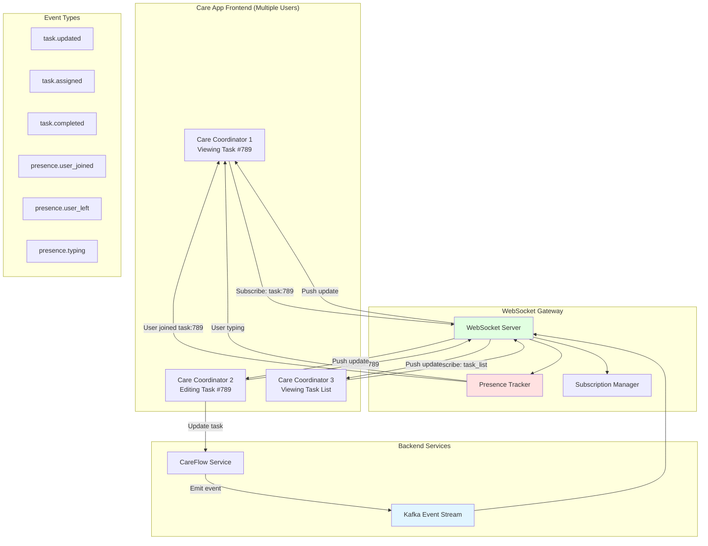

# Care App Real-Time Collaboration

## Executive Summary

This document describes real-time collaboration features for the **Care App**, enabling care coordinators and practitioners to work together seamlessly on tasks, service requests, and member care without conflicts or confusion.

**Problem**: Multiple care coordinators often work on the same member's tasks simultaneously, leading to:
- Edit conflicts (two people editing the same task)
- Confusion about who created or is working on a task
- Stale data (seeing outdated task lists)
- Duplicate work (two people calling the same member)
- Lost updates (last write wins, silently overwriting changes)

**Solution**: Real-time event streaming with presence awareness, live updates, and conflict prevention.

**Key Features**:
- **Presence Indicators**: See who's viewing/editing a task in real-time
- **Live Task Updates**: Tasks update instantly across all Care App sessions
- **Optimistic Locking**: Prevent conflicting edits with visual warnings
- **Activity Feed**: See recent changes by other coordinators
- **Collaborative Cursors**: See where others are typing (optional)
- **Task Assignment Notifications**: Instant alerts when assigned new tasks

---

## Architecture Overview

### High-Level Flow



---

## Core Features

### 1. Presence Awareness

**Problem**: Care coordinators don't know who else is viewing/editing the same task, leading to confusion and duplicate work.

**Solution**: Real-time presence indicators showing who's currently viewing or editing each task.

#### Presence States

```typescript
enum PresenceState {
  VIEWING = "viewing",      // User is viewing task (read-only)
  EDITING = "editing",      // User has task open for editing
  TYPING = "typing",        // User is actively typing in a field
}

interface PresenceInfo {
  user_id: string;
  user_name: string;
  user_role: string;        // "care_coordinator" | "clinician" | "rsa"
  avatar_url?: string;
  state: PresenceState;
  task_id: string;
  last_active: string;      // ISO 8601 timestamp
  cursor_position?: {       // Optional: where they're typing
    field_name: string;
    field_index?: number;
  };
}
```

#### Presence Events

**Join Task**:
```json
{
  "type": "presence.user_joined",
  "task_id": "task_789",
  "user": {
    "user_id": "cc_456",
    "user_name": "Sarah Johnson",
    "user_role": "care_coordinator",
    "avatar_url": "https://cdn.ih.com/avatars/cc_456.jpg",
    "state": "viewing"
  },
  "timestamp": "2025-11-13T10:00:00Z"
}
```

**Leave Task**:
```json
{
  "type": "presence.user_left",
  "task_id": "task_789",
  "user_id": "cc_456",
  "timestamp": "2025-11-13T10:15:00Z"
}
```

**State Change** (viewing → editing):
```json
{
  "type": "presence.state_changed",
  "task_id": "task_789",
  "user_id": "cc_456",
  "old_state": "viewing",
  "new_state": "editing",
  "timestamp": "2025-11-13T10:05:00Z"
}
```

**Typing Indicator**:
```json
{
  "type": "presence.typing",
  "task_id": "task_789",
  "user_id": "cc_456",
  "field_name": "notes",
  "timestamp": "2025-11-13T10:06:00Z"
}
```

#### UI Implementation

**Avatar Pills** (top-right of task view):
```tsx
// Care App - Task View Header
<TaskHeader>
  <TaskTitle>Task #789: Contact member about appointment</TaskTitle>
  
  <PresenceIndicators>
    {presenceInfo.map(user => (
      <Avatar
        key={user.user_id}
        src={user.avatar_url}
        alt={user.user_name}
        status={user.state}  // "viewing" | "editing" | "typing"
        tooltip={`${user.user_name} is ${user.state}`}
      />
    ))}
  </PresenceIndicators>
</TaskHeader>
```

**Lock Warning** (if someone else is editing):
```tsx
// Warning banner when someone else is editing
{currentPresence.some(u => u.state === 'editing' && u.user_id !== currentUserId) && (
  <WarningBanner>
    ⚠️ {presenceInfo.find(u => u.state === 'editing').user_name} is currently editing this task.
    Your changes may conflict with theirs.
  </WarningBanner>
)}
```

**Field-Level Lock** (prevent simultaneous edits):
```tsx
// Disable field if someone else is editing it
<TextField
  label="Notes"
  value={notes}
  onChange={handleNotesChange}
  disabled={isFieldLockedBy(notes', otherUserPresence)}
  helperText={getFieldLockMessage('notes', otherUserPresence)}
/>

// Helper text: "Sarah Johnson is editing this field"
```

---

### 2. Live Task Updates

**Problem**: Task lists become stale. Care coordinators see outdated task statuses, assignments, or notes.

**Solution**: Real-time event streaming pushes updates instantly to all subscribed Care App sessions.

#### Task Event Types

```typescript
interface TaskEvent {
  type: 'task.created' | 'task.updated' | 'task.assigned' | 'task.completed' | 'task.deleted';
  task_id: string;
  task: Task;
  changed_fields?: string[];  // For updates: which fields changed
  changed_by: {
    user_id: string;
    user_name: string;
    user_role: string;
  };
  timestamp: string;
}
```

**Task Created**:
```json
{
  "type": "task.created",
  "task_id": "task_890",
  "task": {
    "id": "task_890",
    "title": "Schedule follow-up appointment",
    "member_id": "A123456",
    "member_name": "John Doe",
    "assigned_to": "cc_456",
    "status": "pending",
    "priority": "high",
    "due_date": "2025-11-15"
  },
  "changed_by": {
    "user_id": "system",
    "user_name": "CareFlow Automation",
    "user_role": "system"
  },
  "timestamp": "2025-11-13T10:00:00Z"
}
```

**Task Updated**:
```json
{
  "type": "task.updated",
  "task_id": "task_789",
  "task": {
    "id": "task_789",
    "title": "Contact member about appointment",
    "member_id": "A123456",
    "notes": "Called member, left voicemail. Will try again tomorrow.",
    "status": "in_progress"
  },
  "changed_fields": ["notes", "status"],
  "changed_by": {
    "user_id": "cc_456",
    "user_name": "Sarah Johnson",
    "user_role": "care_coordinator"
  },
  "timestamp": "2025-11-13T10:30:00Z"
}
```

**Task Assigned**:
```json
{
  "type": "task.assigned",
  "task_id": "task_789",
  "task": {
    "id": "task_789",
    "assigned_to": "cc_789",
    "assigned_to_name": "Mike Chen",
    "assigned_by": "cc_456",
    "assigned_by_name": "Sarah Johnson",
    "reason": "Transferring to specialist coordinator"
  },
  "changed_by": {
    "user_id": "cc_456",
    "user_name": "Sarah Johnson",
    "user_role": "care_coordinator"
  },
  "timestamp": "2025-11-13T10:45:00Z"
}
```

**Task Completed**:
```json
{
  "type": "task.completed",
  "task_id": "task_789",
  "task": {
    "id": "task_789",
    "status": "completed",
    "completed_at": "2025-11-13T10:50:00Z",
    "completion_notes": "Successfully scheduled appointment for 11/20"
  },
  "changed_by": {
    "user_id": "cc_456",
    "user_name": "Sarah Johnson",
    "user_role": "care_coordinator"
  },
  "timestamp": "2025-11-13T10:50:00Z"
}
```

#### Subscription Patterns

**Subscribe to Specific Task**:
```typescript
// WebSocket subscription
websocket.subscribe({
  channel: 'task:789',
  event_types: ['task.updated', 'presence.*']
});

// React hook
const { task, presenceInfo } = useTaskSubscription('task_789');
```

**Subscribe to Task List** (filtered by assignment):
```typescript
// Subscribe to all tasks assigned to current user
websocket.subscribe({
  channel: 'task_list:assigned_to:cc_456',
  event_types: ['task.created', 'task.updated', 'task.completed', 'task.assigned']
});

// React hook
const { tasks } = useTaskList({
  filter: { assigned_to: currentUserId },
  sort: { field: 'due_date', order: 'asc' }
});
```

**Subscribe to Member's Tasks**:
```typescript
// Subscribe to all tasks for a specific member
websocket.subscribe({
  channel: 'task_list:member:A123456',
  event_types: ['task.*']
});

// React hook
const { tasks } = useMemberTasks('A123456');
```

#### UI Implementation

**Optimistic Updates** (instant feedback):
```typescript
const completeTask = async (taskId: string) => {
  // 1. Optimistic update (immediate UI change)
  setTasks(tasks => tasks.map(t => 
    t.id === taskId ? { ...t, status: 'completed' } : t
  ));
  
  // 2. Send mutation to backend
  try {
    await taskService.completeTask(taskId);
  } catch (error) {
    // 3. Revert on error
    setTasks(tasks => tasks.map(t => 
      t.id === taskId ? { ...t, status: 'in_progress' } : t
    ));
    toast.error('Failed to complete task');
  }
  
  // 4. WebSocket event confirms change (reconcile)
  // (handled by useTaskSubscription hook)
};
```

**Live Update Animation**:
```tsx
// Highlight updated tasks with animation
<TaskCard
  task={task}
  className={task.recently_updated ? 'pulse-animation' : ''}
/>

// CSS animation
.pulse-animation {
  animation: pulse 0.5s ease-in-out;
  border-left: 4px solid #4CAF50;
}
```

---

### 3. Conflict Prevention

**Problem**: Two care coordinators edit the same task simultaneously, causing "last write wins" conflicts where one person's changes silently overwrite the other's.

**Solution**: Optimistic locking with version numbers and visual conflict warnings.

#### Optimistic Locking Strategy

**Version-Based Locking**:
```typescript
interface Task {
  id: string;
  title: string;
  notes: string;
  version: number;  // Incremented on each update
  last_modified_by: string;
  last_modified_at: string;
}

// Update request includes expected version
interface UpdateTaskRequest {
  task_id: string;
  version: number;  // Expected current version
  changes: Partial<Task>;
}

// Backend validates version before applying changes
function updateTask(req: UpdateTaskRequest): Task | ConflictError {
  const currentTask = db.getTask(req.task_id);
  
  if (currentTask.version !== req.version) {
    // Conflict! Someone else updated the task
    return {
      error: 'CONFLICT',
      message: 'Task was modified by another user',
      current_version: currentTask.version,
      expected_version: req.version,
      current_task: currentTask
    };
  }
  
  // Apply changes and increment version
  const updatedTask = {
    ...currentTask,
    ...req.changes,
    version: currentTask.version + 1,
    last_modified_by: req.user_id,
    last_modified_at: new Date().toISOString()
  };
  
  db.saveTask(updatedTask);
  return updatedTask;
}
```

#### Conflict Resolution UI

**Conflict Detection Modal**:
```tsx
const TaskEditForm = () => {
  const [task, setTask] = useState<Task>(initialTask);
  const [conflictDetected, setConflictDetected] = useState(false);
  const [conflictInfo, setConflictInfo] = useState<ConflictInfo | null>(null);
  
  const saveTask = async () => {
    try {
      await taskService.updateTask({
        task_id: task.id,
        version: task.version,  // Include version for optimistic locking
        changes: { notes: task.notes, status: task.status }
      });
      
      toast.success('Task saved');
    } catch (error) {
      if (error.code === 'CONFLICT') {
        // Show conflict resolution modal
        setConflictDetected(true);
        setConflictInfo({
          your_changes: { notes: task.notes, status: task.status },
          their_changes: error.current_task,
          modified_by: error.current_task.last_modified_by,
          modified_at: error.current_task.last_modified_at
        });
      }
    }
  };
  
  return (
    <>
      <TaskForm task={task} onChange={setTask} onSave={saveTask} />
      
      {conflictDetected && (
        <ConflictResolutionModal
          conflict={conflictInfo}
          onResolve={(resolution) => {
            if (resolution === 'keep_mine') {
              // Force update with my changes
              forceUpdateTask(task);
            } else if (resolution === 'keep_theirs') {
              // Discard my changes, reload task
              setTask(conflictInfo.their_changes);
            } else if (resolution === 'merge') {
              // Manual merge UI
              showMergeModal(conflictInfo);
            }
            setConflictDetected(false);
          }}
        />
      )}
    </>
  );
};
```

**Conflict Modal UI**:
```tsx
<Modal title="Task Update Conflict">
  <p>
    <strong>{conflictInfo.modified_by}</strong> updated this task while you were editing.
  </p>
  <p>Last updated: {formatTimestamp(conflictInfo.modified_at)}</p>
  
  <SplitView>
    <YourChanges>
      <h3>Your Changes</h3>
      <DiffView before={originalTask} after={yourChanges} />
    </YourChanges>
    
    <TheirChanges>
      <h3>Their Changes</h3>
      <DiffView before={originalTask} after={theirChanges} />
    </TheirChanges>
  </SplitView>
  
  <Actions>
    <Button onClick={() => onResolve('keep_theirs')}>
      Keep Their Changes
    </Button>
    <Button onClick={() => onResolve('merge')}>
      Merge Changes
    </Button>
    <Button variant="primary" onClick={() => onResolve('keep_mine')}>
      Keep My Changes
    </Button>
  </Actions>
</Modal>
```

---

### 4. Activity Feed

**Problem**: Care coordinators need context about recent changes to tasks, especially when returning after time away.

**Solution**: Real-time activity feed showing recent actions by all team members.

#### Activity Event Schema

```typescript
interface ActivityEvent {
  id: string;
  type: 'task_created' | 'task_updated' | 'task_assigned' | 'task_completed' | 'note_added' | 'member_contacted';
  actor: {
    user_id: string;
    user_name: string;
    user_role: string;
    avatar_url?: string;
  };
  subject: {
    type: 'task' | 'member' | 'service_request';
    id: string;
    name: string;
  };
  action_description: string;
  details?: any;
  timestamp: string;
}
```

**Activity Feed Events**:
```json
[
  {
    "id": "activity_001",
    "type": "task_completed",
    "actor": {
      "user_id": "cc_456",
      "user_name": "Sarah Johnson",
      "user_role": "care_coordinator"
    },
    "subject": {
      "type": "task",
      "id": "task_789",
      "name": "Contact member about appointment"
    },
    "action_description": "completed task",
    "timestamp": "2025-11-13T10:50:00Z"
  },
  {
    "id": "activity_002",
    "type": "note_added",
    "actor": {
      "user_id": "cc_789",
      "user_name": "Mike Chen",
      "user_role": "care_coordinator"
    },
    "subject": {
      "type": "member",
      "id": "A123456",
      "name": "John Doe"
    },
    "action_description": "added a note",
    "details": {
      "note_preview": "Member confirmed appointment for 11/20..."
    },
    "timestamp": "2025-11-13T10:45:00Z"
  },
  {
    "id": "activity_003",
    "type": "task_assigned",
    "actor": {
      "user_id": "cc_456",
      "user_name": "Sarah Johnson",
      "user_role": "care_coordinator"
    },
    "subject": {
      "type": "task",
      "id": "task_790",
      "name": "Schedule specialist referral"
    },
    "action_description": "assigned task to you",
    "timestamp": "2025-11-13T10:30:00Z"
  }
]
```

#### Activity Feed UI

```tsx
const ActivityFeed = () => {
  const { activities } = useActivityFeed({
    filter: { team_id: currentTeamId },
    limit: 50
  });
  
  return (
    <FeedContainer>
      <FeedHeader>
        <h2>Team Activity</h2>
        <FilterDropdown />
      </FeedHeader>
      
      <FeedList>
        {activities.map(activity => (
          <ActivityItem key={activity.id}>
            <Avatar src={activity.actor.avatar_url} />
            <ActivityContent>
              <ActivityText>
                <strong>{activity.actor.user_name}</strong> {activity.action_description}{' '}
                <Link to={`/tasks/${activity.subject.id}`}>
                  {activity.subject.name}
                </Link>
              </ActivityText>
              <ActivityTimestamp>
                {formatRelativeTime(activity.timestamp)}
              </ActivityTimestamp>
              {activity.details?.note_preview && (
                <NotePreview>{activity.details.note_preview}</NotePreview>
              )}
            </ActivityContent>
          </ActivityItem>
        ))}
      </FeedList>
    </FeedContainer>
  );
};
```

---

### 5. Task Assignment Notifications

**Problem**: Care coordinators miss task assignments or discover them only when checking their task list.

**Solution**: Real-time push notifications for new task assignments.

#### Notification Events

```typescript
interface TaskAssignmentNotification {
  type: 'notification.task_assigned';
  task_id: string;
  task_title: string;
  member_id: string;
  member_name: string;
  assigned_by: {
    user_id: string;
    user_name: string;
  };
  priority: 'low' | 'medium' | 'high' | 'urgent';
  due_date?: string;
  message?: string;  // Optional message from assigner
  timestamp: string;
}
```

**Example Notification**:
```json
{
  "type": "notification.task_assigned",
  "task_id": "task_890",
  "task_title": "Schedule follow-up appointment",
  "member_id": "A123456",
  "member_name": "John Doe",
  "assigned_by": {
    "user_id": "cc_456",
    "user_name": "Sarah Johnson"
  },
  "priority": "high",
  "due_date": "2025-11-15",
  "message": "Member requested specific time slot, please prioritize",
  "timestamp": "2025-11-13T11:00:00Z"
}
```

#### Notification UI

**Toast Notification** (non-blocking):
```tsx
<Toast
  variant="info"
  icon={<TaskIcon />}
  title="New Task Assigned"
  message="Sarah Johnson assigned you: Schedule follow-up appointment"
  actions={[
    <Button size="small" onClick={() => navigateToTask('task_890')}>
      View Task
    </Button>,
    <Button size="small" variant="text" onClick={() => dismissNotification()}>
      Dismiss
    </Button>
  ]}
  duration={10000}  // 10 seconds
/>
```

**Notification Badge** (persistent):
```tsx
<TaskListHeader>
  <h1>My Tasks</h1>
  {unreadNotifications > 0 && (
    <NotificationBadge>{unreadNotifications}</NotificationBadge>
  )}
</TaskListHeader>
```

**Browser Notifications** (when Care App not in focus):
```typescript
const showBrowserNotification = (notification: TaskAssignmentNotification) => {
  if ('Notification' in window && Notification.permission === 'granted') {
    new Notification('New Task Assigned', {
      body: `${notification.assigned_by.user_name} assigned you: ${notification.task_title}`,
      icon: '/ih-icon.png',
      tag: notification.task_id,
      requireInteraction: true,
      data: { task_id: notification.task_id }
    }).onclick = () => {
      window.focus();
      navigateToTask(notification.task_id);
    };
  }
};
```

---

## WebSocket Integration

### Connection Management

**WebSocket Client** (Care App):
```typescript
import { WebSocketClient } from '@includedhealth/websocket-client';

const wsClient = new WebSocketClient({
  url: 'wss://events.includedhealth.com',
  token: jwtToken,  // JWT with care_coordinator role
  reconnect: true,
  heartbeat: 30000,  // 30 seconds
});

// Connect on app load
await wsClient.connect();

// Subscribe to channels
wsClient.subscribe('task_list:assigned_to:cc_456');
wsClient.subscribe('notifications:cc_456');

// Handle events
wsClient.on('task.updated', (event) => {
  updateTaskInState(event.task);
});

wsClient.on('task.assigned', (event) => {
  showNotification(event);
  addTaskToList(event.task);
});

wsClient.on('presence.user_joined', (event) => {
  updatePresenceInfo(event.user);
});
```

### Subscription Channels

**Task-Level Subscriptions**:
- `task:{task_id}` - Specific task updates + presence
- `task:{task_id}:presence` - Presence only

**List-Level Subscriptions**:
- `task_list:assigned_to:{user_id}` - Tasks assigned to user
- `task_list:member:{member_id}` - All tasks for member
- `task_list:team:{team_id}` - All tasks for team

**User-Level Subscriptions**:
- `notifications:{user_id}` - All notifications for user
- `activity_feed:{team_id}` - Team activity feed

### Event Filtering (Authorization)

**Backend Event Filter** (see ACCESS_CONTROL_DESIGN.md):
```go
func (g *Gateway) FilterEventForUser(event Event, user User) (Event, bool) {
    // Check if user has access to this task
    switch event.Type {
    case "task.updated", "task.assigned":
        taskID := event.Subject.ID
        
        // Query Authzed for permission
        allowed, err := g.authzed.Check(user.ID, "view", "task", taskID)
        if err != nil || !allowed {
            return Event{}, false  // Don't send event
        }
        
        // Check if task contains PHI
        if event.Data.ContainsPHI {
            // Verify user has PHI access for this member
            memberID := event.Data.MemberID
            phiAllowed, _ := g.authzed.Check(user.ID, "view_phi", "member", memberID)
            if !phiAllowed {
                // Redact PHI fields
                event.Data = g.redactPHI(event.Data)
            }
        }
        
        return event, true
        
    case "presence.user_joined":
        // Only send presence to users viewing the same task
        taskID := event.Data.TaskID
        if g.isUserSubscribedTo(user.ID, taskID) {
            return event, true
        }
        return Event{}, false
    }
    
    return event, true
}
```

---

## Implementation Details

### Backend Changes

**1. CareFlow Event Emission**:
```go
// CareFlow service - Emit events on task changes
func (s *TaskService) UpdateTask(ctx context.Context, req *UpdateTaskRequest) (*Task, error) {
    // 1. Validate version (optimistic locking)
    currentTask, err := s.repo.GetTask(ctx, req.TaskID)
    if err != nil {
        return nil, err
    }
    
    if currentTask.Version != req.Version {
        return nil, ErrConflict{
            CurrentVersion: currentTask.Version,
            ExpectedVersion: req.Version,
            CurrentTask: currentTask,
        }
    }
    
    // 2. Apply changes and increment version
    updatedTask := applyChanges(currentTask, req.Changes)
    updatedTask.Version = currentTask.Version + 1
    updatedTask.LastModifiedBy = req.UserID
    updatedTask.LastModifiedAt = time.Now()
    
    // 3. Save to database
    if err := s.repo.SaveTask(ctx, updatedTask); err != nil {
        return nil, err
    }
    
    // 4. Emit event to Kafka
    event := TaskUpdatedEvent{
        Type: "task.updated",
        TaskID: updatedTask.ID,
        Task: updatedTask,
        ChangedFields: getChangedFields(currentTask, updatedTask),
        ChangedBy: UserInfo{
            UserID: req.UserID,
            UserName: req.UserName,
            UserRole: req.UserRole,
        },
        Timestamp: time.Now(),
    }
    
    s.eventProducer.Publish(ctx, "careflow.task.updated", event)
    
    return updatedTask, nil
}
```

**2. Presence Service**:
```go
// Presence service - Track who's viewing/editing what
type PresenceService struct {
    redis *redis.Client
}

func (s *PresenceService) UserJoinedTask(ctx context.Context, taskID, userID string, state PresenceState) error {
    key := fmt.Sprintf("presence:task:%s", taskID)
    
    presenceInfo := PresenceInfo{
        UserID: userID,
        State: state,
        JoinedAt: time.Now(),
    }
    
    // Store in Redis with 5-minute expiry (extended by heartbeats)
    if err := s.redis.HSet(ctx, key, userID, presenceInfo).Err(); err != nil {
        return err
    }
    
    s.redis.Expire(ctx, key, 5*time.Minute)
    
    // Emit presence event
    event := PresenceUserJoinedEvent{
        Type: "presence.user_joined",
        TaskID: taskID,
        User: presenceInfo,
        Timestamp: time.Now(),
    }
    
    s.eventProducer.Publish(ctx, "careflow.presence.user_joined", event)
    
    return nil
}

func (s *PresenceService) UpdatePresenceState(ctx context.Context, taskID, userID string, newState PresenceState) error {
    // Update state in Redis
    // Emit presence.state_changed event
}

func (s *PresenceService) UserLeftTask(ctx context.Context, taskID, userID string) error {
    key := fmt.Sprintf("presence:task:%s", taskID)
    
    // Remove from Redis
    if err := s.redis.HDel(ctx, key, userID).Err(); err != nil {
        return err
    }
    
    // Emit presence event
    event := PresenceUserLeftEvent{
        Type: "presence.user_left",
        TaskID: taskID,
        UserID: userID,
        Timestamp: time.Now(),
    }
    
    s.eventProducer.Publish(ctx, "careflow.presence.user_left", event)
    
    return nil
}

// Heartbeat to keep presence alive
func (s *PresenceService) Heartbeat(ctx context.Context, taskID, userID string) error {
    key := fmt.Sprintf("presence:task:%s", taskID)
    
    // Extend expiry
    s.redis.Expire(ctx, key, 5*time.Minute)
    
    return nil
}
```

### Frontend Changes (Care App)

**1. React Hooks for Real-Time**:
```typescript
// hooks/useTaskSubscription.ts
export const useTaskSubscription = (taskId: string) => {
  const [task, setTask] = useState<Task | null>(null);
  const [presenceInfo, setPresenceInfo] = useState<PresenceInfo[]>([]);
  const wsClient = useWebSocket();
  
  useEffect(() => {
    // Subscribe to task updates and presence
    wsClient.subscribe(`task:${taskId}`);
    
    // Handle task updates
    const unsubTask = wsClient.on('task.updated', (event) => {
      if (event.task_id === taskId) {
        setTask(event.task);
      }
    });
    
    // Handle presence events
    const unsubPresence = wsClient.on('presence.*', (event) => {
      if (event.task_id === taskId) {
        updatePresence(event);
      }
    });
    
    // Send presence heartbeat every 30 seconds
    const heartbeatInterval = setInterval(() => {
      wsClient.send({
        type: 'presence.heartbeat',
        task_id: taskId,
        user_id: currentUserId,
      });
    }, 30000);
    
    // Announce joining task
    wsClient.send({
      type: 'presence.user_joined',
      task_id: taskId,
      user_id: currentUserId,
      state: 'viewing',
    });
    
    // Cleanup
    return () => {
      unsubTask();
      unsubPresence();
      clearInterval(heartbeatInterval);
      
      // Announce leaving task
      wsClient.send({
        type: 'presence.user_left',
        task_id: taskId,
        user_id: currentUserId,
      });
    };
  }, [taskId]);
  
  return { task, presenceInfo };
};
```

**2. Task List with Live Updates**:
```typescript
// components/TaskList.tsx
export const TaskList = () => {
  const currentUserId = useCurrentUser().id;
  const { tasks, loading } = useTaskList({
    filter: { assigned_to: currentUserId },
    sort: { field: 'due_date', order: 'asc' }
  });
  
  return (
    <div>
      <h1>My Tasks</h1>
      
      {loading ? (
        <LoadingSpinner />
      ) : (
        <TaskTable>
          {tasks.map(task => (
            <TaskRow
              key={task.id}
              task={task}
              onClick={() => navigateToTask(task.id)}
            />
          ))}
        </TaskTable>
      )}
    </div>
  );
};

// hooks/useTaskList.ts
export const useTaskList = (options: TaskListOptions) => {
  const [tasks, setTasks] = useState<Task[]>([]);
  const [loading, setLoading] = useState(true);
  const wsClient = useWebSocket();
  
  useEffect(() => {
    // Initial fetch
    fetchTasks(options).then(setTasks).finally(() => setLoading(false));
    
    // Subscribe to task list updates
    const channel = `task_list:assigned_to:${options.filter.assigned_to}`;
    wsClient.subscribe(channel);
    
    // Handle live updates
    const unsub = wsClient.on('task.*', (event) => {
      switch (event.type) {
        case 'task.created':
        case 'task.assigned':
          // Add new task to list
          setTasks(prev => [...prev, event.task]);
          break;
          
        case 'task.updated':
          // Update existing task
          setTasks(prev => prev.map(t => 
            t.id === event.task_id ? event.task : t
          ));
          break;
          
        case 'task.completed':
          // Remove completed task after animation
          setTimeout(() => {
            setTasks(prev => prev.filter(t => t.id !== event.task_id));
          }, 1000);
          break;
      }
    });
    
    return () => {
      unsub();
      wsClient.unsubscribe(channel);
    };
  }, [options]);
  
  return { tasks, loading };
};
```

---

## Monitoring & Observability

### Metrics

**WebSocket Connections**:
```prometheus
careapp_websocket_connections_active{user_role="care_coordinator"} 45
careapp_websocket_subscriptions_total{channel="task_list"} 120
```

**Presence Tracking**:
```prometheus
careapp_presence_active_users{task_id="task_789"} 3
careapp_presence_conflicts_detected_total 5
```

**Event Delivery**:
```prometheus
careapp_events_published_total{type="task.updated"} 1200
careapp_events_delivered_total{type="task.updated"} 1195
careapp_event_delivery_latency_seconds{p50} 0.05
careapp_event_delivery_latency_seconds{p95} 0.15
```

**Conflict Resolution**:
```prometheus
careapp_conflicts_detected_total{resolution="keep_mine"} 15
careapp_conflicts_detected_total{resolution="keep_theirs"} 8
careapp_conflicts_detected_total{resolution="merge"} 2
```

---

## Deployment Strategy

### Phase 1: Infrastructure (Weeks 1-2)
- Deploy Presence Service (Redis + Kafka)
- Add WebSocket Gateway subscription for CareFlow events
- Add optimistic locking to Task updates

### Phase 2: Presence Indicators (Weeks 3-4)
- Implement presence tracking (join/leave/heartbeat)
- Add presence UI (avatar pills, lock warnings)
- Test with 10% of care coordinators

### Phase 3: Live Task Updates (Weeks 5-6)
- Subscribe to task.* events
- Update task lists in real-time
- Optimistic UI updates

### Phase 4: Conflict Prevention (Weeks 7-8)
- Implement version-based locking
- Add conflict resolution modal
- Field-level lock warnings

### Phase 5: Full Rollout (Weeks 9-10)
- Ramp to 100% of care coordinators
- Activity feed
- Task assignment notifications

---

## Related Documentation

- **FAYE_BAYEUX_WEBSOCKET_DESIGN.md** - WebSocket Gateway architecture
- **ACCESS_CONTROL_DESIGN.md** - Authorization and event filtering
- **EVENT_DRIVEN_RTE_PLAN.md** - Event-driven infrastructure patterns
- **DIGITAL_SESSION_PLATFORM_PLAN.md** - Frontend integration patterns

---

## Summary

**Care App Real-Time Collaboration** transforms task management from a **stale, conflict-prone experience** to a **seamless, collaborative workflow** for care coordinators.

**Key Features**:
1. ✅ **Presence Indicators**: See who's viewing/editing tasks
2. ✅ **Live Updates**: Tasks sync instantly across all sessions
3. ✅ **Conflict Prevention**: Optimistic locking prevents lost edits
4. ✅ **Activity Feed**: Team-wide visibility of recent changes
5. ✅ **Push Notifications**: Instant alerts for task assignments

**Benefits**:
- ✅ No more confusion about who's working on what
- ✅ No more lost updates from conflicting edits
- ✅ No more stale task lists
- ✅ Faster response to task assignments
- ✅ Better team coordination

**Timeline**: 10 weeks (5 phases)
**Target Users**: 200+ care coordinators
**Infrastructure Cost**: ~$500/month (WebSocket + Presence Service)
