# Client Event Publishing: Durable, Reliable Domain Events from Frontend

## Executive Summary

This document defines how **frontend clients** (MX app, iOS, Android, Care app) can **reliably publish domain events** to the backend through the WebSocket Gateway, with **durable storage**, **guaranteed delivery**, and **offline support**.

**Key Capabilities**:
1. **Bidirectional streaming** - Clients can publish events, not just subscribe
2. **Durable delivery** - Events stored locally until acknowledged by server
3. **Offline support** - Queue events while offline, sync when reconnected
4. **Idempotency** - Duplicate events automatically deduplicated
5. **Ordering** - Event order preserved per client session
6. **Backpressure** - Flow control prevents overwhelming server

**Use Cases**:
- User activity tracking (page views, button clicks, feature usage)
- Domain events (member actions, care coordinator workflows)
- Command pattern (CQRS: trigger backend workflows)
- State synchronization (client state changes)
- Analytics and observability

---

## Architecture Overview

### Bidirectional Event Flow

```mermaid
graph LR
    subgraph "Frontend Client"
        APP[App UI]
        EVT[Event Emitter]
        QUEUE[Durable Queue<br/>IndexedDB/SQLite]
        PUB[Publisher]
    end
    
    subgraph "WebSocket Gateway"
        WS[WebSocket Handler]
        AUTH[Authorization]
        INGEST[Event Ingester]
        DEDUP[Deduplicator]
    end
    
    subgraph "Backend"
        KAFKA[Kafka Topics]
        PROC[Event Processors]
        STORE[Event Store]
    end
    
    APP -->|User Action| EVT
    EVT -->|Emit| QUEUE
    QUEUE -->|Publish| PUB
    PUB -->|WebSocket| WS
    
    WS -->|Validate| AUTH
    AUTH -->|Authorized| INGEST
    INGEST -->|Check| DEDUP
    DEDUP -->|Unique| KAFKA
    
    KAFKA -->|Process| PROC
    KAFKA -->|Archive| STORE
    
    WS -->|Ack| PUB
    PUB -->|Mark Delivered| QUEUE
    
    style QUEUE fill:#ffe1e1
    style DEDUP fill:#e1f5ff
    style KAFKA fill:#e1ffe1
```



### Event Lifecycle

```
┌─────────────────────────────────────────────────────────────┐
│ 1. Client-Side: Event Creation & Queuing                     │
├─────────────────────────────────────────────────────────────┤
│ • User triggers action (click, submit, navigation)           │
│ • App emits domain event with metadata                       │
│ • Event stored in local durable queue (IndexedDB/SQLite)     │
│ • Queue persists across app restarts                         │
└─────────────────────────────────────────────────────────────┘
                            ↓
┌─────────────────────────────────────────────────────────────┐
│ 2. Client-Side: Publishing with Retry                        │
├─────────────────────────────────────────────────────────────┤
│ • Publisher dequeues events (oldest first)                   │
│ • Send via WebSocket (if connected) or HTTP POST (fallback)  │
│ • Exponential backoff on failure                             │
│ • Keep events in queue until acknowledged                    │
└─────────────────────────────────────────────────────────────┘
                            ↓
┌─────────────────────────────────────────────────────────────┐
│ 3. Server-Side: Authorization & Validation                   │
├─────────────────────────────────────────────────────────────┤
│ • Validate JWT token (ensure client is authenticated)        │
│ • Check authorization (can client publish this event type?)  │
│ • Validate event schema (correct structure, required fields) │
│ • Rate limit check (prevent abuse)                           │
└─────────────────────────────────────────────────────────────┘
                            ↓
┌─────────────────────────────────────────────────────────────┐
│ 4. Server-Side: Deduplication                                │
├─────────────────────────────────────────────────────────────┤
│ • Check event ID in Redis (sliding window: 24 hours)         │
│ • If duplicate: Ack immediately, drop event                   │
│ • If unique: Add to Redis set, proceed to ingestion          │
│ • Prevents processing same event multiple times               │
└─────────────────────────────────────────────────────────────┘
                            ↓
┌─────────────────────────────────────────────────────────────┐
│ 5. Server-Side: Kafka Ingestion                              │
├─────────────────────────────────────────────────────────────┤
│ • Publish event to appropriate Kafka topic                    │
│ • Partition by member_id (preserves order per member)        │
│ • Add server-side metadata (received_at, gateway_id)         │
│ • Wait for Kafka acknowledgment (acks=all)                   │
└─────────────────────────────────────────────────────────────┘
                            ↓
┌─────────────────────────────────────────────────────────────┐
│ 6. Server-Side: Acknowledgment to Client                     │
├─────────────────────────────────────────────────────────────┤
│ • Send ack message back to client via WebSocket              │
│ • Include event ID and server timestamp                      │
│ • Client removes event from local queue                      │
│ • Client can now safely delete event                          │
└─────────────────────────────────────────────────────────────┘
                            ↓
┌─────────────────────────────────────────────────────────────┐
│ 7. Backend: Event Processing                                 │
├─────────────────────────────────────────────────────────────┤
│ • Event processors consume from Kafka                         │
│ • Trigger workflows, update state, send notifications        │
│ • Publish derived events (for subscribers)                    │
│ • Archive to event store for audit                           │
└─────────────────────────────────────────────────────────────┘
```

---

## Client-Side: Event Publishing SDK

### Event Schema

**Client Event Structure**:
```typescript
interface ClientEvent {
  // Event identification
  id: string;                    // UUID (client-generated, for idempotency)
  type: string;                  // "member.action.clicked" | "care.task.completed"
  timestamp: string;             // ISO 8601 (client timestamp)
  
  // Client context
  client: {
    session_id: string;          // Client session identifier
    device_id: string;           // Device identifier (persistent)
    app_version: string;         // "MX-iOS/1.2.3"
    platform: 'ios' | 'android' | 'web' | 'care-web';
  };
  
  // User context
  actor: {
    type: 'member' | 'care_coordinator' | 'anonymous';
    id?: string;                 // Member ID or care coordinator ID
  };
  
  // Event payload
  data: Record<string, any>;     // Event-specific data
  
  // Metadata
  metadata?: {
    correlation_id?: string;     // Link to parent event/workflow
    causation_id?: string;       // Link to triggering event
    tags?: string[];             // Custom tags for filtering
  };
}
```

### TypeScript SDK

```typescript
// frontend-sdk/src/events/publisher.ts

export class EventPublisher {
  private queue: DurableQueue;
  private ws: WebSocket;
  private publishInterval: NodeJS.Timer;
  private pendingAcks: Map<string, PendingEvent>;
  
  constructor(config: PublisherConfig) {
    // Durable queue (IndexedDB for web, SQLite for mobile)
    this.queue = new DurableQueue({
      name: 'event-queue',
      maxSize: 10000,  // Keep up to 10k events
      maxAge: 7 * 24 * 60 * 60 * 1000,  // Keep events for 7 days
    });
    
    // WebSocket connection
    this.ws = new WebSocket(config.websocketUrl, {
      headers: { 'Authorization': `Bearer ${config.token}` }
    });
    
    this.pendingAcks = new Map();
    this.setupHandlers();
    this.startPublisher();
  }
  
  /**
   * Publish an event (async, non-blocking)
   * Events are queued locally and sent asynchronously
   */
  async publish(event: Omit<ClientEvent, 'id' | 'timestamp' | 'client'>): Promise<void> {
    const fullEvent: ClientEvent = {
      id: this.generateEventId(),
      timestamp: new Date().toISOString(),
      client: this.getClientContext(),
      ...event,
    };
    
    // Add to durable queue (survives app restart)
    await this.queue.enqueue(fullEvent);
    
    // Try to publish immediately if online
    if (this.ws.readyState === WebSocket.OPEN) {
      this.publishBatch();
    }
  }
  
  /**
   * Publish a batch of events from the queue
   */
  private async publishBatch(): Promise<void> {
    // Get up to 100 events from queue
    const events = await this.queue.peek(100);
    
    if (events.length === 0) return;
    
    // Send batch via WebSocket
    const batchMessage = {
      type: 'publish_batch',
      events: events.map(e => e.data),
    };
    
    try {
      this.ws.send(JSON.stringify(batchMessage));
      
      // Track pending acks (timeout after 30 seconds)
      events.forEach(event => {
        this.pendingAcks.set(event.data.id, {
          event: event.data,
          sentAt: Date.now(),
          timeout: setTimeout(() => {
            this.handleAckTimeout(event.data.id);
          }, 30000),
        });
      });
      
    } catch (err) {
      console.error('Failed to publish batch', err);
      // Events remain in queue, will retry
    }
  }
  
  /**
   * Handle acknowledgment from server
   */
  private handleAck(ack: AckMessage): void {
    const pending = this.pendingAcks.get(ack.event_id);
    
    if (!pending) {
      console.warn('Received ack for unknown event', ack.event_id);
      return;
    }
    
    // Clear timeout
    clearTimeout(pending.timeout);
    this.pendingAcks.delete(ack.event_id);
    
    // Remove from queue (durably delivered!)
    this.queue.remove(ack.event_id);
    
    // Emit success event
    this.emit('published', {
      eventId: ack.event_id,
      latency: Date.now() - pending.sentAt,
      serverTimestamp: ack.server_timestamp,
    });
  }
  
  /**
   * Handle ack timeout (no response from server)
   */
  private handleAckTimeout(eventId: string): void {
    const pending = this.pendingAcks.get(eventId);
    
    if (!pending) return;
    
    this.pendingAcks.delete(eventId);
    
    // Event remains in queue, will retry
    console.warn('Ack timeout for event', eventId, 'will retry');
    
    // Exponential backoff
    this.scheduleRetry(pending.event);
  }
  
  /**
   * Retry with exponential backoff
   */
  private scheduleRetry(event: ClientEvent): void {
    const retryCount = this.getRetryCount(event.id);
    const backoffMs = Math.min(1000 * Math.pow(2, retryCount), 60000);  // Max 60s
    
    setTimeout(() => {
      this.publishBatch();
    }, backoffMs);
  }
  
  /**
   * Start background publisher (publishes queued events)
   */
  private startPublisher(): void {
    // Publish every 5 seconds (or immediately on new events)
    this.publishInterval = setInterval(() => {
      if (this.ws.readyState === WebSocket.OPEN) {
        this.publishBatch();
      }
    }, 5000);
  }
  
  /**
   * Setup WebSocket handlers
   */
  private setupHandlers(): void {
    this.ws.on('open', () => {
      console.log('WebSocket connected, publishing queued events');
      this.publishBatch();
    });
    
    this.ws.on('message', (message) => {
      const msg = JSON.parse(message);
      
      if (msg.type === 'ack') {
        this.handleAck(msg);
      } else if (msg.type === 'ack_batch') {
        msg.event_ids.forEach(id => this.handleAck({ event_id: id }));
      }
    });
    
    this.ws.on('close', () => {
      console.warn('WebSocket closed, events queued for later');
      // Events remain in queue, will retry when reconnected
    });
  }
  
  /**
   * Get client context (device, app version, etc.)
   */
  private getClientContext(): ClientEvent['client'] {
    return {
      session_id: this.sessionId,
      device_id: this.getDeviceId(),
      app_version: this.config.appVersion,
      platform: this.config.platform,
    };
  }
  
  /**
   * Generate event ID (UUID v4)
   */
  private generateEventId(): string {
    return crypto.randomUUID();
  }
  
  /**
   * Get device ID (persistent across sessions)
   */
  private getDeviceId(): string {
    // Stored in localStorage (web) or keychain (mobile)
    let deviceId = localStorage.getItem('device_id');
    
    if (!deviceId) {
      deviceId = this.generateEventId();
      localStorage.setItem('device_id', deviceId);
    }
    
    return deviceId;
  }
}
```

### Durable Queue Implementation

```typescript
// frontend-sdk/src/events/durable-queue.ts

export class DurableQueue {
  private db: IDBDatabase;
  
  constructor(config: QueueConfig) {
    this.db = this.openDatabase(config.name);
  }
  
  /**
   * Open IndexedDB (survives browser restart)
   */
  private async openDatabase(name: string): Promise<IDBDatabase> {
    return new Promise((resolve, reject) => {
      const request = indexedDB.open(name, 1);
      
      request.onupgradeneeded = (event) => {
        const db = (event.target as IDBOpenDBRequest).result;
        
        // Create object store for events
        const store = db.createObjectStore('events', { keyPath: 'id' });
        store.createIndex('timestamp', 'timestamp');
        store.createIndex('retryCount', 'retryCount');
      };
      
      request.onsuccess = () => resolve(request.result);
      request.onerror = () => reject(request.error);
    });
  }
  
  /**
   * Add event to queue
   */
  async enqueue(event: ClientEvent): Promise<void> {
    const tx = this.db.transaction('events', 'readwrite');
    const store = tx.objectStore('events');
    
    await store.add({
      id: event.id,
      data: event,
      timestamp: Date.now(),
      retryCount: 0,
    });
  }
  
  /**
   * Get next N events from queue (oldest first)
   */
  async peek(count: number): Promise<Array<{ id: string; data: ClientEvent }>> {
    const tx = this.db.transaction('events', 'readonly');
    const store = tx.objectStore('events');
    const index = store.index('timestamp');
    
    const events: Array<{ id: string; data: ClientEvent }> = [];
    const cursor = await index.openCursor();
    
    while (cursor && events.length < count) {
      events.push({
        id: cursor.value.id,
        data: cursor.value.data,
      });
      await cursor.continue();
    }
    
    return events;
  }
  
  /**
   * Remove event from queue (after ack)
   */
  async remove(eventId: string): Promise<void> {
    const tx = this.db.transaction('events', 'readwrite');
    const store = tx.objectStore('events');
    await store.delete(eventId);
  }
  
  /**
   * Get queue size
   */
  async size(): Promise<number> {
    const tx = this.db.transaction('events', 'readonly');
    const store = tx.objectStore('events');
    return await store.count();
  }
  
  /**
   * Clear old events (garbage collection)
   */
  async clearOldEvents(maxAgeMs: number): Promise<void> {
    const cutoff = Date.now() - maxAgeMs;
    const tx = this.db.transaction('events', 'readwrite');
    const store = tx.objectStore('events');
    const index = store.index('timestamp');
    
    const cursor = await index.openCursor(IDBKeyRange.upperBound(cutoff));
    
    while (cursor) {
      await cursor.delete();
      await cursor.continue();
    }
  }
}
```

---

## Server-Side: Event Ingestion

### WebSocket Gateway Handler

```go
// websocket-gateway/app/gateway/publisher.go
package gateway

import (
    "context"
    "encoding/json"
    "time"
    
    "github.com/google/uuid"
)

type PublishHandler struct {
    redis          *redis.Client
    kafka          *kafka.Producer
    authz          *authzed.Client
    auditLog       *audit.Logger
    rateLimiter    *rate.Limiter
}

func (h *PublishHandler) HandlePublish(
    ctx context.Context,
    conn *Connection,
    message *PublishMessage,
) error {
    // 1. Rate limit check
    allowed := h.rateLimiter.Allow(conn.Identity.Sub, 100, time.Minute)
    if !allowed {
        return h.sendError(conn, "Rate limit exceeded", message.Events[0].ID)
    }
    
    acks := []string{}
    
    for _, event := range message.Events {
        // 2. Validate event schema
        if err := h.validateEvent(event); err != nil {
            log.Error("Invalid event schema", zap.Error(err), zap.String("eventId", event.ID))
            continue  // Skip invalid event, don't ack
        }
        
        // 3. Authorization check
        authorized, err := h.authorizePublish(conn.Identity, event)
        if err != nil || !authorized {
            h.auditLog.LogDenied(conn.Identity.Sub, "publish", event.Type, "Not authorized")
            continue  // Skip unauthorized event, don't ack
        }
        
        // 4. Deduplication check
        isDuplicate, err := h.checkDuplicate(event.ID)
        if err != nil {
            log.Error("Dedup check failed", zap.Error(err))
            continue
        }
        
        if isDuplicate {
            log.Info("Duplicate event, skipping", zap.String("eventId", event.ID))
            acks = append(acks, event.ID)  // Ack duplicate (already processed)
            continue
        }
        
        // 5. Enrich event with server-side metadata
        enrichedEvent := h.enrichEvent(event, conn)
        
        // 6. Publish to Kafka
        partition := h.getPartition(event)
        err = h.kafka.Publish(ctx, &kafka.Message{
            Topic:     h.getTopicForEventType(event.Type),
            Key:       []byte(event.Actor.ID),  // Partition by actor (preserves order)
            Value:     enrichedEvent,
            Partition: partition,
        })
        
        if err != nil {
            log.Error("Failed to publish to Kafka", zap.Error(err))
            continue  // Don't ack if Kafka publish fails
        }
        
        // 7. Mark as processed (dedup)
        h.markProcessed(event.ID)
        
        // 8. Log successful ingestion
        h.auditLog.LogEventIngested(conn.Identity.Sub, event.Type, event.ID)
        
        // 9. Add to ack list
        acks = append(acks, event.ID)
    }
    
    // 10. Send batch acknowledgment
    if len(acks) > 0 {
        return h.sendBatchAck(conn, acks)
    }
    
    return nil
}

func (h *PublishHandler) validateEvent(event *ClientEvent) error {
    // Check required fields
    if event.ID == "" {
        return fmt.Errorf("missing event ID")
    }
    if event.Type == "" {
        return fmt.Errorf("missing event type")
    }
    if event.Timestamp == "" {
        return fmt.Errorf("missing timestamp")
    }
    
    // Validate timestamp is recent (within 24 hours)
    timestamp, err := time.Parse(time.RFC3339, event.Timestamp)
    if err != nil {
        return fmt.Errorf("invalid timestamp format")
    }
    
    age := time.Since(timestamp)
    if age > 24*time.Hour {
        return fmt.Errorf("event too old: %v", age)
    }
    
    // Validate event type format
    if !isValidEventType(event.Type) {
        return fmt.Errorf("invalid event type: %s", event.Type)
    }
    
    return nil
}

func (h *PublishHandler) authorizePublish(
    identity *Identity,
    event *ClientEvent,
) (bool, error) {
    // Check if user can publish this event type
    
    // Members can only publish events for themselves
    if identity.Type == "member" {
        if event.Actor.Type != "member" || event.Actor.ID != identity.MemberID {
            return false, nil
        }
        
        // Members can only publish certain event types
        allowedTypes := []string{
            "member.action.*",
            "member.navigation.*",
            "member.feature_usage.*",
        }
        
        if !matchesAnyPattern(event.Type, allowedTypes) {
            return false, nil
        }
        
        return true, nil
    }
    
    // Care coordinators can publish care team events
    if identity.Type == "care_coordinator" {
        // Check if care coordinator has relationship with member
        if event.Actor.Type == "member" {
            authorized, err := h.authz.Check(context.Background(), &authzedpb.CheckPermissionRequest{
                Resource: &authzedpb.ObjectReference{
                    ObjectType: "member",
                    ObjectId:   event.Actor.ID,
                },
                Permission: "publish_events",
                Subject: &authzedpb.SubjectReference{
                    Object: &authzedpb.ObjectReference{
                        ObjectType: "care_coordinator",
                        ObjectId:   identity.Sub,
                    },
                },
            })
            
            return authorized, err
        }
        
        return true, nil
    }
    
    // Backend services can publish anything
    if identity.Type == "service" {
        return true, nil
    }
    
    return false, nil
}

func (h *PublishHandler) checkDuplicate(eventID string) (bool, error) {
    // Check if event ID exists in Redis (sliding window: 24 hours)
    key := fmt.Sprintf("event:processed:%s", eventID)
    
    exists, err := h.redis.Exists(context.Background(), key).Result()
    if err != nil {
        return false, err
    }
    
    return exists == 1, nil
}

func (h *PublishHandler) markProcessed(eventID string) error {
    // Mark event as processed in Redis (expires after 24 hours)
    key := fmt.Sprintf("event:processed:%s", eventID)
    
    return h.redis.Set(context.Background(), key, "1", 24*time.Hour).Err()
}

func (h *PublishHandler) enrichEvent(
    event *ClientEvent,
    conn *Connection,
) *EnrichedEvent {
    return &EnrichedEvent{
        ClientEvent: event,
        ServerMetadata: ServerMetadata{
            ReceivedAt:  time.Now().Format(time.RFC3339),
            GatewayID:   h.gatewayID,
            GatewayIP:   conn.RemoteAddr,
            ProcessedBy: "websocket-gateway",
        },
    }
}

func (h *PublishHandler) sendBatchAck(conn *Connection, eventIDs []string) error {
    ack := &AckMessage{
        Type:            "ack_batch",
        EventIDs:        eventIDs,
        ServerTimestamp: time.Now().Format(time.RFC3339),
    }
    
    return conn.Send(ack)
}

func (h *PublishHandler) getTopicForEventType(eventType string) string {
    // Route events to appropriate Kafka topics
    
    if strings.HasPrefix(eventType, "member.action") {
        return "client-events.member-actions"
    }
    
    if strings.HasPrefix(eventType, "member.navigation") {
        return "client-events.navigation"
    }
    
    if strings.HasPrefix(eventType, "care.task") {
        return "client-events.care-tasks"
    }
    
    // Default topic
    return "client-events.general"
}
```

---

## Event Types & Use Cases

### 1. User Activity Tracking

**Event Type**: `member.action.*`

**Use Cases**:
- Page views, button clicks
- Feature usage analytics
- A/B test tracking
- User journey mapping

**Example Event**:
```json
{
  "id": "evt_abc123",
  "type": "member.action.button_clicked",
  "timestamp": "2025-11-13T12:00:00Z",
  "client": {
    "session_id": "sess_xyz789",
    "device_id": "device_456",
    "app_version": "MX-iOS/1.2.3",
    "platform": "ios"
  },
  "actor": {
    "type": "member",
    "id": "A123456"
  },
  "data": {
    "button_id": "find_care_now",
    "screen": "home",
    "context": {
      "has_active_coverage": true,
      "days_since_onboarding": 7
    }
  }
}
```

**Backend Processing**:
```typescript
// Analytics processor
kafka.consume('client-events.member-actions', async (event) => {
  // Update user analytics dashboard
  await analytics.track({
    userId: event.actor.id,
    event: event.type,
    properties: event.data,
  });
  
  // Trigger ML feature usage model
  await ml.updateFeatureUsageModel(event);
});
```

### 2. Domain Commands (CQRS)

**Event Type**: `care.task.command.*`

**Use Cases**:
- Care coordinator completes task
- Member requests appointment
- Schedule follow-up action
- Trigger backend workflows

**Example Event**:
```json
{
  "id": "evt_def456",
  "type": "care.task.command.complete",
  "timestamp": "2025-11-13T12:05:00Z",
  "client": {
    "session_id": "sess_care123",
    "device_id": "device_cc789",
    "app_version": "Care-Web/2.0.1",
    "platform": "care-web"
  },
  "actor": {
    "type": "care_coordinator",
    "id": "CC456"
  },
  "data": {
    "task_id": "task_789",
    "member_id": "A123456",
    "completion_status": "completed",
    "notes": "Contacted member, scheduled follow-up appointment",
    "next_actions": ["schedule_appointment", "send_confirmation"]
  },
  "metadata": {
    "correlation_id": "workflow_abc123"
  }
}
```

**Backend Processing**:
```go
// Command handler
kafka.Consume("client-events.care-tasks", func(event *ClientEvent) {
    // Execute command
    err := taskService.CompleteTask(event.Data.TaskID, &CompleteTaskRequest{
        CompletedBy: event.Actor.ID,
        Status:      event.Data.CompletionStatus,
        Notes:       event.Data.Notes,
    })
    
    // Publish domain event (for subscribers)
    kafka.Publish("domain-events.care-task-completed", &TaskCompletedEvent{
        TaskID:      event.Data.TaskID,
        MemberID:    event.Data.MemberID,
        CompletedBy: event.Actor.ID,
        CompletedAt: time.Now(),
    })
    
    // Trigger next actions
    for _, action := range event.Data.NextActions {
        workflowEngine.TriggerAction(action, event.Data.MemberID)
    }
})
```

### 3. State Synchronization

**Event Type**: `member.state.changed`

**Use Cases**:
- Client-side state changes
- Offline edits
- Form submissions
- Preference updates

**Example Event**:
```json
{
  "id": "evt_ghi789",
  "type": "member.state.changed.preferences",
  "timestamp": "2025-11-13T12:10:00Z",
  "client": {
    "session_id": "sess_member456",
    "device_id": "device_mobile123",
    "app_version": "MX-Android/1.3.0",
    "platform": "android"
  },
  "actor": {
    "type": "member",
    "id": "A123456"
  },
  "data": {
    "entity_type": "member_preferences",
    "entity_id": "A123456",
    "changes": {
      "notification_preferences": {
        "email_enabled": false,
        "sms_enabled": true,
        "push_enabled": true
      },
      "language": "es"
    }
  }
}
```

### 4. Offline-First Workflows

**Event Type**: `member.offline.sync`

**Use Cases**:
- Offline form completion
- Queue actions while disconnected
- Sync when reconnected
- Conflict resolution

**Example Event**:
```json
{
  "id": "evt_jkl012",
  "type": "member.offline.sync.form_submitted",
  "timestamp": "2025-11-13T10:30:00Z",  // Captured while offline
  "client": {
    "session_id": "sess_offline",
    "device_id": "device_mobile456",
    "app_version": "MX-iOS/1.2.3",
    "platform": "ios"
  },
  "actor": {
    "type": "member",
    "id": "A123456"
  },
  "data": {
    "form_id": "health_assessment",
    "form_version": "2.0",
    "submitted_at_client": "2025-11-13T10:30:00Z",  // Offline timestamp
    "synced_at": "2025-11-13T12:15:00Z",            // Online timestamp
    "responses": {
      "q1": "yes",
      "q2": "no",
      "q3": "sometimes"
    }
  }
}
```

---

## Reliability Features

### 1. Idempotency (Duplicate Detection)

**Problem**: Client may retry failed events, causing duplicates

**Solution**: Server tracks event IDs in Redis (24-hour window)

```go
func (h *PublishHandler) checkDuplicate(eventID string) (bool, error) {
    key := fmt.Sprintf("event:processed:%s", eventID)
    
    // Check if exists
    exists, err := h.redis.Exists(context.Background(), key).Result()
    if err != nil {
        return false, err
    }
    
    if exists == 1 {
        // Duplicate detected, but still ack to client
        log.Info("Duplicate event detected", zap.String("eventId", eventID))
        return true, nil
    }
    
    // Not a duplicate, mark as processing
    h.redis.Set(context.Background(), key, "1", 24*time.Hour)
    return false, nil
}
```

**Key Points**:
- Event IDs are client-generated UUIDs (globally unique)
- Redis tracks processed events for 24 hours
- Duplicates are immediately acked (don't reprocess)
- Prevents double-processing from client retries

### 2. Ordering Guarantees

**Problem**: Events from same client/member may arrive out of order

**Solution**: Kafka partitioning by member ID

```go
func (h *PublishHandler) getPartition(event *ClientEvent) int32 {
    // Partition by actor ID (member or care coordinator)
    // Events from same actor go to same partition → ordered processing
    
    key := event.Actor.ID
    hash := fnv.New32a()
    hash.Write([]byte(key))
    
    return int32(hash.Sum32() % uint32(h.kafka.NumPartitions))
}
```

**Guarantees**:
- Events from same member/actor are ordered within partition
- Events across different members may be processed concurrently
- Consumers process events in order per partition

### 3. Backpressure (Flow Control)

**Problem**: Client sends events faster than server can process

**Solution**: Server-side backpressure signals

```go
func (h *PublishHandler) checkBackpressure() bool {
    // Check Kafka lag
    kafkaLag := h.kafka.GetLag()
    if kafkaLag > 10000 {
        return true  // Too much lag, apply backpressure
    }
    
    // Check pending acks
    pendingAcks := h.getPendingAckCount()
    if pendingAcks > 1000 {
        return true  // Too many unacked events
    }
    
    return false
}

func (h *PublishHandler) HandlePublish(conn *Connection, msg *PublishMessage) error {
    // Check backpressure before accepting events
    if h.checkBackpressure() {
        return h.sendBackpressure(conn, &BackpressureMessage{
            Type: "backpressure",
            RetryAfterMs: 5000,  // Client should wait 5 seconds
        })
    }
    
    // Process events...
}
```

**Client-side handling**:
```typescript
ws.on('message', (message) => {
  if (message.type === 'backpressure') {
    // Pause publishing for specified duration
    this.pausePublishing(message.retryAfterMs);
  }
});
```

### 4. Fallback to HTTP POST

**Problem**: WebSocket may be unavailable (firewall, proxy)

**Solution**: Fall back to HTTP POST endpoint

```typescript
class EventPublisher {
  async publishBatch(): Promise<void> {
    // Try WebSocket first
    if (this.ws.readyState === WebSocket.OPEN) {
      try {
        await this.publishViaWebSocket();
        return;
      } catch (err) {
        console.warn('WebSocket publish failed, falling back to HTTP', err);
      }
    }
    
    // Fallback to HTTP POST
    await this.publishViaHTTP();
  }
  
  private async publishViaHTTP(): Promise<void> {
    const events = await this.queue.peek(100);
    
    const response = await fetch('https://events.includedhealth.com/v1/publish', {
      method: 'POST',
      headers: {
        'Authorization': `Bearer ${this.token}`,
        'Content-Type': 'application/json',
      },
      body: JSON.stringify({
        events: events.map(e => e.data),
      }),
    });
    
    if (!response.ok) {
      throw new Error('HTTP publish failed');
    }
    
    const result = await response.json();
    
    // Handle acks
    result.acks.forEach(eventId => {
      this.queue.remove(eventId);
    });
  }
}
```

---

## Security & Authorization

### Publishing Permissions

**Authorization Matrix**:

| Actor Type | Can Publish Event Types | Requires Relationship |
|------------|------------------------|----------------------|
| **Member** | `member.action.*`<br/>`member.navigation.*`<br/>`member.state.changed.*` | Own data only (actor.id = member_id) |
| **Care Coordinator** | `care.task.*`<br/>`care.note.*`<br/>`member.action.*` (on behalf) | Must have care relationship with member (Authzed) |
| **Backend Service** | All event types | Service-to-service JWT |
| **Anonymous** | `anonymous.action.*` (pre-auth) | No PHI/PII in events |

### Event Type Patterns

**Allowed patterns by actor**:

```yaml
member:
  allowed_event_types:
    - "member.action.*"
    - "member.navigation.*"
    - "member.feature_usage.*"
    - "member.state.changed.*"
  constraints:
    - actor.type == "member"
    - actor.id == identity.member_id

care_coordinator:
  allowed_event_types:
    - "care.task.*"
    - "care.note.*"
    - "member.action.*"  # On behalf of member
  constraints:
    - authzed.check(resource: member, permission: publish_events)

service:
  allowed_event_types:
    - "*"  # All event types
  constraints:
    - identity.type == "service"
```

### Rate Limiting

**Per-actor limits**:

```go
type RateLimiter struct {
    limits map[string]*rate.Limit
}

func (rl *RateLimiter) GetLimit(actorType string) *rate.Limit {
    limits := map[string]*rate.Limit{
        "member":           rate.Limit{Requests: 100, Window: time.Minute},
        "care_coordinator": rate.Limit{Requests: 500, Window: time.Minute},
        "service":          rate.Limit{Requests: 10000, Window: time.Minute},
    }
    
    return limits[actorType]
}

func (rl *RateLimiter) Allow(identity *Identity) bool {
    limit := rl.GetLimit(identity.Type)
    
    key := fmt.Sprintf("ratelimit:publish:%s", identity.Sub)
    
    count, _ := redis.Incr(key)
    if count == 1 {
        redis.Expire(key, limit.Window)
    }
    
    return count <= limit.Requests
}
```

---

## Monitoring & Observability

### Client-Side Metrics

```typescript
class EventPublisher {
  private metrics = {
    eventsPublished: 0,
    eventsAcked: 0,
    eventsFailed: 0,
    queueSize: 0,
    avgLatency: 0,
    pendingAcks: 0,
  };
  
  async reportMetrics(): Promise<void> {
    // Report to analytics service
    await analytics.track('event_publisher_metrics', {
      events_published: this.metrics.eventsPublished,
      events_acked: this.metrics.eventsAcked,
      events_failed: this.metrics.eventsFailed,
      queue_size: await this.queue.size(),
      avg_latency_ms: this.metrics.avgLatency,
      pending_acks: this.pendingAcks.size,
    });
  }
}
```

### Server-Side Metrics

```go
// Prometheus metrics
var (
    eventsReceived = prometheus.NewCounterVec(
        prometheus.CounterOpts{
            Name: "events_received_total",
            Help: "Total events received from clients",
        },
        []string{"event_type", "actor_type"},
    )
    
    eventsPublished = prometheus.NewCounterVec(
        prometheus.CounterOpts{
            Name: "events_published_total",
            Help: "Total events published to Kafka",
        },
        []string{"topic", "event_type"},
    )
    
    eventsDuplicated = prometheus.NewCounterVec(
        prometheus.CounterOpts{
            Name: "events_duplicated_total",
            Help: "Total duplicate events detected",
        },
        []string{"event_type"},
    )
    
    eventsRejected = prometheus.NewCounterVec(
        prometheus.CounterOpts{
            Name: "events_rejected_total",
            Help: "Total events rejected (validation, authorization)",
        },
        []string{"reason", "event_type"},
    )
    
    publishLatency = prometheus.NewHistogramVec(
        prometheus.HistogramOpts{
            Name:    "event_publish_latency_seconds",
            Help:    "Latency from client event to Kafka publish",
            Buckets: prometheus.DefBuckets,
        },
        []string{"event_type"},
    )
)
```

---

## Implementation Roadmap

### Phase 1: Core Publishing (Weeks 1-4)

**Goals**:
- ✅ Client-side event publishing SDK
- ✅ Durable queue (IndexedDB/SQLite)
- ✅ WebSocket publishing with acks
- ✅ Server-side ingestion to Kafka

**Deliverables**:
- TypeScript SDK for web (`frontend-sdk`)
- Swift SDK for iOS
- Kotlin SDK for Android
- WebSocket Gateway publish handler
- Kafka topic setup

### Phase 2: Reliability (Weeks 5-6)

**Goals**:
- ✅ Idempotency (deduplication)
- ✅ Retry with exponential backoff
- ✅ Offline support
- ✅ HTTP POST fallback

**Deliverables**:
- Redis-based deduplication
- Client-side retry logic
- Offline queue sync
- HTTP POST endpoint

### Phase 3: Authorization (Weeks 7-8)

**Goals**:
- ✅ Event type authorization
- ✅ Rate limiting per actor
- ✅ Authzed integration for care team
- ✅ Audit logging

**Deliverables**:
- Authorization rules for event types
- Rate limiter implementation
- Authzed checks for care coordinators
- Audit logs for published events

### Phase 4: Use Cases (Weeks 9-12)

**Goals**:
- ✅ User activity tracking
- ✅ Domain commands (CQRS)
- ✅ State synchronization
- ✅ Offline-first workflows

**Deliverables**:
- Analytics pipeline (member actions)
- Command handlers (care tasks)
- State sync processors
- Conflict resolution logic

---

## Summary & Recommendations

### What We Built

✅ **Bidirectional event streaming**:
- Clients can publish events reliably
- Server pushes events to clients
- Full duplex communication

✅ **Durability**:
- Client-side durable queue (IndexedDB/SQLite)
- Events survive app restarts
- Guaranteed delivery with acks

✅ **Reliability**:
- Idempotency (deduplication)
- Retry with exponential backoff
- HTTP POST fallback
- Offline support

✅ **Authorization**:
- Event type permissions
- Rate limiting per actor
- Authzed relationship checks
- Audit logging

### Use Cases Enabled

1. **User Activity Tracking** - Analytics, A/B testing, feature usage
2. **Domain Commands** - CQRS pattern, trigger workflows
3. **State Synchronization** - Offline-first, form submissions
4. **Observability** - Client-side errors, performance metrics

### Next Steps

1. **Implement TypeScript SDK** (Week 1-2)
2. **Deploy WebSocket Gateway** (Week 3-4)
3. **Add mobile SDKs** (Week 5-6)
4. **Roll out use cases** (Week 7-12)

---

## Related Documentation

- **ACCESS_CONTROL_DESIGN.md** - Authorization for event subscriptions
- **FAYE_BAYEUX_WEBSOCKET_DESIGN.md** - WebSocket reliability patterns
- **EVENT_DRIVEN_RTE_PLAN.md** - Server-to-client event push
- **DIGITAL_SESSION_PLATFORM_PLAN.md** - Frontend platform integration
