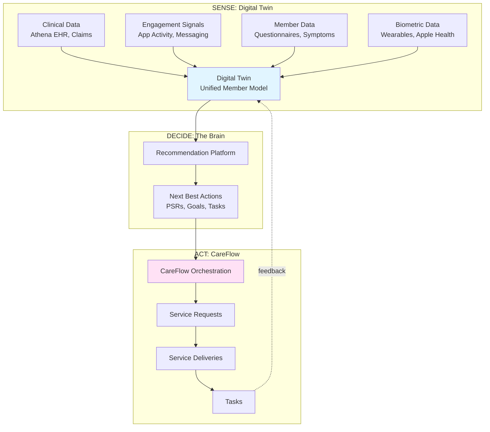
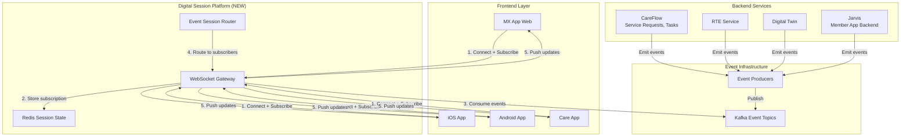

# Digital Session Platform: Event-Driven Member Experience

**Extends**: `EVENT_DRIVEN_RTE_PLAN.md`  
**Status**: DRAFT  
**Created**: 2025-01-15

---

## Executive Summary

This document extends the event-driven RTE architecture to create a **Digital Session Platform** - a generic, reusable event streaming infrastructure that any frontend application (MX app, iOS, Android, Care app) can use to subscribe to member session events and receive real-time updates.

### Vision

**Every member interaction with IncludedHealth** (whether through app, chat, voice, video) creates a **Digital Session** that emits events throughout its lifecycle. Frontends subscribe to these events and receive push notifications for:
- Service requests being processed
- Tasks being completed
- Clinical encounters progressing
- Coverage checks completing
- Care plans updating
- Real-time member state changes

### Key Concept: Digital Session

A **Digital Session** represents any member interaction with IncludedHealth, encompassing:
- **App Sessions**: Member using MX app, iOS, or Android
- **Chat Sessions**: Member messaging with care team
- **Voice Sessions**: Phone calls with care team
- **Video Sessions**: Video consultations
- **Clinical Encounters**: Athena EHR visits
- **Background Sessions**: System-initiated processes (cache warming, proactive outreach)

Each session produces an event stream that frontends can subscribe to for real-time updates.

---

## Architecture Context: IncludedHealth's Existing Models

### Current Operational Models (from Glean)

Based on Brad Tofel's "Operational Models" document, IncludedHealth already has these concepts:

#### MemberSession (Existing)
> "An MemberSession represents an interaction between a member and IH, using one of several channels: Chat, Voice, Video, App"

**Current attributes**:
- Time period (active duration)
- Participants (member + IH staff)
- Intent (main reason for interaction)
- Channel (chat/voice/video/app)
- Access controls (based on authenticated members)

**Current usage**:
- Service Requests have FK to MemberSession where created
- Tasks completed during session have FK to MemberSession
- Valuable for product analytics

#### Digital Twin + CareFlow Architecture (Existing)

From IncludedHealth's 2025 Tech Vision:



**Key Insight**: Digital Twin already produces event streams. CareFlow orchestrates Service Requests and Tasks. **What's missing**: Frontend access to these event streams.

---

## Proposed: Digital Session Platform

### What We're Adding

**Extend the event-driven RTE infrastructure to create a generic platform** where:

1. **Every MemberSession emits events** (lifecycle, state changes)
2. **Every Service Request emits events** (submitted, processing, completed)
3. **Every Task emits events** (assigned, in-progress, completed)
4. **Frontends subscribe by session ID** and receive all relevant events
5. **WebSocket Gateway** routes events to connected clients

### Architecture Overview



---

## Event Types & Schema

### Session Lifecycle Events

#### 1. `session.created`

Emitted when a member starts any interaction with IncludedHealth.

```protobuf
message SessionCreatedEvent {
  string session_id = 1;
  string member_id = 2;
  string account_id = 3;
  SessionType session_type = 4;  // APP, CHAT, VOICE, VIDEO, CLINICAL
  SessionChannel channel = 5;    // MX_WEB, IOS, ANDROID, CARE_APP
  google.protobuf.Timestamp created_at = 6;
  string initiator_id = 7;       // Who started the session
  string intent = 8;             // Main reason for session
  map<string, string> metadata = 9;
}

enum SessionType {
  SESSION_TYPE_UNSPECIFIED = 0;
  SESSION_TYPE_APP = 1;          // Member using app
  SESSION_TYPE_CHAT = 2;         // Messaging session
  SESSION_TYPE_VOICE = 3;        // Phone call
  SESSION_TYPE_VIDEO = 4;        // Video consultation
  SESSION_TYPE_CLINICAL = 5;     // Athena EHR encounter
  SESSION_TYPE_BACKGROUND = 6;   // System-initiated
}

enum SessionChannel {
  CHANNEL_UNSPECIFIED = 0;
  CHANNEL_MX_WEB = 1;
  CHANNEL_IOS = 2;
  CHANNEL_ANDROID = 3;
  CHANNEL_CARE_APP = 4;
  CHANNEL_PHONE_INBOUND = 5;
  CHANNEL_PHONE_OUTBOUND = 6;
  CHANNEL_ATHENA = 7;
}
```

#### 2. `session.active`

Emitted periodically (every 30s) while session is active (heartbeat).

```protobuf
message SessionActiveEvent {
  string session_id = 1;
  string member_id = 2;
  google.protobuf.Timestamp last_activity_at = 3;
  SessionState state = 4;
  repeated string active_service_requests = 5;  // SRs in progress
  repeated string active_tasks = 6;             // Tasks in progress
}

enum SessionState {
  STATE_UNSPECIFIED = 0;
  STATE_ACTIVE = 1;
  STATE_IDLE = 2;           // No activity for >5 min
  STATE_WAITING = 3;        // Waiting for async operation
  STATE_COMPLETING = 4;     // Wrapping up
}
```

#### 3. `session.ended`

Emitted when session closes.

```protobuf
message SessionEndedEvent {
  string session_id = 1;
  string member_id = 2;
  google.protobuf.Timestamp ended_at = 3;
  int64 duration_seconds = 4;
  SessionEndReason reason = 5;
  SessionOutcome outcome = 6;
  repeated string completed_service_requests = 7;
  repeated string completed_tasks = 8;
}

enum SessionEndReason {
  REASON_UNSPECIFIED = 0;
  REASON_USER_CLOSED = 1;
  REASON_TIMEOUT = 2;
  REASON_COMPLETED = 3;
  REASON_ERROR = 4;
}

enum SessionOutcome {
  OUTCOME_UNSPECIFIED = 0;
  OUTCOME_SUCCESS = 1;
  OUTCOME_PARTIAL = 2;
  OUTCOME_FAILED = 3;
}
```

### Service Request Events

#### 4. `service_request.submitted`

```protobuf
message ServiceRequestSubmittedEvent {
  string service_request_id = 1;
  string session_id = 2;
  string member_id = 3;
  string healthcare_service = 4;  // "RTE", "EMO", "VPC", "Claims"
  string subject_account_id = 5;  // Beneficiary
  string initiator_id = 6;
  string reason = 7;
  ServiceRequestPriority priority = 8;
  google.protobuf.Timestamp submitted_at = 9;
}

enum ServiceRequestPriority {
  PRIORITY_UNSPECIFIED = 0;
  PRIORITY_INTERACTIVE = 1;  // User waiting
  PRIORITY_STANDARD = 2;     // Normal async
  PRIORITY_BATCH = 3;        // Bulk processing
  PRIORITY_URGENT = 4;       // Escalated
}
```

#### 5. `service_request.processing`

```protobuf
message ServiceRequestProcessingEvent {
  string service_request_id = 1;
  string session_id = 2;
  string member_id = 3;
  ProcessingStage stage = 4;
  int32 estimated_completion_seconds = 5;
  repeated TaskStatus task_statuses = 6;
}

enum ProcessingStage {
  STAGE_UNSPECIFIED = 0;
  STAGE_QUEUED = 1;
  STAGE_SCHEDULED = 2;
  STAGE_EXECUTING = 3;
  STAGE_FINALIZING = 4;
}

message TaskStatus {
  string task_id = 1;
  string task_type = 2;
  string status = 3;  // "pending", "in_progress", "completed"
}
```

#### 6. `service_request.completed`

```protobuf
message ServiceRequestCompletedEvent {
  string service_request_id = 1;
  string session_id = 2;
  string member_id = 3;
  ServiceDeliveryOutcome outcome = 4;
  bytes result_data = 5;  // Service-specific result
  int64 processing_duration_ms = 6;
  google.protobuf.Timestamp completed_at = 7;
}

enum ServiceDeliveryOutcome {
  OUTCOME_UNSPECIFIED = 0;
  OUTCOME_SUCCESS = 1;
  OUTCOME_FAILED = 2;
  OUTCOME_CANCELED = 3;
}
```

### Task Events

#### 7. `task.assigned`

```protobuf
message TaskAssignedEvent {
  string task_id = 1;
  string session_id = 2;
  string member_id = 3;
  string service_request_id = 4;
  string task_type = 5;
  string assignee_id = 6;        // Who will complete it
  string assignee_role = 7;      // "member", "care_team", "clinician"
  google.protobuf.Timestamp assigned_at = 8;
  google.protobuf.Timestamp due_at = 9;
}
```

#### 8. `task.in_progress`

```protobuf
message TaskInProgressEvent {
  string task_id = 1;
  string session_id = 2;
  string member_id = 3;
  string started_by = 4;
  google.protobuf.Timestamp started_at = 5;
  int32 estimated_completion_seconds = 6;
}
```

#### 9. `task.completed`

```protobuf
message TaskCompletedEvent {
  string task_id = 1;
  string session_id = 2;
  string member_id = 3;
  string service_request_id = 4;
  string completed_by = 5;
  bytes task_result = 6;  // Form data, outcome
  google.protobuf.Timestamp completed_at = 7;
}
```

### Domain-Specific Events

#### 10. `rte.completed` (RTE-specific)

From the original event-driven RTE plan:

```protobuf
message RTECompletedEvent {
  string session_id = 1;              // NEW: Link to session
  string workflow_id = 2;
  string service_request_id = 3;      // NEW: Link to SR
  string member_id = 4;
  // ... rest from EVENT_DRIVEN_RTE_PLAN.md
}
```

#### 11. `coverage.updated` (Coverage-specific)

```protobuf
message CoverageUpdatedEvent {
  string session_id = 1;
  string member_id = 2;
  string account_id = 3;
  CoverageChangeType change_type = 4;
  CoverageDetails coverage = 5;
}

enum CoverageChangeType {
  CHANGE_UNSPECIFIED = 0;
  CHANGE_ENROLLMENT = 1;
  CHANGE_VERIFICATION = 2;
  CHANGE_TERMINATION = 3;
  CHANGE_UPDATE = 4;
}
```

#### 12. `care_plan.updated` (Care Plan-specific)

```protobuf
message CarePlanUpdatedEvent {
  string session_id = 1;
  string member_id = 2;
  string care_plan_id = 3;
  CarePlanStatus status = 4;
  repeated string updated_goals = 5;
  repeated string new_tasks = 6;
}
```

---

## Frontend API: Digital Session SDK

### SDK Overview

Provide a unified SDK for all frontend platforms to interact with the Digital Session Platform.

### Platform Support

- **Web** (MX app): TypeScript/JavaScript SDK
- **iOS**: Swift SDK
- **Android**: Kotlin SDK
- **Care App** (Web): Same as MX app

### Core SDK Interface

```typescript
// TypeScript/JavaScript SDK
import { DigitalSessionClient } from '@includedhealth/digital-session';

// 1. Initialize client
const client = new DigitalSessionClient({
  endpoint: 'wss://sessions.includedhealth.com/v1',
  auth: {
    token: authToken,  // JWT from login
  },
  reconnect: {
    enabled: true,
    maxAttempts: 10,
    backoff: 'exponential',
  },
});

// 2. Create/connect to session
const session = await client.createSession({
  type: SessionType.APP,
  channel: SessionChannel.MX_WEB,
  intent: 'check_coverage',
  metadata: {
    screen: 'coverage_screen',
    version: '2.5.0',
  },
});

// 3. Subscribe to session events
session.on('service_request.completed', (event) => {
  console.log('Service request completed:', event);
  // Update UI with result
});

session.on('task.assigned', (event) => {
  console.log('New task assigned:', event);
  // Show task in To-Do list
});

session.on('rte.completed', (event) => {
  console.log('RTE check complete:', event);
  // Update coverage display
});

// 4. Submit service request
const serviceRequest = await session.submitServiceRequest({
  service: 'RTE',
  subject: accountId,
  reason: 'verify_coverage',
  priority: ServiceRequestPriority.INTERACTIVE,
});

// 5. Listen for progress updates
serviceRequest.on('progress', (update) => {
  console.log(`${update.stage}: ${update.estimatedSeconds}s remaining`);
  // Update progress bar
});

// 6. Handle completion
serviceRequest.on('completed', (result) => {
  console.log('Request completed:', result);
  // Display result to user
});

// 7. End session
await session.end({
  reason: SessionEndReason.USER_CLOSED,
  outcome: SessionOutcome.SUCCESS,
});
```

### iOS SDK (Swift)

```swift
import DigitalSessionKit

// 1. Initialize client
let client = DigitalSessionClient(
    endpoint: URL(string: "wss://sessions.includedhealth.com/v1")!,
    authToken: authToken
)

// 2. Create session
client.createSession(
    type: .app,
    channel: .ios,
    intent: "check_coverage"
) { session in
    // 3. Subscribe to events
    session.on(.serviceRequestCompleted) { event in
        print("Service request completed: \(event)")
        // Update SwiftUI view
    }
    
    // 4. Submit service request
    session.submitServiceRequest(
        service: "RTE",
        subject: accountId,
        priority: .interactive
    ) { serviceRequest in
        // Handle service request
    }
}
```

### Android SDK (Kotlin)

```kotlin
import com.includedhealth.digitalsession.DigitalSessionClient

// 1. Initialize client
val client = DigitalSessionClient(
    endpoint = "wss://sessions.includedhealth.com/v1",
    authToken = authToken
)

// 2. Create session
client.createSession(
    type = SessionType.APP,
    channel = SessionChannel.ANDROID,
    intent = "check_coverage"
) { session ->
    // 3. Subscribe to events
    session.on(EventType.SERVICE_REQUEST_COMPLETED) { event ->
        println("Service request completed: $event")
        // Update Compose UI
    }
    
    // 4. Submit service request
    session.submitServiceRequest(
        service = "RTE",
        subject = accountId,
        priority = ServiceRequestPriority.INTERACTIVE
    )
}
```

---

## Use Cases by Frontend Application

### MX App (Web)

#### Use Case 1: Coverage Check Screen

**Current** (Synchronous):
```typescript
// User clicks "Check Coverage"
const response = await checkCoverage(accountId);  // Blocks 10-30s
if (response.error) {
  showError("Coverage check failed");
}
```

**With Digital Sessions** (Event-Driven):
```typescript
// User clicks "Check Coverage"
const session = await client.getActiveSession();

// Submit request (instant)
const sr = await session.submitServiceRequest({
  service: 'RTE',
  subject: accountId,
});

// Show loading state
showLoadingIndicator('Checking coverage...');

// Listen for result
sr.on('completed', (result) => {
  hideLoadingIndicator();
  displayCoverage(result.coverage);
});

sr.on('progress', (update) => {
  updateProgressBar(update.percentComplete);
});
```

**Benefits**:
- Instant feedback (no waiting)
- Progress visibility
- No timeout failures
- Can backgroundautomatically

#### Use Case 2: Enrollment Flow

```typescript
// User submits enrollment form
const session = await client.getActiveSession();

const enrollment = await session.submitServiceRequest({
  service: 'ENROLLMENT_INSTANT_COVERAGE',
  subject: accountId,
  data: enrollmentForm,
});

// Show processing state
showEnrollmentProcessing();

// Listen for events
enrollment.on('task.completed', (task) => {
  if (task.task_type === 'STONE_CREATION') {
    showMessage('Step 1/3: Records created');
  }
  if (task.task_type === 'PDID_RETRIEVAL') {
    showMessage('Step 2/3: Identity verified');
  }
  if (task.task_type === 'RTE_CHECK') {
    showMessage('Step 3/3: Coverage confirmed');
  }
});

enrollment.on('completed', (result) => {
  showEnrollmentSuccess(result);
});
```

**Benefits**:
- Real-time progress updates
- No more "first enrollment failure" (ACT-2819)
- Clear visibility into what's happening

#### Use Case 3: To-Do List (Home Screen)

```typescript
// User opens app
const session = await client.getActiveSession();

// Subscribe to task events
session.on('task.assigned', (task) => {
  // New task appears in To-Do list
  addTaskToList(task);
});

session.on('task.completed', (task) => {
  // Task disappears from list
  removeTaskFromList(task);
});

// Display current tasks
const tasks = await session.getActiveTasks();
renderToDoList(tasks);
```

**Benefits**:
- Real-time task updates
- No polling required
- Always current

### iOS App

#### Use Case 1: Coverage Screen with Push Notifications

```swift
class CoverageViewController: UIViewController {
    var session: DigitalSession?
    
    override func viewDidLoad() {
        super.viewDidLoad()
        
        // Create session
        client.createSession(type: .app, channel: .ios) { session in
            self.session = session
            
            // Subscribe to RTE events
            session.on(.rteCompleted) { [weak self] event in
                DispatchQueue.main.async {
                    self?.displayCoverage(event.coverage)
                }
            }
        }
    }
    
    @IBAction func checkCoverageButtonTapped(_ sender: Any) {
        // Submit request
        session?.submitServiceRequest(
            service: "RTE",
            subject: accountId
        ) { sr in
            // Show loading
            self.showLoadingState()
            
            // Listen for completion
            sr.on(.completed) { [weak self] result in
                DispatchQueue.main.async {
                    self?.hideLoadingState()
                    self?.displayCoverage(result.coverage)
                }
            }
        }
    }
}
```

#### Use Case 2: Background Session (App Closed)

**Scenario**: User closes app while RTE check is processing

```swift
// 1. User closes app
// 2. RTE completes while app is closed
// 3. Push notification sent to device

// In AppDelegate
func application(
    _ application: UIApplication,
    didReceiveRemoteNotification userInfo: [AnyHashable: Any]
) {
    if let eventType = userInfo["event_type"] as? String,
       eventType == "rte.completed" {
        // Show local notification
        let content = UNMutableNotificationContent()
        content.title = "Coverage Check Complete"
        content.body = "Your coverage has been verified"
        
        UNUserNotificationCenter.current().add(
            UNNotificationRequest(
                identifier: UUID().uuidString,
                content: content,
                trigger: nil
            )
        )
    }
}
```

**Benefits**:
- User doesn't need to wait
- Gets notified when ready
- Can check result later

### Android App

#### Use Case 1: Coverage Screen with Compose

```kotlin
@Composable
fun CoverageScreen(viewModel: CoverageViewModel) {
    val coverageState by viewModel.coverageState.collectAsState()
    
    Column {
        when (coverageState) {
            is CoverageState.Loading -> {
                CircularProgressIndicator()
                Text("Checking coverage...")
            }
            is CoverageState.Success -> {
                CoverageDetails(coverageState.coverage)
            }
            is CoverageState.Error -> {
                ErrorMessage(coverageState.error)
            }
        }
        
        Button(onClick = { viewModel.checkCoverage() }) {
            Text("Check Coverage")
        }
    }
}

class CoverageViewModel : ViewModel() {
    private val _coverageState = MutableStateFlow<CoverageState>(CoverageState.Idle)
    val coverageState: StateFlow<CoverageState> = _coverageState
    
    fun checkCoverage() {
        viewModelScope.launch {
            _coverageState.value = CoverageState.Loading
            
            // Get active session
            val session = client.getActiveSession()
            
            // Submit service request
            val sr = session.submitServiceRequest(
                service = "RTE",
                subject = accountId
            )
            
            // Listen for completion
            sr.on(EventType.COMPLETED) { event ->
                _coverageState.value = CoverageState.Success(event.coverage)
            }
            
            sr.on(EventType.FAILED) { event ->
                _coverageState.value = CoverageState.Error(event.error)
            }
        }
    }
}
```

### Care App (Clinician/Care Team)

#### Use Case 1: Member Context Panel

**Scenario**: Care team member has active call with patient

```typescript
// Care App - Member context panel
const session = await client.getActiveMemberSession(memberId);

// Subscribe to real-time updates
session.on('coverage.updated', (event) => {
  // Update coverage display in real-time
  refreshMemberContext(event.coverage);
});

session.on('task.completed', (event) => {
  // Show completed tasks
  addToActivityFeed(event);
});

session.on('service_request.completed', (event) => {
  // Show service delivery outcomes
  updateMemberHistory(event);
});

// Display current context
const context = await session.getMemberContext();
renderMemberPanel({
  coverage: context.coverage,
  activeTasks: context.tasks,
  recentServiceRequests: context.serviceRequests,
});
```

**Benefits**:
- Real-time member state
- No manual refresh needed
- Always current information

#### Use Case 2: Warm Transfer

```typescript
// Care team member initiates warm transfer
const currentSession = await client.getActiveSession();

// Create new service request for specialist
const transferSR = await currentSession.submitServiceRequest({
  service: 'WARM_TRANSFER',
  target_role: 'CLINICIAN',
  target_speciality: 'PSYCHIATRY',
  reason: 'member_needs_psych_eval',
  current_call_id: currentSession.id,
});

// Listen for specialist assignment
transferSR.on('task.assigned', (task) => {
  if (task.assignee_role === 'CLINICIAN') {
    showMessage(`Connecting to ${task.assignee_name}...`);
  }
});

transferSR.on('completed', (result) => {
  // Transfer complete
  showMessage('Member transferred to specialist');
  currentSession.end();
});
```

---

## Kafka Topic Architecture

### Topic Naming Convention

```
sessions.{domain}.{event-type}

Examples:
- sessions.lifecycle.created
- sessions.lifecycle.active
- sessions.lifecycle.ended
- sessions.service-request.submitted
- sessions.service-request.completed
- sessions.task.assigned
- sessions.task.completed
- sessions.rte.completed (domain-specific)
- sessions.coverage.updated (domain-specific)
```

### Topic Configuration

| Topic | Partitions | Retention | Key | Purpose |
|-------|-----------|-----------|-----|---------|
| `sessions.lifecycle.created` | 50 | 30 days | session_id | Session creation tracking |
| `sessions.lifecycle.active` | 50 | 7 days | session_id | Heartbeats (high volume) |
| `sessions.lifecycle.ended` | 50 | 90 days | session_id | Session analytics |
| `sessions.service-request.submitted` | 100 | 30 days | service_request_id | SR tracking |
| `sessions.service-request.completed` | 100 | 30 days | service_request_id | SR outcomes |
| `sessions.task.assigned` | 100 | 30 days | task_id | Task orchestration |
| `sessions.task.completed` | 100 | 30 days | task_id | Task outcomes |
| `sessions.rte.completed` | 50 | 7 days | member_id | RTE-specific (from original plan) |
| `sessions.coverage.updated` | 50 | 90 days | account_id | Coverage state changes |

### Partitioning Strategy

**Primary key: `session_id`** for session lifecycle events  
**Secondary key: `member_id`** for member-scoped events

Benefits:
- All events for a session are ordered
- All events for a member are ordered
- High parallelism (50-100 partitions)

### Consumer Groups

| Consumer Group | Topics | Purpose |
|---------------|--------|---------|
| `websocket-gateway` | All `sessions.*` | Push to connected clients |
| `analytics-pipeline` | All `sessions.*` | Data warehouse ingestion |
| `metrics-aggregator` | All `sessions.*` | Real-time metrics |
| `careflow-service` | `sessions.service-request.*`, `sessions.task.*` | CareFlow orchestration |
| `digital-twin` | All `sessions.*` | Update member model |
| `notification-service` | `sessions.service-request.completed`, `sessions.task.assigned` | Push notifications (iOS/Android) |

---

## WebSocket Gateway Extension

### Subscription Model

**Frontend subscribes to**:
1. **Session ID** - All events for active session
2. **Member ID** - All events for member (across sessions)
3. **Specific event types** - Filter by event type

### Subscription API

```typescript
// Subscribe to active session
client.subscribe({
  type: 'session',
  sessionId: session.id,
  events: ['*'],  // All events
});

// Subscribe to member events (cross-session)
client.subscribe({
  type: 'member',
  memberId: member.id,
  events: [
    'service_request.completed',
    'task.assigned',
    'coverage.updated',
  ],
});

// Subscribe to specific service requests
client.subscribe({
  type: 'service_request',
  serviceRequestIds: [sr1.id, sr2.id, sr3.id],
  events: ['*'],
});
```

### Event Filtering

WebSocket gateway filters events before pushing to clients:

```go
// In WebSocket Gateway
func (g *Gateway) shouldPushToClient(event *Event, subscription *Subscription) bool {
    // Filter by subscription type
    switch subscription.Type {
    case "session":
        return event.SessionID == subscription.SessionID
    case "member":
        return event.MemberID == subscription.MemberID
    case "service_request":
        return contains(subscription.ServiceRequestIDs, event.ServiceRequestID)
    }
    
    // Filter by event type
    if len(subscription.Events) > 0 && !contains(subscription.Events, "*") {
        return contains(subscription.Events, event.Type)
    }
    
    return true
}
```

### Load Balancing

**Connection distribution**:
- Sticky sessions (member always connects to same gateway instance)
- Redis tracks which gateway has which member's connections
- Kafka consumer group rebalances across gateway instances

**Scaling**:
- Each gateway instance handles ~10k connections
- Auto-scale based on connection count
- Horizontal scaling with load balancer

---

## Backend Integration: Event Emission

### CareFlow Service Integration

**Emit events when Service Requests and Tasks change state**:

```go
// In careflow-service/app/service/service_request.go
func (s *Service) SubmitServiceRequest(ctx context.Context, req *ServiceRequest) error {
    // Save to DB
    if err := s.repo.CreateServiceRequest(ctx, req); err != nil {
        return err
    }
    
    // Emit event
    s.eventProducer.Emit(ctx, &ServiceRequestSubmittedEvent{
        ServiceRequestID: req.ID,
        SessionID:        req.SessionID,
        MemberID:         req.MemberID,
        HealthcareService: req.Service,
        SubmittedAt:      req.CreatedAt,
    })
    
    return nil
}

func (s *Service) CompleteServiceRequest(ctx context.Context, req *ServiceRequest, result *ServiceDelivery) error {
    // Update DB
    if err := s.repo.UpdateServiceRequest(ctx, req); err != nil {
        return err
    }
    
    // Emit event
    s.eventProducer.Emit(ctx, &ServiceRequestCompletedEvent{
        ServiceRequestID: req.ID,
        SessionID:        req.SessionID,
        MemberID:         req.MemberID,
        Outcome:          result.Outcome,
        ResultData:       result.Data,
        CompletedAt:      time.Now(),
    })
    
    return nil
}
```

### RTE Service Integration

**Extend RTE events to include session context**:

```go
// In realtime-eligibility/app/workflows/fetchrte/v1/internal/fetch_rte_worker.go
func (w *fetchRteWorker) FetchRteActivity(ctx context.Context, params ActivityParams) (*RTEResponse, error) {
    // Call Stedi
    response, err := w.stediGateway.ProxyEligibility(ctx, params.Request)
    
    // Emit event with session context
    w.eventProducer.Emit(ctx, &RTECompletedEvent{
        SessionID:        params.SessionID,       // NEW: From request context
        ServiceRequestID: params.ServiceRequestID,  // NEW: Link to SR
        WorkflowID:       params.WorkflowID,
        MemberID:         params.MemberID,
        // ... rest of event
    })
    
    return response, err
}
```

### Jarvis Integration (Member App Backend)

**Emit session lifecycle events**:

```ruby
# In jarvis/app/controllers/api/v1/sessions_controller.rb
class Api::V1::SessionsController < ApiController
  def create
    # Create session
    @session = MemberSession.create!(
      member_id: current_member.id,
      session_type: 'APP',
      channel: request_channel,
      intent: params[:intent]
    )
    
    # Emit event
    EventProducer.emit(
      type: 'sessions.lifecycle.created',
      data: {
        session_id: @session.id,
        member_id: @session.member_id,
        session_type: @session.session_type,
        channel: @session.channel,
        created_at: @session.created_at
      }
    )
    
    render json: @session
  end
  
  def heartbeat
    # Update last activity
    @session.update!(last_activity_at: Time.current)
    
    # Emit heartbeat event
    EventProducer.emit(
      type: 'sessions.lifecycle.active',
      data: {
        session_id: @session.id,
        member_id: @session.member_id,
        last_activity_at: @session.last_activity_at
      }
    )
    
    head :ok
  end
end
```

---

## Implementation Roadmap

### Phase 0: Foundation (From EVENT_DRIVEN_RTE_PLAN.md)

**Already planned** (Weeks 1-4):
- Kafka cluster setup
- Event producer service
- Event consumer framework
- WebSocket gateway (basic)

### Phase 1: Digital Session Platform Core (Weeks 5-8)

**Goal**: Extend event infrastructure for session management

#### Week 5-6: Session Event Schema & Producer

**Tasks**:
1. Define session event protobuf schemas
2. Implement session event producer in Jarvis
3. Emit `session.created`, `session.active`, `session.ended` events
4. Kafka topics for session events

**Deliverables**:
- Session events flowing to Kafka
- Validation dashboard (Grafana)

**Files to Create**:
- NEW: `proto-common/domain/sessions/v1/session_events.proto`
- NEW: `jarvis/app/services/event_producer.rb`
- NEW: `jarvis/app/models/member_session.rb` (extend existing)

#### Week 7-8: WebSocket Gateway Session Support

**Tasks**:
1. Extend WebSocket gateway to support session subscriptions
2. Implement session-based event routing
3. Add subscription filtering
4. Load test (10k concurrent sessions)

**Deliverables**:
- WebSocket gateway supports session subscriptions
- Clients can subscribe to session events
- Load test results

**Files to Modify**:
- `websocket-gateway/app/handler/websocket.go` (extend)
- `websocket-gateway/app/router/event_router.go` (add session routing)

### Phase 2: CareFlow Integration (Weeks 9-12)

**Goal**: Emit Service Request and Task events

#### Week 9-10: Service Request Events

**Tasks**:
1. Integrate event producer into CareFlow service
2. Emit SR events (submitted, processing, completed)
3. Link SRs to sessions

**Deliverables**:
- Service Request events flowing
- Events linked to sessions

**Files to Modify**:
- `careflow-service/app/service/service_request.go`
- `careflow-service/app/producer/events.go` (new)

#### Week 11-12: Task Events

**Tasks**:
1. Emit Task events (assigned, in_progress, completed)
2. Link tasks to sessions and SRs
3. Validate event ordering

**Deliverables**:
- Task events flowing
- Complete event chain: Session → SR → Tasks

### Phase 3: Frontend SDK Development (Weeks 13-20)

#### Week 13-15: Web SDK (TypeScript)

**Tasks**:
1. Build `@includedhealth/digital-session` npm package
2. Implement DigitalSessionClient
3. Example integration with MX app
4. Documentation

**Deliverables**:
- NPM package published
- Example coverage screen integration
- SDK documentation

**Files to Create**:
- NEW: `digital-session-sdk/packages/web/`
  - `src/client.ts`
  - `src/session.ts`
  - `src/service_request.ts`
  - `src/events.ts`

#### Week 16-17: iOS SDK (Swift)

**Tasks**:
1. Build `DigitalSessionKit` Swift Package
2. Implement session management
3. Example integration with iOS app

**Deliverables**:
- Swift Package published
- Example integration

**Files to Create**:
- NEW: `digital-session-sdk/packages/ios/`
  - `Sources/DigitalSessionKit/Client.swift`
  - `Sources/DigitalSessionKit/Session.swift`

#### Week 18-19: Android SDK (Kotlin)

**Tasks**:
1. Build Android library
2. Implement session management
3. Example integration with Android app

**Deliverables**:
- Maven/Gradle library published
- Example integration

**Files to Create**:
- NEW: `digital-session-sdk/packages/android/`
  - `src/main/kotlin/com/includedhealth/digitalsession/`

### Phase 4: Production Rollout (Weeks 21-24)

#### Week 21-22: MX App Integration

**Tasks**:
1. Integrate SDK into MX app
2. Migrate coverage screen to event-driven
3. Migrate enrollment flow
4. Feature flag rollout (10% → 100%)

**Deliverables**:
- Coverage screen using events
- Enrollment using events
- Metrics: Timeout rate reduction

**Files to Modify**:
- `mx-app/src/features/coverage/CoverageScreen.tsx`
- `mx-app/src/features/enrollment/EnrollmentFlow.tsx`

#### Week 23-24: iOS/Android Integration

**Tasks**:
1. Integrate SDK into iOS app
2. Integrate SDK into Android app
3. Feature flag rollout
4. Push notification integration

**Deliverables**:
- Mobile apps using event-driven sessions
- Push notifications working

---

## Success Metrics

### User Experience Metrics

| Metric | Current | Target (Phase 4) | Measurement |
|--------|---------|------------------|-------------|
| Frontend timeout rate | 5-10% | <1% | Frontend error logs |
| Time to first interaction | Page load time | <500ms (session created) | Frontend telemetry |
| User-perceived latency | 10-30s blocking | Instant feedback + async | UX metrics |
| Engagement rate | Baseline | +20% (better UX) | Product analytics |

### Session Metrics

| Metric | Target | Measurement |
|--------|--------|-------------|
| Session creation rate | Baseline + events | Session events/sec |
| Average session duration | Baseline | Session analytics |
| Sessions with >1 service request | Track | Product analytics |
| Session completion rate | >95% | Completed vs abandoned |

### Event Infrastructure Metrics

| Metric | Target | Measurement |
|--------|--------|-------------|
| Event emission rate | 1000s/sec | Kafka producer metrics |
| Event delivery latency | <100ms (P95) | WebSocket push latency |
| WebSocket connection stability | >99.5% uptime | Connection metrics |
| Session event ordering | 100% correct | Validation tests |

### Business Impact Metrics

| Metric | Expected Impact | Measurement |
|--------|----------------|-------------|
| Service completion rate | +15% | ServiceRequest outcomes |
| Task completion rate | +20% | Task analytics |
| Member satisfaction (NPS) | +5 points | Survey data |
| Support ticket volume | -30% | Support metrics |

---

## Use Case Matrix: Which Frontends Benefit

| Use Case | MX Web | iOS | Android | Care App | Benefit |
|----------|--------|-----|---------|----------|---------|
| Real-time coverage updates | ✅ | ✅ | ✅ | ✅ | No timeout failures |
| Enrollment progress visibility | ✅ | ✅ | ✅ | ❌ | Clear status updates |
| To-Do list auto-update | ✅ | ✅ | ✅ | ❌ | Always current |
| Service request tracking | ✅ | ✅ | ✅ | ✅ | Visibility into progress |
| Push notifications | ❌ | ✅ | ✅ | ❌ | Offline completion notice |
| Member context panel | ❌ | ❌ | ❌ | ✅ | Real-time member state |
| Warm transfer orchestration | ❌ | ❌ | ❌ | ✅ | Seamless handoffs |
| Background processing | ✅ | ✅ | ✅ | ✅ | No user waiting |

---

## Comparison: Before vs After

### Before (Synchronous + Polling)

```
User Action → Request → Wait 30s → Timeout → Retry
             ↓
         Frontend blocked
         User sees spinner
         No progress visibility
         Frequent failures
```

### After (Event-Driven Sessions)

```
User Action → Create Session → Submit SR → Instant Response
             ↓                  ↓           ↓
         Session created    SR queued   Show "Processing..."
         Subscribe events   Tasks start  Progress updates
             ↓                  ↓           ↓
         Event: SR started  Event: Task 1 done  "Step 1/3..."
         Event: Task 2 done Event: SR completed "Complete!"
             ↓                  ↓           ↓
         User gets result   UI updates    No timeout
```

---

## Open Questions

### Q1: How do we handle session expiration?

**Options**:
1. **Sliding window**: Session extends with each activity (current 30min inactivity)
2. **Fixed duration**: Session expires after X hours regardless of activity
3. **Explicit close**: Frontend must explicitly end session

**Recommendation**: Sliding window (30min) with explicit close option. Auto-extend on any activity.

### Q2: Can multiple devices share the same session?

**Scenario**: Member opens app on phone, then opens web

**Options**:
1. **Separate sessions**: Each device gets its own session
2. **Shared session**: Both devices connect to same session
3. **Hybrid**: Web/mobile separate, but events visible across all

**Recommendation**: Separate sessions per device, but member-level subscription allows seeing events across sessions.

### Q3: How do we handle offline scenarios?

**Scenario**: User closes app while SR is processing

**Solution**:
1. Session remains active server-side (30min timeout)
2. When SR completes → Send push notification (iOS/Android)
3. User reopens app → Reconnects to session → Gets result
4. Missed events replayed from Kafka offset

### Q4: What about privacy/security?

**Concern**: Events may contain PHI

**Mitigations**:
1. **TLS required**: wss:// only (encrypted transport)
2. **JWT authentication**: Only authenticated members see their events
3. **Authorization**: Can only subscribe to your own member_id/session_id
4. **PHI minimization**: Events contain IDs, not full PHI (fetch details via API)
5. **Audit logging**: All subscriptions logged for compliance

### Q5: How do we test this end-to-end?

**Testing Strategy**:
1. **Unit tests**: SDK event handling
2. **Integration tests**: WebSocket gateway + Kafka
3. **E2E tests**: Cypress/Detox with test Kafka cluster
4. **Load tests**: 10k concurrent sessions
5. **Chaos tests**: Kill gateway instances, validate reconnect

---

## Migration Strategy

### Gradual Rollout

**Week 21-22**: MX Web (10% → 50% → 100%)
**Week 23**: iOS (10% → 50% → 100%)
**Week 24**: Android (10% → 50% → 100%)

**Feature Flags**:
- `enable-digital-sessions` - Enable session creation
- `enable-session-events` - Subscribe to events
- `enable-websocket-push` - WebSocket notifications
- `fallback-to-polling` - Disable events, use old polling

### Backward Compatibility

**Phase 1-3**: Events emitted but optional (frontends can ignore)
**Phase 4**: Frontends migrate to events (polling still works as fallback)
**Phase 5**: Deprecate polling APIs (6-month notice)
**Phase 6**: Remove polling code

### Rollback Plan

**If issues arise**:
1. Disable feature flag (instant rollback to polling)
2. Sessions continue being created (for analytics)
3. Events continue flowing (for observability)
4. No data loss or user impact

---

## Cost Estimate

### Infrastructure Costs (Incremental)

| Component | Cost/Month (Prod) | Notes |
|-----------|------------------|-------|
| Kafka topics (sessions.*) | +$1k | Additional topics beyond RTE |
| WebSocket gateway | +$2k-3k | More connections (100k+) |
| Event producers (Jarvis, CareFlow) | +$500 | CPU/memory overhead |
| **Total Incremental** | **+$3.5k-4.5k** | Beyond EVENT_DRIVEN_RTE_PLAN.md costs |

### Total Cost (RTE + Digital Sessions)

| Component | Cost/Month (Prod) |
|-----------|------------------|
| Kafka cluster | $5k-8k |
| WebSocket gateway | $3k-5k |
| Event producers | $1k |
| Monitoring/observability | $500 |
| **Total** | **$9.5k-14.5k** |

**Cost Offset**:
- Reduced polling CPU: $2k-3k/month
- Reduced timeout retries: $1k/month
- Reduced support tickets: $2k/month (less troubleshooting)

**Net Cost**: ~$3.5k-8.5k/month

**ROI**: Incident cost reduction + improved member experience > infrastructure cost

---

## Next Steps

1. **Review** this plan with Architecture, Product, and Engineering teams
2. **Prioritize** use cases by business value
3. **Prototype** Web SDK with coverage screen (2-week spike)
4. **Validate** with UX research (do users understand async feedback?)
5. **Plan** integration with existing Digital Twin / CareFlow initiatives
6. **Align** with 2025 Tech Vision (Sense-Decide-Act platform)
7. **Start** Phase 1 after EVENT_DRIVEN_RTE_PLAN.md Phase 5 complete

---

## Appendix A: Event Payload Examples

### A.1. Session Created Event

```json
{
  "specversion": "1.0",
  "type": "com.includedhealth.sessions.lifecycle.created",
  "source": "/jarvis/sessions",
  "id": "evt_session_created_12345",
  "time": "2025-01-15T10:00:00Z",
  "datacontenttype": "application/json",
  "data": {
    "session_id": "sess_abc123def456",
    "member_id": "M123456",
    "account_id": "A789012",
    "session_type": "APP",
    "channel": "MX_WEB",
    "created_at": "2025-01-15T10:00:00Z",
    "initiator_id": "M123456",
    "intent": "check_coverage",
    "metadata": {
      "screen": "coverage_screen",
      "app_version": "2.5.0",
      "device": "iPhone 14",
      "os_version": "iOS 17.2"
    }
  }
}
```

### A.2. Service Request Completed Event

```json
{
  "specversion": "1.0",
  "type": "com.includedhealth.sessions.service-request.completed",
  "source": "/careflow/service-requests",
  "id": "evt_sr_completed_67890",
  "time": "2025-01-15T10:05:23Z",
  "datacontenttype": "application/json",
  "data": {
    "service_request_id": "sr_xyz789abc123",
    "session_id": "sess_abc123def456",
    "member_id": "M123456",
    "healthcare_service": "RTE",
    "outcome": "SUCCESS",
    "result_data": {
      "coverage_status": "ACTIVE",
      "payer_name": "Blue Cross Blue Shield",
      "effective_date": "2025-01-01",
      "termination_date": "2025-12-31"
    },
    "processing_duration_ms": 12543,
    "completed_at": "2025-01-15T10:05:23Z"
  }
}
```

---

## Appendix B: Related Documentation

### IncludedHealth Internal Docs (from Glean)

- **Operational Models** - Brad Tofel's MemberSession, ServiceRequest, Task models
- **Early 2025 Tech Vision** - Digital Twin, The Brain, CareFlow architecture
- **CareFlow: Platform for Orchestrating Care** - Service Request/Task orchestration
- **proactive-cache-warming.md** - Member Cron integration (already created)

### This Repository

- **EVENT_DRIVEN_RTE_PLAN.md** - Original event-driven RTE architecture
- **EVENT_DRIVEN_RTE_SUMMARY.md** - Executive summary of RTE plan
- **EVENT_DRIVEN_INDEX.md** - Navigation guide for event docs

---

**Document Version**: 1.0  
**Created**: 2025-01-15  
**Author**: AI Assistant (Claude)  
**Status**: DRAFT  
**Extends**: EVENT_DRIVEN_RTE_PLAN.md

