# Digital Twin MCP Documentation Master Guide

## Document Set Overview

This guide ensures consistency across all Digital Twin MCP documentation and provides a single entry point for understanding the complete system.

### Document Hierarchy

```mermaid
graph TD
    MASTER[📚 DIGITAL_TWIN_MCP_MASTER.md<br/>You are here]
    
    subgraph "Core Architecture"
        PATTERN[📄 DIGITAL_TWIN_MCP_PATTERN.md<br/>Core pattern & architecture]
        CATALOG[📄 MEMBER_TWIN_RESOURCES_CATALOG.md<br/>Resource definitions]
    end
    
    subgraph "Integration Guides"
        EVENTS[📄 DIGITAL_TWIN_MCP_RESOURCES_INTEGRATION.md<br/>Event-driven integration]
        AUTH[📄 MCP_AUTHORIZATION_AUTHZILLA_INTEGRATION.md<br/>Authorization]
        SECURITY[📄 MCP_SECURITY_BEST_PRACTICES_IH.md<br/>Security]
        SAMPLING[📄 MCP_SAMPLING_ELICITATION_PATTERNS.md<br/>Sampling & elicitation]
    end
    
    subgraph "Implementation"
        MVP[📄 DIGITAL_TWIN_MCP_MVP_POC.md<br/>MVP proof of concept]
        MIGRATION[📄 AGENT_PLATFORM_DIGITAL_TWIN_MIGRATION.md<br/>Migration plan]
    end
    
    subgraph "Supporting"
        SUMMARY[📄 MCP_RESOURCES_AND_EVENTS_SUMMARY.md<br/>Executive summary]
        REVIEW[📄 Review & correction docs]
    end
    
    MASTER --> PATTERN
    MASTER --> CATALOG
    PATTERN --> EVENTS
    PATTERN --> AUTH
    PATTERN --> SECURITY
    PATTERN --> SAMPLING
    CATALOG --> MVP
    EVENTS --> MIGRATION
```



---

## Reading Order

### For Architects
1. **Start**: [MCP_RESOURCES_AND_EVENTS_SUMMARY.md](./MCP_RESOURCES_AND_EVENTS_SUMMARY.md) - Executive overview
2. **Core**: [DIGITAL_TWIN_MCP_PATTERN.md](./DIGITAL_TWIN_MCP_PATTERN.md) - Architecture patterns
3. **Integration**: [DIGITAL_TWIN_MCP_RESOURCES_INTEGRATION.md](./DIGITAL_TWIN_MCP_RESOURCES_INTEGRATION.md) - Event architecture
4. **Security**: [MCP_SECURITY_BEST_PRACTICES_IH.md](./MCP_SECURITY_BEST_PRACTICES_IH.md) - Security requirements

### For Developers
1. **Start**: [DIGITAL_TWIN_MCP_MVP_POC.md](./DIGITAL_TWIN_MCP_MVP_POC.md) - Quick POC implementation
2. **Resources**: [MEMBER_TWIN_RESOURCES_CATALOG.md](./MEMBER_TWIN_RESOURCES_CATALOG.md) - Available resources
3. **Patterns**: [MCP_SAMPLING_ELICITATION_PATTERNS.md](./MCP_SAMPLING_ELICITATION_PATTERNS.md) - Implementation patterns
4. **Migration**: [AGENT_PLATFORM_DIGITAL_TWIN_MIGRATION.md](./AGENT_PLATFORM_DIGITAL_TWIN_MIGRATION.md) - Migration guide

### For Product Teams
1. **Start**: [MCP_RESOURCES_AND_EVENTS_SUMMARY.md](./MCP_RESOURCES_AND_EVENTS_SUMMARY.md) - Business value
2. **Migration**: [AGENT_PLATFORM_DIGITAL_TWIN_MIGRATION.md](./AGENT_PLATFORM_DIGITAL_TWIN_MIGRATION.md) - Simplification benefits
3. **Patterns**: [MCP_SAMPLING_ELICITATION_PATTERNS.md](./MCP_SAMPLING_ELICITATION_PATTERNS.md) - User experience improvements

---

## Terminology & Conventions

### Naming Standards

| Term | Standard Usage | NOT | Context |
|------|---------------|-----|---------|
| **Digital Twin MCP** | The complete platform | MemberTwin MCP, Member Twin | When referring to the overall system |
| **MemberTwin** | The member-specific twin implementation | member-twin, Member Twin | In code and URIs |
| **MCP server** | The server implementing MCP protocol | Digital Twin server | Technical context |
| **Resource URI** | `mcp://twins/member/{id}/...` | `mcp://member-twin/...` | All resource identifiers |

### Tool Naming

```yaml
# Standard tool names (use dots for namespacing)
tools:
  - memberTwin.search       # ✅ Correct
  - memberTwin.readDocument  # ✅ Correct  
  - memberTwin.chat         # ✅ Correct
  
  # NOT these variations:
  - memberTwin_search       # ❌ Underscore
  - member-twin-search      # ❌ Hyphens
  - searchMemberTwin        # ❌ Different order
```

### Resource URI Format

```yaml
# Standard format
mcp://twins/{twin_type}/{id}/{resource_type}[/{sub_resource}]

# Examples:
mcp://twins/member/M123/profile
mcp://twins/member/M123/coverage
mcp://twins/member/M123/care/tasks
mcp://twins/practitioner/P456/availability
```

---

## Code Style Guide

### Go Examples

```go
// Package naming
package membertwin  // lowercase, no separators

// Type naming
type MemberTwinServer struct {  // CamelCase
    // ...
}

// Method naming
func (s *MemberTwinServer) ReadDocument(ctx context.Context, uri string) (*Resource, error) {
    // Implementation
}

// Constants
const (
    ResourceTypeProfile  = "profile"
    ResourceTypeCoverage = "coverage"
)
```

### Python Examples

```python
# Class naming
class MemberTwinClient:  # PascalCase
    
    # Method naming
    def read_document(self, uri: str) -> dict:  # snake_case
        pass
    
    # Tool decorator
    @tool
    def memberTwin_search(query: str, member_id: str) -> list:
        """Search member resources."""
        pass
```

### TypeScript Examples

```typescript
// Interface naming
interface MemberTwinResource {  // PascalCase
  uri: string;
  name: string;
  mimeType: string;
}

// Function naming
function readDocument(uri: string): Promise<Resource> {  // camelCase
  // Implementation
}

// Constant naming
const RESOURCE_BASE_URI = 'mcp://twins/member';  // UPPER_SNAKE_CASE
```

---

## Document Structure Template

All documents should follow this structure:

```markdown
# Document Title

## Executive Summary
Brief 2-3 sentence overview of the document's purpose.

## Key Concepts (if applicable)
- Concept 1: Definition
- Concept 2: Definition

## Architecture/Design (main content)
### Section 1
Content...

### Section 2
Content...

## Implementation (if applicable)
Code examples and practical guidance.

## References
- Link to related documents
- External specifications
```

---

## Common Diagrams

### 1. Three-Layer Architecture

Used in: Multiple documents


### 2. Event Flow

Used in: Event integration documents


---

## Key Messages

### Consistency Points

All documents should reinforce these key messages:

1. **Simplification**: 100+ tools → 3 universal verbs
2. **Standards-Based**: Follows MCP specification exactly
3. **2025 Tech Vision**: Implements "Sense" layer
4. **Event-Driven**: Real-time updates via Kafka
5. **Security-First**: Authzilla + Authzed integration
6. **Developer-Friendly**: Single integration point

### Value Propositions

Consistently emphasize these benefits:

- **For Developers**: Learn 3 tools instead of 100+
- **For Operations**: Single service to monitor and deploy
- **For Product**: Faster feature development
- **For Business**: 80% code reduction, lower maintenance

---

## Cross-Reference Matrix

| Document | References | Referenced By |
|----------|------------|---------------|
| **DIGITAL_TWIN_MCP_PATTERN.md** | MCP Spec, 2025 Tech Vision | All other docs |
| **MEMBER_TWIN_RESOURCES_CATALOG.md** | Pattern doc | MVP, Migration |
| **DIGITAL_TWIN_MCP_RESOURCES_INTEGRATION.md** | Pattern, Proto-common | Event Index |
| **MCP_AUTHORIZATION_AUTHZILLA_INTEGRATION.md** | Pattern, MCP Auth spec | Security doc |
| **MCP_SECURITY_BEST_PRACTICES_IH.md** | Auth doc, MCP Security spec | MVP |
| **MCP_SAMPLING_ELICITATION_PATTERNS.md** | Pattern, Catalog | MVP |
| **DIGITAL_TWIN_MCP_MVP_POC.md** | All core docs | Migration |
| **AGENT_PLATFORM_DIGITAL_TWIN_MIGRATION.md** | MVP, Pattern | - |
| **MCP_RESOURCES_AND_EVENTS_SUMMARY.md** | Pattern, Integration | - |

---

## Version History

| Version | Date | Changes |
|---------|------|---------|
| 1.0 | 2025-01-20 | Initial documentation set |
| 1.1 | 2025-01-20 | Added Walmart Coverage ADR |
| 1.2 | 2025-01-20 | Consistency improvements |

---

## Quick Links

### Core Specifications
- [MCP Specification](https://modelcontextprotocol.io/specification/2025-06-18)
- [MCP Resources](https://modelcontextprotocol.io/specification/2025-06-18/server/resources)
- [MCP Authorization](https://modelcontextprotocol.io/specification/2025-06-18/basic/authorization)
- [MCP Security](https://modelcontextprotocol.io/specification/2025-06-18/basic/security_best_practices)

### IH Systems
- [Agent Platform](https://github.com/ConsultingMD/agent-platform)
- [ai-workflows](https://github.com/ConsultingMD/ai-workflows)
- [Proto-common](https://github.com/ConsultingMD/proto-common)
- [Authzilla](https://github.com/ConsultingMD/authzilla)

### Related Documents
- [Event-Driven Index](./EVENT_DRIVEN_INDEX.md)
- [2025 Tech Vision](https://docs.google.com/presentation/d/...)
- [Walmart Coverage ADR](https://github.com/ConsultingMD/ai-workflows/blob/main/docs/adr/0002_walmart-coverage-info.md)

---

## Maintenance

### Document Owners
- **Core Pattern**: Platform Architecture team
- **Implementation**: Agent Platform team
- **Security**: Security team
- **Migration**: Tiger team

### Review Schedule
- Weekly: During active development
- Monthly: After MVP launch
- Quarterly: Production maintenance

### Update Process
1. Update specific document
2. Update this master guide if structure changes
3. Update EVENT_DRIVEN_INDEX.md if adding documents
4. Ensure cross-references remain valid
