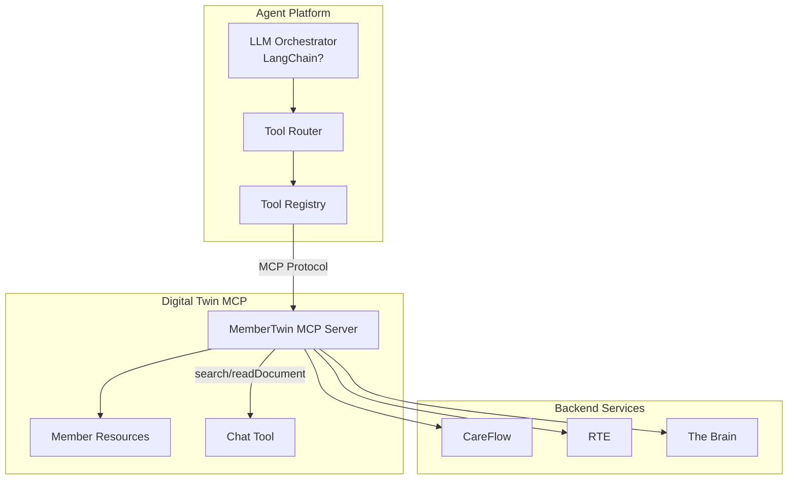

# Digital Twin MCP MVP Proof of Concept

## Executive Summary

This document defines the **thinnest possible MVP** to prove out the Digital Twin MCP pattern with Member Digital Twin. This is a **throwaway proof of concept** designed to validate the architecture before building production systems.

---

## Integration with Agent Platform

### Current Agent Platform Architecture

Based on Glean research:

1. **Tool-Based Routing**: Agent Platform recently shifted from intent classification to tool-based routing
2. **MCP Integration**: IH already has MCP servers (Omnibus, MCProxy, GitHub) and infrastructure
3. **LangChain**: Mentioned in context but specific usage unclear - likely for LLM orchestration
4. **Walmart Health Profile**: Intro Profile Agent collects health profiles through structured conversations

### How Digital Twin MCP Fits



**Key Integration Points**:
- Agent Platform discovers MemberTwin MCP server via MCP protocol
- Tools exposed via MCP become available to LLM agents
- Chat tool enables conversational member data access
- Resources provide structured member context

---

## MVP Scope: Thinnest Possible POC

### What We're Proving

1. ✅ MCP server can expose member resources
2. ✅ Agent Platform can discover and use MCP tools
3. ✅ Chat tool can gather member information conversationally
4. ✅ Resources can be sampled intelligently
5. ✅ Events can flow from backend changes to MCP resources

### What We're NOT Building

❌ Full resource catalog (only 3-5 resources)  
❌ Production authorization (mock Authzilla)  
❌ Real Authzed integration (hardcoded permissions)  
❌ Event-driven infrastructure (direct DB reads)  
❌ WebSocket gateway (not needed for POC)  
❌ Production deployment (local dev only)  

---

## MVP Architecture

### Minimal Components

```
┌─────────────────────────────────────────┐
│  Agent Platform (Existing)              │
│  - LLM Orchestrator                     │
│  - Tool Router                          │
└──────────────┬──────────────────────────┘
               │ MCP Protocol (HTTP)
               ↓
┌─────────────────────────────────────────┐
│  MemberTwin MCP Server (NEW - POC)      │
│  - HTTP handler (MCP endpoints)         │
│  - 3 MCP tools: search, readDocument    │
│  - Mock resource store (in-memory)      │
└──────────────┬──────────────────────────┘
               │ Direct DB queries
               ↓
┌─────────────────────────────────────────┐
│  Member Database (Existing)             │
│  - Member profile                       │
│  - Coverage data                        │
│  - Care plan summary                    │
└─────────────────────────────────────────┘
```

### MVP Resources (Only 3)

```yaml
resources:
  - uri: mcp://twins/member/{id}/profile
    name: Member Profile
    description: Basic demographics and contact info
    
  - uri: mcp://twins/member/{id}/coverage
    name: Coverage Summary
    description: Current insurance coverage and benefits
    
  - uri: mcp://twins/member/{id}/care-summary
    name: Care Summary
    description: Active care plans and tasks
```

### MVP Tools (Only 2)

```yaml
tools:
  - name: memberTwin.search
    description: Search for member resources
    inputSchema:
      type: object
      properties:
        query: { type: string }
        memberId: { type: string }
        
  - name: memberTwin.readDocument
    description: Read a specific member resource
    inputSchema:
      type: object
      properties:
        uri: { type: string }
```

**Note**: Chat tool deferred to Phase 2 (adds complexity)

---

## Golang Implementation Options

### Option 1: Standalone MCP Server (Recommended for POC)

**Structure**:
```
member-twin-mcp-poc/
├── cmd/
│   └── server/
│       └── main.go          # HTTP server
├── internal/
│   ├── mcp/
│   │   ├── handler.go       # MCP protocol handlers
│   │   ├── tools.go         # Tool implementations
│   │   └── resources.go     # Resource management
│   ├── member/
│   │   ├── profile.go       # Profile fetcher
│   │   ├── coverage.go      # Coverage fetcher
│   │   └── care.go          # Care summary fetcher
│   └── mock/
│       └── auth.go          # Mock authorization
└── go.mod
```

**Dependencies**:
```go
require (
    github.com/gorilla/mux v1.8.0
    github.com/ConsultingMD/go-common v0.0.0  // For DB access
)
```

**Pros**:
- ✅ Simplest to build
- ✅ No service dependencies
- ✅ Easy to throw away
- ✅ Can run locally

**Cons**:
- ❌ Not production-ready
- ❌ Direct DB access (not recommended for prod)

### Option 2: Handler in Existing Service

**Where**: Add to `member-sponsorship` or `coverage-server`

**Structure**:
```
member-sponsorship/
├── app/
│   └── handler/
│       └── mcp/
│           ├── mcp_handler.go
│           ├── tools.go
│           └── resources.go
```

**Pros**:
- ✅ Reuses existing DB connections
- ✅ Shares service infrastructure
- ✅ Easier to integrate with existing code

**Cons**:
- ❌ Couples POC to production service
- ❌ Harder to throw away later
- ❌ May affect production service

### Option 3: Go MCP Library Wrapper

**Use existing library**: `github.com/modelcontextprotocol/go-sdk` (if exists) or build minimal wrapper

**Structure**:
```go
import "github.com/modelcontextprotocol/go-sdk/server"

func main() {
    srv := server.NewMCPServer()
    
    srv.AddTool("memberTwin_search", handleSearch)
    srv.AddTool("memberTwin_readDocument", handleReadDocument)
    
    srv.AddResource("mcp://twins/member/{id}/profile", getProfile)
    
    srv.Serve(":8080")
}
```

**Pros**:
- ✅ Follows MCP spec exactly
- ✅ Less boilerplate
- ✅ Easier to maintain

**Cons**:
- ❌ May not exist yet (need to check)
- ❌ Adds dependency

**Recommendation**: **Option 1 (Standalone)** for POC - easiest to build and throw away

---

## Service Architecture Integration

### How MCP Server Fits

```go
// Minimal MCP server structure
package main

import (
    "net/http"
    "github.com/gorilla/mux"
)

type MCPServer struct {
    router     *mux.Router
    memberRepo MemberRepository
    auth       AuthChecker
}

func NewMCPServer() *MCPServer {
    s := &MCPServer{
        router: mux.NewRouter(),
    }
    
    // MCP protocol endpoints
    s.router.HandleFunc("/mcp/v1/tools/list", s.handleToolsList)
    s.router.HandleFunc("/mcp/v1/tools/call", s.handleToolCall)
    s.router.HandleFunc("/mcp/v1/resources/list", s.handleResourcesList)
    s.router.HandleFunc("/mcp/v1/resources/read", s.handleResourceRead)
    
    return s
}

func (s *MCPServer) handleToolCall(w http.ResponseWriter, r *http.Request) {
    var req struct {
        Name      string                 `json:"name"`
        Arguments map[string]interface{} `json:"arguments"`
    }
    
    json.NewDecoder(r.Body).Decode(&req)
    
    // Route to tool handler
    switch req.Name {
    case "memberTwin_search":
        s.handleSearch(w, req.Arguments)
    case "memberTwin_readDocument":
        s.handleReadDocument(w, req.Arguments)
    default:
        http.Error(w, "Unknown tool", 400)
    }
}
```

### Handler Pattern

```go
// Internal handler for member data
type MemberHandler struct {
    db *sql.DB
}

func (h *MemberHandler) GetProfile(memberID string) (*Profile, error) {
    // Direct DB query (POC only!)
    row := h.db.QueryRow(`
        SELECT id, first_name, last_name, email, phone
        FROM members
        WHERE id = $1
    `, memberID)
    
    var p Profile
    err := row.Scan(&p.ID, &p.FirstName, &p.LastName, &p.Email, &p.Phone)
    return &p, err
}
```

---

## Test Client Options

### Option 1: Claude Desktop (Recommended)

**Why**: 
- ✅ Already supports MCP
- ✅ Real-world agent experience
- ✅ Easy to configure

**Configuration** (`claude_desktop_config.json`):
```json
{
  "mcpServers": {
    "member-twin": {
      "command": "go",
      "args": ["run", "cmd/server/main.go"],
      "env": {
        "DB_CONNECTION": "postgres://...",
        "MEMBER_ID": "M123"
      }
    }
  }
}
```

### Option 2: MCP Inspector (Development Tool)

**Why**:
- ✅ Built for testing MCP servers
- ✅ Interactive exploration
- ✅ Good for debugging

**Usage**:
```bash
npm install -g @modelcontextprotocol/inspector
mcp-inspector --server "go run cmd/server/main.go"
```

### Option 3: Simple HTTP Client (Quick Test)

**Why**:
- ✅ Fastest to write
- ✅ Good for integration tests
- ✅ No external dependencies

**Example**:
```go
func TestMCPServer(t *testing.T) {
    // Start server
    go main()
    time.Sleep(100 * time.Millisecond)
    
    // Test tools/list
    resp, _ := http.Get("http://localhost:8080/mcp/v1/tools/list")
    var tools struct {
        Tools []Tool `json:"tools"`
    }
    json.NewDecoder(resp.Body).Decode(&tools)
    
    assert.Len(t, tools.Tools, 2)
    assert.Equal(t, "memberTwin_search", tools.Tools[0].Name)
}
```

### Option 4: Python MCP Client (For LangChain Integration)

**Why**:
- ✅ If Agent Platform uses Python/LangChain
- ✅ Can test integration path
- ✅ Matches production stack

**Example**:
```python
from mcp import ClientSession, StdioServerParameters
import asyncio

async def test_member_twin():
    async with ClientSession(
        StdioServerParameters(
            command="go",
            args=["run", "cmd/server/main.go"]
        )
    ) as session:
        # List tools
        tools = await session.list_tools()
        print(f"Available tools: {[t.name for t in tools.tools]}")
        
        # Call search tool
        result = await session.call_tool(
            "memberTwin.search",
            {"query": "coverage", "memberId": "M123"}
        )
        print(f"Search results: {result.content}")
```

**Recommendation**: **Claude Desktop** for POC - most realistic agent experience

---

## MVP Implementation Plan

### Week 1: Basic MCP Server

**Day 1-2**: Set up project structure
- [ ] Create `member-twin-mcp-poc/` directory
- [ ] Set up Go module
- [ ] Add HTTP server with MCP endpoints
- [ ] Implement `tools/list` endpoint

**Day 3-4**: Implement tools
- [ ] `memberTwin.search` tool
- [ ] `memberTwin.readDocument` tool
- [ ] Mock data store (hardcoded JSON)

**Day 5**: Test with Claude Desktop
- [ ] Configure Claude Desktop
- [ ] Verify tools appear
- [ ] Test tool calls

### Week 2: Real Data Integration

**Day 1-2**: Connect to database
- [ ] Add DB connection (read-only)
- [ ] Implement `GetProfile()` handler
- [ ] Implement `GetCoverage()` handler
- [ ] Implement `GetCareSummary()` handler

**Day 3-4**: Implement resources
- [ ] `resources/list` endpoint
- [ ] `resources/read` endpoint
- [ ] Resource URI parsing

**Day 5**: End-to-end test
- [ ] Test with real member data
- [ ] Verify resource reading
- [ ] Document findings

### Week 3: Agent Platform Integration

**Day 1-2**: Integrate with Agent Platform
- [ ] Configure Agent Platform to discover MCP server
- [ ] Test tool routing
- [ ] Verify LLM can use tools

**Day 3-4**: Test scenarios
- [ ] "What is member M123's coverage?"
- [ ] "Search for member M123's care plans"
- [ ] Measure latency and accuracy

**Day 5**: Demo and documentation
- [ ] Create demo video
- [ ] Document learnings
- [ ] Identify gaps for production

---

## Success Criteria

### Must Have (POC Validated)

✅ Agent Platform discovers MemberTwin MCP server  
✅ LLM can call `memberTwin.search` tool  
✅ LLM can call `memberTwin.readDocument` tool  
✅ Resources return real member data  
✅ End-to-end latency < 500ms  

### Nice to Have

🎯 Chat tool implemented  
🎯 Resource sampling working  
🎯 Multiple members supported  
🎯 Error handling robust  

---

## Code Example: Minimal MCP Server

```go
package main

import (
    "database/sql"
    "encoding/json"
    "fmt"
    "log"
    "net/http"
    "os"
    
    "github.com/gorilla/mux"
    _ "github.com/lib/pq"
)

type MCPServer struct {
    db *sql.DB
}

type Tool struct {
    Name        string                 `json:"name"`
    Description string                 `json:"description"`
    InputSchema map[string]interface{} `json:"inputSchema"`
}

type Content struct {
    Type string `json:"type"`
    Text string `json:"text"`
}

func main() {
    db, err := sql.Open("postgres", os.Getenv("DB_CONNECTION"))
    if err != nil {
        log.Fatal(err)
    }
    
    server := &MCPServer{db: db}
    
    r := mux.NewRouter()
    r.HandleFunc("/mcp/v1/tools/list", server.handleToolsList)
    r.HandleFunc("/mcp/v1/tools/call", server.handleToolCall)
    r.HandleFunc("/mcp/v1/resources/list", server.handleResourcesList)
    r.HandleFunc("/mcp/v1/resources/read", server.handleResourceRead)
    
    log.Println("MCP Server starting on :8080")
    log.Fatal(http.ListenAndServe(":8080", r))
}

func (s *MCPServer) handleToolsList(w http.ResponseWriter, r *http.Request) {
    tools := []Tool{
        {
            Name:        "memberTwin.search",
            Description: "Search for member resources",
            InputSchema: map[string]interface{}{
                "type": "object",
                "properties": map[string]interface{}{
                    "query":    map[string]string{"type": "string"},
                    "memberId": map[string]string{"type": "string"},
                },
            },
        },
        {
            Name:        "memberTwin.readDocument",
            Description: "Read a specific member resource",
            InputSchema: map[string]interface{}{
                "type": "object",
                "properties": map[string]interface{}{
                    "uri": map[string]string{"type": "string"},
                },
            },
        },
    }
    
    json.NewEncoder(w).Encode(map[string]interface{}{"tools": tools})
}

func (s *MCPServer) handleToolCall(w http.ResponseWriter, r *http.Request) {
    var req struct {
        Name      string                 `json:"name"`
        Arguments map[string]interface{} `json:"arguments"`
    }
    json.NewDecoder(r.Body).Decode(&req)
    
    switch req.Name {
    case "memberTwin.search":
        query := req.Arguments["query"].(string)
        memberID := req.Arguments["memberId"].(string)
        
        // Simple search (POC only)
        results := s.searchResources(memberID, query)
        
        json.NewEncoder(w).Encode(map[string]interface{}{
            "content": []Content{
                {Type: "text", Text: fmt.Sprintf("Found %d resources", len(results))},
            },
        })
        
    case "memberTwin.readDocument":
        uri := req.Arguments["uri"].(string)
        content := s.readResource(uri)
        
        json.NewEncoder(w).Encode(map[string]interface{}{
            "content": []Content{
                {Type: "text", Text: content},
            },
        })
    }
}

func (s *MCPServer) searchResources(memberID, query string) []string {
    // Simple search implementation (POC)
    // In production, would use full-text search or vector similarity
    resources := []string{
        fmt.Sprintf("mcp://twins/member/%s/profile", memberID),
        fmt.Sprintf("mcp://twins/member/%s/coverage", memberID),
        fmt.Sprintf("mcp://twins/member/%s/care-summary", memberID),
    }
    
    // Filter by query (simple string matching for POC)
    var results []string
    for _, r := range resources {
        if contains(r, query) {
            results = append(results, r)
        }
    }
    return results
}

func (s *MCPServer) readResource(uri string) string {
    // Parse URI: mcp://twins/member/M123/profile
    // Extract member ID and resource type
    // Query database
    // Return JSON
    
    // POC implementation
    return `{"id": "M123", "name": "John Doe", "email": "john@example.com"}`
}

func contains(s, substr string) bool {
    return len(s) >= len(substr) && (s == substr || len(substr) == 0)
}

---

## Next Steps After POC

If POC validates the pattern:

1. **Production Architecture**: Design proper service boundaries
2. **Authorization**: Integrate real Authzilla/Authzed
3. **Event-Driven**: Add Kafka event infrastructure
4. **Resource Catalog**: Expand to full resource set
5. **Chat Tool**: Implement conversational interface
6. **Sampling**: Add intelligent resource selection

---

## References

- [MCP Specification](https://modelcontextprotocol.io/specification/2025-06-18)
- [Agent Platform Docs](https://github.com/ConsultingMD/agent-platform)
- [Go MCP Examples](https://github.com/modelcontextprotocol) (if available)
- [IH MCP Servers](https://github.com/ConsultingMD/coding-agents-config/tree/main/mcp-servers)
