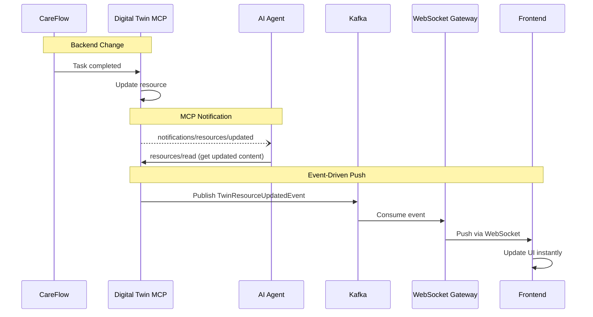
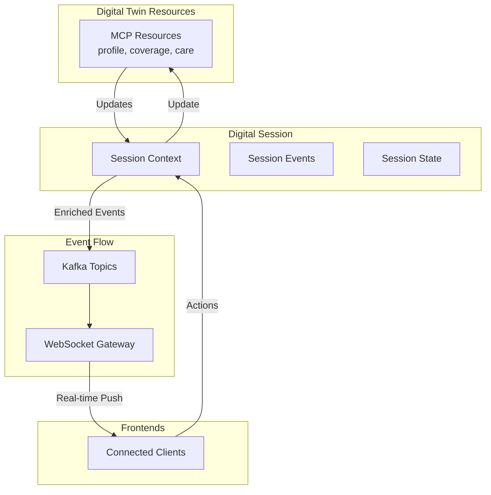

# Digital Twin MCP Resources & Event-Driven Integration

## Executive Summary

This document describes how the Digital Twin MCP pattern integrates with IH's event-driven architecture, following the [MCP Resources specification](https://modelcontextprotocol.io/specification/2025-06-18/server/resources). Digital Twin resources emit change notifications through Kafka, which flow to frontends via the WebSocket gateway, enabling real-time member experiences.

---

## Key Integration: MCP Resources + Event-Driven Architecture

The MCP Resources specification defines how servers expose resources and notify clients of changes. This maps perfectly to IH's Digital Twin and event-driven architecture:

```mermaid
graph TB
    subgraph "Digital Twin MCP Layer"
        DT[Digital Twin Resources]
        MEMBER[mcp://twins/member/{id}]
        PROFILE[.../profile]
        COVERAGE[.../coverage]
        CARE[.../care/summary]
        TASK[.../care/task/{id}]
    end
    
    subgraph "MCP Resource Operations"
        LIST[resources/list]
        READ[resources/read]
        SUB[resources/subscribe]
        NOTIFY[notifications/resources/updated]
    end
    
    subgraph "Event Infrastructure"
        KAFKA[Kafka Event Stream]
        TOPICS[Topics:<br/>twins.member.updated<br/>twins.coverage.changed<br/>twins.task.completed]
    end
    
    subgraph "Digital Session Platform"
        WS[WebSocket Gateway]
        SESSION[Digital Session]
        SDK[Frontend SDKs]
    end
    
    subgraph "Frontend Clients"
        IOS[iOS App]
        WEB[MX App]
        CARE[Care App]
    end
    
    DT --> LIST
    DT --> READ
    DT --> SUB
    DT --> NOTIFY
    
    NOTIFY -->|Publish| KAFKA
    KAFKA --> WS
    WS --> SESSION
    SESSION --> SDK
    SDK --> IOS
    SDK --> WEB
    SDK --> CARE
```

---

## How MCP Resources Work in the Digital Twin

### 1. Resource Definition (Following MCP Spec)

Each Digital Twin exposes resources as defined in the MCP specification:

```json
{
  "uri": "mcp://twins/member/M123/coverage",
  "name": "Coverage Summary",
  "title": "Member Coverage & Benefits",
  "description": "Current coverage, deductibles, and benefits",
  "mimeType": "application/json",
  "annotations": {
    "audience": ["user", "assistant"],
    "priority": 0.9,
    "lastModified": "2025-01-15T10:00:00Z"
  }
}
```

### 2. Resource Discovery

Agents discover available resources via `resources/list`:

**Request:**
```json
{
  "jsonrpc": "2.0",
  "id": 1,
  "method": "resources/list",
  "params": {
    "cursor": null
  }
}
```

**Response:**
```json
{
  "jsonrpc": "2.0",
  "id": 1,
  "result": {
    "resources": [
      {
        "uri": "mcp://twins/member/M123/profile",
        "name": "Member Profile",
        "mimeType": "application/json"
      },
      {
        "uri": "mcp://twins/member/M123/coverage",
        "name": "Coverage Summary",
        "mimeType": "application/json"
      },
      {
        "uri": "mcp://twins/member/M123/care/summary",
        "name": "Care Summary",
        "mimeType": "application/json"
      }
    ]
  }
}
```

### 3. Resource Reading

Agents retrieve resource contents via `resources/read`:

**Request:**
```json
{
  "jsonrpc": "2.0",
  "id": 2,
  "method": "resources/read",
  "params": {
    "uri": "mcp://twins/member/M123/coverage"
  }
}
```

**Response:**
```json
{
  "jsonrpc": "2.0",
  "id": 2,
  "result": {
    "contents": [
      {
        "uri": "mcp://twins/member/M123/coverage",
        "mimeType": "application/json",
        "text": "{\"plan\":\"PPO Plus\",\"deductible\":{\"used\":500,\"max\":1000},\"oop_max\":{\"used\":1200,\"max\":3000}}"
      }
    ]
  }
}
```

### 4. Resource Subscriptions & Change Notifications

This is where **MCP Resources meet Event-Driven Architecture**:

#### Subscribe to Resource Changes
```json
{
  "jsonrpc": "2.0",
  "id": 3,
  "method": "resources/subscribe",
  "params": {
    "uri": "mcp://twins/member/M123/coverage"
  }
}
```

#### Resource Update Flow

When a resource changes (e.g., RTE completes and updates coverage):

1. **Digital Twin detects change** (from CareFlow, RTE, Brain, etc.)
2. **MCP notification emitted**:
   ```json
   {
     "jsonrpc": "2.0",
     "method": "notifications/resources/updated",
     "params": {
       "uri": "mcp://twins/member/M123/coverage"
     }
   }
   ```
3. **Event published to Kafka**:
   ```protobuf
   message TwinResourceUpdatedEvent {
     string resource_uri = 1;  // "mcp://twins/member/M123/coverage"
     string twin_type = 2;     // "member"
     string twin_id = 3;       // "M123"
     string resource_type = 4; // "coverage"
     google.protobuf.Timestamp updated_at = 5;
     ChangeMetadata metadata = 6;
   }
   ```
4. **WebSocket Gateway consumes from Kafka**
5. **Frontend receives real-time update**

---

## Event-Driven Integration Architecture

### Event Flow: MCP Resource → Kafka → WebSocket → Frontend



### Kafka Topics for Digital Twin Resources

Following the proto-common pattern:

```yaml
# Member Twin Resources
twins.member.updated:
  - Profile changes
  - Enrollment updates
  - Preference changes

twins.member.coverage.changed:
  - RTE completions
  - Benefits updates
  - Deductible/OOP changes

twins.member.care.changed:
  - CareFlow task updates
  - Service request status
  - Care plan modifications

twins.member.clinical.changed:
  - New conditions
  - Medication updates
  - Lab results

# Practitioner Twin Resources
twins.practitioner.updated:
  - Availability changes
  - Schedule updates
  - Credential changes

# Digital Session Resources
twins.session.updated:
  - Session state changes
  - New messages
  - Context updates
```

### WebSocket Subscription Model

Frontends subscribe to resource changes via WebSocket:

```typescript
// Frontend SDK
const twinClient = new DigitalTwinClient({
  websocket: 'wss://events.includedhealth.com/v1/ws',
  auth: { token: authToken }
});

// Subscribe to specific resources
await twinClient.subscribeToResource('mcp://twins/member/M123/coverage');
await twinClient.subscribeToResource('mcp://twins/member/M123/care/summary');

// Handle resource updates
twinClient.on('resource.updated', async (event) => {
  if (event.uri === 'mcp://twins/member/M123/coverage') {
    // Fetch updated coverage
    const coverage = await twinClient.readResource(event.uri);
    updateCoverageUI(coverage);
  }
});
```

---

## Concrete Example: RTE Completion Flow

This example shows how RTE completion flows through the system:

### 1. RTE Service Completes Eligibility Check

```go
// In realtime-eligibility service
func (s *RTEService) completeEligibilityCheck(memberID string, result *EligibilityResult) {
    // Update cache
    s.cache.Set(memberID, result)
    
    // Emit event (existing event-driven RTE plan)
    event := &RTECompletedEvent{
        MemberID: memberID,
        Status: "completed",
        Eligibility: result,
    }
    s.producer.Publish("rte.completed", event)
}
```

### 2. Digital Twin Consumes RTE Event & Updates Resource

```go
// In member-twin-mcp service
func (t *MemberTwin) handleRTECompleted(event *RTECompletedEvent) {
    // Update coverage resource
    coverageURI := fmt.Sprintf("mcp://twins/member/%s/coverage", event.MemberID)
    t.updateResource(coverageURI, event.Eligibility)
    
    // Notify MCP subscribers (agents)
    t.mcp.NotifyResourceUpdated(coverageURI)
    
    // Publish to Kafka for frontends
    twinEvent := &TwinResourceUpdatedEvent{
        ResourceURI: coverageURI,
        TwinType: "member",
        TwinID: event.MemberID,
        ResourceType: "coverage",
        UpdatedAt: time.Now(),
    }
    t.producer.Publish("twins.member.coverage.changed", twinEvent)
}
```

### 3. WebSocket Gateway Pushes to Frontend

```go
// In websocket-gateway
func (g *Gateway) handleTwinResourceUpdate(event *TwinResourceUpdatedEvent) {
    // Find connected sessions for this member
    connections := g.redis.GetMemberConnections(event.TwinID)
    
    for _, conn := range connections {
        // Push update to frontend
        conn.Send(WebSocketMessage{
            Type: "resource.updated",
            Payload: map[string]interface{}{
                "uri": event.ResourceURI,
                "timestamp": event.UpdatedAt,
            },
        })
    }
}
```

### 4. Frontend Updates UI

```typescript
// In MX app
twinClient.on('resource.updated', async (event) => {
  if (event.uri.includes('/coverage')) {
    // Show instant update notification
    showNotification('Coverage information updated!');
    
    // Fetch and display updated coverage
    const coverage = await twinClient.readResource(event.uri);
    setCoverageData(coverage);
    setLoadingState(false);
  }
});
```

---

## Resource Templates for Dynamic Resources

Following MCP spec, the Digital Twin supports parameterized resources:

```json
{
  "jsonrpc": "2.0",
  "method": "resources/templates/list",
  "result": {
    "resourceTemplates": [
      {
        "uriTemplate": "mcp://twins/member/{memberId}/care/task/{taskId}",
        "name": "Care Task",
        "description": "Individual care task details",
        "mimeType": "application/json"
      },
      {
        "uriTemplate": "mcp://twins/member/{memberId}/encounter/{encounterId}",
        "name": "Clinical Encounter",
        "description": "Visit or encounter details",
        "mimeType": "application/fhir+json"
      }
    ]
  }
}
```

---

## Integration with Digital Session Platform

The Digital Session (from `DIGITAL_SESSION_PLATFORM_PLAN.md`) acts as the orchestration layer:



### Session-Aware Resource Updates

When resources update within a session context:

```protobuf
message SessionResourceUpdatedEvent {
  string session_id = 1;
  string resource_uri = 2;
  string member_id = 3;
  
  // Context about why resource updated
  oneof trigger {
    string task_completed = 4;
    string rte_finished = 5;
    string form_submitted = 6;
    string chat_action = 7;
  }
  
  // Session-specific metadata
  SessionContext context = 8;
}
```

---

## Privacy & Security Integration

MCP Resources include privacy annotations that flow through the event system:

```json
{
  "uri": "mcp://twins/member/M123/clinical/medications",
  "annotations": {
    "audience": ["assistant"],  // Not for direct user display
    "privacy": {
      "phi_category": "MEDICATIONS",
      "requires_consent": true,
      "allowed_destinations": ["care_team", "pharmacy"]
    }
  }
}
```

Event consumers respect these annotations:

```go
func (g *Gateway) filterEventForClient(event *TwinResourceUpdatedEvent, clientRole string) bool {
    resource := g.getResourceMetadata(event.ResourceURI)
    
    // Check audience restrictions
    if !contains(resource.Annotations.Audience, clientRole) {
        return false
    }
    
    // Check privacy restrictions
    if resource.Annotations.Privacy.RequiresConsent {
        if !g.hasConsent(event.TwinID, resource.Annotations.Privacy.PHICategory) {
            return false
        }
    }
    
    return true
}
```

---

## Implementation Roadmap

### Phase 1: MCP Resource Layer (Weeks 1-4)
- Implement Digital Twin MCP server with resource endpoints
- Define resource URIs and schemas in Schema Registry
- Basic resources/list and resources/read operations

### Phase 2: Change Detection & Notifications (Weeks 5-8)
- Integrate with CareFlow, RTE, Brain for change detection
- Implement resources/subscribe
- Emit notifications/resources/updated

### Phase 3: Kafka Event Publishing (Weeks 9-12)
- Publish TwinResourceUpdatedEvent to Kafka
- Follow proto-common event patterns
- Add event schemas to Schema Registry

### Phase 4: WebSocket Integration (Weeks 13-16)
- WebSocket Gateway consumes Twin events
- Route to connected sessions by member_id
- Frontend SDK updates for resource subscriptions

### Phase 5: Digital Session Integration (Weeks 17-20)
- Enrich events with session context
- Implement session-aware filtering
- Add chat tool integration

### Phase 6: Production Rollout (Weeks 21-24)
- Feature flags for gradual rollout
- Monitor event delivery metrics
- Deprecate polling patterns

---

## Benefits of This Integration

### 1. Real-Time Member Experience
- Coverage updates appear instantly (no polling)
- Care tasks update in real-time
- Clinical data syncs immediately

### 2. Unified Architecture
- Single event infrastructure (Kafka + WebSocket)
- Consistent resource model (MCP spec)
- Reusable across all twin types

### 3. AI Agent Integration
- Agents subscribe to resource changes
- Automatic context updates
- No polling or manual refresh

### 4. Developer Experience
- Standard MCP interface
- Type-safe resource schemas
- Built-in change notifications

---

## Migration from Current State

### Current: Direct API Calls + Polling
```typescript
// Current pattern (to be replaced)
const checkCoverage = async () => {
  setLoading(true);
  const result = await api.getRTECoverage(memberId);  // 10-30s wait
  setCoverage(result);
  setLoading(false);
};

// Poll for updates
setInterval(checkCoverage, 5000);  // Wasteful polling
```

### Future: Resource Subscriptions + Push
```typescript
// New pattern with Digital Twin resources
const initCoverage = async () => {
  // Subscribe to resource
  await twinClient.subscribeToResource(`mcp://twins/member/${memberId}/coverage`);
  
  // Get initial state
  const coverage = await twinClient.readResource(`mcp://twins/member/${memberId}/coverage`);
  setCoverage(coverage);
  
  // Receive push updates
  twinClient.on('resource.updated', (event) => {
    if (event.uri.includes('/coverage')) {
      const updated = await twinClient.readResource(event.uri);
      setCoverage(updated);  // Instant update!
    }
  });
};
```

---

## Metrics & Monitoring

### MCP Resource Metrics
```prometheus
# Resource operations
mcp_resources_list_total{twin_type="member"}
mcp_resources_read_total{resource_type="coverage"}
mcp_resources_subscribe_total{twin_type="member"}
mcp_resources_updated_total{resource_type="care_task"}

# Event flow metrics
twin_events_published_total{topic="twins.member.coverage.changed"}
twin_events_delivered_total{client_type="ios"}
twin_event_delivery_latency_seconds{p95="0.1"}
```

### Success Criteria
- Resource update latency < 500ms (from backend change to frontend)
- WebSocket delivery rate > 99.9%
- Zero polling requests after migration
- 50% reduction in API calls

---

## Summary

By combining:
1. **MCP Resources specification** (standard interface for Digital Twins)
2. **Event-driven architecture** (Kafka + WebSocket infrastructure)
3. **Digital Session Platform** (orchestration and context)

We create a unified system where:
- Digital Twins expose resources via standard MCP protocol
- Resources emit change notifications when updated
- Events flow through Kafka to WebSocket Gateway
- Frontends receive real-time push updates
- No more polling, no more timeouts, instant updates

This integration leverages all three architectural components (Digital Twin, Event-Driven, Digital Session) to deliver the real-time member experience promised in IH's 2025 Tech Vision.
