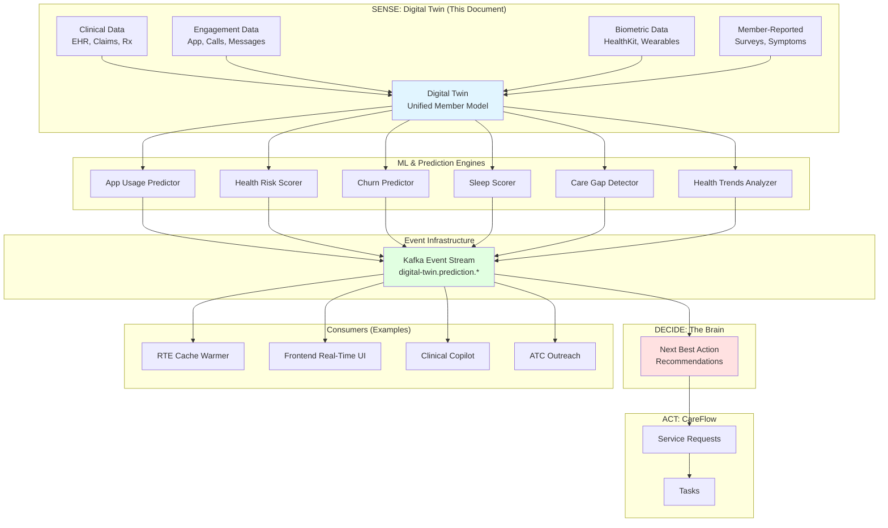

# Digital Twin Platform: Predictive Event Architecture

## Executive Summary

The **Digital Twin Platform** is the "Sense" layer of IncludedHealth's **Sense-Decide-Act** architecture. It maintains a real-time, unified representation of each member by continuously ingesting signals from clinical systems, engagement platforms, biometric devices, and member-reported data.

**Core Innovation**: Transform the Digital Twin from a **read-only state repository** into an **active event emitter** that publishes predictive events when ML models detect patterns, risks, or opportunities.

**Key Concept**:
```
Traditional: Digital Twin stores state → Apps query when needed
Predictive:  Digital Twin emits events → Apps react proactively
```

**Benefits**:
- **Proactive Care**: Act on predictions before member needs arise
- **Zero-Wait Experiences**: Pre-warm caches, pre-fetch data
- **Real-Time Personalization**: Update UI/recommendations instantly
- **Distributed Intelligence**: Any service can subscribe to predictions

---

## Architecture Overview

### Sense-Decide-Act Platform



### Key Components

**1. Digital Twin (Sense)**:
- Unified member model
- Continuously updated state
- Signal aggregation from all sources

**2. Prediction Engines**:
- ML models trained on historical data
- Real-time scoring when signals change
- Threshold-based event emission

**3. Event Infrastructure** (Kafka):
- `digital-twin.prediction.*` topic namespace
- CloudEvents standard format
- Partitioned by member_id

**4. The Brain (Decide)**:
- Consumes prediction events
- Generates Next Best Actions (NBA)
- Ranks recommendations by expected value

**5. CareFlow (Act)**:
- Service Requests
- Tasks for care coordinators
- Service Deliveries

**6. Domain-Specific Consumers**:
- RTE Cache Warmer (see RTE_PROACTIVE_CACHE_WARMING.md)
- Frontend real-time UI updates
- Clinical Copilot alerts
- Air Traffic Control outreach coordination

---

## Predictive Models & Events

### 1. App Usage Prediction

**Model**: Random Forest / Gradient Boosting
**Inputs**: Historical app usage, time of day, day of week, recent engagement
**Output**: Probability member will open app in next N minutes

**Event**:
```json
{
  "type": "digital-twin.prediction.app_usage_likely",
  "member_id": "A123456",
  "timestamp": "2025-11-13T08:00:00Z",
  "data": {
    "probability": 0.85,
    "predicted_time": "2025-11-13T09:00:00Z",
    "confidence": "high",
    "window_minutes": 60
  }
}
```

**Use Cases**:
- Pre-warm RTE cache (see RTE_PROACTIVE_CACHE_WARMING.md)
- Pre-fetch member dashboard data
- Load personalized recommendations
- Prepare video visit resources

---

### 2. Health Risk Score

**Model**: HCC (Hierarchical Condition Categories) + Custom ML
**Inputs**: Claims, diagnoses, medications, utilization, chronic conditions
**Output**: Risk score (0.0-1.0), risk tier (low/medium/high)

**Event**:
```json
{
  "type": "digital-twin.prediction.health_risk_changed",
  "member_id": "A123456",
  "timestamp": "2025-11-13T10:00:00Z",
  "data": {
    "risk_score": 0.72,
    "previous_score": 0.45,
    "risk_tier": "high",
    "contributing_factors": [
      "chronic_conditions_count: 3",
      "recent_ed_visit: true",
      "medication_adherence: 0.60"
    ],
    "hcc_score": 1.85
  }
}
```

**Use Cases**:
- Alert care coordinators (high-risk member)
- Surface care gaps in Clinical Copilot
- Prioritize outreach (Air Traffic Control)
- Adjust service recommendations

---

### 3. Churn Risk Score

**Model**: Logistic Regression / XGBoost
**Inputs**: Engagement history, benefit utilization, satisfaction scores, claims gaps
**Output**: Churn probability (0.0-1.0)

**Event**:
```json
{
  "type": "digital-twin.prediction.churn_risk_elevated",
  "member_id": "A123456",
  "timestamp": "2025-11-13T11:00:00Z",
  "data": {
    "churn_probability": 0.68,
    "previous_probability": 0.32,
    "risk_tier": "high",
    "contributing_factors": [
      "days_since_last_login: 45",
      "benefit_utilization: 0.15",
      "nps_score: 3"
    ]
  }
}
```

**Use Cases**:
- Trigger retention campaigns
- Assign high-touch care coordinator
- Surface "win-back" recommendations
- Alert client success team

---

### 4. Sleep Score & Anomalies

**Model**: Sleep stage analysis + anomaly detection
**Inputs**: HealthKit sleep data (duration, quality, heart rate, SpO2)
**Output**: Sleep score (0-100), anomalies detected

**Event**:
```json
{
  "type": "digital-twin.prediction.sleep_anomaly_detected",
  "member_id": "A123456",
  "timestamp": "2025-11-13T07:30:00Z",
  "data": {
    "sleep_score": 42,
    "anomaly_type": "poor_quality_persistent",
    "duration_hours": 4.2,
    "deep_sleep_minutes": 15,
    "days_consecutive": 5,
    "recommendation": "Consider sleep consultation"
  }
}
```

**Use Cases**:
- Surface in Health Trends feature
- Recommend sleep specialist
- Alert care coordinator (if severe)
- Trigger wellness outreach

---

### 5. Care Gap Detection

**Model**: Rule-based + ML gap predictor
**Inputs**: Clinical data, guidelines, member profile, recent visits
**Output**: Detected care gaps (screenings, vaccinations, follow-ups)

**Event**:
```json
{
  "type": "digital-twin.prediction.care_gap_detected",
  "member_id": "A123456",
  "timestamp": "2025-11-13T09:00:00Z",
  "data": {
    "gap_type": "colorectal_screening",
    "due_date": "2025-12-01",
    "days_overdue": 15,
    "priority": "high",
    "clinical_guidelines": "USPSTF 2021",
    "member_age": 52,
    "risk_factors": ["family_history"]
  }
}
```

**Use Cases**:
- Alert in Clinical Copilot during visits
- Surface in member app dashboard
- Trigger outreach (Air Traffic Control)
- Assign task to care coordinator

---

### 6. Health Trends Anomalies

**Model**: Time-series anomaly detection (heart rate, activity, weight)
**Inputs**: HealthKit continuous data (heart rate, steps, weight, BP)
**Output**: Anomalies detected, severity, duration

**Event**:
```json
{
  "type": "digital-twin.prediction.health_trend_anomaly",
  "member_id": "A123456",
  "timestamp": "2025-11-13T14:00:00Z",
  "data": {
    "metric": "resting_heart_rate",
    "anomaly_type": "persistently_elevated",
    "value_current": 105,
    "value_baseline": 72,
    "duration_days": 7,
    "severity": "moderate",
    "recommendation": "Consult primary care"
  }
}
```

**Use Cases**:
- Display in Health Trends feature
- Alert member via push notification
- Recommend virtual visit
- Flag in Clinical Copilot

---

### 7. Activity/Movement Prediction

**Model**: Random Forest (from wearables research)
**Inputs**: Heart rate, steps, calories, accelerometer data
**Output**: Movement type (lying, sitting, walking, running), activity level

**Event**:
```json
{
  "type": "digital-twin.prediction.activity_level_changed",
  "member_id": "A123456",
  "timestamp": "2025-11-13T06:00:00Z",
  "data": {
    "activity_level": "sedentary",
    "previous_level": "moderate",
    "days_consecutive": 10,
    "avg_steps_daily": 1200,
    "recommendation": "Increase activity"
  }
}
```

**Use Cases**:
- Surface in wellness dashboard
- Trigger activity coaching outreach
- Recommend fitness program
- Update member's health plan

---

### 8. Hypertension Risk

**Model**: BP trend analysis + risk predictor
**Inputs**: HealthKit BP readings, medications, diagnoses
**Output**: Hypertension risk score, recommendation

**Event**:
```json
{
  "type": "digital-twin.prediction.hypertension_risk_elevated",
  "member_id": "A123456",
  "timestamp": "2025-11-13T18:00:00Z",
  "data": {
    "risk_score": 0.78,
    "systolic_avg_7d": 145,
    "diastolic_avg_7d": 92,
    "readings_count": 14,
    "trend": "increasing",
    "on_medication": true,
    "recommendation": "Urgent PCP follow-up"
  }
}
```

**Use Cases**:
- Alert member via push notification
- Assign urgent task to care coordinator
- Surface in Clinical Copilot
- Recommend telehealth visit

---

### 9. Chronic Condition Prediction

**Model**: Claims + clinical data classifier
**Inputs**: Diagnoses, medications, utilization, lab results
**Output**: Predicted chronic conditions, confidence

**Event**:
```json
{
  "type": "digital-twin.prediction.chronic_condition_likely",
  "member_id": "A123456",
  "timestamp": "2025-11-13T12:00:00Z",
  "data": {
    "condition": "type_2_diabetes",
    "confidence": 0.82,
    "evidence": [
      "hba1c_7.2",
      "fasting_glucose_elevated",
      "bmi_32.4",
      "family_history"
    ],
    "recommendation": "Confirm diagnosis, refer to diabetes program"
  }
}
```

**Use Cases**:
- Surface in Clinical Copilot (confirm diagnosis)
- Recommend screening/testing
- Pre-populate care plan
- Trigger program enrollment outreach

---

### 10. Next Best Action (The Brain)

**Model**: Two-stage recommendation engine (generate → rank)
**Inputs**: All Digital Twin signals + historical outcomes
**Output**: Ranked list of Next Best Actions (NBA)

**Event**:
```json
{
  "type": "digital-twin.prediction.nba_updated",
  "member_id": "A123456",
  "timestamp": "2025-11-13T09:00:00Z",
  "data": {
    "recommendations": [
      {
        "action": "schedule_colorectal_screening",
        "expected_value": 0.85,
        "rationale": "Overdue by 15 days, high compliance history",
        "priority": 1
      },
      {
        "action": "refill_medication_metformin",
        "expected_value": 0.78,
        "rationale": "30-day supply ending in 3 days",
        "priority": 2
      },
      {
        "action": "schedule_annual_wellness_visit",
        "expected_value": 0.62,
        "rationale": "Due in 30 days, good engagement",
        "priority": 3
      }
    ]
  }
}
```

**Use Cases**:
- Display in member app dashboard
- Surface in Clinical Copilot
- Drive Air Traffic Control outreach
- Pre-populate care coordinator tasks

---

## Event Schema

### CloudEvents Standard

All Digital Twin prediction events use **CloudEvents** format:

```json
{
  "specversion": "1.0",
  "type": "digital-twin.prediction.app_usage_likely",
  "source": "digital-twin/prediction-engine/app-usage-predictor",
  "id": "evt_abc123",
  "time": "2025-11-13T08:00:00Z",
  "datacontenttype": "application/json",
  "subject": "member/A123456",
  "data": {
    "probability": 0.85,
    "predicted_time": "2025-11-13T09:00:00Z",
    "confidence": "high",
    "window_minutes": 60
  }
}
```

### Event Type Taxonomy

```
digital-twin.prediction.*
├── app_usage_likely           # Member likely to open app soon
├── health_risk_changed        # Health risk score updated
├── churn_risk_elevated        # Churn risk increased
├── sleep_anomaly_detected     # Sleep quality issue
├── care_gap_detected          # Missing screening/vaccine
├── health_trend_anomaly       # HealthKit metric anomaly
├── activity_level_changed     # Activity level shift
├── hypertension_risk_elevated # BP risk increased
├── chronic_condition_likely   # Predicted new condition
└── nba_updated               # Next Best Actions changed
```

---

## Implementation Components

### 1. Member Cron Service (NEW)

**Purpose**: Periodically evaluate members for predictive events.

**Architecture**:
```
┌─────────────────────────────────────────┐
│ Member Cron Service                     │
├─────────────────────────────────────────┤
│ 1. Load member cohort (priority-based)  │
│ 2. Query Digital Twin for signals       │
│ 3. Invoke prediction models (ML API)    │
│ 4. Evaluate thresholds                  │
│ 5. Emit events to Kafka                 │
└─────────────────────────────────────────┘
```

**Scheduling Strategy**:
- **High-Priority Members**: Every 15 minutes
  - Recent engagement (< 24 hours)
  - High health risk (> 0.7)
  - Active care plan
- **Medium-Priority Members**: Every 1 hour
  - Moderate engagement (< 7 days)
  - Moderate health risk (0.3-0.7)
- **Low-Priority Members**: Every 6 hours
  - Low engagement (> 7 days)
  - Low health risk (< 0.3)

**Implementation**:
```go
// Member Cron Service
type MemberCronService struct {
    digitalTwin   DigitalTwinClient
    mlAPI         MLPredictionAPI
    kafkaProducer KafkaProducer
}

func (s *MemberCronService) RunCronCycle(ctx context.Context) error {
    // 1. Load priority cohort
    members, err := s.digitalTwin.GetMembersForPrediction(ctx, PriorityHigh)
    if err != nil {
        return err
    }
    
    // 2. For each member, run predictions
    for _, member := range members {
        // Query Digital Twin for latest signals
        signals, err := s.digitalTwin.GetSignals(ctx, member.ID)
        if err != nil {
            continue
        }
        
        // 3. Run ML predictions
        predictions, err := s.mlAPI.PredictAll(ctx, signals)
        if err != nil {
            continue
        }
        
        // 4. Evaluate thresholds and emit events
        for _, pred := range predictions {
            if pred.ExceedsThreshold() {
                event := pred.ToCloudEvent(member.ID)
                s.kafkaProducer.Publish(ctx, "digital-twin.prediction", event)
            }
        }
    }
    
    return nil
}
```

---

### 2. ML Prediction API

**Purpose**: Centralized API for invoking ML models.

**Architecture**:
```
┌─────────────────────────────────────────┐
│ ML Prediction API (KServe)              │
├─────────────────────────────────────────┤
│ Models:                                 │
│ - app-usage-predictor                   │
│ - health-risk-scorer                    │
│ - churn-predictor                       │
│ - sleep-scorer                          │
│ - care-gap-detector                     │
│ - health-trends-analyzer                │
└─────────────────────────────────────────┘
```

**API Contract**:
```protobuf
service MLPredictionService {
  rpc PredictAppUsage(AppUsagePredictionRequest) returns (AppUsagePredictionResponse);
  rpc PredictHealthRisk(HealthRiskPredictionRequest) returns (HealthRiskPredictionResponse);
  rpc PredictChurnRisk(ChurnRiskPredictionRequest) returns (ChurnRiskPredictionResponse);
  rpc PredictAll(PredictAllRequest) returns (PredictAllResponse);
}

message AppUsagePredictionRequest {
  string member_id = 1;
  DigitalTwinSignals signals = 2;
}

message AppUsagePredictionResponse {
  float probability = 1;
  string predicted_time = 2;
  string confidence = 3;  // "high" | "medium" | "low"
  int32 window_minutes = 4;
}
```

---

### 3. Event Consumers (Domain-Specific)

**RTE Cache Warmer** (see RTE_PROACTIVE_CACHE_WARMING.md):
```go
// Subscribe to app usage predictions
kafka.Subscribe("digital-twin.prediction.app_usage_likely", func(event CloudEvent) {
    if event.Data.Probability > 0.8 {
        // Pre-warm RTE cache
        rteCacheWarmer.WarmCache(event.Subject.MemberID)
    }
})
```

**Frontend Real-Time UI**:
```typescript
// WebSocket connection receives prediction events
websocket.on('digital-twin.prediction.care_gap_detected', (event) => {
  // Display care gap alert in dashboard
  showCareGapAlert(event.data);
});
```

**Clinical Copilot**:
```go
// Subscribe to care gap detections
kafka.Subscribe("digital-twin.prediction.care_gap_detected", func(event CloudEvent) {
    // Surface in care coordinator UI
    copilotUI.ShowAlert(event.Subject.MemberID, event.Data)
})
```

**Air Traffic Control (Outreach)**:
```go
// Subscribe to churn risk predictions
kafka.Subscribe("digital-twin.prediction.churn_risk_elevated", func(event CloudEvent) {
    // Trigger retention campaign
    atc.CreateOutreachTask(event.Subject.MemberID, "retention", event.Data)
})
```

---

## Integration with Existing Systems

### Digital Twin (Existing)

**Current State**: Read-only state repository
- Query APIs: `GetMember()`, `GetSignals()`, `GetProfile()`
- Updated by: Clinical systems, engagement platforms, HealthKit

**Proposed Enhancement**: Add event emission
- **New API**: `EmitPredictionEvent(memberID, eventType, data)`
- **Integration Point**: Member Cron Service calls ML API, then emits via Digital Twin

**No Breaking Changes**: Existing query APIs remain unchanged

---

### The Brain (Existing)

**Current State**: Next Best Action recommendation engine
- Two-stage process: Generate → Rank
- Inputs: Digital Twin state (polled)

**Proposed Enhancement**: Subscribe to prediction events
- **Subscribe**: `digital-twin.prediction.*` events
- **React**: Update NBA recommendations in real-time
- **Benefit**: Faster reaction to member state changes

---

### CareFlow (Existing)

**Current State**: Task orchestration platform
- Service Requests → Tasks → Service Deliveries

**Proposed Enhancement**: Subscribe to prediction events
- **Subscribe**: `digital-twin.prediction.care_gap_detected`
- **Auto-Create**: Tasks for care coordinators
- **Benefit**: Proactive task generation

---

### Clinical Copilot (In Development)

**Proposed Integration**: Subscribe to prediction events
- **Subscribe**: All `digital-twin.prediction.*` events
- **Display**: Real-time alerts during member interactions
- **Benefit**: Care coordinators see predictions in-context

---

## Monitoring & Observability

### Metrics

**Prediction Accuracy**:
```prometheus
digital_twin_prediction_accuracy{model="app_usage", outcome="correct"} 0.82
digital_twin_prediction_accuracy{model="churn_risk", outcome="false_positive"} 0.15
```

**Event Throughput**:
```prometheus
digital_twin_events_emitted_total{type="app_usage_likely"} 45000
digital_twin_events_consumed_total{consumer="rte_cache_warmer", type="app_usage_likely"} 45000
```

**Model Latency**:
```prometheus
digital_twin_ml_prediction_duration_seconds{model="health_risk"} 0.25
digital_twin_ml_prediction_duration_seconds{model="churn_risk"} 0.18
```

**Member Cron Performance**:
```prometheus
member_cron_cycle_duration_seconds{priority="high"} 45.0
member_cron_members_evaluated_total{priority="high"} 12000
member_cron_events_emitted_total{priority="high"} 3500
```

### Logging

**Structured Logs** (JSON):
```json
{
  "timestamp": "2025-11-13T08:00:00Z",
  "service": "member-cron",
  "level": "info",
  "message": "Prediction event emitted",
  "member_id": "A123456",
  "event_type": "app_usage_likely",
  "probability": 0.85,
  "model_version": "v2.3.1"
}
```

### Alerting

**Prediction Quality Degradation**:
```yaml
alert: PredictionAccuracyLow
expr: digital_twin_prediction_accuracy < 0.70
for: 30m
annotations:
  summary: "{{$labels.model}} prediction accuracy dropped to {{$value}}"
  description: "Model may need retraining"
```

**Event Processing Lag**:
```yaml
alert: PredictionEventLag
expr: digital_twin_event_lag_seconds > 300
for: 10m
annotations:
  summary: "Prediction events delayed by {{$value}}s"
  description: "Consumer {{$labels.consumer}} is falling behind"
```

---

## Deployment Strategy

### Phase 1: Member Cron + ML API (Weeks 1-4)

**Goals**:
- Deploy Member Cron Service
- Integrate with existing Digital Twin (read-only)
- Deploy ML Prediction API (KServe)

**Deliverables**:
- Member Cron service (Go)
- ML Prediction API integration
- Kafka topic: `digital-twin.prediction.*`

**Metrics**:
- Member Cron cycles: 1 per 15 minutes (high-priority)
- ML API latency: < 500ms P95
- Events emitted: ~50k/day (initial cohort)

---

### Phase 2: First Consumer - RTE Cache Warmer (Weeks 5-8)

**Goals**:
- Implement RTE Cache Warmer consumer
- Subscribe to `app_usage_likely` events
- Measure cache hit rate improvement

**Deliverables**:
- RTE Cache Warmer service (see RTE_PROACTIVE_CACHE_WARMING.md)
- Stedi Batch API integration
- Metrics dashboard

**Success Criteria**:
- +20% cache hit rate
- 95% faster UX for predicted app opens

---

### Phase 3: Clinical Copilot Integration (Weeks 9-12)

**Goals**:
- Integrate prediction events into Clinical Copilot
- Display care gaps, health risks, anomalies
- Train care coordinators on new alerts

**Deliverables**:
- WebSocket subscription in Copilot UI
- Alert display components
- Training documentation

**Success Criteria**:
- Care coordinators act on 70% of alerts
- Positive feedback from CC team

---

### Phase 4: Frontend Real-Time UI (Weeks 13-16)

**Goals**:
- Subscribe member apps to prediction events
- Display care gaps, health trends in real-time
- Update recommendations dynamically

**Deliverables**:
- WebSocket SDK integration (see CLIENT_EVENT_PUBLISHING.md)
- Dashboard UI components
- Member notifications

**Success Criteria**:
- Members see updates within 1 second
- +15% care gap closure rate

---

### Phase 5: The Brain Integration (Weeks 17-20)

**Goals**:
- Migrate The Brain to event-driven updates
- Replace polling with event subscriptions
- Faster NBA updates

**Deliverables**:
- Kafka subscription in The Brain
- NBA recalculation on prediction events
- Performance benchmarks

**Success Criteria**:
- NBA updates < 5 seconds (vs. 5 minutes polling)
- -50% compute cost (no polling)

---

## Security & Privacy

### PHI Protection

**Event Data Classification**:
```json
{
  "type": "digital-twin.prediction.health_risk_changed",
  "authorization": {
    "visibility": "member_only",
    "sensitivity": "phi",
    "member_id": "A123456",
    "allowed_roles": ["care_coordinator", "clinician"]
  },
  "data": {
    "risk_score": 0.72  // PHI
  }
}
```

### Access Control

**Authorization** (see ACCESS_CONTROL_DESIGN.md):
- JWT authentication for consumers
- Authzed relationship checks
- Event filtering by member_id

### HIPAA Compliance

**Audit Logging**:
- All prediction events logged
- Consumer access tracked
- Member consent verified

---

## Cost Analysis

### Infrastructure Costs

**Member Cron Service**:
- Compute: 4 pods @ $50/month = $200/month
- ML API calls: 50k/day @ $0.001/call = $50/day = $1,500/month
- **Total**: ~$1,700/month

**Kafka Topic Storage**:
- 50k events/day × 1 KB/event = 50 MB/day
- Retention: 30 days = 1.5 GB
- **Cost**: ~$10/month

**Total Infrastructure**: ~$1,710/month

### ROI (Example: RTE Cache Warmer)

**Savings**:
- Reduced Stedi API calls: 20% cache hit increase
- 20% × 100k calls/day × $0.10/call = $2,000/day = $60,000/month

**ROI**: $60,000 savings / $1,710 cost = **35x return**

---

## Related Documentation

- **RTE_PROACTIVE_CACHE_WARMING.md** - RTE-specific cache warming use case
- **EVENT_DRIVEN_RTE_PLAN.md** - Event-driven RTE architecture
- **DIGITAL_SESSION_PLATFORM_PLAN.md** - Frontend integration
- **ACCESS_CONTROL_DESIGN.md** - Authorization for prediction events
- **CLIENT_EVENT_PUBLISHING.md** - Bidirectional event streaming

---

## Summary

The **Digital Twin Platform** transforms IncludedHealth's member representation from a passive state store into an active, predictive system that emits events when ML models detect patterns, risks, or opportunities.

**Key Innovations**:
✅ **Predictive Events**: Proactive care instead of reactive
✅ **Distributed Intelligence**: Any service can subscribe
✅ **Real-Time Personalization**: Instant UI updates
✅ **Zero-Wait Experiences**: Pre-warm caches, pre-fetch data

**13 Predictive Models**:
1. App Usage Prediction
2. Health Risk Score
3. Churn Risk Score
4. Sleep Score & Anomalies
5. Care Gap Detection
6. Health Trends Anomalies
7. Activity/Movement Prediction
8. Hypertension Risk
9. Chronic Condition Prediction
10. Next Best Action (The Brain)
11. Infection/Pregnancy Detection (from wearables)
12. Member Engagement Prediction
13. Clinical Complexity Score

**Use Cases**:
- RTE cache warming (see RTE_PROACTIVE_CACHE_WARMING.md)
- Clinical Copilot alerts
- Frontend real-time UI updates
- Air Traffic Control outreach
- The Brain NBA updates
- CareFlow task automation

**Timeline**: 20 weeks (5 phases)
**Cost**: ~$1,710/month
**ROI**: 35x (RTE use case alone)
