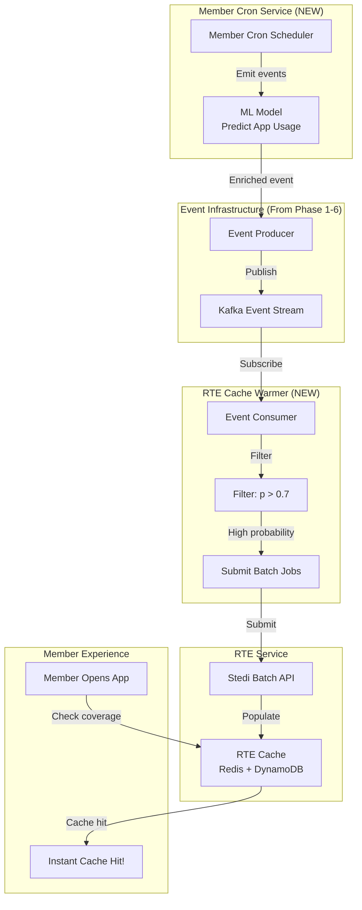
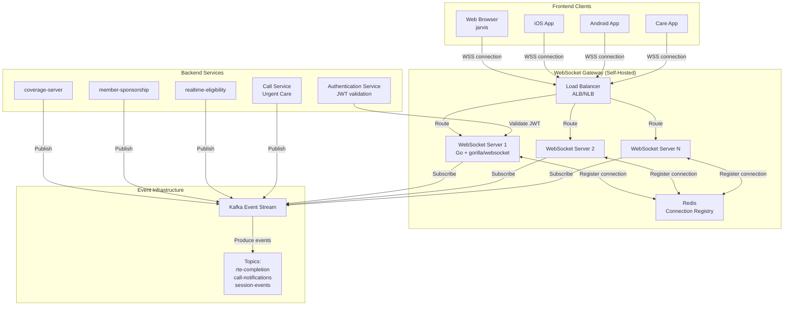

# Event-Driven RTE System - Documentation Index

This directory contains comprehensive documentation for replacing synchronous RTE (Real-Time Eligibility) requests with an event-driven push notification system, along with the Digital Twin MCP pattern integration.

---

## 🆕 Digital Twin MCP Integration

The Digital Twin MCP pattern is now integrated with the event-driven architecture. These documents describe how IH's Digital Twin Platform (the "Sense" layer of the 2025 Tech Vision) uses MCP Resources and event-driven notifications to enable real-time member experiences.

### 📚 Quick Navigation

📄 **[DIGITAL_TWIN_MCP_README.md](./DIGITAL_TWIN_MCP_README.md)** ⭐ **NEW - START HERE**
- Complete guide to Digital Twin MCP documentation
- Role-based reading paths (Executive, Architect, Developer, Security)
- Implementation roadmap (POC → MVP → Migration)
- FAQ and quick reference

📄 **[DIGITAL_TWIN_MCP_MASTER.md](./DIGITAL_TWIN_MCP_MASTER.md)** 📚 **NEW - CONSISTENCY GUIDE**
- Document hierarchy and structure
- Terminology and naming standards (Digital Twin MCP, MemberTwin, tool naming)
- Code style guide for Go, Python, TypeScript
- Cross-reference matrix for all documents

### Core Digital Twin Documents

📄 **DIGITAL_TWIN_MCP_PATTERN.md** (521 lines)
- First principles design of the Digital Twin MCP interface
- Three-verb pattern: search, readDocument, chat
- Implementation of the 2025 Tech Vision "Sense" layer
- Architecture integration with CareFlow, Brain, ATC, Agent Platform

📄 **MEMBER_TWIN_RESOURCES_CATALOG.md** (720 lines)  
- Complete catalog of MemberTwin MCP resources
- Resource URIs: profile, coverage, care, clinical, financial
- Document types and schemas
- Digital Session integration via chat tool

📄 **DIGITAL_TWIN_MCP_RESOURCES_INTEGRATION.md** (NEW)
- **How MCP Resources meet Event-Driven Architecture**
- Resource change notifications via Kafka
- WebSocket delivery to frontends
- Digital Session orchestration
- Complete example: RTE completion flow

📄 **MCP_RESOURCES_AND_EVENTS_SUMMARY.md** (NEW)
- Executive summary of MCP + Events integration
- The three layers: MCP Resources, Events, Delivery
- Key benefits and implementation phases
- Quick reference for architects and engineers

📄 **MCP_AUTHORIZATION_AUTHZILLA_INTEGRATION.md** (NEW)
- Integration of MCP OAuth 2.1 with Authzilla
- Authzed (SpiceDB) for fine-grained permissions
- Token structure and validation
- Complete authorization flow examples

📄 **MCP_SECURITY_BEST_PRACTICES_IH.md** (NEW)
- Implementation of MCP Security Best Practices
- Prevention of Confused Deputy attacks
- Token passthrough prevention (critical)
- Session hijacking mitigation
- Security checklist and incident response

📄 **MCP_SAMPLING_ELICITATION_PATTERNS.md** (NEW)
- Intelligent resource sampling strategies
- Information elicitation through chat interface
- Adaptive context management
- Clinical use cases (triage, adherence, care gaps)
- Implementation patterns and metrics

📄 **DIGITAL_TWIN_MCP_MVP_POC.md** (NEW)
- Thinnest MVP to prove out Digital Twin MCP pattern
- Golang implementation options and architecture
- Integration with Agent Platform and LangChain
- Test client recommendations (Claude Desktop, MCP Inspector)
- 3-week implementation plan for throwaway POC

📄 **AGENT_PLATFORM_DIGITAL_TWIN_MIGRATION.md** (NEW)
- Complete mapping of Agent Platform tools → Digital Twin resources
- Shows 100+ tools → 3 universal tools simplification
- Migration phases (28 weeks, 7 phases)
- Before/after architecture comparison
- Code reduction metrics (80%+ reduction)
- Risk mitigation and success criteria

### Supporting Documents

📄 **digital_twin_mcp_pattern_review.md**
- Review and corrections based on actual IH systems
- Clarifications on what exists vs. what's proposed
- Alignment with 2025 Tech Vision

📄 **digital_twin_mcp_pattern_corrections_summary.md**
- Quick reference of key corrections
- Existing infrastructure (Omnibus MCP, Digital Session Platform)

📄 **digital_twin_specific_text_corrections.md**
- Line-by-line corrections for accuracy

---

## Quick Start

**Start here** depending on your role:

### For Executives & Product Managers
👉 **Read**: `EVENT_DRIVEN_RTE_SUMMARY.md` (5-10 minutes)
- Problem overview
- Business impact
- Key metrics
- Timeline and costs

### For Engineers Implementing This
👉 **Read**: `EVENT_DRIVEN_RTE_PLAN.md` (30-45 minutes)
- Detailed technical architecture
- Implementation phases
- Code examples
- Migration strategy

### For Architects & Tech Leads
👉 **Read Both**:
1. `EVENT_DRIVEN_RTE_SUMMARY.md` - High-level overview
2. `EVENT_DRIVEN_RTE_PLAN.md` - Deep technical details

---

## Document Overview

### 📄 EVENT_DRIVEN_RTE_SUMMARY.md (483 lines)

**Quick Start: Read this first**

**Executive summary for quick understanding**

**Contents**:
- Problem statement (timeout cascade analysis)
- Solution overview (event-driven architecture)
- Benefits quantified
- Timeline (28 weeks)
- Cost estimates ($5.5k-8.5k/month)
- Success metrics (before/after)
- Migration strategy

**Best for**:
- Initial review and buy-in
- Stakeholder presentations
- Project kickoff meetings

---

### 📚 EVENT_DRIVEN_RTE_PLAN.md (2074 lines)

**Comprehensive technical specification**

---

### 🌐 DIGITAL_SESSION_PLATFORM_PLAN.md (1631 lines)

**Extension: Generic event platform for all frontends**

**This document extends the RTE plan to create a unified Digital Session Platform that any frontend can use.**

**Key Concepts**:
- **Digital Session**: Any member interaction (app, chat, voice, video, clinical encounter)
- **Event Streaming**: Real-time updates pushed to frontends
- **Multi-Platform Support**: MX app, iOS, Android, Care app
- **Integration**: Aligns with Digital Twin, CareFlow, and The Brain architecture

**Contents**:

#### Section 1: Architecture Context
- IncludedHealth's existing MemberSession model (from Operational Models doc)
- Digital Twin + CareFlow architecture (Sense-Decide-Act platform)
- What's missing: Frontend access to event streams

#### Section 2: Digital Session Platform Design
- Event types (12+ schemas): Session lifecycle, Service Requests, Tasks, Domain-specific
- Event flow architecture with Mermaid diagrams
- WebSocket gateway extension for session-based routing

#### Section 3: Frontend API & SDKs
- **TypeScript/JavaScript SDK** (MX app web)
- **Swift SDK** (iOS app)
- **Kotlin SDK** (Android app)
- **Care App** integration (web-based)
- Complete code examples for each platform

#### Section 4: Use Cases by Frontend
- **MX App**: Coverage screen, enrollment flow, To-Do list
- **iOS**: Real-time updates, background sessions, push notifications
- **Android**: Compose UI integration, viewModel patterns
- **Care App**: Member context panel, warm transfers

#### Section 5: Backend Integration
- CareFlow service event emission (Service Requests, Tasks)
- RTE service session context linking
- Jarvis session lifecycle events (Ruby)

#### Section 6: Kafka Topic Architecture
- Topic naming convention: `sessions.{domain}.{event-type}`
- 9 new topics with retention policies
- Consumer groups for different purposes

#### Section 7: Implementation Roadmap
- Phase 1: Digital Session Platform Core (Weeks 5-8)
- Phase 2: CareFlow Integration (Weeks 9-12)
- Phase 3: Frontend SDK Development (Weeks 13-20)
- Phase 4: Production Rollout (Weeks 21-24)

#### Section 8: Success Metrics & Cost Estimate
- User experience metrics (timeout rate, latency)
- Session metrics (creation rate, duration)
- Infrastructure costs (+$3.5k-4.5k/month incremental)

#### Section 9: Migration Strategy & Open Questions
- Gradual rollout with feature flags
- Backward compatibility approach
- Privacy/security considerations
- Testing strategy

**Best for**:
- Frontend teams implementing event-driven UX
- Architects designing cross-platform event systems
- Product teams planning member experience improvements
- Backend teams integrating with Digital Session Platform

---

### 🔧 PROTO_COMMON_INTEGRATION.md (3,000 lines)

**Implementation Guide: Integrate event-driven architecture with IncludedHealth's proto-common patterns**

**Contents**:
- Protostore event emission pattern (automatic `*Changed` events)
- Standard event components (`shared.events.v1.Header`, `Provenance`)
- Domain event definition patterns (following existing RTE, authentication, care operations events)
- Safe Harbor annotations for PHI/PII
- Event Gateway integration (for non-protostore events)
- Migration from CloudEvents to proto-common native format
- Complete proto definitions for all RTE, Digital Session, and Care Operations events
- **NEW**: Digital Twin resource events (`TwinResourceUpdatedEvent`, `TwinResourceCreatedEvent`)
- Code generation and kafka topic patterns

**Best for**:
- Backend engineers implementing event emission
- Platform engineers setting up Kafka topics
- Anyone defining new domain events
- Understanding existing proto-common event patterns

**Key Takeaway**: All events must follow proto-common patterns rather than custom schemas. Protostore automatically generates `*Changed` events for entities; custom events use `shared.events.v1.Header`.

---

### 🔄 PROACTIVE_CACHE_WARMING_INTEGRATION.md

**Integration: Future enhancement using event infrastructure for predictive cache warming**

**This section explains how the existing `./proactive-cache-warming.md` document integrates with the event-driven architecture.**

---

## Proactive Cache Warming Integration

### What Is Proactive Cache Warming?

The `./proactive-cache-warming.md` document describes a **predictive system** for pre-warming RTE caches **before** members need them. Instead of waiting for users to trigger cache misses, the system:

1. **Predicts** which members will use the app (ML model)
2. **Schedules** cache warming jobs before predicted usage
3. **Pre-populates** RTE cache using Stedi Batch API (doesn't consume realtime slots)
4. **Delivers** instant cache hits when users actually arrive

### Four Core Components

From the proactive-cache-warming document:

1. **Member Cron** - Scheduled event emitter for member-based triggers
   - Emits events for members at configurable intervals (@daily, @weekly)
   - Enriched with ML predictions (app_usage_probability, predicted_operations)
   - Kafka topic: `member-cron-events`

2. **Cache Control Parameter** - Explicit cache behavior in GraphQL/RPC
   - Allow clients to opt into cached data when staleness acceptable
   - Three modes: PREFER_CACHE, REQUIRE_FRESH, DEFAULT

3. **Batch RPC Interface** - Durable batch job submission
   - Use Stedi Batch API (10,000 checks/batch) for non-time-sensitive work
   - Separates batch from real-time traffic (no 15-slot congestion)

4. **Cache Warming Interface** - Proactive cache population
   - Consumer of Member Cron events
   - Warms cache before predicted member activity
   - Target: +20% cache hit rate

### How It Integrates with Event-Driven RTE

The proactive cache warming system is **Phase 7** (Weeks 25-28) of the event-driven RTE plan. It builds on the same event infrastructure:

```
EVENT_DRIVEN_RTE_PLAN.md (Phases 1-6)
    ├─ Foundation: Kafka + WebSocket Gateway
    ├─ Event emission from realtime-eligibility
    ├─ Event consumption in coverage/member-sponsorship
    ├─ Async APIs + Frontend SDKs
    └─ Migration complete
    
         ↓ ENABLES ↓
         
PROACTIVE CACHE WARMING (Phase 7, Weeks 25-28)
    ├─ Member Cron Service (NEW)
    │  └─ Emits: member-cron-events (scheduled, predictive)
    ├─ RTE Cache Warmer Consumer (NEW)
    │  └─ Subscribes to: member-cron-events
    │  └─ Filters: High app_usage_probability (>0.7)
    │  └─ Actions: Submit RTE requests using Batch API
    └─ Result: Cache pre-populated before member arrives
```

### Event Flow: Proactive Cache Warming



### Integration Benefits

**By building on the event-driven infrastructure**:

1. **Reuses Kafka cluster** - Same infrastructure, additional topics
2. **Reuses Event Producer** - Same producer service, new event types
3. **Reuses Consumer Framework** - Same `go-common/eventconsumer` library
4. **Reuses WebSocket Gateway** - Can push "cache warming complete" events to frontends
5. **Natural extension** - Not a separate project, just new consumers

**Cost-efficient**:
- Incremental cost: ~$1k-2k/month (Member Cron service + ML inference)
- Saves: Reduced realtime slot usage (batch API is free)
- ROI: +20% cache hit rate = less user waiting

### Key Event Schemas

#### MemberCronEvent (from proactive-cache-warming.md)

```protobuf
message MemberCronEvent {
  string member_id = 1;
  string account_id = 2;
  string schedule_name = 3;  // "daily-rte-warmup"
  string cron_expression = 4;  // "@daily"
  
  MemberContext context = 5;
}

message MemberContext {
  string sponsor_id = 1;
  bool has_rte_enabled = 2;
  
  ActivityPrediction predicted_activity = 3;
}

message ActivityPrediction {
  float app_usage_probability = 1;  // 0.0-1.0 (ML model prediction)
  repeated string predicted_operations = 2;  // ["check_eligibility"]
  float confidence = 3;
  string model_version = 4;
}
```

#### Usage Example

```go
// In realtime-eligibility/app/consumer/membercron/consumer.go (NEW)
func (c *CacheWarmerConsumer) HandleMemberCronEvent(ctx context.Context, event *MemberCronEvent) error {
    // Filter: Only warm cache for high-probability members
    if event.Context.PredictedActivity.AppUsageProbability < 0.7 {
        return nil  // Skip low-probability members
    }
    
    // Check if RTE-enabled
    if !event.Context.HasRteEnabled {
        return nil
    }
    
    // Submit batch RTE request (Stedi Batch API)
    return c.rteService.SubmitBatchRequest(ctx, BatchRequest{
        MemberID: event.MemberID,
        Priority: "BATCH",  // Low priority, uses Batch API
        UseBatchAPI: true,  // Don't consume realtime slots
    })
}
```

### Digital Twin Alignment

The Member Cron is part of IncludedHealth's **Digital Twin architecture** (2025 Tech Vision):

```
SENSE: Digital Twin
    ├─ Clinical Data (EHR, claims)
    ├─ Engagement Signals (app activity)
    ├─ Member Cron (scheduled, predictive events) ← NEW
    └─ Biometric Data (wearables)
    
DECIDE: The Brain
    └─ Next Best Actions (PSRs, Goals, Tasks)
    
ACT: CareFlow + Domain Services
    ├─ CareFlow (orchestration)
    ├─ RTE Cache Warming ← Consumer of Member Cron events
    ├─ Air Traffic Control (proactive outreach)
    └─ Care Teams (follow-up recommendations)
```

**Multiple consumers of Member Cron events**:
- ✅ RTE Cache Warmer (this plan)
- ✅ The Brain (trigger recommendations)
- ✅ Air Traffic Control (schedule outreach)
- ✅ Care Teams (surface members needing follow-up)
- ✅ CareFlow (trigger scheduled care actions)

### Implementation Timeline

**Phase 7: Proactive Cache Warming** (Weeks 25-28 of EVENT_DRIVEN_RTE_PLAN.md)

#### Week 25-26: Member Cron Service
- Build Member Cron scheduler service (Go/Python)
- Integrate ML model for app usage prediction
- Emit `member-cron-events` to Kafka
- Deploy to UAT

**Deliverables**:
- Member Cron service deployed
- ML predictions flowing
- Events in Kafka

**Files to Create**:
- NEW: `member-cron/` (new microservice)
  - `cmd/server/main.go`
  - `app/scheduler/cron.go`
  - `app/ml/predictor.go`
  - `platform/serviceConfig.yaml`

#### Week 27-28: RTE Cache Warmer Consumer
- Build cache warmer consumer in realtime-eligibility
- Subscribe to `member-cron-events`
- Submit batch requests to Stedi Batch API
- Measure cache hit rate improvement

**Deliverables**:
- Cache warmer deployed
- Batch API integration complete
- Metrics: +20% cache hit rate (target)

**Files to Create**:
- NEW: `realtime-eligibility/app/consumer/membercron/consumer.go`
- NEW: `realtime-eligibility/app/gateway/stedi/batch.go` (Stedi Batch API client)

### Success Metrics

| Metric | Baseline | Target | Measurement |
|--------|----------|--------|-------------|
| Cache hit rate | 40-50% | 60-70% (+20%) | RTE cache metrics |
| User-perceived latency | 10-30s | <500ms (cache hit) | Frontend telemetry |
| Realtime slot saturation | 5-10 incidents/year | 0 incidents | Incident tracking |
| Batch job duration | 3.75 hours (1000 members) | <30 min (Batch API) | Job metrics |

### Why This Matters

**Without proactive cache warming**:
```
User opens app → Cache miss → Wait 10-30s → Frustration
```

**With proactive cache warming**:
```
8am: ML predicts user will open app around 9am
8:30am: Member Cron emits event
8:31am: Cache warmer submits batch job
8:45am: Cache populated (Batch API takes 15 min)
9:00am: User opens app → Cache hit → Instant (<500ms)
```

**Result**: User doesn't even know we called Stedi - they just see instant coverage!

### Related Documentation

**External (realtime-eligibility repo)**:
- `./proactive-cache-warming.md` - Full 3960-line specification

**This repo (project-coverage-redesign)**:
- `EVENT_DRIVEN_RTE_PLAN.md` Section 9.7 - Mentions Phase 7 (cache warming)
- `DIGITAL_SESSION_PLATFORM_PLAN.md` Section 7 - Implementation roadmap includes cache warming

---

## Replacing Pusher Channels with Self-Hosted WebSocket Gateway

### CRITICAL CLARIFICATION: Two Different Pusher Products

IncludedHealth uses **TWO separate Pusher products**:

1. **Pusher Beams** (Web push notifications) → ✅ **ALREADY MIGRATED TO FIREBASE (Oct 2025)**
   - Epic: [RET-402](https://includedhealth.atlassian.net/browse/RET-402)
   - Replacement: Firebase Cloud Messaging (FCM)
   - No action needed - migration complete!

2. **Pusher Channels** (Real-time WebSocket) → ⚠️ **STILL IN ACTIVE USE - REPLACEMENT OPPORTUNITY**
   - This is what we'd replace with self-hosted WebSocket Gateway
   - No migration plan currently exists

### Current State: Pusher Channels Integration

**GraphQL Query**:
```graphql
query pusherInfo {
  me {
    member {
      pusherSubscribeInfo {
        appKey              # Pusher app identifier
        presenceChannelName # presence-member-{id}
        authURL             # Channel authentication endpoint
      }
    }
  }
}
```

**Clients**:
- iOS app (member-ios-app)
- Android app (member-android-app)
- Web (jarvis)

**Primary Use Case: Video Visit Events** (Urgent Care, Appointments)
- `call_accepted` - Provider accepted call
- `appointment_ready` - Appointment ready to join
- `call_ended` - Call completed
- `join_call` - Notification to join video visit
- `paid_extend_call_request` - Provider extending call time

**Secondary Use Case: Real-Time Presence**
- Show which members/providers are online

### Why Replace Pusher Channels?

| Issue | Evidence | Impact |
|-------|----------|--------|
| **Unreliable delivery** | iOS docs: *"Pusher is not 100% reliable"* | iOS built fallback polling |
| **Vendor lock-in** | INC-801: 7-8 day support response time | Can't rely on support |
| **Past incidents** | Pusher Beams: 0.17% delivery rate (INC-801) | High risk |
| **Cost** | Est. $99-299+/month (~$1.2-3.6k/year) | Savings opportunity |
| **Event-driven fit** | Already building Kafka + WebSocket | Redundant infrastructure |
| **iOS team precedent** | Already has fallback logic (polling) | Known workaround |

### The INC-801 Incident (Pusher Beams, June 2025)

**What Happened**:
- Pusher Beams web pushes completely blocked
- Only 97 of 57,000 notifications delivered (0.17% success rate)
- Exceeded subscription quota (stale connections)
- Support took 7-8 days to respond, tickets abruptly closed

**Quote from incident report**:
> "That PusherBeam support is unreliable non-existent (Beside 1 AI bot that auto-replies to emails)"

**Severity**: SEV-2 (EPDD), SEV-3 (Members)

**Long-term follow-up**: RET-402 - Migrated to Firebase (complete)

### iOS Team Already Built Fallback Logic

**From iOS Video Visits README**:
> "When the provider ends the call... the call_ended pusher and the roomCompleted events will be received. **Because Pusher is not 100% reliable**, we use the call-status API to get the end status whenever we receive the roomCompleted or roomNotFound events **as well as the pusher event**."

**Key Insight**: The iOS team **already knows Pusher is unreliable** and built polling as a backup. This proves:
1. ✅ Pusher failures are real and documented
2. ✅ Fallback to polling/REST APIs works
3. ✅ Migration risk is lower (fallback already exists)

### Key Insight

We're already building a WebSocket Gateway for the event-driven RTE system (Phase 3). **Extending it to replace Pusher Channels is nearly free** - just add support for video visit events.

---

### Self-Hosted WebSocket Gateway Architecture



---

### Requirements for Pusher Replacement

#### 1. **WebSocket Connection Management**

**Capabilities**:
- Maintain long-lived WebSocket connections (hours to days)
- Handle 10k-100k concurrent connections per instance
- Auto-reconnect with exponential backoff (client SDK)
- Heartbeat/ping-pong to detect stale connections
- Connection state persistence (Redis)

**Implementation**:
```go
// WebSocket Gateway (Go)
type Gateway struct {
    connections map[string]*Connection  // member_id -> connection
    redis       *redis.Client           // Distributed connection registry
    kafka       *kafka.Consumer         // Event stream consumer
}

func (g *Gateway) HandleWebSocket(w http.ResponseWriter, r *http.Request) {
    // 1. Upgrade HTTP to WebSocket
    conn, err := upgrader.Upgrade(w, r, nil)
    if err != nil {
        return
    }
    
    // 2. Authenticate (JWT from query param or first message)
    token := r.URL.Query().Get("token")
    claims, err := validateJWT(token)
    if err != nil {
        conn.Close()
        return
    }
    
    // 3. Register connection in Redis
    memberID := claims.MemberID
    g.redis.Set(ctx, fmt.Sprintf("ws:member:%s", memberID), conn.ID, 24*time.Hour)
    
    // 4. Start listening for events and messages
    go g.listenForEvents(conn, memberID)
    go g.listenForClientMessages(conn)
}
```

#### 2. **Event Subscription & Filtering**

**Capabilities**:
- Subscribe to specific event types (e.g., "call_join", "rte_completed")
- Filter by member_id, account_id, session_id
- Dynamic subscription management (add/remove topics)
- Multi-tenancy (members can't see each other's events)

**Subscription API**:
```typescript
// Frontend Client SDK
const ws = new IncludedHealthWebSocket({
  url: 'wss://events.includedhealth.com/v1/ws',
  auth: { token: authToken },
});

// Subscribe to events
await ws.subscribe({
  topics: ['rte-completion', 'call-notifications'],
  filters: {
    member_id: memberId,
  },
});

// Event handler
ws.on('call.join', (event) => {
  showCallNotification(event.payload);
});

ws.on('rte.completed', (event) => {
  updateCoverageDisplay(event.payload);
});
```

#### 3. **Authentication & Authorization**

**Capabilities**:
- JWT token validation (existing Auth0/authentication service)
- Member-scoped authorization (can't subscribe to other members' events)
- Token refresh without disconnecting
- Graceful expiration handling

**Auth Flow**:
```
1. Frontend gets JWT from authentication service
2. Frontend connects to WebSocket with JWT (query param or first message)
3. Gateway validates JWT signature
4. Gateway extracts member_id from claims
5. Gateway only pushes events matching member_id
```

#### 4. **Kafka Integration**

**Capabilities**:
- Consume from multiple Kafka topics
- Consumer group per gateway instance (load balancing)
- Filter events by member_id before pushing
- Handle consumer group rebalancing

**Event Flow**:
```
Backend Service → Kafka Topic → WebSocket Gateway → Connected Client
```

#### 5. **Client SDK** (TypeScript, Swift, Kotlin)

**Capabilities**:
- Auto-reconnect with exponential backoff
- Message queuing during disconnection
- Event type subscription management
- Heartbeat/ping-pong
- Graceful shutdown

**TypeScript SDK**:
```typescript
// frontend-sdk/src/websocket/client.ts
export class IncludedHealthWebSocket {
  private ws: WebSocket | null = null;
  private reconnectAttempts = 0;
  private maxReconnectAttempts = 10;
  private subscriptions: Map<string, EventHandler> = new Map();
  
  async connect(config: WebSocketConfig): Promise<void> {
    this.ws = new WebSocket(`${config.url}?token=${config.auth.token}`);
    
    this.ws.onmessage = (event) => {
      const message = JSON.parse(event.data);
      const handler = this.subscriptions.get(message.type);
      if (handler) {
        handler(message);
      }
    };
    
    this.ws.onclose = () => {
      this.reconnect();
    };
  }
  
  private async reconnect(): Promise<void> {
    if (this.reconnectAttempts >= this.maxReconnectAttempts) {
      throw new Error('Max reconnect attempts reached');
    }
    
    const delay = Math.min(1000 * Math.pow(2, this.reconnectAttempts), 30000);
    await new Promise(resolve => setTimeout(resolve, delay));
    
    this.reconnectAttempts++;
    await this.connect(this.config);
  }
  
  on(eventType: string, handler: EventHandler): void {
    this.subscriptions.set(eventType, handler);
  }
}
```

---

### Migration Strategy

#### Phase 1: Build WebSocket Gateway (Weeks 1-8)

**Deliverables**:
- WebSocket Gateway service (Go)
- Connection management with Redis
- Kafka consumer integration
- Authentication (JWT validation)
- Basic health checks and metrics

**Files to Create**:
- NEW: `websocket-gateway/` (new microservice)
  - `cmd/server/main.go`
  - `app/gateway/websocket.go`
  - `app/auth/jwt.go`
  - `app/consumer/events.go`
  - `platform/serviceConfig.yaml`

#### Phase 2: Frontend SDK (Weeks 9-12)

**Deliverables**:
- TypeScript SDK (Web)
- Swift SDK (iOS)
- Kotlin SDK (Android)
- Auto-reconnect logic
- Event subscription API

**Files to Create**:
- NEW: `frontend-sdk-websocket/`
  - `typescript/src/client.ts`
  - `swift/Sources/IncludedHealthWebSocket/Client.swift`
  - `kotlin/src/main/kotlin/com/includedhealth/websocket/Client.kt`

#### Phase 3: Migrate Pusher Channels Use Cases (Weeks 13-16)

**Current Pusher Channels Events** (from iOS Video Visits README):
1. **`call_accepted`** - Provider accepted call → Member can enter waiting room
2. **`appointment_ready`** - Appointment ready to join → Begin connection
3. **`call_ended`** - Call completed → Show post-visit flow
4. **`join_call`** - Notification to join video visit → Trigger app notification
5. **`paid_extend_call_request`** - Provider extending call time → Update UI

**Migration Strategy**:

**Step 1: Backend Event Publishing**
- Call service (or virtual visits service) publishes events to Kafka:
  - `call.accepted` (replaces Pusher `call_accepted`)
  - `call.ready` (replaces Pusher `appointment_ready`)
  - `call.ended` (replaces Pusher `call_ended`)
  - `call.join` (replaces Pusher `join_call`)
  - `call.extend` (replaces Pusher `paid_extend_call_request`)
- WebSocket gateway consumes Kafka events
- WebSocket gateway pushes to connected clients (filtered by member_id)

**Step 2: Dual-Run Period (CRITICAL)**
- ✅ **Keep Pusher Channels running** - Don't break video visits!
- ✅ **Add WebSocket gateway support** - Parallel implementation
- ✅ **Feature flag**: `use-websocket-for-video-visits` (LaunchDarkly)
- ✅ **Keep iOS fallback polling** - Already exists, proves reliability
- Monitor metrics: event delivery rate, latency, connection stability

**Step 3: Gradual Rollout**
- Week 1: 5% of users on WebSocket gateway
- Week 2: Monitor (compare Pusher vs WebSocket delivery rates)
- Week 3: 25% rollout
- Week 4: 50% rollout
- Week 5: 100% rollout (if metrics good)
- Decommission Pusher Channels subscription

**Files to Modify**:
- `coverage/app/graph/coverage.graphqls` - Add `websocketSubscribeInfo` field (alongside `pusherSubscribeInfo`)
- `coverage/app/graph/coverage.resolvers.go` - Implement resolver
- Backend (call service/virtual visits):
  - NEW: `app/producer/events/video_visit_events.go` - Publish to Kafka
- Frontends:
  - iOS: `member-ios-app/App/Features/Sources/VideoVisits/` - Add WebSocket support
  - Android: Similar location - Add WebSocket support
  - Web: jarvis - Add WebSocket support
  - Keep Pusher SDK during dual-run, remove after 100% rollout

#### Phase 4: Deprecate Pusher Channels (Weeks 17-20)

**Prerequisites**:
- [ ] 100% of users on WebSocket gateway
- [ ] No Pusher events observed for 2+ weeks
- [ ] iOS/Android/Web fallback polling still works (tested)
- [ ] Video visit success rate >= baseline (no regressions)

**Steps**:
1. Deprecate `pusherSubscribeInfo` GraphQL field (mark deprecated, don't remove yet)
2. Cancel Pusher Channels subscription (~$99-299+/month savings)
3. Remove Pusher SDK from frontends (iOS, Android, Web)
4. Remove `pusherSubscribeInfo` GraphQL field (6+ months later)
5. Update documentation

---

### Cost Comparison

| Component | Pusher Channels (Current) | Self-Hosted | Savings |
|-----------|--------------------------|-------------|---------|
| **Service cost** | ~$99-299+/month | $0 (included in infrastructure) | $1.2-3.6k+/year |
| **Infrastructure** | $0 | $0 (shared with RTE infrastructure) | N/A |
| **Development** | $0 | $10-15k (incremental, client SDKs only) | N/A |
| **Maintenance** | $0 | $0 (shared with RTE ops) | N/A |
| **Total Year 1** | $1.2-3.6k | $10-15k | **-$8.8k to -$13.8k** (cost) |
| **Total Year 2+** | $1.2-3.6k/year | $0 (shared ops) | **$1.2-3.6k+/year** (savings) |

**ROI**: Break-even in ~Year 3, but **strategic value is immediate**:
- ✅ **Reuses RTE infrastructure** - No additional Kafka/WebSocket costs
- ✅ **Full control** - No vendor lock-in after INC-801 incident
- ✅ **Known reliability issues** - iOS team already built fallback polling
- ✅ **Lower risk** - iOS fallback logic proves migration feasible
- ✅ **Enables future features** - Digital Session Platform, real-time updates
- ✅ **No compliance concerns** - In-house HIPAA control

**Key Insight**: Since we're building WebSocket Gateway for RTE anyway, **incremental cost is only $10-15k** (client SDK updates + migration work). Infrastructure is free (shared).

---

### Technical Requirements

#### Infrastructure

| Component | Technology | Purpose |
|-----------|-----------|---------|
| **Load Balancer** | AWS ALB/NLB | WebSocket connection routing |
| **WebSocket Servers** | Go (gorilla/websocket or nhooyr.io/websocket) | Connection management |
| **Connection Registry** | Redis | Track which members are connected |
| **Event Stream** | Kafka | Event distribution |
| **Authentication** | Auth0 JWT validation | Secure connections |
| **Observability** | Prometheus + Grafana | Metrics and monitoring |

#### Metrics to Track

```
# Connection metrics
websocket_connections_active{instance="ws-1"}
websocket_connections_total{instance="ws-1"}
websocket_reconnects_total{reason="timeout"}

# Event delivery metrics
websocket_events_pushed_total{event_type="rte.completed"}
websocket_events_dropped_total{reason="disconnected"}
websocket_event_delivery_duration_seconds

# Performance metrics
websocket_message_size_bytes
websocket_kafka_lag_messages
websocket_auth_failures_total
```

#### Scalability

**Vertical Scaling** (per instance):
- 10k-50k concurrent connections (depending on instance size)
- Redis handles connection registry lookup (<1ms)
- Kafka consumer lag <100ms

**Horizontal Scaling**:
- Add more WebSocket gateway instances
- Load balancer distributes connections
- Redis shared across all instances
- Kafka consumer group auto-rebalances

**Target SLA**:
- 99.9% uptime (matches Kafka SLA)
- <100ms event delivery latency (Kafka → Client)
- <5s reconnect time (auto-reconnect with backoff)

---

### Migration Checklist

**Pre-Migration**:
- [ ] WebSocket Gateway service deployed (UAT + Production)
- [ ] Frontend SDKs published (npm, CocoaPods, Maven)
- [ ] Feature flag: `use-websocket-gateway` (LaunchDarkly)
- [ ] Metrics dashboards created
- [ ] Runbook documented

**During Migration**:
- [ ] Dual-run Pusher + WebSocket (monitor both)
- [ ] Gradual rollout (5% → 25% → 50% → 100%)
- [ ] Monitor connection stability, event delivery, latency
- [ ] Rollback plan ready (toggle feature flag)

**Post-Migration**:
- [ ] All clients migrated (0% using Pusher)
- [ ] Pusher subscription canceled
- [ ] `pusherSubscribeInfo` GraphQL field removed
- [ ] Pusher SDKs removed from frontends
- [ ] Documentation updated

**Timeline**: 20 weeks (5 months) from start to Pusher deprecation

---

### Recommendation: Incremental Migration (Recommended)

**Approach**:
1. **Phase 1-2**: Build WebSocket Gateway for RTE events (Weeks 1-12)
2. **Phase 3-4**: Extend to video visit events, migrate Pusher Channels (Weeks 13-20)

**Rationale**:
- ✅ **Build once, use twice** - Single infrastructure for RTE + video visits
- ✅ **Lower total cost** - Shared ops, incremental $10-15k
- ✅ **Proven fallback** - iOS already polls when Pusher fails
- ✅ **INC-801 lessons** - Vendor support unreliable, self-hosting strategic

**Alternative: Keep Pusher Channels Temporarily**:
- Focus RTE event-driven first (Weeks 1-24)
- Migrate Pusher Channels later (after 6+ months)
- **Downside**: Continue paying $1.2-3.6k+/year, vendor lock-in persists

**Final Recommendation**: **Migrate Pusher Channels during Phase 3-4** (Weeks 13-20). The incremental cost is small ($10-15k), and the strategic value (vendor independence, reliability control) is high.

---

## How the Documents Relate

```
DIGITAL TWIN MCP PATTERN (2025 Tech Vision "Sense" Layer)
    ├─ MCP Resources: Standardized interface for member/practitioner data
    ├─ Three verbs: search, readDocument, chat
    ├─ Resource URIs: mcp://twins/member/{id}/coverage, etc.
    └─ Change notifications: resources/updated events
    
         ↓ EMITS EVENTS VIA ↓
         
EVENT_DRIVEN_RTE_PLAN.md (Weeks 1-28)
    ├─ Focus: Eliminate RTE timeout failures
    ├─ Infrastructure: Kafka + WebSocket gateway
    ├─ Events: RTE-specific (completion, failure, timeout)
    ├─ 7 Phases: Foundation → Migration → Proactive Cache Warming
    └─ Benefits: No more long-running sync requests
    
         ↓ EXTENDS TO ↓
         
DIGITAL_SESSION_PLATFORM_PLAN.md (Weeks 5-24, overlaps with RTE phases)
    ├─ Focus: Generic event platform for ALL frontends
    ├─ Infrastructure: Same Kafka + WebSocket (extended)
    ├─ Events: Session lifecycle, Service Requests, Tasks, Domain events
    ├─ Frontend SDKs: Web, iOS, Android, Care app
    ├─ Integration: Digital Twin, CareFlow, The Brain
    └─ Benefits: Real-time member experience across all channels
    
         ↓ ORCHESTRATES ↓
         
DIGITAL_TWIN_MCP_RESOURCES_INTEGRATION.md (NEW)
    ├─ Connects: MCP Resources ↔ Event-Driven Architecture
    ├─ Flow: Resource change → Kafka event → WebSocket → Frontend
    ├─ Example: RTE completion updates coverage resource
    └─ Result: Real-time push updates for all Digital Twin resources
    
         ↓ ADVANCED FEATURE ↓

PROACTIVE CACHE WARMING (Phase 7, Weeks 25-28)
    ├─ Source: ./proactive-cache-warming.md
    ├─ Components: Member Cron + ML predictions + Stedi Batch API
    ├─ Goal: Zero wait time (<500ms cache hits)
    ├─ Integration: Uses same Kafka infrastructure from Phase 1-6
    ├─ Digital Twin: Part of "Sense-Decide-Act" platform (2025 vision)
    └─ Impact: +20% cache hit rate, 95% faster UX
```

### Key Insight

The **Digital Session Platform** is NOT a separate project - it's an **extension** of the event-driven RTE infrastructure to create a **reusable platform** that serves multiple use cases:

1. ✅ **RTE timeout elimination** (original problem)
2. ✅ **Real-time coverage updates** (all frontends)
3. ✅ **Service Request tracking** (progress visibility)
4. ✅ **Task orchestration** (To-Do lists, assignments)
5. ✅ **Member context sync** (Care app real-time updates)
6. ✅ **Push notifications** (iOS/Android background)
7. ✅ **Proactive cache warming** ⭐ (ML-predicted pre-warming for zero wait time)

By building the generic platform, we solve RTE timeouts **and** enable a whole new class of real-time member experiences.

**Proactive Cache Warming** represents the "north star" vision: Instead of reacting to user requests (even with fast event-driven responses), we **predict** what users will need and have the answer ready **before they ask**. This transforms the member experience from "fast async" to "instant" - they don't even realize a complex external API call happened.

---

## Quick Start by Role (Updated)

### For Executives & Product
👉 **Read**: 
1. `EVENT_DRIVEN_RTE_SUMMARY.md` - Problem and solution overview
2. `DIGITAL_TWIN_MCP_PATTERN.md` Section 1 - Concept overview and vision
3. Advanced Feature: Proactive Cache Warming section

### For Frontend Engineers
👉 **Read**: 
1. `DIGITAL_SESSION_PLATFORM_PLAN.md` Sections 3-4 - SDK APIs & Use Cases
2. `DIGITAL_TWIN_MCP_RESOURCES_INTEGRATION.md` - Real-time resource updates
3. `MEMBER_TWIN_RESOURCES_CATALOG.md` - Available resources to consume

### For Backend Engineers  
👉 **Read**: 
1. `EVENT_DRIVEN_RTE_PLAN.md` Sections 4-6 - Implementation details
2. `PROTO_COMMON_INTEGRATION.md` - Event patterns
3. `DIGITAL_TWIN_MCP_RESOURCES_INTEGRATION.md` - Resource change notifications
4. Proactive Cache Warming Integration (this doc)

### For Architects
👉 **Read**: All documents, especially:
1. `DIGITAL_TWIN_MCP_PATTERN.md` - First principles and architecture
2. `DIGITAL_TWIN_MCP_RESOURCES_INTEGRATION.md` - How it all connects
3. `EVENT_DRIVEN_RTE_PLAN.md` - Complete technical specification

### For AI/Agent Teams
👉 **Read**:
1. `DIGITAL_TWIN_MCP_PATTERN.md` - MCP interface for agents
2. `MEMBER_TWIN_RESOURCES_CATALOG.md` - Resources agents can access
3. `DIGITAL_TWIN_MCP_RESOURCES_INTEGRATION.md` Section on subscriptions

### For ML/Data Teams
👉 **Read**: Proactive Cache Warming Integration section → `./proactive-cache-warming.md`

### For Platform/Infrastructure Teams
👉 **Read**: Replacing Pusher with Self-Hosted WebSocket Gateway section (this doc)

---

### 📚 EVENT_DRIVEN_RTE_PLAN.md (2074 lines) - DETAILED CONTENTS

**Comprehensive technical specification**

**Contents**:

#### Section 1: Problem Definition
- High-level architecture with Mermaid diagrams
- Event-driven flow comparison (current vs proposed)
- Core components (Event Producer, Kafka, WebSocket Gateway)
- Event schema specifications (protobuf)

#### Section 3: Application-Specific Use Cases
- **coverage-server** (7 opportunities)
  - GraphQL subscriptions
  - Enrollment instant coverage (ACT-2819)
  - Parity testing
  - Files to modify/create
- **member-sponsorship** (5 opportunities)
  - Async RPC endpoints
  - Beneficiary verification
  - Enrollment processing
- **realtime-eligibility** (3 opportunities)
  - Event emission
  - Proactive cache warming integration
- **Frontend** (2 opportunities)
  - Real-time updates
  - Offline support
- **Batch Processing** (2 opportunities)
  - Medication service fixes (INC-864)
  - Bulk eligibility checks

#### Section 4: Generic Event Infrastructure
- Event schema standard (CloudEvents)
- Kafka configuration (topics, partitions, retention)
- WebSocket gateway design
- Event consumer framework API
- Dead letter queue (DLQ) handling
- Schema registry integration

#### Section 5: Implementation Plan (28 weeks)
- **Phase 1**: Foundation (Weeks 1-4)
- **Phase 2**: RTE Event Emission (Weeks 5-8)
- **Phase 3**: Backend Consumption (Weeks 9-12)
- **Phase 4**: Async Endpoints (Weeks 13-16)
- **Phase 5**: WebSocket Gateway (Weeks 17-20)
- **Phase 6**: Migration & Cleanup (Weeks 21-24)
- **Phase 7**: Advanced Features (Weeks 25-28)

#### Section 6: Technical Specifications
- Event producer service design
- Event consumer framework API
- WebSocket gateway protocol
- Schema registry integration
- Observability (metrics, dashboards, alerts)

#### Section 7: Success Metrics
- User experience metrics
- System performance metrics
- Event infrastructure metrics
- Business metrics

#### Section 8: Risks & Mitigations
- Kafka cluster outage
- Event consumer lag
- WebSocket connection instability
- Schema evolution issues
- Increased complexity

#### Section 9: Alternative Architectures
- Why not SSE, GraphQL Subscriptions, gRPC Streaming, Redis Pub/Sub, AWS EventBridge

#### Section 10: Appendices
- Event payload examples
- Code snippets (producer, consumer)
- Monitoring queries (Prometheus)
- Runbook excerpts

**Best for**:
- Implementation teams
- Code reviews
- Architecture decisions
- Detailed planning

---

## Related Documentation (Other Repositories)

### realtime-eligibility Repository

**Core RTE Documentation**:
- `docs/traffic-control.md` - Current scheduler design (WDRR, token bucket)
- `./proactive-cache-warming.md` - Member Cron integration (Digital Twin)
- `docs/RTE_REQUEST_CHAIN_ANALYSIS.md` - 7 request chains to Stedi
- `docs/RTE_ERROR_BACKPRESSURE_ANALYSIS.md` - Failure scenarios
- `docs/RTE_BACKPRESSURE_CURRENT_STATE_ANALYSIS.md` - First principles analysis

**Key Insights from RTE Docs**:
- 15 concurrent connection limit (hard constraint)
- P95 latency > 10 seconds, P99 > 30 seconds
- 8 incidents in 14 months (6 SEV-1, 2 SEV-2)
- 90+ services depend on RTE
- WDRR scheduler (Phase 7) addresses fairness but not timeouts

### coverage Repository

**Problem Context**:
- `REQUEST_CHAINS_ACT_2819.md` - Request chain analysis for instant coverage
- `IMPLEMENTATION_PLAN_ACT_2819.md` - Retry logic for PDID race condition (ACT-2819)

**Key Insights**:
- Instant coverage enrollment fails on first attempt (60-70% success rate)
- 90-second timeout in RTE gateway causes frequent failures
- GraphQL queries block for 10-30 seconds waiting for RTE

### member-sponsorship Repository

**Timeout Locations**:
- `app/gateway/rteproxy/rte_proxy_gateway.go` - 60-second client timeout
- `app/service/channel/rte/rte.go` - Request deduplication (singleflight)

**Key Insights**:
- 60-second polling timeout frequently exceeded
- Async beneficiary verification blocks on RTE
- Enrollment workflows timeout during slow payer periods

---

## How This Plan Addresses Current Problems

### Problem → Solution Mapping

| Current Problem | Root Cause | Event-Driven Solution |
|----------------|------------|---------------------|
| **Frontend timeout failures (5-10%)** | Frontend waits 10-30s for RTE response | Instant "processing" response, push notification when ready |
| **Enrollment first-attempt failures (ACT-2819)** | PDID not ready, retry loop takes 90s | Pending state enrollment, event-driven finalization |
| **Batch job saturation (INC-864)** | Medication service floods 15 Stedi slots | Low-priority async requests, event-driven completion tracking |
| **Poor user experience** | Frozen UI during long waits | Real-time progress updates, no blocking |
| **8 incidents in 14 months** | Timeout cascades, slot saturation | Async decoupling, batch isolation, no timeouts |

### Technical Improvements

| Current Architecture | Event-Driven Architecture |
|---------------------|---------------------------|
| Synchronous request-response | Async request + event notification |
| Polling loops (every 1s) | Push notifications (instant) |
| 90-second timeout → failure | No timeout (async completion) |
| Client blocks waiting | Client receives instant response |
| Batch jobs saturate slots | Batch jobs use low-priority queue |
| No progress visibility | Real-time status updates |

---

## Implementation Checklist

### Phase 0: Preparation (Before Week 1)

- [ ] Review this documentation
- [ ] Architecture review meeting
- [ ] Budget approval for infrastructure ($5.5k-8.5k/month)
- [ ] Assign team (2-3 engineers)
- [ ] Provision UAT Kafka cluster
- [ ] Set up monitoring dashboards

### Phase 1: Foundation (Weeks 1-4)

- [ ] Kafka cluster deployed (UAT)
- [ ] Event producer service implemented
- [ ] Event consumer framework (go-common)
- [ ] Integration tests passing
- [ ] Documentation complete

### Phase 2: RTE Event Emission (Weeks 5-8)

- [ ] Events emitted from realtime-eligibility
- [ ] Shadow mode validation
- [ ] Metrics dashboard created
- [ ] Event schema validated

### Phase 3: Backend Consumption (Weeks 9-12)

- [ ] coverage-server event consumer deployed
- [ ] member-sponsorship event consumer deployed
- [ ] Cache updates via events validated
- [ ] Shadow mode metrics confirm correctness

### Phase 4: Async Endpoints (Weeks 13-16)

- [ ] Async GraphQL mutations implemented
- [ ] Async RPC methods implemented
- [ ] Frontend SDK updated
- [ ] Feature flags configured

### Phase 5: WebSocket Gateway (Weeks 17-20)

- [ ] WebSocket gateway deployed
- [ ] Frontend SDK with WebSocket support
- [ ] Load test (10k connections) passed
- [ ] Auto-reconnect tested

### Phase 6: Migration (Weeks 21-24)

- [ ] Traffic migrated (10% → 50% → 100%)
- [ ] Polling logic removed
- [ ] Sync endpoints deprecated
- [ ] Documentation updated

### Phase 7: Advanced Features (Weeks 25-28)

- [ ] Member Cron deployed
- [ ] Proactive cache warming implemented
- [ ] Stedi Batch API integrated
- [ ] Final metrics validated

---

## Success Criteria

### Must Achieve (Go/No-Go Metrics)

✅ **Incident Reduction**: <2 RTE-related SEV-1/SEV-2 incidents per year (vs. 8 in 14 months)

✅ **Timeout Rate**: <1% frontend timeout rate (vs. 5-10%)

✅ **Enrollment Success**: >95% first-attempt success (vs. 60-70%)

✅ **No Regressions**: Cache hit rate, latency, error rate unchanged or improved

### Nice to Have (Stretch Goals)

🎯 Cache hit rate +20% (with proactive warming)

🎯 Mean time to coverage display <500ms (from 10-30s)

🎯 Zero batch-related incidents (vs. 3 in 14 months)

---

## Frequently Asked Questions

### Q1: Why Kafka instead of Redis Pub/Sub?

**Answer**: Redis Pub/Sub has no durability (messages lost if no subscriber) and no replay capability. Kafka provides:
- Durability (events persist for 7-30 days)
- Replay capability (debug incidents by replaying events)
- Ordering guarantees (by partition key)
- Horizontal scalability

### Q2: Why WebSocket instead of Server-Sent Events (SSE)?

**Answer**: WebSocket supports bidirectional communication (future use cases like client-initiated actions). SSE is one-way only. WebSocket also has better mobile app support.

### Q3: Do we need to remove the WDRR scheduler?

**Answer**: No! WDRR scheduler (Gate 3) addresses fairness and aberrant clients. Event-driven architecture addresses client timeouts. They solve different problems and work together:
- WDRR: Fair scheduling of 15 Stedi slots (prevents slow payer starvation)
- Events: Eliminate client timeouts (decouple request from response)

### Q4: What happens if Kafka goes down?

**Answer**: Services fall back to polling (feature flag-controlled). Events are not delivered during outage but system remains functional. When Kafka recovers, event emission resumes.

### Q5: How do we test this in dev environment?

**Answer**: 
- Local: Docker Compose with Kafka + schema registry
- UAT: Shared Kafka cluster
- Unit tests: Mock event consumer framework

### Q6: What's the blast radius if something goes wrong?

**Answer**: Feature flags control rollout at each phase. If issues arise:
1. Disable feature flag (instant rollback)
2. Services fall back to polling
3. No data loss (events continue flowing)
4. Fix and re-enable

### Q7: How long until users see benefits?

**Answer**: 
- Week 20: Frontend users see real-time updates (WebSocket push)
- Week 21: Backend services migrated, timeout rate drops
- Week 24: Polling removed, incident rate drops
- Week 28: Full benefits realized (cache warming, batch isolation)

### Q8: What's the cost?

**Answer**: 
- Infrastructure: $5.5k-8.5k/month (Kafka, WebSocket gateway)
- Cost offset: $2k/month savings (reduced CPU from polling removal)
- Net cost: $3.5k-6.5k/month
- ROI: Incident cost reduction > infrastructure cost

### Q9: Can we do this in phases or must we go all-in?

**Answer**: Phased approach! Each phase is independently valuable:
- Phase 2: Events flowing (observability benefit)
- Phase 3: Backend cache updates (reduced polling load)
- Phase 4: Async endpoints (reduced timeout failures)
- Phase 5: WebSocket (best user experience)

### Q10: What if a service doesn't want to migrate?

**Answer**: Backward compatible! Sync endpoints remain available with 6-month deprecation notice. Services can migrate on their own timeline. Early adopters get benefits first.

---

## Contact & Ownership

**Document Authors**: AI Assistant (Claude)

**Reviewers**: [To be assigned]

**Implementation Team**: [To be assigned]

**Project Sponsor**: [To be assigned]

**Slack Channel**: [To be created]

**JIRA Epic**: [To be created]

---

## Version History

| Version | Date | Changes | Author |
|---------|------|---------|--------|
| 1.0 | 2025-01-15 | Initial draft | Claude AI |
| | | | |

---

## Next Steps

1. **Schedule Review Meeting** (Week 0)
   - Invite: Architecture team, Engineering leads, Product
   - Duration: 2 hours
   - Agenda: Review plan, Q&A, decision on next steps

2. **Proof of Concept** (Optional, Weeks 1-2)
   - Build minimal event producer + consumer
   - Validate Kafka setup
   - Measure latency/throughput

3. **Kickoff** (Week 1 if approved)
   - Provision Kafka cluster
   - Assign engineers
   - Create JIRA epic and stories
   - Set up monitoring

4. **Weekly Status Updates**
   - Demo progress every Friday
   - Update metrics dashboard
   - Adjust timeline as needed

---

**Document Status**: DRAFT  
**Approval Required**: Yes  
**Target Start Date**: [To be determined]  
**Estimated Completion**: 7 months from start
