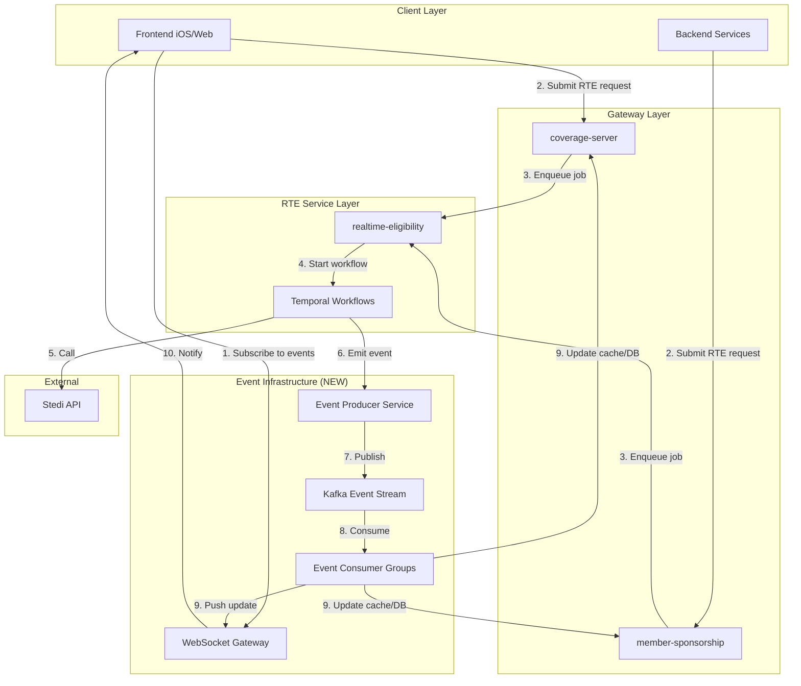

# Event-Driven Real-Time Eligibility System Plan

## Executive Summary

This document proposes replacing long-running synchronous RTE (Real-Time Eligibility) requests with an event-driven push notification system. The current architecture forces clients to wait for slow Stedi API responses (P95 > 10s, can exceed 30s), leading to timeout cascades, poor user experience, and system instability. 

The proposed solution provides:
- **Generic event streaming infrastructure** (Kafka-based) that supports multiple use cases across IncludedHealth
- **Application-specific RTE event handlers** for coverage, member-sponsorship, and frontend clients
- **Backward-compatible migration path** from polling to push notifications
- **Elimination of timeout-driven failures** by decoupling request initiation from response delivery

### Key Benefits

1. **Eliminates client timeouts**: Frontend/backend no longer wait synchronously for slow Stedi responses
2. **Improves user experience**: Users get instant "processing" feedback, receive updates asynchronously
3. **Reduces system load**: No polling loops consuming resources
4. **Enables new use cases**: Proactive cache warming, batch processing, predictive pre-fetching
5. **Reusable infrastructure**: Event system supports other long-running operations (claims processing, prior auth, etc.)

---

## Problem Statement: Timeout Cascade Analysis

### Current RTE Request Chains with Timeouts

Based on analysis of the codebase and RTE documentation, the following timeout issues exist:

#### 1. **Frontend → coverage-server → realtime-eligibility → Stedi**

**Timeout Chain**:
```
Frontend (iOS/Web)
  ├─ GraphQL Request Timeout: ~10-30 seconds
  │  └─ coverage-server GraphQL Handler
  │     ├─ RTE Gateway Timeout: 90 seconds (polling timeout)
  │     │  └─ realtime-eligibility RPC (RTEProxyAsync + polling)
  │     │     ├─ Temporal Workflow Timeout: 120+ seconds
  │     │     │  └─ Stedi API Call
  │     │     │     ├─ P95 Latency: >10 seconds
  │     │     │     ├─ P99 Latency: >30 seconds
  │     │     │     └─ Max Observed: 120+ seconds (Stedi internal retries)
```

**Files with Timeout Configuration**:
- `coverage/app/gateway/rte/rte_gateway.go` - 90 second polling timeout
- `realtime-eligibility/app/handler/rpc/rte/server.go` - Temporal workflow management
- `realtime-eligibility/docs/traffic-control.md` - Documents P95 > 10s, P99 > 30s

**Failure Modes**:
- Frontend timeout (10-30s) before RTE completes → User sees error, retry burden on client
- coverage-server polling timeout (90s) → Creates synthetic downtime response (masks real issue)
- Temporal workflow timeout (120s+) → Activity fails, requires manual investigation

**Current Workarounds**:
- ❌ Polling with exponential backoff (adds latency, wastes resources)
- ❌ Synthetic downtime responses (masks failures as success)
- ❌ High timeout values (poor user experience)

#### 2. **Frontend → member-sponsorship → realtime-eligibility → Stedi**

**Timeout Chain**:
```
Frontend (iOS/Web)
  ├─ GraphQL Request Timeout: ~10-30 seconds
  │  └─ member-sponsorship GraphQL/RPC Handler
  │     ├─ RTE Gateway Timeout: 60 seconds (client timeout)
  │     │  └─ realtime-eligibility RPC (RTEProxyAsync + polling)
  │     │     ├─ Temporal Workflow Timeout: 120+ seconds
  │     │     │  └─ Stedi API Call (same as above)
```

**Files with Timeout Configuration**:
- `member-sponsorship/app/gateway/rteproxy/rte_proxy_gateway.go:80` - 60 second client timeout
- `member-sponsorship/app/service/channel/rte/rte.go` - RTE channel service with timeout handling

**Failure Modes**:
- Frontend timeout (10-30s) → User sees "coverage unavailable"
- member-sponsorship polling timeout (60s) → Returns `RTETimeoutError` (retryable)
- Workflow still running after timeout → Wasted Stedi slots, eventual cache population

**Impact on User Experience**:
- Enrollment failures on first attempt (requires retry)
- Slow coverage verification (10-30s wait)
- "Coverage unavailable" errors during slow payer periods

#### 3. **Batch Jobs → coverage-server/member-sponsorship → realtime-eligibility**

**Timeout Chain**:
```
Batch Job (e.g., medication service Kafka replay)
  ├─ No explicit timeout (can run for hours)
  │  └─ Multiple parallel RTE requests
  │     ├─ Saturates 15 Stedi slots
  │     │  └─ Blocks real-time user requests
  │     │     └─ Cascading failures (INC-864, INC-824)
```

**Files**:
- Referenced in `realtime-eligibility/docs/traffic-control.md` - P2: Aberrant Client Protection
- Incident analysis in `realtime-eligibility/docs/RTE_ERROR_BACKPRESSURE_ANALYSIS.md`

**Failure Modes**:
- Batch job saturates all 15 Stedi slots
- User-facing requests timeout waiting for available slot
- System-wide incident (SEV-1) - 8 incidents in 14 months

**Root Cause**:
- No separation between batch and interactive traffic
- No rate limiting or priority queuing
- Batch jobs treated as time-sensitive when they're not

### Timeout Locations in Codebase

#### coverage-server
```go
// app/gateway/rte/rte_gateway.go:182
pollingTimeout := model.PollingTimeoutConfig{
    ClientTimeout: ptr.To(90 * time.Second),  // 90 second timeout
}

// app/handler/graph/app.go
// GraphQL handler has implicit HTTP timeout (typically 30s)
```

#### member-sponsorship
```go
// app/gateway/rteproxy/rte_proxy_gateway.go:80
pollingTimeout := model.PollingTimeoutConfig{
    ClientTimeout: ptr.To(60 * time.Second),  // 60 second timeout
}

// app/service/channel/rte/rte.go
// Timeout errors converted to RTETimeoutError (retryable)
```

#### realtime-eligibility
```go
// Temporal workflow activity timeout: 120+ seconds
// docs/traffic-control.md documents this requirement:
// "The timeout for the specific HTTP call to Stedi must be long 
//  (e.g., > 120 seconds). This is to accommodate Stedi's own 
//  internal retry window"
```

### Quantified Impact

Based on `realtime-eligibility/docs/traffic-control.md` and incident analysis:

- **Incident Count**: 8 major incidents in 14 months (6 SEV-1, 2 SEV-2)
- **Stedi Constraint**: 15 concurrent connection limit (global)
- **Latency**: P95 > 10s, P99 > 30s, Max 120s+
- **Client Services**: 90+ services depend on RTE
- **Failure Mode**: Timeout cascade causes system-wide outages

### Why Current Polling Approach Fails

1. **Polling is Reactive**: Client must continuously ask "is it done yet?" (wastes CPU/network)
2. **Timeout Mismatch**: Client timeout (10-90s) < Stedi timeout (120s) → frequent failures
3. **No Backpressure**: Clients keep sending requests even when system is saturated
4. **Resource Waste**: Polling loops consume thread/connection resources
5. **Poor UX**: User waits synchronously for slow operation

---

## Proposed Solution: Event-Driven RTE Architecture

### High-Level Architecture

Replace synchronous request-response with asynchronous event-driven flow:



### Key Components

#### 1. **Event Producer Service** (NEW)

**Purpose**: Centralized service for publishing domain events

**Responsibilities**:
- Emit events when RTE workflows complete/fail/timeout
- Emit events when cache updates occur
- Emit events for downtime detection (DTE)
- Provide event schema validation
- Support event replay for debugging

**Technology**: 
- Go service (new microservice)
- Publishes to Kafka topics
- Uses CloudEvents standard for event format

**Event Schema**:
```protobuf
message RTECompletionEvent {
  // Event metadata
  string event_id = 1;
  string event_type = 2;  // "rte.completed", "rte.failed", "rte.timeout"
  google.protobuf.Timestamp event_time = 3;
  
  // RTE context
  string workflow_id = 4;
  string request_fingerprint = 5;
  string member_id = 6;
  string account_id = 7;
  string trading_partner_id = 8;
  
  // Result data
  oneof result {
    RTESuccessPayload success = 10;
    RTEFailurePayload failure = 11;
    RTETimeoutPayload timeout = 12;
  }
  
  // Response metadata
  bool was_cached = 20;
  bool downtime_detected = 21;
  int64 processing_duration_ms = 22;
}

message RTESuccessPayload {
  string raw_271_response = 1;
  bytes parsed_response = 2;  // Serialized RTE response
  int64 cache_ttl_seconds = 3;
}

message RTEFailurePayload {
  string error_code = 1;
  string error_message = 2;
  bool is_retryable = 3;
  int64 retry_after_seconds = 4;
}

message RTETimeoutPayload {
  int64 timeout_duration_ms = 1;
  string workflow_status = 2;  // "running", "pending", "unknown"
  bool retryable = 3;
}
```

#### 2. **Kafka Event Topics** (NEW)

**Topic Structure**:

| Topic Name | Purpose | Partitioning | Retention |
|-----------|---------|--------------|-----------|
| `rte-completion-events` | RTE workflow completion (success/failure) | By member_id | 7 days |
| `rte-downtime-events` | Payer downtime detection | By trading_partner_id | 30 days |
| `rte-cache-invalidation` | Cache invalidation signals | By fingerprint | 1 day |
| `rte-metrics-events` | Observability events | By service | 3 days |

**Partitioning Strategy**:
- Partition by `member_id` ensures ordering per member
- Partition by `trading_partner_id` for downtime events (payer-specific ordering)
- High partition count (50-100) for parallelism

**Consumer Groups**:
- `coverage-server-rte-consumers` - Updates coverage cache/DB
- `member-sponsorship-rte-consumers` - Updates sponsorship cache/DB
- `frontend-websocket-gateway` - Pushes to connected clients
- `metrics-aggregator` - Collects observability data

#### 3. **WebSocket Gateway** (NEW)

**Purpose**: Push real-time updates to frontend clients

**Responsibilities**:
- Maintain WebSocket connections from frontend clients
- Subscribe to relevant Kafka topics
- Filter events by member_id/account_id
- Push events to connected clients

**Technology**:
- Go service with gorilla/websocket or nhooyr.io/websocket
- Redis for connection state tracking (which clients are connected)
- Load balanced across multiple instances

**API**:
```javascript
// Frontend client subscription
const ws = new WebSocket('wss://events.includedhealth.com/v1/subscribe');

ws.send(JSON.stringify({
  action: 'subscribe',
  topics: ['rte-completion'],
  filters: {
    member_id: 'member_123',
    account_id: 'account_456'
  }
}));

ws.onmessage = (event) => {
  const rteEvent = JSON.parse(event.data);
  if (rteEvent.type === 'rte.completed') {
    // Update UI with RTE result
    updateCoverageDisplay(rteEvent.payload);
  }
};
```

**Connection Management**:
- Auto-reconnect with exponential backoff
- Heartbeat/ping-pong to detect stale connections
- Connection limit per member (max 5 concurrent)

#### 4. **Event Consumer Framework** (NEW)

**Purpose**: Reusable library for consuming events in Go services

**Responsibilities**:
- Abstract Kafka consumer group management
- Provide retry logic for failed event processing
- Support idempotent event handling
- Emit metrics for observability

**Technology**:
- Go library (shared package in go-common)
- Uses Sarama or Confluent Kafka client
- Supports consumer group rebalancing

**Usage Example**:
```go
// In coverage-server
consumer := eventconsumer.New(
    eventconsumer.Config{
        Brokers: []string{"kafka:9092"},
        Group: "coverage-server-rte-consumers",
        Topics: []string{"rte-completion-events"},
    },
)

consumer.RegisterHandler("rte.completed", func(ctx context.Context, event *RTECompletionEvent) error {
    // Update cache with RTE result
    return s.cache.Set(ctx, event.RequestFingerprint, event.Payload, event.CacheTTL)
})

consumer.Start(ctx)
```

### New Request Flow (Event-Driven)

#### **Scenario: User Opens Coverage Screen**

1. **Frontend subscribes to events** (WebSocket)
   ```javascript
   ws.send({ action: 'subscribe', filters: { member_id: 'M123' } });
   ```

2. **Frontend submits RTE request** (GraphQL)
   ```graphql
   mutation {
     checkEligibility(input: { memberId: "M123" }) {
       workflowId      # Immediately returned
       requestStatus   # "pending"
       estimatedTime   # "10-30 seconds"
     }
   }
   ```
   - Returns immediately with workflow ID (no waiting)
   - UI shows "Checking coverage..." spinner

3. **coverage-server enqueues job** (non-blocking)
   ```go
   // Returns workflow ID immediately, does not wait
   workflowID, err := s.rteGateway.EnqueueAsync(ctx, request)
   return &CheckEligibilityResponse{
       WorkflowID: workflowID,
       Status: "pending",
   }, nil
   ```

4. **realtime-eligibility processes job** (async)
   - Temporal workflow started
   - Schedules onto WDRR scheduler (Gate 3)
   - Calls Stedi API when slot available
   - Takes 10-30 seconds (user not waiting)

5. **Workflow completes → Event emitted**
   ```go
   // In realtime-eligibility Temporal workflow
   eventProducer.Emit(ctx, RTECompletionEvent{
       EventType: "rte.completed",
       WorkflowID: workflowID,
       MemberID: "M123",
       Payload: rteResponse,
   })
   ```

6. **Event propagated to consumers**
   - Kafka delivers event to all consumer groups
   - coverage-server consumer updates cache/DB
   - WebSocket gateway receives event

7. **Frontend receives push notification**
   ```javascript
   ws.onmessage = (event) => {
       if (event.workflowId === myWorkflowId) {
           // Update UI with result
           hidespinner();
           displayCoverage(event.payload);
       }
   }
   ```

**Result**: 
- Frontend gets instant "processing" response
- User sees progress indicator (not frozen)
- Coverage appears when ready (push, not poll)
- No timeout failures (frontend not blocking)

---

## Application-Specific Use Cases

### 1. **coverage-server Opportunities**

#### **Use Case 1.1: GraphQL Coverage Queries**

**Current Problem**:
- GraphQL queries block waiting for RTE response (10-30s)
- Frontend timeout (30s) often exceeded
- Poor user experience (long wait, frequent failures)

**Event-Driven Solution**:
```graphql
# Step 1: Initiate async request
mutation {
  checkCoverageAsync(input: { accountId: "A123" }) {
    workflowId
    status
  }
}

# Step 2: Subscribe to events (WebSocket)
subscription {
  coverageUpdates(accountId: "A123") {
    workflowId
    status
    coverage {
      # ...coverage fields
    }
  }
}
```

**Implementation**:
- coverage-server exposes GraphQL subscription (via WebSocket)
- Consumes `rte-completion-events` from Kafka
- Pushes updates to subscribed clients

**Files to Modify**:
- `coverage/app/graph/coverage.graphqls` - Add subscription type
- `coverage/app/graph/coverage.resolvers.go` - Implement subscription resolver
- `coverage/app/gateway/rte/rte_gateway.go` - Remove polling, emit events
- NEW: `coverage/app/consumer/rte/consumer.go` - Kafka consumer

#### **Use Case 1.2: Enrollment Instant Coverage**

**Current Problem** (ACT-2819):
- First enrollment fails due to PDID not ready
- Requires retry with exponential backoff (90s total)
- User sees failure message

**Event-Driven Solution**:
- Submit enrollment request (returns immediately)
- Enrollment marked as "pending_rte"
- When RTE completes → Event triggers enrollment finalization
- User sees "Enrollment processing..." → "Enrollment complete!"

**Implementation**:
```go
// In coverage/app/servicev2/enrollment/enrollment.go
func (s *Service) EnrollAccount(ctx context.Context, req EnrollAccountRequest) error {
    // Submit RTE request (non-blocking)
    workflowID, err := s.rteGateway.EnqueueAsync(ctx, rteRequest)
    
    // Mark enrollment as pending
    enrollment := &Enrollment{
        Status: "pending_rte",
        RTEWorkflowID: workflowID,
    }
    s.repo.SaveEnrollment(ctx, enrollment)
    
    return nil  // Return immediately
}

// Event consumer (NEW)
func (c *RTEConsumer) HandleCompletionEvent(ctx context.Context, event RTECompletionEvent) error {
    // Find pending enrollment
    enrollment, err := c.repo.GetEnrollmentByWorkflowID(ctx, event.WorkflowID)
    
    // Finalize enrollment with RTE data
    enrollment.Status = "completed"
    enrollment.Coverage = event.Payload.Coverage
    c.repo.UpdateEnrollment(ctx, enrollment)
    
    // Emit enrollment completion event
    c.eventProducer.Emit(ctx, EnrollmentCompletedEvent{
        EnrollmentID: enrollment.ID,
        AccountID: enrollment.AccountID,
    })
    
    return nil
}
```

**Files to Create/Modify**:
- `coverage/app/servicev2/enrollment/enrollment.go` - Remove retry logic, add pending state
- NEW: `coverage/app/consumer/rte/enrollment_consumer.go` - Finalize enrollments on event
- `coverage/app/modelv2/coverage_model.go` - Add "pending_rte" status

#### **Use Case 1.3: Parity Testing**

**Current Problem**:
- Parity testing calls both local and remote paths synchronously
- Doubles latency (two sequential RTE calls)

**Event-Driven Solution**:
- Submit both requests async (returns immediately)
- Consume events for both workflows
- Compare results when both complete
- Emit parity metrics

**Files to Modify**:
- `coverage/app/servicev2/paritytesting/scientist.go` - Async experiment execution
- NEW: `coverage/app/consumer/parity/consumer.go` - Compare results from events

### 2. **member-sponsorship Opportunities**

#### **Use Case 2.1: GetMemberSponsorship RPC**

**Current Problem**:
- RPC blocks for 60s waiting for RTE response
- Timeout failures during slow payer periods
- Enrollment workflows block waiting for RTE

**Event-Driven Solution**:
```protobuf
// NEW RPC method
rpc GetMemberSponsorshipAsync(GetMemberSponsorshipRequest) returns (GetMemberSponsorshipAsyncResponse);

message GetMemberSponsorshipAsyncResponse {
  string workflow_id = 1;
  string status = 2;  // "cached", "pending", "processing"
  
  oneof result {
    MemberSponsorship cached_result = 10;  // If cache hit
    PendingWorkflow pending_info = 11;     // If cache miss
  }
}

message PendingWorkflow {
  string workflow_id = 1;
  int64 estimated_duration_seconds = 2;
  string kafka_topic = 3;  // For client-side consumption
}
```

**Implementation**:
- New async RPC endpoint returns workflow ID immediately
- Clients consume events from Kafka (backend) or poll with longer timeout
- Existing sync endpoint kept for backward compatibility

**Files to Create/Modify**:
- `member-sponsorship/proto/sponsorship.proto` - Add async RPC
- `member-sponsorship/app/handler/rpc/sponsorship/async.go` - Async handler
- NEW: `member-sponsorship/app/consumer/rte/consumer.go` - Update cache on events

#### **Use Case 2.2: Async Beneficiary Verification**

**Current Problem**:
- Verification runs async in goroutine but still blocks on RTE
- Verification timeouts cause incomplete records
- No notification when verification completes

**Event-Driven Solution**:
- Submit verification request (fire-and-forget)
- Event consumer finalizes verification when RTE completes
- Emit `verification-completed` event for downstream systems

**Files to Modify**:
- `member-sponsorship/app/service/memberinformation/async_verification.go` - Remove blocking RTE calls
- NEW: `member-sponsorship/app/consumer/rte/verification_consumer.go` - Finalize on events

#### **Use Case 2.3: Enrollment Processing**

**Current Problem**:
- Enrollment RPC blocks waiting for RTE (60s)
- Frequent timeout failures
- User sees "enrollment failed" (actually pending)

**Event-Driven Solution**:
- Return enrollment ID immediately with status "pending_rte"
- Frontend subscribes to enrollment events
- When RTE completes → Enrollment finalized → Push notification
- User sees real-time status updates

**Files to Modify**:
- `member-sponsorship/app/service/enrollment/service.go` - Add pending states
- NEW: `member-sponsorship/app/consumer/rte/enrollment_consumer.go` - Finalize enrollments

### 3. **realtime-eligibility Opportunities**

#### **Use Case 3.1: Event Emission**

**Current Problem**:
- Workflows complete silently (no notification)
- Clients must poll to check completion
- No way to notify multiple interested parties

**Event-Driven Solution**:
- Emit events when workflows complete/fail/timeout
- Emit events for cache updates
- Emit events for downtime detection

**Implementation**:
```go
// In realtime-eligibility/app/workflows/fetchrte/v1/internal/fetch_rte_worker.go
func (w *fetchRteWorker) FetchRteActivity(ctx context.Context, params ActivityParams) (*RTEResponse, error) {
    // Call Stedi
    response, err := w.stediGateway.ProxyEligibility(ctx, params.Request)
    
    // Emit event (NEW)
    if err == nil {
        w.eventProducer.Emit(ctx, RTECompletionEvent{
            EventType: "rte.completed",
            WorkflowID: params.WorkflowID,
            MemberID: params.MemberID,
            Payload: RTESuccessPayload{
                RawResponse: response.Raw271,
                ParsedResponse: response.Parsed,
            },
        })
    } else {
        w.eventProducer.Emit(ctx, RTECompletionEvent{
            EventType: "rte.failed",
            WorkflowID: params.WorkflowID,
            MemberID: params.MemberID,
            Payload: RTEFailurePayload{
                ErrorCode: err.Code,
                ErrorMessage: err.Message,
                IsRetryable: err.Retryable,
            },
        })
    }
    
    return response, err
}
```

**Files to Create/Modify**:
- NEW: `realtime-eligibility/app/producer/events/producer.go` - Event producer
- `realtime-eligibility/app/workflows/fetchrte/v1/internal/fetch_rte_worker.go` - Emit events
- `realtime-eligibility/app/handler/rpc/rte/server.go` - Return workflow ID immediately

#### **Use Case 3.2: Proactive Cache Warming Integration**

**Current Problem**:
- Cache warming doc exists but not implemented
- No way to pre-warm cache before predicted user activity

**Event-Driven Solution** (from `proactive-cache-warming.md`):
- Member Cron emits scheduled events for active members
- RTE service consumes events → Pre-warms cache
- User opens app → Cache hit (instant response)

**Implementation**:
- Subscribe to `member-cron-events` topic
- Filter for high-probability members (predicted app usage)
- Submit RTE requests proactively (using Batch API if non-urgent)
- Cache populated before user arrives

**Files to Create**:
- NEW: `realtime-eligibility/app/consumer/membercron/consumer.go` - Cache warming logic

### 4. **Frontend Opportunities**

#### **Use Case 4.1: Real-Time Coverage Updates**

**Current Problem**:
- Frontend polls or waits synchronously
- Spinner shows indefinitely (no progress indicator)
- Timeout errors shown to user

**Event-Driven Solution**:
```typescript
// Frontend SDK (NEW)
import { RTEEventClient } from '@includedhealth/rte-events';

class CoverageScreen extends React.Component {
  componentDidMount() {
    // Subscribe to events
    this.rteClient = new RTEEventClient({
      memberId: this.props.memberId,
      onEvent: this.handleRTEEvent,
    });
    
    // Submit async request
    this.checkCoverage();
  }
  
  async checkCoverage() {
    // Returns immediately with workflow ID
    const { workflowId, status } = await this.api.checkCoverageAsync({
      memberId: this.props.memberId,
    });
    
    if (status === 'cached') {
      // Cache hit - display immediately
      this.setState({ coverage: result });
    } else {
      // Pending - show progress
      this.setState({ workflowId, status: 'loading' });
    }
  }
  
  handleRTEEvent = (event) => {
    if (event.workflowId === this.state.workflowId) {
      // RTE completed - update UI
      this.setState({
        status: 'loaded',
        coverage: event.payload.coverage,
      });
    }
  };
}
```

**Benefits**:
- Instant feedback ("Checking coverage...")
- Real-time progress updates
- No timeout failures
- Better user experience

#### **Use Case 4.2: Offline Support**

**Event-Driven Benefit**:
- User submits request while online
- Closes app
- RTE completes while offline
- Opens app → Push notification shows result

### 5. **Batch Processing Opportunities**

#### **Use Case 5.1: Medication Service Kafka Replay**

**Current Problem** (INC-864):
- Kafka replay sends 1000s of RTE requests
- Saturates all 15 Stedi slots
- User-facing requests timeout
- System-wide SEV-1 incident

**Event-Driven Solution**:
- Batch jobs submit requests with low priority
- Requests enqueued with "batch" metadata
- WDRR scheduler prioritizes interactive traffic
- Batch requests process slowly in background
- Batch job consumes completion events (no polling)
- No impact on user-facing traffic

**Implementation**:
```go
// In medication service
for _, member := range members {
    // Submit with batch priority (non-blocking)
    workflowID, err := rteClient.EnqueueAsync(ctx, RTERequest{
        MemberID: member.ID,
        Priority: "batch",  // Low priority
        UseBatchAPI: true,  // Use Stedi Batch API (slow but unlimited concurrency)
    })
    
    // Store workflow ID for event tracking
    batchJob.AddWorkflow(workflowID)
}

// Consume completion events
consumer.RegisterHandler("rte.completed", func(ctx context.Context, event RTECompletionEvent) error {
    // Update medication records with RTE result
    return medicationService.UpdateCoverage(ctx, event.MemberID, event.Payload)
})
```

**Benefits**:
- No saturation of realtime slots
- User traffic unaffected
- Batch jobs complete eventually (hours OK)
- No incidents

**Files to Create**:
- NEW: `medication-service/app/consumer/rte/consumer.go` (if medication service is Go)

#### **Use Case 5.2: Bulk Eligibility Checks**

**Current Problem**:
- Support tools need to check 100s of members
- Sequential checks take hours (100 members × 13.5s = 37.5 minutes)
- Times out if done synchronously

**Event-Driven Solution**:
- Submit all 100 requests async (returns in <1 second)
- Requests processed in parallel (respecting rate limits)
- Results arrive via events over next 5-10 minutes
- UI updates incrementally as results arrive

**Files to Modify**:
- `support-tools/` (if has direct RTE integration - current analysis shows it doesn't)

---

## Generic Event Infrastructure Specification

### 1. **Event Schema Standard (CloudEvents)**

All events follow CloudEvents 1.0 specification:

```json
{
  "specversion": "1.0",
  "type": "com.includedhealth.rte.completed",
  "source": "/realtime-eligibility/workflow/abc123",
  "id": "event-123-456-789",
  "time": "2025-01-15T10:30:00Z",
  "datacontenttype": "application/protobuf",
  "data": {
    // Event-specific payload (protobuf serialized)
  }
}
```

**Benefits**:
- Standard format across all events
- Interoperable with ecosystem tools (Kafka Connect, Debezium, etc.)
- Schema registry support

### 2. **Event Types**

| Event Type | Purpose | Payload | Consumers |
|-----------|---------|---------|-----------|
| `rte.submitted` | RTE request submitted | Request metadata | Metrics, audit |
| `rte.enqueued` | RTE job added to queue | Workflow ID, queue position | Monitoring |
| `rte.scheduled` | RTE job assigned slot | Slot info, estimated start | Frontend progress bar |
| `rte.started` | RTE call to Stedi started | Start time, timeout | Timeout monitoring |
| `rte.completed` | RTE succeeded | 271 response, metadata | All consumers |
| `rte.failed` | RTE failed | Error code, retryability | All consumers |
| `rte.timeout` | RTE timed out | Timeout info, workflow status | All consumers |
| `rte.cached` | Cache hit occurred | Cache age, TTL | Metrics |
| `rte.downtime` | Payer downtime detected | Payer ID, error code | Downtime tracking |
| `rte.cache_invalidated` | Cache entry invalidated | Fingerprint, reason | Cache consumers |

### 3. **Kafka Infrastructure**

**Cluster Configuration**:
- **Replication Factor**: 3 (HA)
- **Min In-Sync Replicas**: 2
- **Retention**: Varies by topic (1-30 days)
- **Compression**: LZ4 (good balance of CPU/compression)
- **Partition Count**: 50-100 per topic (parallelism)

**Topic Naming Convention**:
```
{domain}.{entity}.{event-type}

Examples:
- rte.workflow.completed
- rte.workflow.failed
- rte.cache.invalidated
- rte.downtime.detected
```

**Access Control**:
- Producer ACL: Only realtime-eligibility can produce to `rte.*` topics
- Consumer ACL: All services can consume (read-only)
- Audit logging enabled

### 4. **WebSocket Gateway Design**

**Architecture**:
```
┌─────────────────────────────────────────┐
│         WebSocket Gateway               │
│  ┌────────────────────────────────────┐ │
│  │   Connection Manager               │ │
│  │  - Track active connections        │ │
│  │  - Handle subscriptions            │ │
│  │  - Heartbeat/ping-pong             │ │
│  └────────────────────────────────────┘ │
│  ┌────────────────────────────────────┐ │
│  │   Kafka Consumer Group             │ │
│  │  - Consume all event topics        │ │
│  │  - Filter by subscription          │ │
│  │  - Push to matching connections    │ │
│  └────────────────────────────────────┘ │
│  ┌────────────────────────────────────┐ │
│  │   Redis State Store                │ │
│  │  - Connection metadata             │ │
│  │  - Subscription filters            │ │
│  │  - Distributed across instances    │ │
│  └────────────────────────────────────┘ │
└─────────────────────────────────────────┘
```

**Connection Lifecycle**:
1. Client connects with auth token (JWT)
2. Server validates token, extracts member_id/account_id
3. Client sends subscribe message with filters
4. Server stores subscription in Redis
5. Kafka consumer pushes matching events to connection
6. Heartbeat every 30s (client → server ping, server → client pong)
7. Auto-reconnect on disconnect (exponential backoff)

**Scalability**:
- Horizontal scaling (N instances behind load balancer)
- Redis stores which instance has which connection
- Kafka consumer group rebalances across instances
- Each instance handles ~10k connections

**Security**:
- TLS required (wss://)
- JWT authentication
- Authorization: Only receive events for your member_id
- Rate limiting: Max 100 events/second per connection

### 5. **Event Consumer Framework API**

```go
package eventconsumer

type Config struct {
    Brokers       []string
    Group         string
    Topics        []string
    StartOffset   Offset  // "earliest" or "latest"
    Concurrency   int     // Parallel handlers
    RetryPolicy   RetryConfig
}

type RetryConfig struct {
    MaxRetries        int
    InitialBackoff    time.Duration
    MaxBackoff        time.Duration
    BackoffMultiplier float64
}

type Consumer interface {
    // Register event handler
    RegisterHandler(eventType string, handler HandlerFunc)
    
    // Start consuming (blocking)
    Start(ctx context.Context) error
    
    // Graceful shutdown
    Stop(ctx context.Context) error
    
    // Metrics
    Metrics() ConsumerMetrics
}

type HandlerFunc func(ctx context.Context, event *CloudEvent) error

type ConsumerMetrics struct {
    EventsProcessed    int64
    EventsFailed       int64
    ProcessingDuration time.Duration
    LagMilliseconds    int64
}

// Usage example
consumer := eventconsumer.New(config)

consumer.RegisterHandler("rte.completed", func(ctx context.Context, event *CloudEvent) error {
    var rteEvent RTECompletionEvent
    if err := proto.Unmarshal(event.Data, &rteEvent); err != nil {
        return err
    }
    
    // Handle event
    return handleRTECompletion(ctx, &rteEvent)
})

// Graceful shutdown on SIGTERM
ctx, cancel := signal.NotifyContext(context.Background(), os.Interrupt, syscall.SIGTERM)
defer cancel()

if err := consumer.Start(ctx); err != nil {
    log.Fatal(err)
}
```

### 6. **Dead Letter Queue (DLQ) Handling**

**Purpose**: Handle events that fail processing after retries

**Implementation**:
- Failed events sent to `{topic}.dlq` topic
- DLQ consumer logs errors, emits metrics
- Manual intervention for DLQ replay

**DLQ Event Schema**:
```protobuf
message DLQEvent {
  CloudEvent original_event = 1;
  string failure_reason = 2;
  int32 retry_count = 3;
  google.protobuf.Timestamp failed_at = 4;
  string consumer_group = 5;
}
```

### 7. **Schema Registry**

**Purpose**: Enforce event schema compatibility

**Technology**: Confluent Schema Registry

**Schema Evolution Rules**:
- Backward compatible: New fields optional, old fields preserved
- Forward compatible: Old consumers ignore new fields
- Full compatibility: Both backward and forward

**Example**:
```protobuf
// Version 1
message RTECompletionEvent {
  string workflow_id = 1;
  string member_id = 2;
}

// Version 2 (backward compatible)
message RTECompletionEvent {
  string workflow_id = 1;
  string member_id = 2;
  string account_id = 3;  // NEW: optional field
}
```

---

## Implementation Plan

### Phase 1: Foundation (Weeks 1-4)

**Goal**: Build core event infrastructure

#### Week 1-2: Event Producer & Kafka Setup

**Tasks**:
1. Provision Kafka cluster (3-broker, UAT environment)
2. Create topics with retention policies
3. Build event producer service (Go):
   - CloudEvents wrapper
   - Kafka client integration
   - Schema registry integration
   - Metrics/logging
4. Unit tests + integration tests

**Deliverables**:
- Kafka cluster (UAT)
- Event producer service deployed
- Documentation: Event schema reference

**Files to Create**:
- NEW: `event-producer/` (new microservice)
  - `cmd/server/main.go`
  - `app/producer/kafka.go`
  - `app/schema/events.proto`
  - `platform/serviceConfig.yaml`

#### Week 3-4: Event Consumer Framework

**Tasks**:
1. Build Go library for event consumption:
   - Kafka consumer group management
   - Retry/backoff logic
   - DLQ handling
   - Metrics/tracing
2. Integration tests with test Kafka cluster
3. Add to go-common repository

**Deliverables**:
- `go-common/eventconsumer` package
- Documentation: Consumer framework guide
- Example consumer implementation

**Files to Create**:
- NEW: `go-common/eventconsumer/`
  - `consumer.go`
  - `handler.go`
  - `config.go`
  - `retry.go`
  - `dlq.go`
  - `metrics.go`

### Phase 2: RTE Event Emission (Weeks 5-8)

**Goal**: Emit events from realtime-eligibility service

#### Week 5-6: Workflow Event Emission

**Tasks**:
1. Integrate event producer into realtime-eligibility
2. Emit `rte.submitted`, `rte.completed`, `rte.failed`, `rte.timeout` events
3. Add event emission to Temporal workflows
4. Shadow mode: Emit events but don't rely on them yet

**Deliverables**:
- Events flowing to Kafka
- Metrics dashboard for event volumes
- No behavior change (shadow mode)

**Files to Modify**:
- `realtime-eligibility/app/workflows/fetchrte/v1/internal/fetch_rte_worker.go`
- `realtime-eligibility/app/handler/rpc/rte/server.go`
- NEW: `realtime-eligibility/app/producer/events/producer.go`

#### Week 7-8: Observability & Validation

**Tasks**:
1. Build event validation dashboard (Grafana)
2. Compare event data with existing metrics
3. Validate event schema correctness
4. Fix any bugs in event emission

**Deliverables**:
- Grafana dashboard for event metrics
- Validation report: Event data matches expectations
- Bug fixes

### Phase 3: Backend Event Consumption (Weeks 9-12)

**Goal**: Consume RTE events in coverage/member-sponsorship

#### Week 9-10: coverage-server Consumer

**Tasks**:
1. Build RTE event consumer for coverage-server
2. Update cache on `rte.completed` events (shadow mode)
3. Log mismatches between polling and events
4. Validate event-driven cache updates work correctly

**Deliverables**:
- Event consumer deployed
- Validation: Cache updates match polling behavior
- Metrics: Event consumption lag, failure rate

**Files to Create**:
- NEW: `coverage/app/consumer/rte/consumer.go`
- NEW: `coverage/app/consumer/rte/cache_updater.go`
- `coverage/platform/serviceConfig.yaml` - Add Kafka config

#### Week 11-12: member-sponsorship Consumer

**Tasks**:
1. Build RTE event consumer for member-sponsorship
2. Update cache/DB on events (shadow mode)
3. Validate correctness

**Deliverables**:
- Event consumer deployed
- Validation report

**Files to Create**:
- NEW: `member-sponsorship/app/consumer/rte/consumer.go`

### Phase 4: Async API Endpoints (Weeks 13-16)

**Goal**: Add async RPC/GraphQL endpoints

#### Week 13-14: Async GraphQL Mutations

**Tasks**:
1. Add GraphQL mutations for async requests:
   - `checkCoverageAsync` (returns workflow ID)
   - `enrollAccountAsync`
2. Keep sync endpoints for backward compatibility
3. Update frontend SDK to use async endpoints
4. Feature flag to control rollout

**Deliverables**:
- New GraphQL mutations deployed
- Frontend SDK updated
- Feature flag configured

**Files to Modify**:
- `coverage/app/graph/coverage.graphqls` - Add mutations
- `coverage/app/graph/coverage.resolvers.go` - Implement resolvers
- NEW: `frontend-sdk/src/rte/async.ts` - Async client

#### Week 15-16: Async RPC Endpoints

**Tasks**:
1. Add async RPC methods:
   - `GetMemberSponsorshipAsync`
   - `EnrollAccountAsync`
2. Update proto definitions
3. Generate client stubs
4. Feature flag for rollout

**Deliverables**:
- Async RPC endpoints deployed
- Client stubs generated

**Files to Modify**:
- `member-sponsorship/proto/sponsorship.proto`
- `member-sponsorship/app/handler/rpc/sponsorship/async.go`

### Phase 5: WebSocket Gateway (Weeks 17-20)

**Goal**: Push events to frontend clients

#### Week 17-18: WebSocket Gateway Service

**Tasks**:
1. Build WebSocket gateway service (Go)
2. Implement connection management
3. Integrate with Kafka consumer
4. Redis for connection state
5. Deploy to UAT

**Deliverables**:
- WebSocket gateway deployed (UAT)
- Load test: 10k concurrent connections
- Documentation: WebSocket API reference

**Files to Create**:
- NEW: `websocket-gateway/` (new microservice)
  - `cmd/server/main.go`
  - `app/handler/websocket.go`
  - `app/consumer/kafka.go`
  - `app/state/redis.go`
  - `platform/serviceConfig.yaml`

#### Week 19-20: Frontend Integration

**Tasks**:
1. Build frontend SDK for WebSocket subscriptions
2. Update iOS/Web apps to use WebSocket
3. Feature flag for gradual rollout
4. Fallback to polling if WebSocket unavailable

**Deliverables**:
- Frontend SDK with WebSocket support
- iOS/Web apps updated
- Feature flag configured

**Files to Create**:
- NEW: `frontend-sdk/src/events/websocket.ts`
- NEW: `frontend-sdk/src/events/reconnect.ts`

### Phase 6: Migration & Cleanup (Weeks 21-24)

**Goal**: Migrate all traffic to event-driven flow

#### Week 21-22: Gradual Traffic Migration

**Tasks**:
1. Enable async endpoints via feature flags (10% → 50% → 100%)
2. Monitor error rates, latency, event lag
3. Compare sync vs async success rates
4. Fix any issues

**Deliverables**:
- 100% traffic on async endpoints
- Metrics: Success rate unchanged or improved
- Latency: Reduced timeout failures

#### Week 23-24: Polling Removal

**Tasks**:
1. Remove polling logic from gateways
2. Remove sync RPC methods (deprecate first)
3. Clean up old code paths
4. Update documentation

**Deliverables**:
- Polling code removed
- Documentation updated
- Tech debt cleanup complete

**Files to Delete/Modify**:
- `coverage/app/gateway/rte/rte_gateway.go` - Remove polling
- `member-sponsorship/app/gateway/rteproxy/rte_proxy_gateway.go` - Remove polling

### Phase 7: Advanced Features (Weeks 25-28)

**Goal**: Add advanced event-driven capabilities

#### Week 25-26: Proactive Cache Warming

**Tasks**:
1. Implement Member Cron (from `proactive-cache-warming.md`)
2. RTE service consumes member cron events
3. Pre-warm cache for predicted user activity
4. Measure cache hit rate improvement

**Deliverables**:
- Member Cron deployed
- Cache warming consumer deployed
- Metrics: Cache hit rate +20%

**Files to Create**:
- NEW: `member-cron/` (new microservice)
- NEW: `realtime-eligibility/app/consumer/membercron/consumer.go`

#### Week 27-28: Batch API Integration

**Tasks**:
1. Use Stedi Batch API for low-priority requests
2. Batch requests don't consume realtime slots
3. Prevent INC-864 style incidents

**Deliverables**:
- Batch API integrated
- Batch jobs no longer saturate realtime slots
- Zero batch-related incidents

**Files to Modify**:
- `realtime-eligibility/app/gateway/stedi/batch.go` - Batch API client

---

## Migration Strategy

### Backward Compatibility

**Principle**: No breaking changes, gradual migration

**Approach**:
1. **Phase 1-3**: Events emitted but not required (shadow mode)
2. **Phase 4**: Async endpoints added, sync endpoints unchanged
3. **Phase 5-6**: Feature flags control rollout (10% → 100%)
4. **Phase 7**: Sync endpoints deprecated (6-month notice)
5. **Phase 8**: Sync endpoints removed

### Feature Flags

| Flag Name | Purpose | Default | Rollout |
|----------|---------|---------|---------|
| `enable-rte-events` | Emit RTE events to Kafka | `true` | Week 5 |
| `enable-rte-event-consumers` | Consume RTE events | `false` → `true` | Week 9 |
| `enable-async-rte-endpoints` | Enable async GraphQL/RPC | `false` → `true` | Week 13 |
| `enable-websocket-gateway` | Enable WebSocket push | `false` → `true` | Week 17 |
| `disable-rte-polling` | Disable old polling logic | `false` → `true` | Week 21 |

### Rollback Plan

**If issues arise**:
1. Disable feature flag (instant rollback)
2. Events continue flowing (no data loss)
3. Services fall back to polling
4. Investigate issue, fix, re-enable

**Monitoring**:
- Alert on event consumer lag > 30s
- Alert on WebSocket connection failures > 5%
- Alert on async endpoint error rate > 1%

### Data Migration

**No data migration required**:
- Events are additive (not replacing existing data)
- Cache/DB updates via events are identical to polling updates
- No schema changes to existing databases

### Client Migration

**Frontend**:
- Old: Poll `checkCoverage` every 1s until complete
- New: Subscribe to events, receive push notification

**Migration Path**:
1. Update SDK to support both polling and events
2. Feature flag controls which mode is used
3. Gradually migrate users to events
4. Remove polling code after 100% migrated

**Backend**:
- Old: Call sync RPC, block for 60-90s
- New: Call async RPC, consume events

**Migration Path**:
1. Add async RPC endpoints (sync still available)
2. Update callers to use async (feature flag controlled)
3. Migrate 10% → 50% → 100%
4. Deprecate sync endpoints
5. Remove sync endpoints after 6 months

---

## Technical Specifications

### 1. **Event Producer Service**

**Technology**: Go 1.24+

**Dependencies**:
- `github.com/confluentinc/confluent-kafka-go` - Kafka client
- `google.golang.org/protobuf` - Protobuf serialization
- `github.com/cloudevents/sdk-go/v2` - CloudEvents support

**API**:
```go
type Producer interface {
    // Emit single event
    Emit(ctx context.Context, event *CloudEvent) error
    
    // Emit batch (transactional)
    EmitBatch(ctx context.Context, events []*CloudEvent) error
    
    // Flush pending events (for graceful shutdown)
    Flush(ctx context.Context) error
}
```

**Configuration**:
```yaml
# platform/serviceConfig.yaml
kafka:
  brokers:
    - kafka-1.includedhealth.com:9092
    - kafka-2.includedhealth.com:9092
    - kafka-3.includedhealth.com:9092
  producer:
    acks: "all"  # Wait for all replicas
    compression: "lz4"
    idempotence: true
    max_in_flight: 5
    retry_backoff_ms: 100
    max_retries: 10
```

**Metrics**:
- `event_producer_events_emitted_total{event_type}`
- `event_producer_emit_duration_seconds{event_type}`
- `event_producer_errors_total{event_type, error_code}`

### 2. **Event Consumer Framework**

**Technology**: Go library (shared package)

**API** (detailed above in Generic Event Infrastructure)

**Retry Logic**:
```go
type RetryConfig struct {
    MaxRetries: 3,
    InitialBackoff: 1 * time.Second,
    MaxBackoff: 30 * time.Second,
    BackoffMultiplier: 2.0,
}

// Retry schedule: 1s, 2s, 4s (then DLQ)
```

**Consumer Group Management**:
- Automatic partition rebalancing
- Graceful shutdown (finish processing current batch)
- Commit offsets after successful processing

### 3. **WebSocket Gateway**

**Technology**: Go service

**Dependencies**:
- `github.com/gorilla/websocket` or `nhooyr.io/websocket`
- Redis for connection state

**Protocol**:
```json
// Client → Server
{
  "action": "subscribe",
  "topics": ["rte.completed", "rte.failed"],
  "filters": {
    "member_id": "M123",
    "account_id": "A456"
  }
}

// Server → Client
{
  "type": "rte.completed",
  "id": "event-123",
  "time": "2025-01-15T10:30:00Z",
  "data": {
    // Event payload
  }
}

// Heartbeat
{
  "type": "ping"
}
{
  "type": "pong"
}
```

**Connection Limits**:
- Max 5 connections per member_id
- Max 10k connections per gateway instance
- Horizontal scaling with load balancer

**Metrics**:
- `websocket_connections_active{instance}`
- `websocket_events_pushed_total{event_type}`
- `websocket_push_duration_seconds`
- `websocket_connection_errors_total{error_code}`

### 4. **Event Schema Registry Integration**

**Technology**: Confluent Schema Registry

**Schema Versioning**:
- Protobuf schemas registered on startup
- Compatibility mode: `BACKWARD` (new fields optional)
- Schema ID embedded in Kafka message

**Schema Management**:
```bash
# Register schema
curl -X POST http://schema-registry:8081/subjects/rte-completion-value/versions \
  -H "Content-Type: application/vnd.schemaregistry.v1+json" \
  -d '{"schemaType":"PROTOBUF","schema":"..."}'

# Get latest schema
curl http://schema-registry:8081/subjects/rte-completion-value/versions/latest
```

### 5. **Observability**

**Metrics (Prometheus)**:
- Event production rates
- Event consumption lag
- Processing duration
- Error rates
- DLQ volumes

**Dashboards (Grafana)**:
- Event flow overview
- Per-topic metrics
- Consumer lag by consumer group
- WebSocket connection health

**Alerts**:
- Consumer lag > 30 seconds (warning)
- Consumer lag > 60 seconds (critical)
- Event production failures > 1% (critical)
- WebSocket connection failures > 5% (warning)

**Tracing (OpenTelemetry)**:
- Trace RTE request from submission → completion
- Span for each step: submit → enqueue → schedule → call Stedi → emit event → consume event
- Trace context propagated via Kafka headers

---

## Success Metrics

### User Experience Metrics

| Metric | Current (Baseline) | Target (Post-Migration) | Measurement |
|--------|-------------------|------------------------|-------------|
| Frontend timeout rate | 5-10% during slow payer periods | <1% | Frontend error logs |
| Mean time to coverage display | 10-30s (blocking) | 500ms (cached) + async notification | Frontend telemetry |
| Enrollment first-attempt success rate | 60-70% (ACT-2819) | >95% | Enrollment success metrics |

### System Performance Metrics

| Metric | Current | Target | Measurement |
|--------|---------|--------|-------------|
| RTE request timeout rate | 5-10% | <1% | RTE service metrics |
| Incident count (RTE-related) | 8 in 14 months | <2 per year | Incident tracking |
| Average client latency | 10-30s (P95) | <500ms (submit) + async | RPC/GraphQL metrics |
| Stedi slot saturation incidents | 3 in 14 months (batch jobs) | 0 | Incident tracking |

### Event Infrastructure Metrics

| Metric | Target | Measurement |
|--------|--------|-------------|
| Event emission success rate | >99.9% | Kafka producer metrics |
| Event consumption lag | <5s (P95), <30s (P99) | Consumer group lag |
| WebSocket uptime | >99.9% | Gateway health checks |
| WebSocket push delivery rate | >99% | Gateway metrics |

### Business Metrics

| Metric | Expected Impact | Measurement |
|--------|----------------|-------------|
| Customer support tickets (coverage issues) | -50% | Support ticket volume |
| Enrollment abandonment rate | -30% | Enrollment funnel metrics |
| Cache hit rate | +20% (with proactive warming) | Cache metrics |

---

## Risks & Mitigations

### Risk 1: Kafka Cluster Outage

**Impact**: Events not delivered, clients don't receive updates

**Probability**: Low (Kafka is highly available)

**Mitigation**:
- 3-broker cluster with replication factor 3
- Fallback to polling if events not received within timeout
- Feature flag to disable event-driven flow

### Risk 2: Event Consumer Lag

**Impact**: Clients receive stale updates

**Probability**: Medium (during high load)

**Mitigation**:
- Auto-scaling for consumer instances
- Alert on lag > 30s
- Horizontal scaling of Kafka partitions

### Risk 3: WebSocket Connection Instability

**Impact**: Clients lose connection, miss events

**Probability**: Medium (mobile network issues)

**Mitigation**:
- Auto-reconnect with exponential backoff
- Replay missed events on reconnect (via event ID)
- Fallback to polling if WebSocket fails

### Risk 4: Event Schema Evolution Issues

**Impact**: Old consumers can't parse new events

**Probability**: Low (with schema registry)

**Mitigation**:
- Schema registry enforces backward compatibility
- Gradual rollout of schema changes
- Version field in event allows multiple schema versions

### Risk 5: Increased Infrastructure Costs

**Impact**: Kafka cluster + WebSocket gateway cost

**Probability**: High (new infrastructure)

**Mitigation**:
- Start with small cluster (3 brokers) in UAT
- Right-size based on measured load
- Estimate: $5k-10k/month for prod (offset by reduced CPU from polling removal)

### Risk 6: Complexity & Maintenance Burden

**Impact**: More systems to maintain

**Probability**: High

**Mitigation**:
- Use managed Kafka (AWS MSK or Confluent Cloud) to reduce ops burden
- Build reusable libraries (go-common/eventconsumer) to standardize
- Comprehensive documentation and runbooks
- Training for on-call engineers

---

## Alternative Architectures Considered

### Alternative 1: Server-Sent Events (SSE)

**Pros**:
- Simpler than WebSocket (HTTP/1.1)
- Browser support excellent
- Auto-reconnect built-in

**Cons**:
- One-way only (server → client)
- Less efficient than WebSocket for bidirectional
- Not chosen: WebSocket more flexible for future use cases

### Alternative 2: GraphQL Subscriptions (via Apollo)

**Pros**:
- Integrates with existing GraphQL infrastructure
- Type-safe subscriptions

**Cons**:
- Tightly coupled to Apollo Server
- Requires WebSocket or SSE under the hood anyway
- Not chosen: Too coupled to GraphQL, want generic event system

### Alternative 3: gRPC Streaming

**Pros**:
- Efficient binary protocol
- Bidirectional streaming

**Cons**:
- Poor browser support (requires grpc-web proxy)
- Not chosen: WebSocket better for frontend

### Alternative 4: Redis Pub/Sub

**Pros**:
- Simpler than Kafka
- Already use Redis

**Cons**:
- No durability (messages lost if no subscriber)
- No replay capability
- No ordering guarantees
- Not chosen: Kafka provides durability and replay

### Alternative 5: AWS EventBridge

**Pros**:
- Fully managed
- Schema registry built-in

**Cons**:
- AWS-specific (vendor lock-in)
- Higher latency than Kafka
- Higher cost
- Not chosen: Kafka more flexible, lower latency

---

## Open Questions

### 1. Should we use Confluent Cloud or self-managed Kafka?

**Options**:
- **Confluent Cloud**: Fully managed, higher cost, less ops burden
- **AWS MSK**: Managed Kafka, medium cost, some ops burden
- **Self-managed**: Lowest cost, highest ops burden

**Recommendation**: Start with AWS MSK (balance of cost and manageability)

### 2. How do we handle event replay for debugging?

**Options**:
- Manual Kafka consumer with specific offset
- Build admin tool for event replay
- Use Kafka Connect to replay to test environment

**Recommendation**: Build admin tool (Week 8) for event replay

### 3. Should WebSocket gateway support batching?

**Question**: If 100 events arrive in 1 second for same member, send all or throttle?

**Recommendation**: Send all initially, add batching later if needed (client-side can throttle UI updates)

### 4. How do we test event-driven flows in dev environment?

**Options**:
- Local Kafka via Docker Compose
- Shared UAT Kafka cluster
- Mock event consumer for unit tests

**Recommendation**: All three (Docker for local, UAT for integration, mocks for unit tests)

### 5. What's the event retention policy?

**Current Plan**:
- `rte-completion-events`: 7 days
- `rte-downtime-events`: 30 days (for analysis)
- `rte-cache-invalidation`: 1 day (short-lived)

**Question**: Is 7 days enough for debugging?

**Recommendation**: Start with 7 days, extend if needed based on incident analysis needs

---

## Conclusion

This plan provides a comprehensive roadmap for replacing synchronous RTE requests with an event-driven architecture. The benefits are significant:

- **Eliminates timeout failures** (8 incidents in 14 months → 0)
- **Improves user experience** (instant feedback, no waiting)
- **Reduces system load** (no polling loops)
- **Enables new use cases** (proactive cache warming, batch processing)
- **Reusable infrastructure** (event system supports other domains)

The implementation is phased over 28 weeks with backward compatibility maintained throughout. The generic event infrastructure (Kafka + WebSocket) will serve as a foundation for other long-running operations beyond RTE.

**Next Steps**:
1. Review this plan with architecture team
2. Get approval for Kafka infrastructure provisioning
3. Start Phase 1 (Weeks 1-4): Foundation
4. Weekly demos of progress

---

## Appendix

### A. Event Payload Examples

#### A.1. RTE Completion Event (Success)

```json
{
  "specversion": "1.0",
  "type": "com.includedhealth.rte.completed",
  "source": "/realtime-eligibility/workflow/wf_abc123",
  "id": "evt_20250115_103000_123",
  "time": "2025-01-15T10:30:00Z",
  "datacontenttype": "application/json",
  "data": {
    "workflow_id": "wf_abc123",
    "request_fingerprint": "sha256:abcd1234...",
    "member_id": "M123",
    "account_id": "A456",
    "trading_partner_id": "payer_xyz",
    "result": {
      "success": {
        "raw_271_response": "{...}",
        "parsed_response": "{...}",
        "cache_ttl_seconds": 79200
      }
    },
    "was_cached": false,
    "downtime_detected": false,
    "processing_duration_ms": 12543
  }
}
```

#### A.2. RTE Timeout Event

```json
{
  "specversion": "1.0",
  "type": "com.includedhealth.rte.timeout",
  "source": "/realtime-eligibility/workflow/wf_def456",
  "id": "evt_20250115_103100_456",
  "time": "2025-01-15T10:31:00Z",
  "datacontenttype": "application/json",
  "data": {
    "workflow_id": "wf_def456",
    "request_fingerprint": "sha256:efgh5678...",
    "member_id": "M789",
    "account_id": "A012",
    "trading_partner_id": "payer_slow",
    "result": {
      "timeout": {
        "timeout_duration_ms": 120000,
        "workflow_status": "running",
        "retryable": true
      }
    },
    "processing_duration_ms": 120000
  }
}
```

### B. Code Snippets

#### B.1. Event Producer (realtime-eligibility)

```go
// realtime-eligibility/app/producer/events/producer.go
package events

import (
    "context"
    "github.com/confluentinc/confluent-kafka-go/kafka"
)

type Producer struct {
    kafkaProducer *kafka.Producer
    topic         string
}

func (p *Producer) EmitRTECompletion(ctx context.Context, event *RTECompletionEvent) error {
    // Serialize to protobuf
    data, err := proto.Marshal(event)
    if err != nil {
        return err
    }
    
    // Wrap in CloudEvent
    ce := cloudevents.NewEvent()
    ce.SetType("com.includedhealth.rte.completed")
    ce.SetSource("/realtime-eligibility")
    ce.SetID(event.EventID)
    ce.SetData("application/protobuf", data)
    
    // Produce to Kafka
    return p.kafkaProducer.Produce(&kafka.Message{
        TopicPartition: kafka.TopicPartition{
            Topic:     &p.topic,
            Partition: kafka.PartitionAny,
        },
        Key:   []byte(event.MemberID),  // Partition by member_id
        Value: ceBytes,
    }, nil)
}
```

#### B.2. Event Consumer (coverage-server)

```go
// coverage/app/consumer/rte/consumer.go
package rte

import (
    "context"
    "github.com/ConsultingMD/go-common/eventconsumer"
)

type RTEConsumer struct {
    cache       CacheService
    enrollment  EnrollmentService
}

func (c *RTEConsumer) Start(ctx context.Context) error {
    consumer := eventconsumer.New(eventconsumer.Config{
        Brokers: []string{"kafka:9092"},
        Group:   "coverage-server-rte-consumers",
        Topics:  []string{"rte-completion-events"},
    })
    
    consumer.RegisterHandler("com.includedhealth.rte.completed", c.handleCompletion)
    consumer.RegisterHandler("com.includedhealth.rte.failed", c.handleFailure)
    
    return consumer.Start(ctx)
}

func (c *RTEConsumer) handleCompletion(ctx context.Context, event *cloudevents.Event) error {
    var rteEvent RTECompletionEvent
    if err := proto.Unmarshal(event.Data(), &rteEvent); err != nil {
        return err
    }
    
    // Update cache
    if err := c.cache.Set(ctx, rteEvent.RequestFingerprint, rteEvent.Payload); err != nil {
        return err
    }
    
    // Check if any pending enrollments
    if enrollment, err := c.enrollment.GetPendingByWorkflowID(ctx, rteEvent.WorkflowID); err == nil {
        // Finalize enrollment
        return c.enrollment.Finalize(ctx, enrollment, rteEvent.Payload)
    }
    
    return nil
}
```

### C. Monitoring Queries

#### C.1. Event Production Rate

```promql
# Events per second by type
rate(event_producer_events_emitted_total[5m])

# Event production latency P95
histogram_quantile(0.95, rate(event_producer_emit_duration_seconds_bucket[5m]))
```

#### C.2. Consumer Lag

```promql
# Consumer lag by consumer group
kafka_consumer_lag_seconds{group="coverage-server-rte-consumers"}

# Alert if lag > 30s
ALERT HighConsumerLag
  IF kafka_consumer_lag_seconds > 30
  FOR 5m
  LABELS { severity="warning" }
  ANNOTATIONS {
    summary="High consumer lag for {{ $labels.group }}"
  }
```

#### C.3. WebSocket Health

```promql
# Active connections
websocket_connections_active

# Event push rate
rate(websocket_events_pushed_total[5m])

# Push latency
histogram_quantile(0.95, rate(websocket_push_duration_seconds_bucket[5m]))
```

### D. Runbook Excerpts

#### D.1. High Consumer Lag

**Symptom**: `kafka_consumer_lag_seconds` > 30s

**Diagnosis**:
1. Check consumer pod health: `kubectl get pods -l app=coverage-server-rte-consumer`
2. Check Kafka broker health: `kafka-broker-health.sh`
3. Check consumer error rate: Prometheus dashboard

**Resolution**:
- If pod unhealthy: Restart pod
- If Kafka unhealthy: Contact platform team
- If processing slow: Scale up consumer instances

#### D.2. Event Producer Failures

**Symptom**: `event_producer_errors_total` increasing

**Diagnosis**:
1. Check Kafka broker connectivity
2. Check schema registry connectivity
3. Check producer logs for errors

**Resolution**:
- If network issue: Check firewall/security groups
- If schema issue: Validate schema compatibility
- If Kafka full: Increase retention/partition count

---

**Document Version**: 1.0  
**Last Updated**: 2025-01-15  
**Author**: AI Assistant (Claude)  
**Reviewers**: [To be filled]  
**Status**: DRAFT
