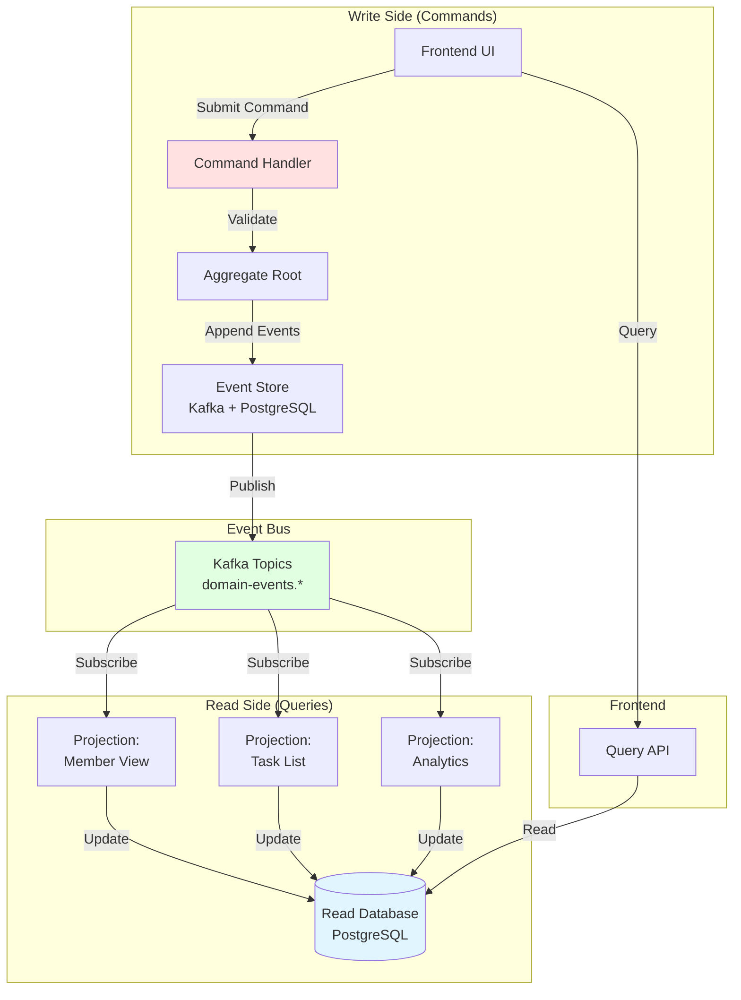

# Event Sourcing & CQRS Implementation Guide

## Executive Summary

This document explains how to implement **Event Sourcing** and **CQRS (Command Query Responsibility Segregation)** patterns using the event-driven infrastructure designed in previous documents.

**Key Concepts**:
- **Event Sourcing**: Store all state changes as immutable events, reconstruct state by replaying events
- **CQRS**: Separate write models (commands) from read models (queries)
- **Event Store**: Append-only log of all domain events (Kafka + PostgreSQL)
- **Projections**: Read-optimized views built from events
- **Eventual Consistency**: Read models updated asynchronously

**Benefits**:
- Complete audit trail (every state change recorded)
- Time travel (reconstruct state at any point)
- Event replay (rebuild projections, fix bugs)
- Scalability (read/write models scaled independently)
- Temporal workflows (saga pattern for long-running processes)

**Use Cases at IncludedHealth**:
- RTE eligibility checks (complete audit trail for compliance)
- Care task management (task lifecycle tracking)
- Member profile updates (HIPAA audit requirements)
- Appointment scheduling (conflict resolution)

---

## Architecture Overview

### CQRS + Event Sourcing Pattern



### Traditional CRUD vs Event Sourcing

**Traditional CRUD (Current State)**:
```
Database: Stores CURRENT state only
┌─────────────────────────────────┐
│ members                         │
├─────────────────────────────────┤
│ id: A123                        │
│ name: "John Doe"                │
│ email: "john@example.com"       │
│ status: "active"                │
│ updated_at: "2025-11-13"        │
└─────────────────────────────────┘

❌ Lost information:
- Who changed the email?
- When was status changed?
- What was the previous email?
- Why was it changed?
```

**Event Sourcing (Complete History)**:
```
Event Store: Stores ALL state changes
┌──────────────────────────────────────────────────────────────┐
│ Event 1: MemberCreated                                       │
│   timestamp: 2025-01-01T10:00:00Z                            │
│   data: { id: A123, name: "John Doe", email: "john@old.com" }│
├──────────────────────────────────────────────────────────────┤
│ Event 2: MemberEmailUpdated                                  │
│   timestamp: 2025-06-15T14:30:00Z                            │
│   data: { old: "john@old.com", new: "john@example.com" }     │
│   actor: { type: "member", id: "A123" }                      │
│   reason: "User updated email via profile settings"          │
├──────────────────────────────────────────────────────────────┤
│ Event 3: MemberStatusActivated                               │
│   timestamp: 2025-11-13T09:00:00Z                            │
│   data: { status: "active" }                                 │
│   actor: { type: "care_coordinator", id: "CC456" }           │
│   reason: "Completed onboarding checklist"                   │
└──────────────────────────────────────────────────────────────┘

✅ Complete audit trail
✅ Reconstruct state at any point in time
✅ Who, what, when, why all captured
```

---

## Core Concepts

### 1. Commands (Write Side)

**Commands** represent **intent to change state**.

```typescript
// Command: Intent to change state
interface Command {
  id: string;              // Command ID (UUID)
  type: string;            // "CompleteTask" | "UpdateMemberEmail"
  timestamp: string;       // When command was issued
  actor: Actor;            // Who issued the command
  data: any;              // Command-specific data
  metadata?: {
    correlation_id?: string;  // Link to parent command/workflow
    causation_id?: string;    // Link to triggering event
  };
}

// Example: Complete Care Task Command
const completeTaskCommand: Command = {
  id: "cmd_abc123",
  type: "CompleteTask",
  timestamp: "2025-11-13T12:00:00Z",
  actor: {
    type: "care_coordinator",
    id: "CC456",
  },
  data: {
    task_id: "task_789",
    completion_status: "completed",
    notes: "Contacted member, scheduled follow-up",
  },
};
```

**Command Handler**: Validates command and produces events

```typescript
class TaskCommandHandler {
  async handle(command: CompleteTaskCommand): Promise<Event[]> {
    // 1. Load aggregate from event store
    const task = await this.taskRepository.load(command.data.task_id);
    
    // 2. Execute command on aggregate (business logic)
    const events = task.complete(command.actor, command.data);
    
    // 3. Persist events to event store
    await this.eventStore.append(task.id, events);
    
    // 4. Publish events to Kafka
    await this.eventBus.publish(events);
    
    return events;
  }
}
```

### 2. Events (State Changes)

**Events** represent **facts that happened** (past tense).

```typescript
// Event: Something that happened (immutable fact)
interface Event {
  id: string;              // Event ID (UUID)
  type: string;            // "TaskCompleted" | "MemberEmailUpdated"
  timestamp: string;       // When event occurred
  aggregate_id: string;    // ID of aggregate (task_789, member_A123)
  aggregate_type: string;  // "Task" | "Member"
  version: number;         // Aggregate version (for optimistic locking)
  actor: Actor;            // Who caused this event
  data: any;              // Event-specific data
  metadata?: {
    correlation_id?: string;
    causation_id?: string;
    command_id?: string;   // Link to originating command
  };
}

// Example: Task Completed Event
const taskCompletedEvent: Event = {
  id: "evt_def456",
  type: "TaskCompleted",
  timestamp: "2025-11-13T12:00:01Z",
  aggregate_id: "task_789",
  aggregate_type: "Task",
  version: 5,  // This is the 5th event for this task
  actor: {
    type: "care_coordinator",
    id: "CC456",
  },
  data: {
    task_id: "task_789",
    completion_status: "completed",
    notes: "Contacted member, scheduled follow-up",
    completed_at: "2025-11-13T12:00:01Z",
  },
  metadata: {
    command_id: "cmd_abc123",
  },
};
```

**Event Naming Conventions**:
- Use past tense: `TaskCompleted` (not `CompleteTask`)
- Be specific: `MemberEmailUpdated` (not `MemberUpdated`)
- Include aggregate type: `Task.Completed` or `TaskCompleted`

### 3. Aggregate Root (Domain Model)

**Aggregate** is a cluster of domain objects treated as a unit.

```typescript
class Task {
  // Current state (rebuilt from events)
  private id: string;
  private status: TaskStatus;
  private assignedTo: string;
  private completedAt?: string;
  private version: number;
  
  // Uncommitted events (pending save)
  private uncommittedEvents: Event[] = [];
  
  /**
   * Command: Complete task
   * Returns events that should be persisted
   */
  complete(actor: Actor, data: CompleteTaskData): Event[] {
    // Business logic validation
    if (this.status === TaskStatus.Completed) {
      throw new Error("Task already completed");
    }
    
    if (actor.id !== this.assignedTo) {
      throw new Error("Only assigned coordinator can complete task");
    }
    
    // Create event (fact that something happened)
    const event: TaskCompletedEvent = {
      id: generateEventId(),
      type: "TaskCompleted",
      timestamp: new Date().toISOString(),
      aggregate_id: this.id,
      aggregate_type: "Task",
      version: this.version + 1,
      actor: actor,
      data: {
        task_id: this.id,
        completion_status: data.completion_status,
        notes: data.notes,
        completed_at: new Date().toISOString(),
      },
    };
    
    // Apply event to update internal state
    this.apply(event);
    
    // Track uncommitted event
    this.uncommittedEvents.push(event);
    
    return [event];
  }
  
  /**
   * Apply event to update state (also used when replaying)
   */
  apply(event: Event): void {
    switch (event.type) {
      case "TaskCreated":
        this.id = event.data.task_id;
        this.status = TaskStatus.Pending;
        this.assignedTo = event.data.assigned_to;
        this.version = event.version;
        break;
        
      case "TaskCompleted":
        this.status = TaskStatus.Completed;
        this.completedAt = event.data.completed_at;
        this.version = event.version;
        break;
        
      // ... other event types
    }
  }
  
  /**
   * Load aggregate from event history (event replay)
   */
  static fromHistory(events: Event[]): Task {
    const task = new Task();
    
    // Replay all events to rebuild current state
    for (const event of events) {
      task.apply(event);
    }
    
    return task;
  }
}
```

### 4. Event Store

**Event Store** is append-only log of all events.

**Storage Strategy**: Kafka (hot) + PostgreSQL (cold)

```typescript
interface EventStore {
  /**
   * Append events to aggregate stream
   * Optimistic concurrency control via version check
   */
  append(aggregateId: string, events: Event[]): Promise<void>;
  
  /**
   * Load all events for an aggregate
   */
  load(aggregateId: string): Promise<Event[]>;
  
  /**
   * Load events after a specific version (for incremental updates)
   */
  loadFromVersion(aggregateId: string, version: number): Promise<Event[]>;
}
```

**PostgreSQL Schema** (Cold Storage):

```sql
CREATE TABLE event_store (
    id UUID PRIMARY KEY,
    aggregate_id VARCHAR(255) NOT NULL,
    aggregate_type VARCHAR(100) NOT NULL,
    event_type VARCHAR(100) NOT NULL,
    version INTEGER NOT NULL,
    timestamp TIMESTAMPTZ NOT NULL,
    actor_type VARCHAR(50) NOT NULL,
    actor_id VARCHAR(255) NOT NULL,
    data JSONB NOT NULL,
    metadata JSONB,
    
    -- Optimistic concurrency control
    UNIQUE (aggregate_id, version),
    
    -- Indexes for fast queries
    INDEX idx_aggregate (aggregate_id, version),
    INDEX idx_aggregate_type (aggregate_type, timestamp),
    INDEX idx_event_type (event_type, timestamp)
);

-- Partition by month for performance
CREATE TABLE event_store_2025_11 PARTITION OF event_store
    FOR VALUES FROM ('2025-11-01') TO ('2025-12-01');
```

**Implementation**:

```typescript
class PostgresEventStore implements EventStore {
  async append(aggregateId: string, events: Event[]): Promise<void> {
    const tx = await this.db.transaction();
    
    try {
      for (const event of events) {
        // Insert event (will fail if version conflict)
        await tx.query(`
          INSERT INTO event_store (
            id, aggregate_id, aggregate_type, event_type,
            version, timestamp, actor_type, actor_id, data, metadata
          ) VALUES ($1, $2, $3, $4, $5, $6, $7, $8, $9, $10)
        `, [
          event.id,
          event.aggregate_id,
          event.aggregate_type,
          event.type,
          event.version,
          event.timestamp,
          event.actor.type,
          event.actor.id,
          event.data,
          event.metadata,
        ]);
      }
      
      await tx.commit();
      
      // Publish to Kafka for projections
      await this.kafka.publish(events);
      
    } catch (err) {
      await tx.rollback();
      
      // Check if optimistic concurrency violation
      if (err.code === '23505') {  // Unique constraint violation
        throw new ConcurrencyError('Aggregate has been modified by another process');
      }
      
      throw err;
    }
  }
  
  async load(aggregateId: string): Promise<Event[]> {
    const result = await this.db.query(`
      SELECT * FROM event_store
      WHERE aggregate_id = $1
      ORDER BY version ASC
    `, [aggregateId]);
    
    return result.rows.map(row => this.mapRowToEvent(row));
  }
  
  async loadFromVersion(aggregateId: string, version: number): Promise<Event[]> {
    const result = await this.db.query(`
      SELECT * FROM event_store
      WHERE aggregate_id = $1 AND version > $2
      ORDER BY version ASC
    `, [aggregateId, version]);
    
    return result.rows.map(row => this.mapRowToEvent(row));
  }
}
```

### 5. Projections (Read Models)

**Projections** are read-optimized views built from events.

```typescript
class TaskListProjection {
  /**
   * Subscribe to events and update read model
   */
  async subscribe(): Promise<void> {
    // Subscribe to task-related events
    await this.kafka.subscribe('domain-events.task.*', async (event) => {
      await this.handleEvent(event);
    });
  }
  
  /**
   * Handle event and update read model
   */
  private async handleEvent(event: Event): Promise<void> {
    switch (event.type) {
      case 'TaskCreated':
        await this.handleTaskCreated(event);
        break;
        
      case 'TaskCompleted':
        await this.handleTaskCompleted(event);
        break;
        
      case 'TaskAssigned':
        await this.handleTaskAssigned(event);
        break;
    }
  }
  
  /**
   * Update read model for TaskCreated event
   */
  private async handleTaskCreated(event: TaskCreatedEvent): Promise<void> {
    await this.db.query(`
      INSERT INTO task_list_view (
        task_id, title, status, assigned_to, member_id, created_at
      ) VALUES ($1, $2, $3, $4, $5, $6)
    `, [
      event.data.task_id,
      event.data.title,
      'pending',
      event.data.assigned_to,
      event.data.member_id,
      event.timestamp,
    ]);
  }
  
  /**
   * Update read model for TaskCompleted event
   */
  private async handleTaskCompleted(event: TaskCompletedEvent): Promise<void> {
    await this.db.query(`
      UPDATE task_list_view
      SET status = 'completed',
          completed_at = $1,
          completed_by = $2
      WHERE task_id = $3
    `, [
      event.data.completed_at,
      event.actor.id,
      event.data.task_id,
    ]);
  }
}
```

**Read Model Schema** (Optimized for Queries):

```sql
-- Denormalized view for fast queries
CREATE TABLE task_list_view (
    task_id VARCHAR(255) PRIMARY KEY,
    title TEXT NOT NULL,
    status VARCHAR(50) NOT NULL,
    assigned_to VARCHAR(255) NOT NULL,
    member_id VARCHAR(255) NOT NULL,
    member_name TEXT,  -- Denormalized from member aggregate
    created_at TIMESTAMPTZ NOT NULL,
    completed_at TIMESTAMPTZ,
    completed_by VARCHAR(255),
    
    -- Indexes for common queries
    INDEX idx_assigned_to (assigned_to, status, created_at),
    INDEX idx_member_id (member_id, status),
    INDEX idx_status (status, created_at)
);

-- Query: Get all tasks for care coordinator (FAST!)
SELECT * FROM task_list_view
WHERE assigned_to = 'CC456' AND status = 'pending'
ORDER BY created_at DESC;
```

---

## Implementation Examples

### Example 1: RTE Eligibility Check (Event Sourcing)

**Use Case**: Track complete history of RTE eligibility checks for HIPAA compliance.

**Aggregate**: `RTEEligibilityCheck`

**Commands**:
- `InitiateEligibilityCheck`
- `RetrySteWithBatchAPI`
- `CancelEligibilityCheck`

**Events**:
- `EligibilityCheckInitiated`
- `RTERequestSentToStedi`
- `RTEResponseReceivedFromStedi`
- `EligibilityCheckCompleted`
- `EligibilityCheckFailed`
- `EligibilityCheckCached`

**Implementation**:

```typescript
// Aggregate: RTE Eligibility Check
class RTEEligibilityCheck {
  private id: string;
  private accountId: string;
  private status: CheckStatus;
  private initiatedAt: string;
  private completedAt?: string;
  private result?: EligibilityResult;
  private stediRequestId?: string;
  private version: number;
  
  /**
   * Command: Initiate eligibility check
   */
  initiate(command: InitiateEligibilityCheckCommand): Event[] {
    // Business logic
    if (this.status !== CheckStatus.New) {
      throw new Error('Check already initiated');
    }
    
    // Create event
    const event: EligibilityCheckInitiatedEvent = {
      id: generateEventId(),
      type: 'EligibilityCheckInitiated',
      timestamp: new Date().toISOString(),
      aggregate_id: this.id,
      aggregate_type: 'RTEEligibilityCheck',
      version: this.version + 1,
      actor: command.actor,
      data: {
        check_id: this.id,
        account_id: command.data.account_id,
        initiated_by: command.actor.id,
        initiated_at: new Date().toISOString(),
      },
    };
    
    this.apply(event);
    return [event];
  }
  
  /**
   * Command: Record Stedi response
   */
  recordStediResponse(response: StediResponse): Event[] {
    const events: Event[] = [];
    
    // Event 1: Response received
    events.push({
      id: generateEventId(),
      type: 'RTEResponseReceivedFromStedi',
      timestamp: new Date().toISOString(),
      aggregate_id: this.id,
      aggregate_type: 'RTEEligibilityCheck',
      version: this.version + 1,
      data: {
        stedi_request_id: response.request_id,
        response_code: response.code,
        latency_ms: response.latency_ms,
      },
    });
    
    // Event 2: Check completed
    if (response.eligible !== undefined) {
      events.push({
        id: generateEventId(),
        type: 'EligibilityCheckCompleted',
        timestamp: new Date().toISOString(),
        aggregate_id: this.id,
        aggregate_type: 'RTEEligibilityCheck',
        version: this.version + 2,
        data: {
          check_id: this.id,
          account_id: this.accountId,
          result: {
            eligible: response.eligible,
            copay_amount: response.copay_amount,
            network_status: response.network_status,
          },
          completed_at: new Date().toISOString(),
          total_duration_ms: Date.now() - new Date(this.initiatedAt).getTime(),
        },
      });
    }
    
    events.forEach(e => this.apply(e));
    return events;
  }
  
  /**
   * Apply events to rebuild state
   */
  apply(event: Event): void {
    switch (event.type) {
      case 'EligibilityCheckInitiated':
        this.id = event.data.check_id;
        this.accountId = event.data.account_id;
        this.status = CheckStatus.Initiated;
        this.initiatedAt = event.data.initiated_at;
        this.version = event.version;
        break;
        
      case 'RTEResponseReceivedFromStedi':
        this.stediRequestId = event.data.stedi_request_id;
        this.version = event.version;
        break;
        
      case 'EligibilityCheckCompleted':
        this.status = CheckStatus.Completed;
        this.completedAt = event.data.completed_at;
        this.result = event.data.result;
        this.version = event.version;
        break;
        
      case 'EligibilityCheckFailed':
        this.status = CheckStatus.Failed;
        this.version = event.version;
        break;
    }
  }
}

// Projection: RTE Dashboard View
class RTEDashboardProjection {
  async handleEvent(event: Event): Promise<void> {
    switch (event.type) {
      case 'EligibilityCheckCompleted':
        // Update dashboard metrics
        await this.db.query(`
          INSERT INTO rte_metrics_view (
            date, total_checks, avg_latency_ms, success_rate
          ) VALUES (CURRENT_DATE, 1, $1, 1.0)
          ON CONFLICT (date) DO UPDATE SET
            total_checks = rte_metrics_view.total_checks + 1,
            avg_latency_ms = (
              rte_metrics_view.avg_latency_ms * rte_metrics_view.total_checks + $1
            ) / (rte_metrics_view.total_checks + 1)
        `, [event.data.total_duration_ms]);
        break;
    }
  }
}
```

**Benefits**:
- ✅ Complete audit trail for HIPAA compliance
- ✅ Time travel: See what eligibility was at any point in time
- ✅ Debugging: Replay events to understand failures
- ✅ Analytics: Build metrics from event stream

### Example 2: Care Task Management (CQRS)

**Use Case**: Separate write model (task lifecycle) from read model (task lists).

**Write Model (Commands & Events)**:

```typescript
// Commands
interface CreateTaskCommand {
  type: 'CreateTask';
  data: {
    title: string;
    description: string;
    member_id: string;
    assigned_to: string;
  };
}

interface CompleteTaskCommand {
  type: 'CompleteTask';
  data: {
    task_id: string;
    notes: string;
  };
}

// Events
interface TaskCreatedEvent {
  type: 'TaskCreated';
  data: {
    task_id: string;
    title: string;
    description: string;
    member_id: string;
    assigned_to: string;
  };
}

interface TaskCompletedEvent {
  type: 'TaskCompleted';
  data: {
    task_id: string;
    notes: string;
    completed_at: string;
  };
}
```

**Read Models (Multiple Projections)**:

```sql
-- Projection 1: Task List (for care coordinators)
CREATE TABLE task_list_view (
    task_id VARCHAR(255) PRIMARY KEY,
    title TEXT NOT NULL,
    status VARCHAR(50) NOT NULL,
    assigned_to VARCHAR(255) NOT NULL,
    member_id VARCHAR(255) NOT NULL,
    member_name TEXT,
    created_at TIMESTAMPTZ NOT NULL,
    INDEX idx_assigned (assigned_to, status, created_at)
);

-- Projection 2: Member Task History (for member app)
CREATE TABLE member_task_history (
    task_id VARCHAR(255) PRIMARY KEY,
    member_id VARCHAR(255) NOT NULL,
    title TEXT NOT NULL,
    status VARCHAR(50) NOT NULL,
    completed_at TIMESTAMPTZ,
    INDEX idx_member (member_id, completed_at DESC)
);

-- Projection 3: Task Analytics (for management dashboard)
CREATE TABLE task_analytics (
    date DATE PRIMARY KEY,
    total_created INT NOT NULL DEFAULT 0,
    total_completed INT NOT NULL DEFAULT 0,
    avg_completion_time_hours FLOAT
);
```

**Multiple Consumers** from same event stream:

```typescript
// Consumer 1: Task List Projection
kafka.subscribe('domain-events.task.*', async (event) => {
  if (event.type === 'TaskCreated') {
    await db.query(`
      INSERT INTO task_list_view (...)
      VALUES (...)
    `);
  }
});

// Consumer 2: Member Task History
kafka.subscribe('domain-events.task.*', async (event) => {
  if (event.type === 'TaskCreated') {
    await db.query(`
      INSERT INTO member_task_history (...)
      VALUES (...)
    `);
  }
});

// Consumer 3: Analytics
kafka.subscribe('domain-events.task.*', async (event) => {
  if (event.type === 'TaskCompleted') {
    await updateAnalytics(event);
  }
});
```

**Query API** (Read Side):

```typescript
// Query: Get my tasks (care coordinator view)
app.get('/api/tasks/my-tasks', async (req, res) => {
  const ccId = req.user.id;
  
  // Query read model (FAST! - no joins, no aggregates)
  const tasks = await db.query(`
    SELECT * FROM task_list_view
    WHERE assigned_to = $1 AND status = 'pending'
    ORDER BY created_at DESC
    LIMIT 50
  `, [ccId]);
  
  res.json(tasks.rows);
});

// Query: Get member task history (member view)
app.get('/api/tasks/member/:memberId', async (req, res) => {
  const memberId = req.params.memberId;
  
  // Query read model (FAST!)
  const tasks = await db.query(`
    SELECT * FROM member_task_history
    WHERE member_id = $1
    ORDER BY completed_at DESC
    LIMIT 20
  `, [memberId]);
  
  res.json(tasks.rows);
});
```

---

## Temporal Integration (Sagas)

**Problem**: Long-running workflows spanning multiple aggregates (sagas).

**Solution**: Use **Temporal** for workflow orchestration, events for state tracking.

### Example: Member Onboarding Saga

**Workflow**: New member onboarding (eligibility check → profile setup → welcome email)

```typescript
// Temporal Workflow
@WorkflowInterface
class MemberOnboardingWorkflow {
  @Workflow
  async execute(memberId: string): Promise<void> {
    // Step 1: Check eligibility
    const eligibility = await activities.checkEligibility(memberId);
    
    // Emit event
    await this.emitEvent({
      type: 'OnboardingStepCompleted',
      data: {
        member_id: memberId,
        step: 'eligibility_check',
        result: eligibility,
      },
    });
    
    if (!eligibility.eligible) {
      throw new Error('Member not eligible');
    }
    
    // Step 2: Setup profile
    await activities.setupProfile(memberId);
    
    // Emit event
    await this.emitEvent({
      type: 'OnboardingStepCompleted',
      data: {
        member_id: memberId,
        step: 'profile_setup',
      },
    });
    
    // Step 3: Send welcome email
    await activities.sendWelcomeEmail(memberId);
    
    // Emit final event
    await this.emitEvent({
      type: 'MemberOnboardingCompleted',
      data: {
        member_id: memberId,
        completed_at: new Date().toISOString(),
      },
    });
  }
  
  /**
   * Helper: Emit event to Kafka
   */
  private async emitEvent(event: DomainEvent): Promise<void> {
    await this.kafka.publish(event);
  }
}
```

**Event-Driven Compensation** (if workflow fails):

```typescript
// Compensation handler
@WorkflowInterface
class MemberOnboardingCompensation {
  async compensate(memberId: string, failedStep: string): Promise<void> {
    // Emit compensation events
    await this.emitEvent({
      type: 'OnboardingFailed',
      data: {
        member_id: memberId,
        failed_step: failedStep,
        failed_at: new Date().toISOString(),
      },
    });
    
    // Rollback actions
    switch (failedStep) {
      case 'profile_setup':
        await activities.deleteProfile(memberId);
        await this.emitEvent({
          type: 'ProfileDeleted',
          data: { member_id: memberId },
        });
        break;
      
      case 'welcome_email':
        // No rollback needed for email
        break;
    }
  }
}
```

---

## Migration Strategy

### Phase 1: Add Event Publishing to Existing CRUD (Weeks 1-4)

**Goal**: Start publishing events without changing existing code.

**Pattern**: Event Sourcing Hybrid (CRUD + Events)

```typescript
// Existing CRUD code
class TaskService {
  async completeTask(taskId: string, data: CompleteTaskData): Promise<void> {
    // 1. Existing: Update database (CRUD)
    await this.db.query(`
      UPDATE tasks
      SET status = 'completed', completed_at = NOW()
      WHERE id = $1
    `, [taskId]);
    
    // 2. NEW: Publish domain event
    await this.eventBus.publish({
      type: 'TaskCompleted',
      aggregate_id: taskId,
      aggregate_type: 'Task',
      data: {
        task_id: taskId,
        completion_status: data.status,
        notes: data.notes,
        completed_at: new Date().toISOString(),
      },
    });
  }
}
```

**Benefits**:
- ✅ No breaking changes to existing code
- ✅ Start building event-driven infrastructure
- ✅ Can build projections from events
- ✅ Can replay events for new read models

### Phase 2: Build Projections (Weeks 5-8)

**Goal**: Create read-optimized views from events.

```typescript
// Projection: Task List View
class TaskListProjection {
  async subscribe(): Promise<void> {
    // Subscribe to task events
    await this.kafka.subscribe('domain-events.task.*', async (event) => {
      switch (event.type) {
        case 'TaskCompleted':
          await this.db.query(`
            UPDATE task_list_view
            SET status = 'completed', completed_at = $1
            WHERE task_id = $2
          `, [event.data.completed_at, event.data.task_id]);
          break;
      }
    });
  }
}
```

### Phase 3: Migrate to Event Sourcing (Weeks 9-16)

**Goal**: Replace CRUD with full event sourcing for critical aggregates.

**Before** (CRUD):
```typescript
async completeTask(taskId: string, data: CompleteTaskData): Promise<void> {
  // Update database directly
  await this.db.query(`UPDATE tasks SET status = 'completed' WHERE id = $1`, [taskId]);
}
```

**After** (Event Sourcing):
```typescript
async completeTask(taskId: string, data: CompleteTaskData): Promise<void> {
  // 1. Load aggregate from event store
  const task = await this.taskRepository.load(taskId);
  
  // 2. Execute command (business logic)
  const events = task.complete(data);
  
  // 3. Persist events
  await this.eventStore.append(taskId, events);
  
  // 4. Publish events
  await this.eventBus.publish(events);
}
```

**Migration Steps**:
1. **Week 9-10**: Implement event store (Kafka + PostgreSQL)
2. **Week 11-12**: Migrate one aggregate (e.g., `Task`)
3. **Week 13-14**: Build projections for migrated aggregate
4. **Week 15-16**: Test in production with feature flags

### Phase 4: Full CQRS (Weeks 17-20)

**Goal**: Separate write and read models completely.

**Write Side** (Event Sourced):
- Commands validated and executed on aggregates
- Events persisted to event store
- Published to Kafka

**Read Side** (Projections):
- Multiple read models from same events
- Optimized for specific queries
- Eventually consistent

**Benefits**:
- ✅ Scale read and write independently
- ✅ Optimize each side for its use case
- ✅ Add new read models without changing write side

---

## Best Practices

### 1. Event Design

**✅ DO**:
- Use past tense: `TaskCompleted` (not `CompleteTask`)
- Include all necessary data in event (no database lookups)
- Be specific: `MemberEmailUpdated` (not `MemberUpdated`)
- Include actor (who caused the event)
- Include timestamp

**❌ DON'T**:
- Don't include computed values (recompute in projection)
- Don't include sensitive data unnecessarily
- Don't make events too granular (group related changes)

### 2. Aggregate Design

**✅ DO**:
- Keep aggregates small (single responsibility)
- Make state changes through events only
- Validate business rules before creating events
- Use optimistic concurrency control (version numbers)

**❌ DON'T**:
- Don't modify aggregate state directly (always via events)
- Don't load multiple aggregates in single transaction
- Don't make aggregates too large (split if > 1000 events)

### 3. Projection Design

**✅ DO**:
- Optimize for read patterns (denormalize)
- Handle events idempotently (projections may replay)
- Use separate database for read models
- Create multiple projections from same events

**❌ DON'T**:
- Don't join across aggregates in projections
- Don't make projections too complex
- Don't couple projections to write side

### 4. Eventual Consistency

**Problem**: Read models lag behind write side.

**Solutions**:

1. **Client-side optimistic UI**:
```typescript
// Frontend: Optimistically update UI
const completeTask = async (taskId: string) => {
  // Optimistically update UI
  setTaskStatus(taskId, 'completed');
  
  // Send command
  const result = await api.completeTask(taskId);
  
  // If command fails, revert UI
  if (!result.success) {
    setTaskStatus(taskId, 'pending');
  }
};
```

2. **Command result includes expected state**:
```typescript
// Backend: Return expected state in command response
const result = await commandHandler.handle(completeTaskCommand);

return {
  success: true,
  events: result.events,
  expected_state: {
    task_id: taskId,
    status: 'completed',
    completed_at: result.events[0].timestamp,
  },
};
```

3. **Client polls for consistency**:
```typescript
// Frontend: Poll read model until consistent
const waitForConsistency = async (taskId: string, expectedVersion: number) => {
  let retries = 0;
  const maxRetries = 10;
  
  while (retries < maxRetries) {
    const task = await api.getTask(taskId);
    
    if (task.version >= expectedVersion) {
      return task;  // Consistent!
    }
    
    await sleep(100);  // Wait 100ms
    retries++;
  }
  
  throw new Error('Consistency timeout');
};
```

---

## Monitoring & Observability

### Event Store Metrics

```typescript
// Prometheus metrics
const eventStoreMetrics = {
  eventsAppended: new Counter({
    name: 'event_store_events_appended_total',
    help: 'Total events appended to event store',
    labelNames: ['aggregate_type', 'event_type'],
  }),
  
  appendLatency: new Histogram({
    name: 'event_store_append_latency_seconds',
    help: 'Latency of event store append operations',
    labelNames: ['aggregate_type'],
  }),
  
  concurrencyConflicts: new Counter({
    name: 'event_store_concurrency_conflicts_total',
    help: 'Total optimistic concurrency conflicts',
    labelNames: ['aggregate_type'],
  }),
};
```

### Projection Lag Monitoring

```typescript
// Monitor how far behind projections are
const projectionLagMetrics = {
  lagSeconds: new Gauge({
    name: 'projection_lag_seconds',
    help: 'Seconds behind event stream',
    labelNames: ['projection_name'],
  }),
  
  eventsProcessed: new Counter({
    name: 'projection_events_processed_total',
    help: 'Total events processed by projection',
    labelNames: ['projection_name', 'event_type'],
  }),
};

// Update metrics
class TaskListProjection {
  async handleEvent(event: Event): Promise<void> {
    const startTime = Date.now();
    
    // Process event
    await this.updateReadModel(event);
    
    // Update metrics
    projectionLagMetrics.eventsProcessed.inc({
      projection_name: 'task_list',
      event_type: event.type,
    });
    
    const lag = (Date.now() - new Date(event.timestamp).getTime()) / 1000;
    projectionLagMetrics.lagSeconds.set({
      projection_name: 'task_list',
    }, lag);
  }
}
```

---

## Summary & Recommendations

### What We Built

✅ **Event Sourcing**:
- Append-only event store (Kafka + PostgreSQL)
- Aggregate roots with event replay
- Complete audit trail
- Time travel capabilities

✅ **CQRS**:
- Separate write and read models
- Command handlers with validation
- Multiple projections from same events
- Optimized queries

✅ **Integration**:
- Temporal workflows (sagas)
- Client event publishing
- WebSocket event streaming
- Authorization and audit

### When to Use Event Sourcing

**✅ USE when**:
- Audit trail required (HIPAA, compliance)
- Complex domain logic
- Need to replay events
- Time travel needed
- Event-driven architecture

**❌ DON'T USE when**:
- Simple CRUD operations
- No audit requirements
- Performance critical (high write volume)
- Team unfamiliar with pattern

### Next Steps

1. **Phase 1**: Add event publishing to existing CRUD (Weeks 1-4)
2. **Phase 2**: Build projections (Weeks 5-8)
3. **Phase 3**: Migrate to event sourcing (Weeks 9-16)
4. **Phase 4**: Full CQRS (Weeks 17-20)

---

## Related Documentation

- **EVENT_DRIVEN_RTE_PLAN.md** - Server-to-client event push
- **CLIENT_EVENT_PUBLISHING.md** - Client-to-server event publishing
- **ACCESS_CONTROL_DESIGN.md** - Event authorization
- **DIGITAL_SESSION_PLATFORM_PLAN.md** - Frontend integration
