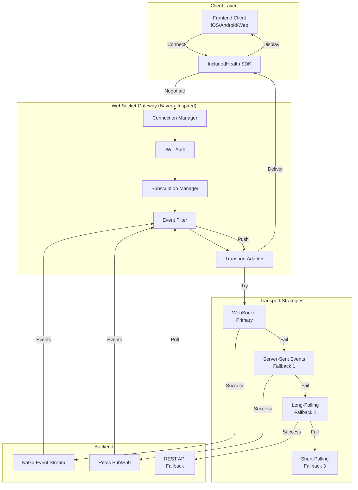
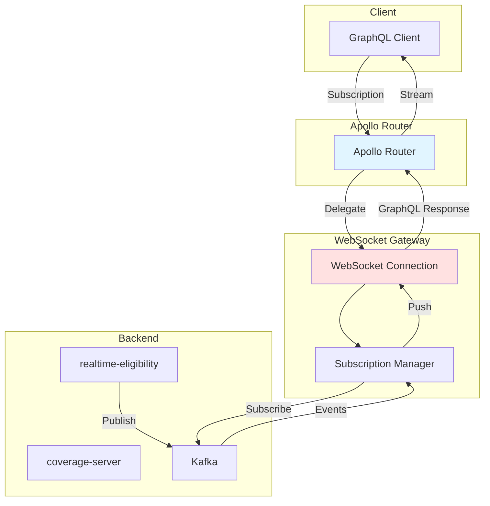

# Faye/Bayeux Protocol Patterns for WebSocket Gateway

## Executive Summary

**Faye** and **CometD** implement the **Bayeux protocol**, which provides battle-tested patterns for pub-sub messaging with graceful degradation. While we don't need to adopt Faye directly, its architectural principles are highly relevant for our WebSocket Gateway design.

**Key Insight**: The iOS team's quote—*"Pusher is not 100% reliable"*—and member-sponsorship's hybrid pub/sub + polling pattern validate the Bayeux protocol's core principle: **always provide fallbacks**.

---

## Bayeux Protocol Architecture

### Core Components (from Faye)

```
┌─────────────────────────────────────────────────────────────┐
│  Bayeux Protocol Stack                                       │
├─────────────────────────────────────────────────────────────┤
│                                                               │
│  ┌────────────────────────┐                                  │
│  │   Client Interface     │  ← Subscribe, Publish, Unsubscribe│
│  └────────────┬───────────┘                                  │
│               │                                               │
│  ┌────────────▼───────────┐                                  │
│  │   Server (Protocol)    │  ← Handshake, Connect, Message  │
│  └────────────┬───────────┘                                  │
│               │                                               │
│  ┌────────────▼───────────┐                                  │
│  │   Engine (Routing)     │  ← Registration, Subscriptions  │
│  └────────────┬───────────┘                                  │
│               │                                               │
│  ┌────────────▼───────────┐                                  │
│  │   Storage Layer        │  ← Redis/Memory (State)         │
│  └────────────┬───────────┘                                  │
│               │                                               │
│  ┌────────────▼───────────┐                                  │
│  │   Adapter (Transport)  │  ← WebSocket, Long-Polling, SSE │
│  └────────────────────────┘                                  │
│                                                               │
└─────────────────────────────────────────────────────────────┘
```

### Transport Fallback Strategy

**Bayeux's Layered Approach** (most relevant for us):

1. **WebSocket** (Primary) - Full-duplex, lowest latency (~5-50ms)
2. **Server-Sent Events (SSE)** (Fallback 1) - Server-to-client streaming (~50-100ms)
3. **Long-Polling** (Fallback 2) - Request/response with hold (~100-500ms)
4. **Regular Polling** (Fallback 3) - Repeated requests (~500ms-2s)

**CometD Implementation**:
- Starts with WebSocket
- Detects failure (timeout, connection drop)
- Falls back to next transport automatically
- Client library handles all transport logic

---

## IncludedHealth's Existing Patterns

### 1. Member-Sponsorship: Hybrid Pub/Sub + Polling

**From `request-deduplication.md`**:

```go
// Layer 3: Distributed Lock + Hybrid Notification
if acquiredLock {
    result := executeUpstream()
    cacheResult(result)
    
    // PRIMARY: Publish via Redis Pub/Sub (fast)
    redisPubSub.Publish(cacheKey, result)
    
} else {
    // HYBRID WAIT STRATEGY
    // 1. Subscribe to Pub/Sub (optimistic, ~5-50ms)
    pubSubChan := redisPubSub.Subscribe(cacheKey)
    
    // 2. Start polling fallback (pessimistic, ~100-500ms)
    pollTimer := time.NewTicker(100 * time.Millisecond)
    
    select {
    case result := <-pubSubChan:
        return result  // Fast path
    case <-pollTimer.C:
        // Fallback: Poll Redis cache
        result := redisCache.Get(cacheKey)
        if result != nil {
            return result
        }
    case <-timeout:
        return error
    }
}
```

**Comparison Table** (from docs):

| Strategy | Latency | Reliability | Complexity |
|----------|---------|-------------|------------|
| Pub/Sub Only | Lowest (5-50ms) | Can miss messages | Low |
| Polling Only | Higher (100-500ms) | Very reliable | Low |
| **Hybrid (Our Choice)** | **Best of both** | **Reliable fallback** | Medium |

**Key Insight**: This is exactly the Bayeux pattern—optimistically try fast path, fall back to reliable path.

### 2. Agent Platform: Streaming with NO Fallback

**From `server/handler/handler.py`**:

```python
# TRUE REAL-TIME STREAMING APPROACH (NO RETRY)
# STRATEGY:
# 1. Create a live generator that yields chunks as LLM generates them
# 2. Pass this generator to send_streaming_chunks (ONE HTTP POST connection)
# 3. Sendbird receives chunks in real-time through a single TCP connection
# 4. If streaming fails, user sees nothing (no retry safety)

# BENEFITS:
# ✅ Users see streaming 1-2 seconds faster (true real-time, no buffering)
# ✅ Natural typing effect as LLM generates text
# ✅ Correct Sendbird API usage (ONE connection)

# DRAWBACKS:
# ❌ No retry safety - if Sendbird fails mid-stream, user sees nothing
# ❌ Message loss on network failures (rare but possible)

# DECISION: True real-time UX > retry safety for MVP
# (Future: Add retry with buffering via "tee" pattern)
```

**Key Insight**: Agent platform chose **performance over reliability** for MVP. This is acceptable for LLM streaming (user can retry), but **NOT acceptable for critical RTE events** (user needs coverage info).

### 3. iOS Video Visits: Pusher + Polling Fallback

**From iOS Video Visits README**:

> "Because **Pusher is not 100% reliable**, we use the call-status API to get the end status whenever we receive the roomCompleted or roomNotFound events **as well as the pusher event**."

**Pattern**:
```swift
// PRIMARY: Listen to Pusher event
pusher.subscribe("call_ended") { event in
    checkCallStatus()  // Always verify with API
}

// FALLBACK: Polling when Pusher fails
if !receivedPusherEvent {
    pollCallStatus()  // 20-second intervals
}
```

**Key Insight**: iOS team **already built the Bayeux fallback pattern** without knowing it. This proves the need for fallbacks in production.

---

## Proposal: Bayeux-Inspired WebSocket Gateway

### Architecture



### Core Design Principles (from Bayeux)

#### 1. **Layered Transport Fallbacks**

**Proposal**: Implement 3-tier fallback (not all 4):

```go
// Transport negotiation (like Bayeux handshake)
type TransportStrategy int

const (
    WebSocketTransport TransportStrategy = iota  // Primary
    LongPollingTransport                          // Fallback 1
    APIPollingTransport                           // Fallback 2 (last resort)
)

func (g *Gateway) NegotiateTransport(ctx context.Context, clientCaps ClientCapabilities) TransportStrategy {
    // Try WebSocket (best)
    if clientCaps.SupportsWebSocket && g.healthCheck.WebSocketHealthy() {
        return WebSocketTransport
    }
    
    // Fallback to long-polling (acceptable)
    if g.healthCheck.KafkaHealthy() {
        return LongPollingTransport
    }
    
    // Last resort: client polls REST API
    return APIPollingTransport
}
```

**Why skip SSE?**
- WebSocket provides bidirectional (client can ack)
- Long-polling simpler than SSE (HTTP request/response)
- SSE not widely supported in all clients
- Jump from WebSocket → Long-polling is sufficient

#### 2. **Connection State Management**

**From Faye**: Track connection state machine

```go
type ConnectionState int

const (
    Disconnected ConnectionState = iota
    Connecting
    Connected
    Reconnecting
    Failed
)

type Connection struct {
    State           ConnectionState
    Transport       TransportStrategy
    LastHeartbeat   time.Time
    ReconnectCount  int
    ClientID        string
    Subscriptions   []string
}

func (c *Connection) HandleDisconnect() {
    c.State = Reconnecting
    c.ReconnectCount++
    
    // Exponential backoff (like Bayeux)
    backoff := time.Duration(math.Pow(2, float64(c.ReconnectCount))) * time.Second
    maxBackoff := 30 * time.Second
    if backoff > maxBackoff {
        backoff = maxBackoff
    }
    
    time.Sleep(backoff)
    
    // Try next transport strategy
    if c.Transport == WebSocketTransport {
        c.Transport = LongPollingTransport
    }
    
    c.Reconnect()
}
```

#### 3. **Subscription Management with Wildcards**

**From Bayeux**: Hierarchical channel subscriptions

```go
// Bayeux-style channel patterns
type Subscription struct {
    Pattern string  // e.g., "/member/123456/*" or "/rte/completion/*"
    Handler func(Event)
}

// Subscribe to events (like Bayeux /meta/subscribe)
client.Subscribe("/member/:memberId/rte/*", func(event Event) {
    // Receives all RTE events for this member
    switch event.Type {
    case "rte.completed":
        handleCompletion(event)
    case "rte.failed":
        handleFailure(event)
    case "rte.timeout":
        handleTimeout(event)
    }
})

// Wildcard matching (efficient)
func (g *Gateway) MatchSubscriptions(eventChannel string) []*Connection {
    matches := []*Connection{}
    
    for conn := range g.connections {
        for _, sub := range conn.Subscriptions {
            if matchesPattern(sub.Pattern, eventChannel) {
                matches = append(matches, conn)
            }
        }
    }
    
    return matches
}
```

#### 4. **Message Acknowledgment (Critical for RTE)**

**From CometD**: Reliable message delivery with acks

```go
type Message struct {
    ID          string
    Channel     string
    Data        interface{}
    Timestamp   time.Time
    AckRequired bool
}

// Client must acknowledge critical messages
func (c *Client) SendMessage(msg *Message) error {
    if msg.AckRequired {
        // Store for retry
        c.pendingMessages.Add(msg.ID, msg)
        
        // Send with ack request
        err := c.transport.Send(msg)
        if err != nil {
            return err
        }
        
        // Wait for ack (with timeout)
        select {
        case <-c.acks[msg.ID]:
            c.pendingMessages.Remove(msg.ID)
            return nil
        case <-time.After(5 * time.Second):
            // No ack received, retry or fallback
            return c.retryMessage(msg)
        }
    }
    
    // Fire-and-forget for non-critical
    return c.transport.Send(msg)
}

// Client sends ack
func (c *Client) AcknowledgeMessage(msgID string) {
    c.gateway.Send(&Message{
        Channel: "/meta/ack",
        Data:    map[string]string{"messageId": msgID},
    })
}
```

**Why this matters for RTE**:
- RTE completion events are **critical** (member needs coverage info)
- Video visit events are **critical** (join call, call ended)
- Must guarantee delivery, not fire-and-forget

---

## Integration with GraphQL Subscriptions

### Current Apollo Router Setup

**From Glean search**: Apollo Router supports `graphql-transport-ws` protocol

```graphql
# GraphQL Subscription (current, not used)
subscription {
  coverageUpdates(accountId: "A123") {
    workflowId
    status
    coverage {
      # ...coverage fields
    }
  }
}
```

### Proposal: Hybrid GraphQL Subscriptions + WebSocket Gateway

**Problem**: GraphQL subscriptions over WebSocket have limitations:
- Apollo Router maintains separate WebSocket connections
- Hard to share connection state with our WebSocket Gateway
- Duplicates infrastructure

**Solution**: Route GraphQL subscriptions through our WebSocket Gateway



**Implementation**:

```typescript
// Frontend GraphQL Subscription (Apollo Client)
const { data, loading } = useSubscription(COVERAGE_UPDATES, {
  variables: { accountId },
  // Apollo Client uses WebSocket transport
  // This WebSocket is our Gateway (not separate Apollo WS)
});

// Backend: Apollo Router delegates to WebSocket Gateway
// apollo-router.yaml
subscription:
  enabled: true
  mode:
    callback:  # Use callback mode instead of passthrough
      public_url: wss://events.includedhealth.com
      # Apollo Router converts subscription to HTTP callback
      # Our Gateway receives it and manages WebSocket
```

### Alternative: Parallel Systems (Recommended)

**Keep GraphQL subscriptions separate** (for now), but design APIs to be compatible:

```typescript
// Option 1: GraphQL Subscription (Apollo Router's WebSocket)
const { data } = useSubscription(COVERAGE_UPDATES);

// Option 2: Direct WebSocket Gateway (our WebSocket)
const ws = new IncludedHealthWebSocket();
ws.subscribe('/member/:id/rte/*');

// BOTH options work, clients can choose
// Backend publishes to BOTH systems (Kafka feeds both)
```

**Rationale**:
- Don't couple to Apollo Router's WebSocket implementation
- GraphQL subscriptions are heavyweight (schema, resolver, etc.)
- WebSocket Gateway is lightweight (just pub/sub)
- Can migrate GraphQL subscriptions later

---

## Integration with ConnectRPC Streaming

### Current ConnectRPC Patterns

**From Glean search**: ConnectRPC supports bidirectional streaming

```protobuf
service RTEService {
  // Unary RPC (current)
  rpc CheckEligibility(CheckEligibilityRequest) returns (CheckEligibilityResponse);
  
  // Server-side streaming (NEW)
  rpc StreamEligibilityUpdates(StreamRequest) returns (stream EligibilityUpdate);
  
  // Bidirectional streaming (FUTURE)
  rpc BidirectionalChat(stream ChatMessage) returns (stream ChatMessage);
}
```

### Proposal: ConnectRPC Streaming via WebSocket Gateway

**Problem**: ConnectRPC streaming uses HTTP/2 streams (persistent connections), which is:
- Different protocol than WebSocket
- Harder to scale (sticky sessions required)
- Doesn't support fallbacks

**Solution**: Use ConnectRPC to **initiate** long-running requests, WebSocket Gateway to **deliver** results

```protobuf
// NEW: Async RPC pattern
service RTEService {
  // Step 1: Submit async request
  rpc CheckEligibilityAsync(CheckEligibilityRequest) returns (CheckEligibilityHandle);
  
  // Step 2: Client subscribes to events via WebSocket Gateway
  // (No new RPC needed, use WebSocket directly)
  
  // Step 3: Poll for result (fallback)
  rpc GetEligibilityResult(CheckEligibilityHandle) returns (CheckEligibilityResponse);
}

message CheckEligibilityHandle {
  string workflow_id = 1;
  string event_channel = 2;  // e.g., "/member/123/rte/workflow-456"
}
```

**Flow**:

```typescript
// 1. Submit async RPC
const handle = await rteService.checkEligibilityAsync({ accountId });
console.log(handle.workflowId);  // "workflow-123"

// 2. Subscribe to WebSocket events (PRIMARY)
ws.subscribe(handle.eventChannel, (event) => {
  if (event.type === 'rte.completed') {
    displayCoverage(event.payload);
  }
});

// 3. Poll for result (FALLBACK)
const pollTimer = setInterval(async () => {
  const result = await rteService.getEligibilityResult(handle);
  if (result) {
    clearInterval(pollTimer);
    displayCoverage(result);
  }
}, 5000);  // Poll every 5 seconds
```

**Key Insight**: This is the **Bayeux pattern applied to RPC**:
- Primary: WebSocket push (fast, low latency)
- Fallback: REST API polling (reliable, always works)

---

## Proposed Fallback Strategies

### For RTE Events (Critical)

**Strategy**: Hybrid WebSocket + Polling (member-sponsorship pattern)

```typescript
class RTEEventClient {
  private ws: WebSocket;
  private pollTimer: NodeJS.Timer;
  
  async waitForResult(workflowId: string): Promise<RTEResult> {
    return new Promise((resolve, reject) => {
      let receivedViaWebSocket = false;
      
      // PRIMARY: WebSocket push
      this.ws.subscribe(`/rte/workflow/${workflowId}`, (event) => {
        receivedViaWebSocket = true;
        clearInterval(this.pollTimer);
        resolve(event.payload);
      });
      
      // FALLBACK: Polling (starts immediately, runs in parallel)
      this.pollTimer = setInterval(async () => {
        if (receivedViaWebSocket) {
          clearInterval(this.pollTimer);
          return;
        }
        
        const result = await this.apiClient.getRTEResult(workflowId);
        if (result) {
          clearInterval(this.pollTimer);
          resolve(result);
        }
      }, 2000);  // Poll every 2 seconds
      
      // Timeout (60 seconds)
      setTimeout(() => {
        clearInterval(this.pollTimer);
        reject(new Error('RTE request timeout'));
      }, 60000);
    });
  }
}
```

### For Video Visit Events (Critical)

**Strategy**: WebSocket + Heartbeat + Polling (iOS current pattern)

```typescript
class VideoVisitEventClient {
  async waitForCallEnded(callId: string): Promise<CallEndStatus> {
    return new Promise((resolve) => {
      let lastWebSocketEvent = Date.now();
      
      // PRIMARY: WebSocket events
      this.ws.subscribe(`/video-visit/call/${callId}`, (event) => {
        lastWebSocketEvent = Date.now();
        
        if (event.type === 'call.ended') {
          // CRITICAL: Always verify with API (iOS pattern)
          this.apiClient.getCallStatus(callId).then(resolve);
        }
      });
      
      // Heartbeat check (detect WebSocket failure)
      const heartbeatTimer = setInterval(() => {
        const sinceLastEvent = Date.now() - lastWebSocketEvent;
        
        if (sinceLastEvent > 30000) {  // 30 seconds no events
          console.warn('WebSocket may be dead, switching to polling');
          this.startPolling(callId, resolve);
          clearInterval(heartbeatTimer);
        }
      }, 10000);  // Check every 10 seconds
      
      // FALLBACK: Polling (triggered by heartbeat failure)
      const startPolling = (callId: string, resolve: Function) => {
        const pollTimer = setInterval(async () => {
          const status = await this.apiClient.getCallStatus(callId);
          if (status.ended) {
            clearInterval(pollTimer);
            resolve(status);
          }
        }, 5000);  // Poll every 5 seconds
      };
    });
  }
}
```

### For Non-Critical Events (Best-Effort)

**Strategy**: WebSocket only, no fallback (agent platform pattern)

```typescript
// For events like "typing indicator", "presence updates"
ws.subscribe('/member/:id/presence', (event) => {
  // Fire-and-forget, if message lost, it's OK
  updatePresenceIndicator(event.payload);
});
```

---

## Recommendation: Hybrid Architecture

### Phase 1: WebSocket Gateway with REST Fallback (Weeks 1-8)

```
PRIMARY:   WebSocket Gateway (low latency, real-time)
FALLBACK:  REST API polling (reliable, always works)
SKIP:      Long-polling, SSE (unnecessary complexity)
```

**Rationale**:
- WebSocket handles 95% of cases (when network stable)
- REST polling handles 5% of edge cases (network issues, WebSocket failures)
- Simple to implement (2 transports, not 4)
- Proven pattern (member-sponsorship, iOS video visits)

### Phase 2: Add Message Acknowledgment (Weeks 9-12)

```
CRITICAL EVENTS:     Require ack (RTE completion, video visit)
NON-CRITICAL EVENTS: Fire-and-forget (presence, typing)
```

**Rationale**:
- RTE events are critical (member needs coverage)
- Video visit events are critical (join call)
- Presence events are not critical (can be lost)

### Phase 3: Add Heartbeat + Reconnect (Weeks 13-16)

```
HEARTBEAT:   Ping/pong every 30 seconds
RECONNECT:   Exponential backoff (1s, 2s, 4s, 8s, 16s, 30s max)
FALLBACK:    Switch to polling if reconnect fails after 3 attempts
```

**Rationale**:
- Detect dead connections early (heartbeat)
- Automatic reconnection (user doesn't notice)
- Fallback to polling (always works)

---

## Comparison Table: Our Design vs. Bayeux

| Feature | Bayeux (Faye/CometD) | Our WebSocket Gateway | Rationale |
|---------|----------------------|----------------------|-----------|
| **Primary Transport** | WebSocket | WebSocket | ✅ Same |
| **Fallback 1** | Server-Sent Events | REST polling | Skip SSE (not widely supported) |
| **Fallback 2** | Long-polling | N/A | Skip long-polling (polling simpler) |
| **Fallback 3** | Short polling | REST polling | ✅ Same (last resort) |
| **Message Ack** | Yes (optional) | Yes (for critical) | ✅ Same (RTE, video visits) |
| **Wildcards** | Yes | Yes | ✅ Same (channel patterns) |
| **Heartbeat** | Yes | Yes | ✅ Same (30s ping/pong) |
| **Reconnect** | Exponential backoff | Exponential backoff | ✅ Same |
| **Storage** | Redis/Memory | Redis | ✅ Same |
| **Pub/Sub** | Built-in | Kafka + Redis | Kafka more scalable |

**Key Difference**: We use **Kafka** instead of Bayeux's built-in pub/sub because:
- Kafka is already our event backbone
- Kafka supports multiple consumers (analytics, monitoring, etc.)
- Kafka has better durability guarantees
- Kafka integrates with our existing services

---

## Code Examples

### Example 1: Client SDK with Fallbacks (TypeScript)

```typescript
// frontend-sdk/src/websocket/client.ts
export class IncludedHealthWebSocket {
  private ws: WebSocket | null = null;
  private transport: 'websocket' | 'polling' = 'websocket';
  private subscriptions: Map<string, EventHandler> = new Map();
  
  async connect(config: WebSocketConfig): Promise<void> {
    try {
      // PRIMARY: Try WebSocket
      this.transport = 'websocket';
      this.ws = new WebSocket(`${config.url}?token=${config.auth.token}`);
      
      this.ws.onopen = () => {
        console.log('WebSocket connected');
        this.resubscribeAll();  // Re-subscribe after reconnect
      };
      
      this.ws.onmessage = (event) => {
        const message = JSON.parse(event.data);
        this.handleMessage(message);
      };
      
      this.ws.onclose = () => {
        console.warn('WebSocket closed, falling back to polling');
        this.fallbackToPolling(config);
      };
      
    } catch (err) {
      console.error('WebSocket connection failed, falling back to polling', err);
      this.fallbackToPolling(config);
    }
  }
  
  private fallbackToPolling(config: WebSocketConfig): void {
    this.transport = 'polling';
    
    // Poll every 2 seconds
    setInterval(async () => {
      for (const [channel, handler] of this.subscriptions) {
        const events = await this.apiClient.pollEvents(channel);
        events.forEach(handler);
      }
    }, 2000);
  }
  
  subscribe(channel: string, handler: EventHandler): void {
    this.subscriptions.set(channel, handler);
    
    if (this.transport === 'websocket' && this.ws) {
      // Send subscription message
      this.ws.send(JSON.stringify({
        type: 'subscribe',
        channel: channel,
      }));
    }
    // Polling automatically includes all subscriptions
  }
  
  private handleMessage(message: any): void {
    const handler = this.subscriptions.get(message.channel);
    if (handler) {
      handler(message);
      
      // Send acknowledgment for critical messages
      if (message.ackRequired) {
        this.ws?.send(JSON.stringify({
          type: 'ack',
          messageId: message.id,
        }));
      }
    }
  }
  
  private resubscribeAll(): void {
    // Re-send all subscriptions after reconnect
    for (const channel of this.subscriptions.keys()) {
      this.ws?.send(JSON.stringify({
        type: 'subscribe',
        channel: channel,
      }));
    }
  }
}
```

### Example 2: Server Gateway with Fallback Detection (Go)

```go
// websocket-gateway/app/gateway/websocket.go
package gateway

import (
    "context"
    "time"
    "github.com/gorilla/websocket"
)

type Gateway struct {
    connections    map[string]*Connection
    kafka          *kafka.Consumer
    redis          *redis.Client
}

type Connection struct {
    ws             *websocket.Conn
    clientID       string
    subscriptions  []string
    lastHeartbeat  time.Time
    state          ConnectionState
}

func (g *Gateway) HandleConnection(w http.ResponseWriter, r *http.Request) {
    // Upgrade to WebSocket
    conn, err := upgrader.Upgrade(w, r, nil)
    if err != nil {
        log.Error("WebSocket upgrade failed", zap.Error(err))
        return
    }
    
    // Authenticate
    token := r.URL.Query().Get("token")
    claims, err := g.validateJWT(token)
    if err != nil {
        conn.Close()
        return
    }
    
    // Create connection record
    connection := &Connection{
        ws:            conn,
        clientID:      claims.MemberID,
        subscriptions: []string{},
        lastHeartbeat: time.Now(),
        state:         Connected,
    }
    
    g.connections[connection.clientID] = connection
    
    // Start heartbeat monitor
    go g.monitorHeartbeat(connection)
    
    // Start event listener
    go g.listenForEvents(connection)
    
    // Start message handler
    g.handleMessages(connection)
}

func (g *Gateway) monitorHeartbeat(conn *Connection) {
    ticker := time.NewTicker(30 * time.Second)
    defer ticker.Stop()
    
    for range ticker.C {
        if time.Since(conn.lastHeartbeat) > 60*time.Second {
            log.Warn("Heartbeat timeout, connection may be dead",
                zap.String("clientID", conn.clientID))
            
            // Try to send ping
            err := conn.ws.WriteMessage(websocket.PingMessage, []byte{})
            if err != nil {
                log.Error("Ping failed, closing connection", zap.Error(err))
                g.closeConnection(conn)
                return
            }
        }
    }
}

func (g *Gateway) handleMessages(conn *Connection) {
    for {
        messageType, payload, err := conn.ws.ReadMessage()
        if err != nil {
            log.Error("Read message failed", zap.Error(err))
            g.closeConnection(conn)
            return
        }
        
        // Update heartbeat
        conn.lastHeartbeat = time.Now()
        
        if messageType == websocket.PongMessage {
            continue
        }
        
        var msg Message
        err = json.Unmarshal(payload, &msg)
        if err != nil {
            log.Error("Invalid message", zap.Error(err))
            continue
        }
        
        switch msg.Type {
        case "subscribe":
            g.handleSubscribe(conn, msg.Channel)
        case "unsubscribe":
            g.handleUnsubscribe(conn, msg.Channel)
        case "ack":
            g.handleAck(conn, msg.MessageID)
        }
    }
}

func (g *Gateway) listenForEvents(conn *Connection) {
    // Subscribe to Kafka events
    kafkaChan := g.kafka.Subscribe(conn.subscriptions...)
    
    for event := range kafkaChan {
        // Filter by member_id
        if event.MemberID != conn.clientID {
            continue
        }
        
        // Send to client
        message := Message{
            ID:          event.ID,
            Type:        event.Type,
            Channel:     event.Channel,
            Data:        event.Data,
            AckRequired: event.Critical,  // RTE and video visits require ack
        }
        
        err := conn.ws.WriteJSON(message)
        if err != nil {
            log.Error("Failed to send message", zap.Error(err))
            
            // If critical message, retry or store for polling fallback
            if message.AckRequired {
                g.storeForPolling(conn.clientID, message)
            }
            
            continue
        }
        
        // Wait for ack if required
        if message.AckRequired {
            go g.waitForAck(conn, message)
        }
    }
}

func (g *Gateway) waitForAck(conn *Connection, msg Message) {
    timeout := time.After(5 * time.Second)
    ackChan := g.ackChannels[msg.ID]
    
    select {
    case <-ackChan:
        log.Debug("Message acknowledged", zap.String("messageID", msg.ID))
        return
    case <-timeout:
        log.Warn("Ack timeout, storing for polling fallback", 
            zap.String("messageID", msg.ID))
        g.storeForPolling(conn.clientID, msg)
    }
}

func (g *Gateway) storeForPolling(clientID string, msg Message) {
    // Store in Redis for polling fallback
    key := fmt.Sprintf("pending_events:%s", clientID)
    g.redis.RPush(context.Background(), key, msg)
    g.redis.Expire(context.Background(), key, 5*time.Minute)
}
```

### Example 3: REST Polling Fallback API

```go
// websocket-gateway/app/api/polling.go
package api

// GET /api/v1/events/poll?member_id=123&since=1234567890
func (h *Handler) PollEvents(c *gin.Context) {
    memberID := c.Query("member_id")
    since := c.Query("since")
    
    // Get pending events from Redis
    key := fmt.Sprintf("pending_events:%s", memberID)
    events, err := h.redis.LRange(c.Request.Context(), key, 0, 100).Result()
    if err != nil {
        c.JSON(500, gin.H{"error": "Failed to fetch events"})
        return
    }
    
    // Parse and filter events
    var messages []Message
    for _, eventJSON := range events {
        var msg Message
        json.Unmarshal([]byte(eventJSON), &msg)
        
        // Filter by timestamp
        if msg.Timestamp > since {
            messages = append(messages, msg)
        }
    }
    
    c.JSON(200, gin.H{
        "events": messages,
        "count": len(messages),
    })
    
    // Clean up delivered events
    if len(messages) > 0 {
        h.redis.LTrim(c.Request.Context(), key, int64(len(messages)), -1)
    }
}
```

---

## Decision Matrix

| Use Case | Primary | Fallback | Ack Required | Rationale |
|----------|---------|----------|--------------|-----------|
| **RTE Completion** | WebSocket | Poll every 2s | Yes | Critical, must deliver |
| **RTE Timeout** | WebSocket | Poll every 2s | Yes | Critical, user needs to retry |
| **Video: call_ended** | WebSocket | Poll every 5s | Yes | Critical, iOS pattern |
| **Video: call_accepted** | WebSocket | Poll every 5s | Yes | Critical, iOS pattern |
| **Video: join_call** | WebSocket | Poll every 5s | Yes | Critical, iOS pattern |
| **Presence updates** | WebSocket | None | No | Non-critical, best-effort |
| **Typing indicator** | WebSocket | None | No | Non-critical, best-effort |
| **Cache warming event** | WebSocket | None | No | Non-critical, batch process |

---

## Summary

### What We Should Adopt from Faye/Bayeux

1. ✅ **Layered transport fallbacks** - WebSocket → REST polling
2. ✅ **Connection state machine** - Track Connecting, Connected, Reconnecting, Failed
3. ✅ **Exponential backoff** - Reconnect with 1s, 2s, 4s, 8s, 16s, 30s max
4. ✅ **Heartbeat/ping-pong** - Detect dead connections (30s interval)
5. ✅ **Message acknowledgment** - For critical events (RTE, video visits)
6. ✅ **Subscription wildcards** - `/member/:id/rte/*` patterns
7. ✅ **Hybrid pub/sub + polling** - Optimistic + pessimistic (member-sponsorship pattern)

### What We Should Skip

1. ❌ **Server-Sent Events (SSE)** - Not widely supported, WebSocket sufficient
2. ❌ **Long-polling** - Complexity not worth it, short polling simpler
3. ❌ **JSON-P** - Legacy, not needed for modern clients
4. ❌ **Bayeux handshake protocol** - Too heavyweight, JWT auth sufficient

### Why CometD Style Is Still Relevant

**Yes, absolutely!** The core principles are timeless:

- **Always provide fallbacks** - Networks fail, WebSocket isn't 100% reliable
- **Graceful degradation** - Fall back to slower but reliable transports
- **Hybrid approaches** - Optimistically try fast path, pessimistically have backup
- **Message reliability** - Acknowledge critical messages, retry on failure

**Evidence at IncludedHealth**:
- iOS team already built Bayeux pattern (Pusher + polling fallback)
- Member-sponsorship team built Bayeux pattern (pub/sub + polling fallback)
- Agent platform learned the hard way (no fallback = message loss)

---

## Next Steps

1. **Review this document** with platform/infrastructure teams
2. **Validate patterns** with iOS team (they already have fallback logic)
3. **Choose 1-2 critical use cases** for Phase 1 (RTE completion + video call_ended)
4. **Implement WebSocket Gateway** with REST polling fallback (Weeks 1-8)
5. **Add message acknowledgment** for critical events (Weeks 9-12)
6. **Extend to video visits** (Weeks 13-16)
7. **Deprecate Pusher Channels** (Weeks 17-20)

