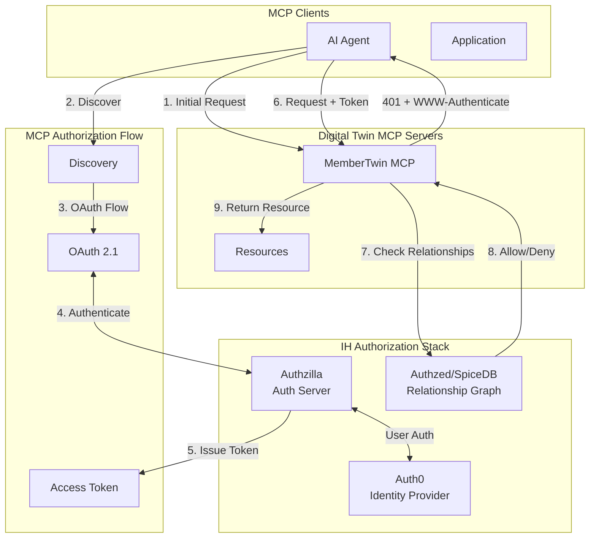

# MCP Authorization with Authzilla & Authzed Integration

## Executive Summary

This document describes how the [MCP Authorization specification](https://modelcontextprotocol.io/specification/2025-06-18/basic/authorization) integrates with IH's existing Authzilla authentication service and Authzed (SpiceDB) authorization system. The MCP OAuth 2.1 flow acts as a **front door** while Authzed provides **fine-grained relationship-based access control** for Digital Twin resources.

---

## Architecture Overview



---

## How MCP Authorization Maps to IH Systems

### 1. MCP Server as OAuth Resource Server

Per the MCP spec, Digital Twin MCP servers act as **OAuth 2.1 resource servers**:

```yaml
# Digital Twin MCP server configuration
mcp_server:
  role: resource_server
  protected_resources:
    - mcp://twins/member/{id}/*
    - mcp://twins/practitioner/{id}/*
  metadata_endpoint: /.well-known/oauth-protected-resource
  authorization_servers:
    - https://authzilla.includedhealth.com
```

### 2. Authzilla as OAuth Authorization Server

Authzilla implements the **OAuth 2.1 authorization server** role required by MCP:

```yaml
authzilla:
  role: authorization_server
  metadata_endpoint: /.well-known/oauth-authorization-server
  capabilities:
    - dynamic_client_registration  # RFC7591
    - pkce                         # Required by OAuth 2.1
    - resource_indicators          # RFC8707
  endpoints:
    authorize: /oauth/authorize
    token: /oauth/token
    register: /oauth/register
```

### 3. Token Structure with Authzed Claims

Authzilla issues JWTs that include both standard OAuth claims and IH-specific relationship claims:

```json
{
  // Standard OAuth 2.1 claims
  "iss": "https://authzilla.includedhealth.com",
  "sub": "user:U123",
  "aud": ["mcp://twins/member", "mcp://twins/practitioner"],
  "exp": 1234567890,
  "scope": "read write",
  
  // IH-specific claims for Authzed
  "ih_claims": {
    "actor_type": "care_coordinator",  // or "member", "agent", "service"
    "actor_id": "CC456",
    "teams": ["behavioral_health", "chronic_care"],
    "sponsor_id": "S789"
  }
}
```

---

## Integration Flow

### Step 1: MCP Discovery (Following MCP Spec)

When an MCP client first connects:

```http
GET /mcp/member/M123/profile HTTP/1.1
Host: twins.includedhealth.com

HTTP/1.1 401 Unauthorized
WWW-Authenticate: Bearer realm="MemberTwin",
                  resource_metadata="https://twins.includedhealth.com/.well-known/oauth-protected-resource"
```

### Step 2: Resource Metadata (RFC9728)

```http
GET /.well-known/oauth-protected-resource HTTP/1.1
Host: twins.includedhealth.com

HTTP/1.1 200 OK
Content-Type: application/json

{
  "resource": "https://twins.includedhealth.com",
  "authorization_servers": [
    "https://authzilla.includedhealth.com"
  ],
  "resource_documentation": "https://docs.includedhealth.com/mcp/twins"
}
```

### Step 3: Authorization Server Metadata (RFC8414)

```http
GET /.well-known/oauth-authorization-server HTTP/1.1
Host: authzilla.includedhealth.com

HTTP/1.1 200 OK
Content-Type: application/json

{
  "issuer": "https://authzilla.includedhealth.com",
  "authorization_endpoint": "https://authzilla.includedhealth.com/oauth/authorize",
  "token_endpoint": "https://authzilla.includedhealth.com/oauth/token",
  "registration_endpoint": "https://authzilla.includedhealth.com/oauth/register",
  "response_types_supported": ["code"],
  "code_challenge_methods_supported": ["S256"],  // PKCE required
  "grant_types_supported": ["authorization_code", "refresh_token"]
}
```

### Step 4: Dynamic Client Registration (RFC7591)

MCP clients register dynamically with Authzilla:

```http
POST /oauth/register HTTP/1.1
Host: authzilla.includedhealth.com
Content-Type: application/json

{
  "client_name": "Claude Desktop MCP Client",
  "client_type": "public",  // or "confidential" for services
  "redirect_uris": ["http://localhost:9876/callback"],
  "grant_types": ["authorization_code", "refresh_token"],
  "response_types": ["code"],
  "scope": "read write",
  "software_id": "mcp-client-v1",
  "software_version": "1.0.0"
}

HTTP/1.1 201 Created
Content-Type: application/json

{
  "client_id": "mcp_client_abc123",
  "client_id_issued_at": 1234567890,
  "redirect_uris": ["http://localhost:9876/callback"],
  "grant_types": ["authorization_code", "refresh_token"]
}
```

### Step 5: OAuth Authorization Flow with PKCE

```http
GET /oauth/authorize?
    client_id=mcp_client_abc123&
    response_type=code&
    scope=read%20write&
    redirect_uri=http://localhost:9876/callback&
    state=xyz123&
    code_challenge=E9Melhoa2OwvFrEMTJguCHaoeK1t8URWbuGJSstw-cM&
    code_challenge_method=S256&
    resource=mcp://twins/member  # RFC8707 resource indicator
Host: authzilla.includedhealth.com
```

### Step 6: Token Exchange

```http
POST /oauth/token HTTP/1.1
Host: authzilla.includedhealth.com
Content-Type: application/x-www-form-urlencoded

grant_type=authorization_code&
code=abc123&
client_id=mcp_client_abc123&
redirect_uri=http://localhost:9876/callback&
code_verifier=dBjftJeZ4CVP-mB92K27uhbUJU1p1r_wW1gFWFOEjXk&
resource=mcp://twins/member

HTTP/1.1 200 OK
Content-Type: application/json

{
  "access_token": "eyJhbGciOiJSUzI1NiIs...",
  "token_type": "Bearer",
  "expires_in": 3600,
  "refresh_token": "8xLOxBtZp8",
  "scope": "read write"
}
```

---

## Authzed (SpiceDB) Integration

### Resource Access Check

When the Digital Twin MCP server receives a request with a valid OAuth token, it checks Authzed for fine-grained permissions:

```go
// In member-twin-mcp service
func (s *MemberTwinServer) checkAccess(ctx context.Context, token *jwt.Token, resourceURI string) error {
    // Extract claims from JWT
    claims := extractClaims(token)
    
    // Parse resource URI
    // mcp://twins/member/M123/coverage
    parts := parseURI(resourceURI)
    memberID := parts[3]  // M123
    resourceType := parts[4]  // coverage
    
    // Check with Authzed
    resp, err := s.authzedClient.CheckPermission(ctx, &authzed.CheckPermissionRequest{
        Resource: &authzed.ObjectReference{
            ObjectType: "member",
            ObjectId:   memberID,
        },
        Permission: "view_" + resourceType,
        Subject: &authzed.SubjectReference{
            Object: &authzed.ObjectReference{
                ObjectType: claims.ActorType,  // e.g., "care_coordinator"
                ObjectId:   claims.ActorID,     // e.g., "CC456"
            },
        },
    })
    
    if resp.Permissionship != authzed.CheckPermissionResponse_PERMISSIONSHIP_HAS_PERMISSION {
        return ErrAccessDenied
    }
    
    return nil
}
```

### Authzed Schema for MCP Resources

```zed
// Authzed schema definition
definition member {
    relation self: user
    relation care_team: care_coordinator | nurse | physician
    relation family: user
    relation sponsor: sponsor
    
    // MCP resource permissions
    permission view_profile = self + care_team + family
    permission view_coverage = self + care_team
    permission view_clinical = self + care_team
    permission view_financial = self + sponsor->billing_admin
    
    // Write permissions more restricted
    permission update_profile = self
    permission create_task = care_team
}

definition care_coordinator {
    relation member_assignments: member
    relation team: team
}

definition digital_twin_resource {
    relation owner: member
    relation viewers: user | care_coordinator | agent
    
    permission read = owner + viewers
    permission subscribe = owner + viewers  // For MCP subscriptions
}
```

---

## Event-Driven Authorization

When Digital Twin resources change and emit events, authorization is enforced at multiple levels:

### 1. MCP Subscription Authorization

```json
// MCP client subscribes to resource changes
{
  "jsonrpc": "2.0",
  "method": "resources/subscribe",
  "params": {
    "uri": "mcp://twins/member/M123/coverage"
  }
}

// Server checks with Authzed before allowing subscription
checkPermission("member:M123", "subscribe_coverage", "agent:A456")
```

### 2. Event Filtering in Kafka Consumer

```go
// WebSocket gateway filters events based on Authzed relationships
func (g *Gateway) filterEventForClient(event *TwinResourceUpdatedEvent, clientID string) bool {
    // Check if client has permission to see this resource update
    allowed := g.authzed.Check(
        fmt.Sprintf("digital_twin_resource:%s", event.ResourceURI),
        "read",
        fmt.Sprintf("client:%s", clientID),
    )
    
    return allowed == PERMISSIONSHIP_HAS_PERMISSION
}
```

### 3. Privacy-Aware Field Projection

```go
// Digital Twin applies field-level access control
func (t *MemberTwin) projectResource(resource *Resource, permissions []string) *Resource {
    projected := &Resource{
        URI: resource.URI,
        Name: resource.Name,
    }
    
    // Only include fields the requester can see
    if contains(permissions, "view_phi") {
        projected.ClinicalData = resource.ClinicalData
    }
    
    if contains(permissions, "view_pii") {
        projected.Demographics = resource.Demographics
    }
    
    return projected
}
```

---

## Security Considerations

### 1. Token Audience Validation

Per the MCP spec's emphasis on [RFC 8707](https://www.rfc-editor.org/rfc/rfc8707.html), tokens MUST be audience-bound:

```go
func validateTokenAudience(token *jwt.Token, expectedResource string) error {
    audiences := token.Claims["aud"].([]string)
    
    // Must include the specific MCP resource
    if !contains(audiences, expectedResource) {
        return ErrInvalidAudience
    }
    
    return nil
}
```

### 2. Token Passthrough Prevention

Following MCP security requirements, Digital Twin servers **MUST NOT** pass OAuth tokens to downstream services:

```go
// WRONG - Never do this
func callDownstream(token string) {
    client.SetHeader("Authorization", token)  // ❌ Token passthrough
}

// CORRECT - Use service-to-service auth
func callDownstream() {
    serviceToken := getServiceToken()  // ✅ Separate token
    client.SetHeader("Authorization", serviceToken)
}
```

### 3. PKCE Required

All MCP clients MUST use PKCE (RFC 7636) as required by OAuth 2.1:

```typescript
// MCP client SDK
class MCPAuthClient {
  async authorize() {
    const verifier = generateCodeVerifier();
    const challenge = await sha256(verifier);
    
    // Store verifier for token exchange
    this.codeVerifier = verifier;
    
    // Include challenge in authorization request
    const authUrl = `${authEndpoint}?` +
      `code_challenge=${challenge}&` +
      `code_challenge_method=S256&` +
      // ... other params
  }
}
```

---

## Implementation Roadmap

### Phase 1: Authzilla OAuth 2.1 Support (Weeks 1-4)
- Add OAuth 2.1 endpoints to Authzilla
- Implement dynamic client registration (RFC7591)
- Add resource indicators support (RFC8707)
- Implement PKCE validation

### Phase 2: Digital Twin MCP Authorization (Weeks 5-8)
- Add protected resource metadata endpoints
- Implement WWW-Authenticate headers
- Integrate token validation with Authzilla
- Add Authzed permission checks

### Phase 3: Fine-Grained Access Control (Weeks 9-12)
- Define Authzed schema for Digital Twin resources
- Implement field-level projections
- Add subscription authorization
- Create audit logging

### Phase 4: Event Authorization (Weeks 13-16)
- Integrate with WebSocket gateway authorization
- Add event filtering based on Authzed relationships
- Implement privacy-aware event delivery
- Test end-to-end flows

---

## Benefits of This Integration

### 1. **Standards Compliance**
- Follows MCP OAuth 2.1 specification exactly
- Implements all required RFCs (8414, 7591, 9728, 8707)
- Compatible with any MCP client

### 2. **Relationship-Based Access**
- Leverages Authzed's Zanzibar model
- Supports complex care team relationships
- Scales to millions of permission checks

### 3. **Defense in Depth**
- OAuth for coarse-grained access
- Authzed for fine-grained permissions
- Event filtering for real-time updates
- Audit logging for compliance

### 4. **Developer Experience**
- Dynamic client registration (no manual setup)
- Standard OAuth flow (familiar to developers)
- Self-documenting via metadata endpoints

---

## Example: End-to-End Flow

### AI Agent Accessing Member Coverage

1. **Agent attempts to read coverage**:
   ```
   GET mcp://twins/member/M123/coverage
   ```

2. **Server returns 401 with discovery hint**:
   ```
   401 Unauthorized
   WWW-Authenticate: Bearer resource_metadata="..."
   ```

3. **Agent discovers Authzilla as auth server**

4. **Agent registers dynamically with Authzilla**

5. **User authorizes agent** (browser flow with PKCE)

6. **Agent receives access token** with IH claims

7. **Agent requests coverage with token**

8. **Digital Twin checks Authzed**:
   ```
   Can agent:A456 view_coverage for member:M123?
   ```

9. **Authzed evaluates relationships**:
   - Is agent assigned to member's care team? ✓
   - Does agent have coverage scope? ✓
   
10. **Digital Twin returns coverage resource**

11. **Agent subscribes to updates**

12. **When coverage changes**:
    - Event published to Kafka
    - WebSocket gateway checks Authzed
    - Event pushed to authorized agent

---

## Conclusion

The MCP authorization specification integrates seamlessly with IH's Authzilla and Authzed infrastructure:

- **Authzilla** serves as the OAuth 2.1 authorization server
- **Authzed** provides fine-grained relationship-based access control
- **Digital Twin MCP servers** act as OAuth resource servers
- **WebSocket gateway** enforces authorization for real-time events

This creates a secure, standards-compliant authorization layer for the Digital Twin MCP pattern that leverages IH's existing investment in Authzilla and Authzed while fully conforming to the MCP specification.
