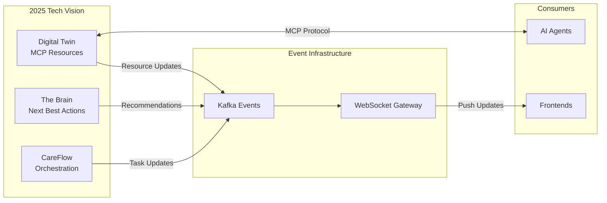

# MCP Resources & Event-Driven Architecture: Summary

## The Big Picture

The [Model Context Protocol (MCP) Resources specification](https://modelcontextprotocol.io/specification/2025-06-18/server/resources) provides the perfect foundation for IH's Digital Twin Platform. By combining MCP Resources with event-driven architecture, we create a real-time, reactive system that serves both AI agents and frontend applications.

---

## How It All Fits Together



---

## The Three Layers

### 1. MCP Resource Layer (Digital Twin)

Following the MCP specification, Digital Twins expose resources:

- **URIs**: `mcp://twins/member/{id}/coverage`
- **Operations**: list, read, subscribe
- **Notifications**: `notifications/resources/updated`

```json
// Standard MCP resource
{
  "uri": "mcp://twins/member/M123/coverage",
  "name": "Coverage Summary",
  "mimeType": "application/json",
  "annotations": {
    "audience": ["user", "assistant"],
    "priority": 0.9
  }
}
```

### 2. Event Layer (Kafka)

When resources change, events flow through Kafka:

```protobuf
message TwinResourceUpdatedEvent {
  string resource_uri = 1;  // MCP URI
  string twin_type = 2;
  string twin_id = 3;
  google.protobuf.Timestamp updated_at = 4;
}
```

Topics:
- `twins.member.updated`
- `twins.member.coverage.changed`
- `twins.member.care.changed`

### 3. Delivery Layer (WebSocket)

Events are pushed to frontends in real-time:

```typescript
// Frontend receives push notification
ws.on('resource.updated', async (event) => {
  if (event.uri === 'mcp://twins/member/M123/coverage') {
    const coverage = await twinClient.readResource(event.uri);
    updateUI(coverage);  // Instant update!
  }
});
```

---

## Key Benefits

### 1. Standard Protocol
- MCP provides a well-defined specification
- Consistent interface across all twin types
- Tools can be built once and reused

### 2. Real-Time Updates
- No polling required
- Push notifications when resources change
- Sub-second latency from backend to frontend

### 3. AI-Native
- Designed for LLM agents (MCP is from Anthropic)
- Privacy annotations guide safe disclosure
- Context management by delegation

### 4. Unified Architecture
- Single event infrastructure (Kafka + WebSocket)
- Reusable across all domains
- Consistent developer experience

---

## Example Flow: RTE Completion

1. **RTE Service** completes eligibility check
2. **Digital Twin** detects coverage change
3. **MCP Notification**: `notifications/resources/updated`
4. **Kafka Event**: Published to `twins.member.coverage.changed`
5. **WebSocket Gateway**: Consumes event, pushes to frontend
6. **Frontend**: Updates coverage display instantly

No polling. No timeouts. Instant updates.

---

## Implementation Phases

### Phase 1: MCP Foundation
- Digital Twin MCP servers
- Resource definitions in Schema Registry
- Basic list/read operations

### Phase 2: Event Integration
- Resource change detection
- Kafka event publishing
- Proto-common event patterns

### Phase 3: Frontend Delivery
- WebSocket gateway integration
- Frontend SDK updates
- Real-time subscriptions

### Phase 4: Production
- Feature flags for rollout
- Deprecate polling patterns
- Monitor metrics

---

## Why This Architecture Wins

1. **Follows Standards**: MCP spec + CloudEvents + proto-common
2. **Scales Horizontally**: Add more twins, more resources, more frontends
3. **Developer Friendly**: Simple APIs, type-safe, well-documented
4. **Future-Proof**: Built on open standards, not proprietary solutions
5. **Cost-Effective**: Reuses existing Kafka/WebSocket infrastructure

---

## Next Steps

1. Review the complete documentation in `EVENT_DRIVEN_INDEX.md`
2. Start with `DIGITAL_TWIN_MCP_RESOURCES_INTEGRATION.md` for technical details
3. Check `MEMBER_TWIN_RESOURCES_CATALOG.md` for available resources
4. Begin Phase 1 implementation with MCP resource definitions

---

## Key Documents

- **MCP Specification**: https://modelcontextprotocol.io/specification/2025-06-18/server/resources
- **Digital Twin Pattern**: `DIGITAL_TWIN_MCP_PATTERN.md`
- **Resources Catalog**: `MEMBER_TWIN_RESOURCES_CATALOG.md`
- **Integration Guide**: `DIGITAL_TWIN_MCP_RESOURCES_INTEGRATION.md`
- **Event-Driven Plan**: `EVENT_DRIVEN_RTE_PLAN.md`

---

## Success Metrics

- Resource update latency < 500ms
- WebSocket delivery rate > 99.9%
- Zero polling after migration
- 50% reduction in API calls
- 100% of Digital Twin resources accessible via MCP

---

**Status**: Ready for Implementation  
**Estimated Timeline**: 24 weeks  
**ROI**: Instant member experiences + AI-native architecture
