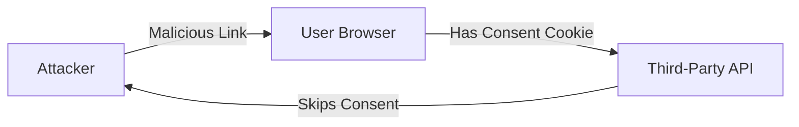
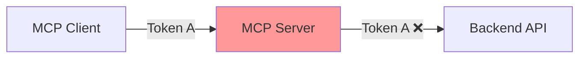
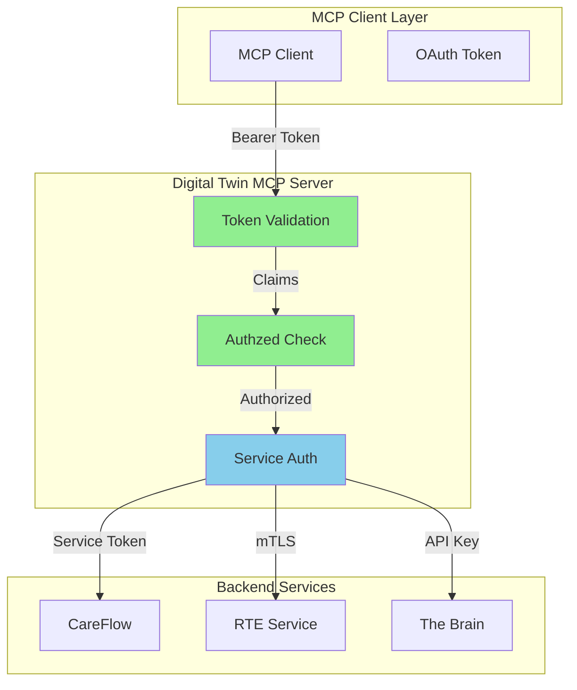

# MCP Security Best Practices for IH Digital Twin Implementation

## Executive Summary

This document maps the [MCP Security Best Practices](https://modelcontextprotocol.io/specification/2025-06-18/basic/security_best_practices) to IH's Digital Twin MCP implementation, showing how our architecture addresses each security concern and providing concrete implementation guidance.

---

## Critical Security Threats & IH Mitigations

### 1. Confused Deputy Problem

#### The Threat

When an MCP proxy server uses a **static client ID** to access third-party APIs, attackers can exploit consent cookies to gain unauthorized access:



#### IH's Mitigation Strategy

**Digital Twin MCP servers are NOT proxy servers** - they access IH's own backend services:

```yaml
# IH Architecture - No proxy pattern
digital_twin_mcp:
  type: resource_server  # NOT a proxy
  accesses:
    - careflow.includedhealth.com  # Internal service
    - rte.includedhealth.com       # Internal service
    - brain.includedhealth.com     # Internal service
  
  # Each backend service has separate auth
  service_auth:
    careflow: service-to-service JWT
    rte: mTLS + service token
    brain: internal API key
```

**Key Protection**: Digital Twin uses **service-to-service authentication** for backend calls, NOT client tokens:

```go
// CORRECT - IH Implementation
func (twin *MemberTwin) fetchCareFlowData(ctx context.Context, memberID string) {
    // Use service account, NOT client token
    serviceToken := twin.getServiceToken("careflow")
    
    req := &careflow.Request{
        MemberID: memberID,
    }
    req.SetAuth(serviceToken)  // Service-to-service auth
    
    // Client token NEVER sent to backend
}
```

### 2. Token Passthrough (Critical Anti-Pattern)

#### The Threat

Token passthrough is when an MCP server accepts client tokens and forwards them to downstream APIs without validation:



#### IH's Strict Token Isolation

**Rule**: Digital Twin servers **MUST NOT** pass client OAuth tokens to any backend service.

```go
// ❌ FORBIDDEN - Never do this
func (twin *MemberTwin) badExample(clientToken string) {
    // WRONG: Passing client token to backend
    careflowClient.SetHeader("Authorization", clientToken)
}

// ✅ REQUIRED - Token isolation
func (twin *MemberTwin) correctImplementation(ctx context.Context) {
    // 1. Validate client token (from MCP client)
    clientClaims := twin.validateClientToken(ctx)
    
    // 2. Check authorization with Authzed
    if !twin.authzed.Check(clientClaims.Subject, "read", "member:M123") {
        return ErrUnauthorized
    }
    
    // 3. Use SEPARATE service token for backend
    serviceToken := twin.auth.GetServiceToken("careflow")
    
    // 4. Call backend with service token
    response := careflowClient.Call(serviceToken, request)
}
```

**Token Validation Requirements**:

```go
func (twin *MemberTwin) validateClientToken(token string) error {
    claims, err := jwt.Parse(token)
    if err != nil {
        return ErrInvalidToken
    }
    
    // MUST validate audience
    if !contains(claims.Audience, "mcp://twins/member") {
        return ErrInvalidAudience  // Token not for this server
    }
    
    // MUST validate issuer
    if claims.Issuer != "https://authzilla.includedhealth.com" {
        return ErrInvalidIssuer
    }
    
    // MUST check expiration
    if time.Now().After(claims.ExpiresAt) {
        return ErrTokenExpired
    }
    
    return nil
}
```

### 3. Session Hijacking Attacks

#### The Threat

Two types of session hijacking can occur:
1. **Prompt Injection**: Attacker injects malicious events into session queue
2. **Impersonation**: Attacker uses stolen session ID to impersonate user

#### IH's Prevention Strategy

**No Session-Based Authentication** - Every request must include valid token:

```go
// ❌ VULNERABLE - Session-based auth
type VulnerableServer struct {
    sessions map[string]*Session  // Session ID → User
}

func (s *VulnerableServer) HandleRequest(sessionID string) {
    session := s.sessions[sessionID]  // No auth check!
    // Attacker with session ID can impersonate
}

// ✅ SECURE - Token-based auth on every request
type SecureDigitalTwin struct {
    // No session storage
}

func (s *SecureDigitalTwin) HandleRequest(ctx context.Context, token string) {
    // MUST validate token on EVERY request
    claims := s.validateToken(token)
    
    // Check with Authzed on EVERY request
    if !s.authzed.Check(claims.Subject, action, resource) {
        return ErrUnauthorized
    }
    
    // Process request
}
```

**WebSocket Security** - Bind connections to user identity:

```go
// WebSocket gateway implementation
type WebSocketConnection struct {
    ID       string     // Random UUID
    UserID   string     // From validated token
    Token    string     // Store for revalidation
    Expiry   time.Time  // Token expiration
}

func (ws *WebSocketGateway) HandleConnection(conn *websocket.Conn, token string) {
    // 1. Validate token
    claims := ws.validateToken(token)
    
    // 2. Create connection with user binding
    wsConn := &WebSocketConnection{
        ID:     uuid.New().String(),  // Cryptographically random
        UserID: claims.Subject,        // Bind to user
        Token:  token,
        Expiry: claims.ExpiresAt,
    }
    
    // 3. Store with user binding as key
    key := fmt.Sprintf("%s:%s", claims.Subject, wsConn.ID)
    ws.connections.Store(key, wsConn)
    
    // 4. Periodically revalidate
    go ws.revalidateConnection(wsConn)
}
```

---

## Additional Security Requirements

### 4. PKCE (Proof Key for Code Exchange)

**Required for all OAuth flows** per OAuth 2.1:

```typescript
// MCP client implementation
class MCPClient {
  private codeVerifier: string;
  
  async startAuth() {
    // Generate cryptographically random verifier
    this.codeVerifier = base64url(crypto.randomBytes(32));
    
    // Create challenge
    const challenge = base64url(sha256(this.codeVerifier));
    
    // Include in authorization request
    const authUrl = new URL(authEndpoint);
    authUrl.searchParams.set('code_challenge', challenge);
    authUrl.searchParams.set('code_challenge_method', 'S256');
    
    // ... rest of OAuth flow
  }
  
  async exchangeCode(code: string) {
    // Include verifier in token exchange
    const response = await fetch(tokenEndpoint, {
      method: 'POST',
      body: new URLSearchParams({
        code,
        code_verifier: this.codeVerifier,  // Proves we initiated flow
        // ...
      })
    });
  }
}
```

### 5. Resource Indicators (RFC 8707)

**Always specify target resource** in OAuth requests:

```http
POST /oauth/token HTTP/1.1
Host: authzilla.includedhealth.com
Content-Type: application/x-www-form-urlencoded

grant_type=authorization_code&
code=abc123&
resource=mcp://twins/member&  # REQUIRED - specify target
code_verifier=dBjftJeZ4CVP...
```

### 6. Secure Session ID Generation

If using sessions (e.g., for WebSocket connections):

```go
// ✅ SECURE - Cryptographically random
func generateSessionID() string {
    b := make([]byte, 32)
    if _, err := rand.Read(b); err != nil {
        panic(err)
    }
    return base64.URLEncoding.EncodeToString(b)
}

// ❌ INSECURE - Predictable
func badSessionID() string {
    return fmt.Sprintf("session_%d", time.Now().Unix())  // Predictable!
}
```

### 7. Authorization Header Validation

**Every request must be validated**:

```go
func (twin *MemberTwin) validateRequest(r *http.Request) error {
    // 1. Extract token
    auth := r.Header.Get("Authorization")
    if !strings.HasPrefix(auth, "Bearer ") {
        return ErrMissingAuth
    }
    token := strings.TrimPrefix(auth, "Bearer ")
    
    // 2. Validate token
    if err := twin.validateToken(token); err != nil {
        return err
    }
    
    // 3. Check rate limits
    if err := twin.rateLimiter.Check(token); err != nil {
        return ErrRateLimited
    }
    
    // 4. Log for audit
    twin.auditLog.Log(AuditEntry{
        Token:     hashToken(token),
        Resource:  r.URL.Path,
        Action:    r.Method,
        Timestamp: time.Now(),
    })
    
    return nil
}
```

---

## Implementation Checklist

### Phase 1: Core Security (MUST have before launch)

- [ ] **No Token Passthrough**
  - [ ] Client tokens validated but never forwarded
  - [ ] Service-to-service auth for backend calls
  - [ ] Audience validation on every token

- [ ] **No Session-Based Auth**
  - [ ] Tokens required on every request
  - [ ] No persistent session state for auth
  - [ ] WebSocket connections bound to user identity

- [ ] **PKCE Implementation**
  - [ ] Code verifier generation (32+ bytes)
  - [ ] SHA256 challenge method
  - [ ] Verifier validation in token exchange

### Phase 2: Defense in Depth

- [ ] **Rate Limiting**
  - [ ] Per-user rate limits
  - [ ] Per-token rate limits
  - [ ] Backoff for failed auth attempts

- [ ] **Audit Logging**
  - [ ] Log all authorization decisions
  - [ ] Track denied access attempts
  - [ ] HIPAA-compliant retention

- [ ] **Token Rotation**
  - [ ] Short-lived access tokens (1 hour)
  - [ ] Refresh token rotation
  - [ ] Revocation support

### Phase 3: Advanced Security

- [ ] **Mutual TLS** for service-to-service
- [ ] **Zero Trust networking** between services
- [ ] **Intrusion detection** for anomalous patterns
- [ ] **Security scanning** of all MCP endpoints

---

## Security Architecture Summary



**Key Security Properties**:

1. ✅ **Token Isolation**: Client tokens never reach backend services
2. ✅ **No Proxy Pattern**: Digital Twin is a resource server, not a proxy
3. ✅ **Relationship-Based Access**: Authzed validates every request
4. ✅ **Audit Trail**: All access logged for compliance
5. ✅ **Defense in Depth**: Multiple security layers

---

## Incident Response Plan

### If Token Compromise Suspected

1. **Immediate**: Revoke affected tokens via Authzilla
2. **Within 1 hour**: Audit logs to determine scope
3. **Within 4 hours**: Rotate service credentials if needed
4. **Within 24 hours**: Incident report with remediation

### If Confused Deputy Attack Detected

1. **Verify**: Digital Twin doesn't proxy to external APIs (it doesn't)
2. **Check**: All backend calls use service auth (not client tokens)
3. **Audit**: Review token validation logic
4. **Report**: Document as security incident

### If Session Hijacking Attempted

1. **Confirm**: No session-based auth exists (tokens required)
2. **Review**: WebSocket connection binding to user
3. **Monitor**: Rate limiting and anomaly detection
4. **Strengthen**: Add additional request validation

---

## References

- [MCP Security Best Practices](https://modelcontextprotocol.io/specification/2025-06-18/basic/security_best_practices)
- [MCP Authorization Specification](https://modelcontextprotocol.io/specification/2025-06-18/basic/authorization)
- [OAuth 2.1 Security BCP](https://datatracker.ietf.org/doc/html/rfc9700)
- [RFC 8707 - Resource Indicators](https://www.rfc-editor.org/rfc/rfc8707.html)
- [OWASP Session Management](https://cheatsheetseries.owasp.org/cheatsheets/Session_Management_Cheat_Sheet.html)
