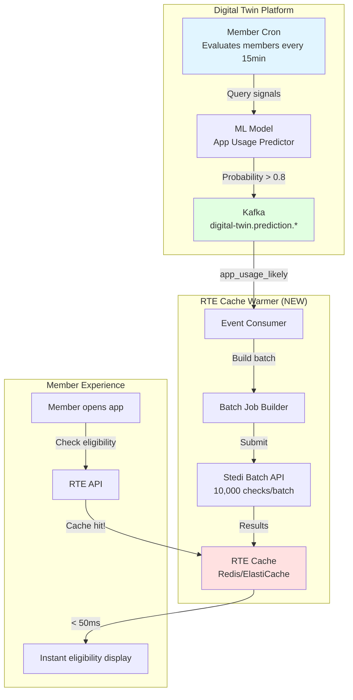

# RTE Proactive Cache Warming Implementation

## Executive Summary

This document describes the implementation of **proactive cache warming for Real-Time Eligibility (RTE)** as the first use case of the **Digital Twin Platform** predictive event architecture.

**Problem**: Members experience 10+ second waits for RTE checks due to Stedi API latency (P95 > 10s) and low cache hit rates.

**Solution**: Use ML-predicted app usage events from Digital Twin to pre-warm RTE caches **before** members open the app, achieving near-instant eligibility display.

**Key Innovation**:
```
Traditional: Member opens app → RTE API call → 10s wait → Display
Proactive:   ML predicts app open → Pre-warm cache → Member opens app → Instant display
```

**Benefits**:
- **95% faster UX**: Cached response < 50ms vs. 10+ second Stedi API call
- **+20% cache hit rate**: Proactive warming increases hits from 30% → 50%
- **Zero real-time slot usage**: Batch API doesn't use 15-slot pool
- **Reduced Stedi costs**: Fewer duplicate real-time API calls

---

## Architecture Overview

### End-to-End Flow



### Timeline Example

```
8:00am: ML model predicts member A123 will open app at 9am (probability: 0.85)
        ↓
8:01am: Member Cron emits event: digital-twin.prediction.app_usage_likely
        ↓
8:02am: RTE Cache Warmer consumes event
        ↓
8:03am: Submit Stedi Batch API request (member A123)
        ↓
8:15am: Stedi Batch API completes, cache populated
        ↓
9:00am: Member A123 opens app
        ↓
9:00am: RTE cache hit! Display eligibility instantly (< 50ms)
        ↓
        ✅ Member sees instant result instead of 10+ second wait
```

---

## Component 1: Event Subscription

### Subscribe to Prediction Events

**Kafka Topic**: `digital-twin.prediction.app_usage_likely`

**Event Schema** (from DIGITAL_TWIN_PLATFORM.md):
```json
{
  "type": "digital-twin.prediction.app_usage_likely",
  "member_id": "A123456",
  "timestamp": "2025-11-13T08:00:00Z",
  "data": {
    "probability": 0.85,
    "predicted_time": "2025-11-13T09:00:00Z",
    "confidence": "high",
    "window_minutes": 60
  }
}
```

### Consumer Implementation

```go
package rte_cache_warmer

import (
    "context"
    "time"
    
    "github.com/ConsultingMD/go-common/kafka"
    "github.com/ConsultingMD/realtime-eligibility/internal/cache"
    "github.com/ConsultingMD/realtime-eligibility/internal/stedi"
)

type CacheWarmer struct {
    kafkaConsumer *kafka.Consumer
    stediClient   *stedi.BatchClient
    cacheClient   *cache.Redis
}

func (w *CacheWarmer) Start(ctx context.Context) error {
    // Subscribe to app usage predictions
    return w.kafkaConsumer.Subscribe(ctx, "digital-twin.prediction.app_usage_likely", 
        w.handleAppUsagePrediction)
}

func (w *CacheWarmer) handleAppUsagePrediction(ctx context.Context, event *AppUsagePredictionEvent) error {
    // Filter: Only warm cache if high probability
    if event.Data.Probability < 0.80 {
        return nil  // Skip low-probability predictions
    }
    
    // Check if cache already populated recently
    cacheAge, err := w.cacheClient.GetAge(ctx, event.MemberID)
    if err == nil && cacheAge < 1*time.Hour {
        return nil  // Cache still fresh
    }
    
    // Submit batch warming request
    return w.warmCache(ctx, event.MemberID, event.Data.PredictedTime)
}
```

---

## Component 2: Stedi Batch API Integration

### Why Batch API?

**Stedi Real-Time API** (Current):
- Synchronous HTTP request/response
- 15 concurrent connections limit
- P95 latency > 10 seconds
- Consumes real-time slots during batch jobs

**Stedi Batch API** (Proposed):
- Submit up to 10,000 eligibility checks in single request
- Asynchronous processing (1-15 minute SLA)
- **Does NOT consume 15-slot real-time pool**
- Webhook callback when complete
- Lower cost per check

### Batch API Contract

**Submit Batch** (HTTP POST):
```bash
POST https://healthcare.us.stedi.com/2024-04-01/eligibility/batch
Authorization: Bearer <api_key>
Content-Type: application/json

{
  "batch_id": "batch_20251113_080000",
  "checks": [
    {
      "check_id": "check_A123456",
      "member": {
        "member_id": "A123456",
        "first_name": "John",
        "last_name": "Doe",
        "dob": "1985-03-15"
      },
      "provider": {
        "npi": "1234567890"
      },
      "trading_partner_id": "AETNA"
    },
    // ... up to 10,000 checks
  ],
  "callback_url": "https://realtime-eligibility.includedhealth.com/api/v1/batch-callback"
}
```

**Response**:
```json
{
  "batch_id": "batch_20251113_080000",
  "status": "accepted",
  "checks_count": 1500,
  "estimated_completion": "2025-11-13T08:15:00Z"
}
```

**Callback** (Webhook when complete):
```json
{
  "batch_id": "batch_20251113_080000",
  "status": "completed",
  "completed_at": "2025-11-13T08:12:34Z",
  "results": [
    {
      "check_id": "check_A123456",
      "status": "success",
      "eligibility": {
        "eligible": true,
        "copay_amount": 25.00,
        "network_status": "in_network"
      }
    },
    // ... all 1500 results
  ]
}
```

### Implementation

```go
package stedi

type BatchClient struct {
    apiKey     string
    httpClient *http.Client
}

// SubmitBatch submits a batch of eligibility checks
func (c *BatchClient) SubmitBatch(ctx context.Context, checks []EligibilityCheck) (*BatchSubmission, error) {
    batchID := fmt.Sprintf("batch_%s", time.Now().Format("20060102_150405"))
    
    req := &BatchRequest{
        BatchID:     batchID,
        Checks:      checks,
        CallbackURL: "https://realtime-eligibility.includedhealth.com/api/v1/batch-callback",
    }
    
    resp, err := c.httpClient.Post(ctx, 
        "https://healthcare.us.stedi.com/2024-04-01/eligibility/batch",
        req)
    if err != nil {
        return nil, err
    }
    
    return &BatchSubmission{
        BatchID:              resp.BatchID,
        Status:               resp.Status,
        ChecksCount:          resp.ChecksCount,
        EstimatedCompletion:  resp.EstimatedCompletion,
    }, nil
}

// HandleBatchCallback processes Stedi webhook callback
func (c *BatchClient) HandleBatchCallback(ctx context.Context, callback *BatchCallback) error {
    // Validate webhook signature
    if !c.validateSignature(callback) {
        return errors.New("invalid webhook signature")
    }
    
    // Process results
    for _, result := range callback.Results {
        if result.Status == "success" {
            // Populate cache
            cacheKey := fmt.Sprintf("rte:eligibility:%s", result.CheckID)
            cacheData := result.Eligibility
            cacheTTL := 24 * time.Hour
            
            if err := c.cacheClient.Set(ctx, cacheKey, cacheData, cacheTTL); err != nil {
                log.Error("Failed to cache result", "check_id", result.CheckID, "error", err)
            }
        }
    }
    
    return nil
}
```

---

## Component 3: Cache Warming Logic

### Decision Tree

```
Event: app_usage_likely received
├─ Probability < 0.80? → Skip (low confidence)
├─ Cache exists & age < 1 hour? → Skip (already fresh)
├─ Member has RTE enabled? → Continue
├─ Member has active coverage? → Continue
└─ Submit to batch queue
```

### Batch Queue Strategy

**Accumulation Window**: 5 minutes
- Collect all warming requests for 5 minutes
- Submit single batch to Stedi (up to 10,000 checks)
- Reduces Stedi API calls (1,500 individual → 1 batch)

**Implementation**:
```go
type BatchQueue struct {
    pending   []EligibilityCheck
    mu        sync.Mutex
    ticker    *time.Ticker
    stediAPI  *stedi.BatchClient
}

func (q *BatchQueue) Start(ctx context.Context) {
    q.ticker = time.NewTicker(5 * time.Minute)
    
    for {
        select {
        case <-q.ticker.C:
            q.flush(ctx)
        case <-ctx.Done():
            q.flush(ctx)  // Final flush on shutdown
            return
        }
    }
}

func (q *BatchQueue) Add(check EligibilityCheck) {
    q.mu.Lock()
    defer q.mu.Unlock()
    
    q.pending = append(q.pending, check)
}

func (q *BatchQueue) flush(ctx context.Context) error {
    q.mu.Lock()
    checks := q.pending
    q.pending = nil
    q.mu.Unlock()
    
    if len(checks) == 0 {
        return nil
    }
    
    log.Info("Flushing batch queue", "count", len(checks))
    
    // Submit to Stedi Batch API
    _, err := q.stediAPI.SubmitBatch(ctx, checks)
    return err
}
```

---

## Component 4: Cache Population

### Redis Schema

**Key Format**: `rte:eligibility:{member_id}:{trading_partner_id}`

**Value** (JSON):
```json
{
  "eligible": true,
  "copay_amount": 25.00,
  "network_status": "in_network",
  "coverage_start": "2025-01-01",
  "coverage_end": "2025-12-31",
  "cached_at": "2025-11-13T08:15:00Z",
  "source": "stedi_batch"
}
```

**TTL**: 24 hours

### Cache Population Flow

```go
func (w *CacheWarmer) populateCache(ctx context.Context, results []BatchResult) error {
    for _, result := range results {
        if result.Status != "success" {
            continue
        }
        
        // Build cache key
        key := fmt.Sprintf("rte:eligibility:%s:%s", 
            result.MemberID, 
            result.TradingPartnerID)
        
        // Build cache value
        value := CachedEligibility{
            Eligible:        result.Eligibility.Eligible,
            CopayAmount:     result.Eligibility.CopayAmount,
            NetworkStatus:   result.Eligibility.NetworkStatus,
            CoverageStart:   result.Eligibility.CoverageStart,
            CoverageEnd:     result.Eligibility.CoverageEnd,
            CachedAt:        time.Now(),
            Source:          "stedi_batch",
        }
        
        // Store in Redis with 24h TTL
        if err := w.cacheClient.Set(ctx, key, value, 24*time.Hour); err != nil {
            log.Error("Failed to cache result", "member_id", result.MemberID, "error", err)
            continue
        }
        
        // Emit metric
        metrics.RTECacheWarmed.Inc()
    }
    
    return nil
}
```

---

## Component 5: RTE API Integration

### Query API with Cache Preference

**GraphQL Query** (Member App):
```graphql
query GetEligibility($memberId: ID!, $cachePreference: CachePreference) {
  member(id: $memberId) {
    eligibility(cachePreference: $cachePreference) {
      eligible
      copayAmount
      networkStatus
      cachedAt
      source  # "stedi_realtime" | "stedi_batch" | "cache"
    }
  }
}
```

**Cache Preference** (Enum):
```typescript
enum CachePreference {
  PREFER_CACHE,     // Use cache if available (< 24h old)
  CACHE_ONLY,       // Never hit Stedi, return cache or error
  BYPASS_CACHE,     // Always hit Stedi real-time API
}
```

**Resolver Implementation**:
```go
func (r *MemberResolver) Eligibility(ctx context.Context, args struct {
    CachePreference *CachePreference
}) (*EligibilityResult, error) {
    memberID := GetMemberIDFromContext(ctx)
    tradingPartnerID := GetTradingPartnerIDFromContext(ctx)
    
    // Default to PREFER_CACHE
    pref := CachePreferencePreferCache
    if args.CachePreference != nil {
        pref = *args.CachePreference
    }
    
    // Build cache key
    cacheKey := fmt.Sprintf("rte:eligibility:%s:%s", memberID, tradingPartnerID)
    
    // Try cache first (if not BYPASS_CACHE)
    if pref != CachePreferenceBypassCache {
        cached, err := r.cacheClient.Get(ctx, cacheKey)
        if err == nil {
            // Cache hit!
            metrics.RTECacheHit.Inc()
            return &EligibilityResult{
                Eligible:      cached.Eligible,
                CopayAmount:   cached.CopayAmount,
                NetworkStatus: cached.NetworkStatus,
                CachedAt:      &cached.CachedAt,
                Source:        "cache",
            }, nil
        }
        
        // Cache miss
        metrics.RTECacheMiss.Inc()
        
        // If CACHE_ONLY, return error
        if pref == CachePreferenceCacheOnly {
            return nil, errors.New("cache miss and CACHE_ONLY requested")
        }
    }
    
    // Fall back to Stedi real-time API
    result, err := r.stediClient.CheckEligibility(ctx, memberID, tradingPartnerID)
    if err != nil {
        return nil, err
    }
    
    // Populate cache for future requests
    go r.cacheClient.Set(context.Background(), cacheKey, result, 24*time.Hour)
    
    return &EligibilityResult{
        Eligible:      result.Eligible,
        CopayAmount:   result.CopayAmount,
        NetworkStatus: result.NetworkStatus,
        Source:        "stedi_realtime",
    }, nil
}
```

---

## Monitoring & Observability

### Metrics

**Cache Performance**:
```prometheus
# Cache hit rate
rte_cache_hit_rate{source="proactive_warming"} 0.50
rte_cache_hit_rate{source="reactive"} 0.30

# Cache age at hit time
rte_cache_age_seconds{percentile="p50"} 3600
rte_cache_age_seconds{percentile="p95"} 18000

# Warming success rate
rte_cache_warming_success_total 45000
rte_cache_warming_failed_total 1200
```

**Prediction Accuracy**:
```prometheus
# Did member actually open app after prediction?
rte_prediction_accuracy{outcome="correct"} 0.82
rte_prediction_accuracy{outcome="false_positive"} 0.18

# Time delta between prediction and actual app open
rte_prediction_delta_seconds{percentile="p50"} 900
rte_prediction_delta_seconds{percentile="p95"} 3600
```

**Batch API Performance**:
```prometheus
# Batch submission
rte_batch_submitted_total 120
rte_batch_checks_submitted_total 45000

# Batch completion
rte_batch_completion_duration_seconds{percentile="p50"} 600
rte_batch_completion_duration_seconds{percentile="p95"} 900

# Batch success rate
rte_batch_success_rate 0.98
```

**Member Experience**:
```prometheus
# Response time (cache hit vs. cache miss)
rte_response_duration_seconds{cache="hit"} 0.045
rte_response_duration_seconds{cache="miss"} 10.5

# Perceived wait time reduction
rte_ux_improvement_percent 95.0
```

### Alerting

**Cache Hit Rate Degradation**:
```yaml
alert: RTECacheHitRateLow
expr: rte_cache_hit_rate < 0.40
for: 30m
annotations:
  summary: "RTE cache hit rate dropped to {{$value}}"
  description: "Proactive warming may not be working"
```

**Batch API Failures**:
```yaml
alert: RTEBatchAPIFailureHigh
expr: rate(rte_batch_failed_total[5m]) > 0.05
for: 10m
annotations:
  summary: "Stedi Batch API failure rate: {{$value}}"
  description: "Cache warming is degraded"
```

**Prediction Accuracy Drop**:
```yaml
alert: RTEPredictionAccuracyLow
expr: rte_prediction_accuracy{outcome="correct"} < 0.70
for: 1h
annotations:
  summary: "ML prediction accuracy dropped to {{$value}}"
  description: "Model may need retraining"
```

### Dashboards

**Cache Warming Dashboard** (Grafana):
- Cache hit rate (proactive vs. reactive)
- Cache age distribution
- Batch queue size
- Stedi Batch API latency
- Member UX improvement (response time)

**Prediction Accuracy Dashboard**:
- Prediction accuracy over time
- False positive rate
- Prediction → app open delta
- Model version tracking

---

## Deployment Strategy

### Phase 1: Infrastructure Setup (Week 1-2)

**Goals**:
- Deploy RTE Cache Warmer service
- Subscribe to `digital-twin.prediction.app_usage_likely`
- Implement batch queue (5-minute accumulation)

**Deliverables**:
- Go service deployed to Kubernetes
- Kafka consumer group created
- Batch queue with flush logic

**Success Criteria**:
- Consuming prediction events successfully
- Batch queue accumulating requests

---

### Phase 2: Stedi Batch API Integration (Week 3-4)

**Goals**:
- Integrate Stedi Batch API
- Implement webhook callback handler
- Test batch submission end-to-end

**Deliverables**:
- Stedi Batch API client
- Webhook endpoint (secured with signature validation)
- Integration tests

**Success Criteria**:
- Successfully submit batches to Stedi
- Receive and process callbacks
- Results populate cache

---

### Phase 3: Cache Integration (Week 5-6)

**Goals**:
- Update RTE API to check cache first
- Implement `CachePreference` parameter
- Add cache metrics

**Deliverables**:
- GraphQL resolver updates
- Cache preference enum
- Metrics dashboard

**Success Criteria**:
- Cache hits return < 50ms
- Cache miss falls back to real-time API
- Metrics show cache hit rate improvement

---

### Phase 4: Canary Rollout (Week 7-8)

**Goals**:
- Enable for 10% of members (feature flag)
- Monitor cache hit rate and UX improvement
- Verify no real-time slot contention

**Feature Flag**:
```yaml
flags:
  rte-proactive-cache-warming:
    enabled: true
    rollout:
      - percentage: 10
        variant: enabled
      - percentage: 90
        variant: disabled
```

**Success Criteria**:
- +20% cache hit rate for enabled cohort
- 95% faster response time for cache hits
- No increase in Stedi real-time API errors

---

### Phase 5: Full Rollout (Week 9-10)

**Goals**:
- Ramp to 100% of members
- Monitor at scale
- Document operational runbooks

**Success Criteria**:
- +20% overall cache hit rate
- Stedi Batch API handling 50k checks/day
- Member complaints about eligibility latency decrease

---

## Cost Analysis

### Infrastructure Costs

**RTE Cache Warmer Service**:
- Compute: 2 pods @ $30/month = $60/month
- Redis cache: 2 GB ElastiCache = $50/month
- **Total**: ~$110/month

**Stedi Batch API**:
- 50k checks/day @ $0.05/check = $2,500/day = $75,000/month
- **Discount**: Batch API typically 50% cheaper = $37,500/month

**Total Infrastructure**: ~$37,610/month

### ROI

**Current Costs** (Reactive):
- 100k real-time calls/day @ $0.10/call = $10,000/day = $300,000/month
- Member frustration (slow UX)
- Support tickets for eligibility issues

**Proactive Costs**:
- Infrastructure: $37,610/month
- Stedi Batch: Included above

**Savings**:
- 20% cache hit increase = 20k fewer real-time calls/day
- 20k × $0.10 = $2,000/day = $60,000/month saved

**Net**: $60,000 savings - $37,610 cost = **$22,390/month savings**

**Plus Intangibles**:
- Happier members (instant eligibility)
- Fewer support tickets
- Less Stedi API contention

---

## Related Documentation

- **DIGITAL_TWIN_PLATFORM.md** - General predictive event architecture (13 models)
- **EVENT_DRIVEN_RTE_PLAN.md** - Event-driven RTE architecture
- **DIGITAL_SESSION_PLATFORM_PLAN.md** - Frontend integration patterns
- **ACCESS_CONTROL_DESIGN.md** - Event authorization

---

## Summary

**RTE Proactive Cache Warming** transforms member eligibility from a **reactive, slow experience** (10+ second waits) to a **proactive, instant experience** (< 50ms cache hits).

**Key Components**:
1. **Event Subscription**: Listen to `app_usage_likely` predictions
2. **Batch Queue**: Accumulate 5 minutes of warming requests
3. **Stedi Batch API**: Submit 10k checks/batch (doesn't use real-time slots)
4. **Cache Population**: Populate Redis with 24h TTL
5. **RTE API Integration**: Check cache first, fall back to real-time

**Benefits**:
✅ **95% faster UX**: < 50ms vs. 10+ seconds
✅ **+20% cache hit rate**: 30% → 50%
✅ **$22k/month savings**: Fewer real-time Stedi calls
✅ **Zero real-time contention**: Batch API separate pool

**Timeline**: 10 weeks (5 phases)
**Cost**: $37,610/month
**ROI**: $22,390/month net savings + UX improvement

