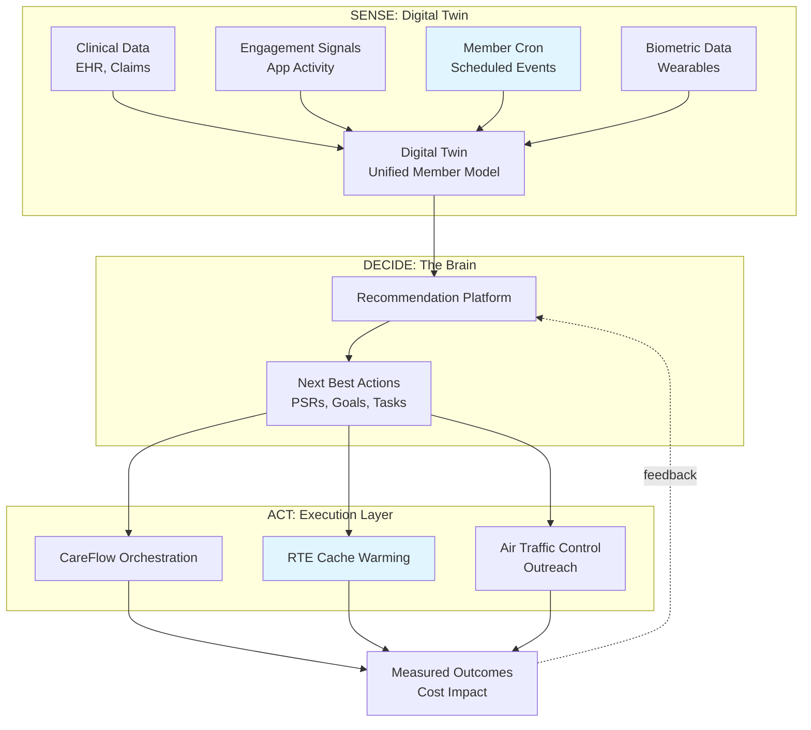
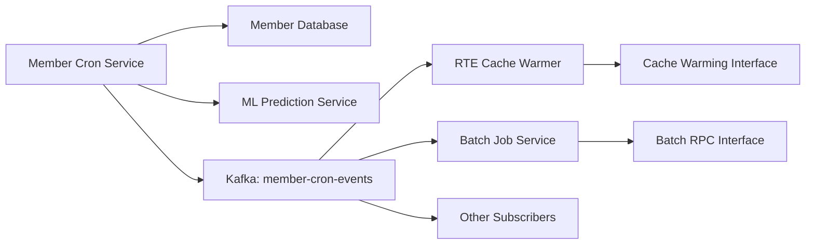
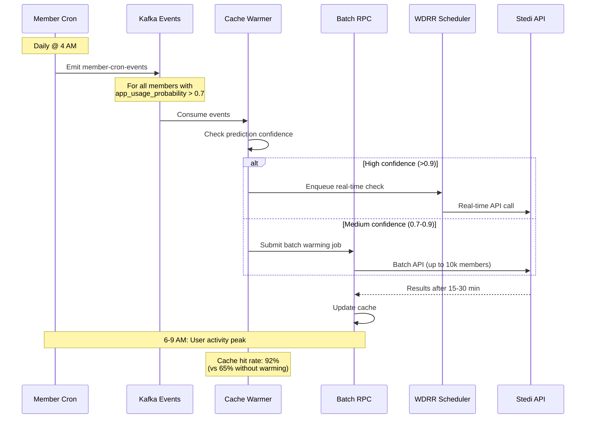

# Proactive Cache Warming and Batch Processing System

## Overview

This document describes a comprehensive system for proactively warming RTE caches and optimizing batch eligibility checks. The system consists of four integrated components that align with the broader **Digital Twin** architecture—the company's strategic initiative to create a real-time, unified member model as the "sense" layer of a closed-loop "sense–decide–act" platform.

1. **Member Cron** - Scheduled event emitter for member-based triggers
2. **Cache Control Parameter** - Explicit cache behavior control in GraphQL/RPC APIs
3. **Batch RPC Interface** - Durable batch job submission with optimal cache management
4. **Cache Warming Interface** - Proactive cache population for predicted member activity

### Relationship to Digital Twin Architecture

The **Member Cron** serves as a foundational infrastructure component of the **Digital Twin**—IncludedHealth's strategic vision for a cloud-based, comprehensive representation of each member. The Digital Twin is designed as an event-driven system that synthesizes clinical data (EHR, claims), engagement signals (app activity, messaging), member-reported data (questionnaires, symptoms), and biometric data (wearables, Apple Health) into a unified, queryable member model.

**Key architectural alignment:**

- **Member Cron → Event Stream**: The Member Cron emits scheduled, predictive events into the Digital Twin's event stream architecture, enabling downstream systems to react to predicted member states and temporal patterns
- **Digital Twin → The Brain → Actions**: Events from Member Cron flow into "The Brain" (recommendation platform) which generates "Next Best Actions" that are executed through CareFlow and other operational systems
- **RTE as a Domain Service**: The RTE cache warming system exemplifies how domain services consume Digital Twin events to proactively prepare for predicted member needs, demonstrating the broader pattern for other services

This design establishes a pattern that other domain services can follow: consume predictive member events, prepare resources ahead of time, and improve member experience through proactive rather than reactive operations.

## Motivation

### Current Problems

- **Reactive caching**: Caches are only populated on-demand, leading to cache misses during user interactions
- **Batch job inefficiency**: Services make sequential RTE calls without coordination (1,000 members × 13.5s = 3.75 hours)
- **15-slot congestion**: Real-time user requests compete with batch jobs for limited Stedi concurrency
- **Predictable patterns**: Daily app usage patterns are predictable but not leveraged for cache warming
- **No cache control**: Clients cannot explicitly request cached data when staleness is acceptable

### Solution Benefits

- **Proactive cache warming**: Pre-populate caches before predicted user activity
- **Optimal batch processing**: Use Stedi Batch API (10,000 checks/batch) for non-time-sensitive work
- **Separation of concerns**: Move batch work off real-time 15-slot pool
- **Explicit cache control**: Allow clients to opt into cached data for acceptable use cases
- **Event-driven coordination**: Centralized member event emission for all subscribers

---

## Component 1: Member Cron

### Purpose

A scheduled service that emits events for members at configurable intervals, enabling downstream services to perform batch operations or cache warming without building their own scheduling infrastructure.

### Role in Digital Twin Architecture

The Member Cron is a **temporal event generator** within the Digital Twin's event stream architecture. While most Digital Twin events are reactive (triggered by member actions like "opened app" or "completed questionnaire"), the Member Cron provides **proactive, scheduled events** that enable anticipatory workflows.

**Position in the Sense-Decide-Act Flywheel:**



**Why Member Cron is Critical for Digital Twin:**

1. **Temporal Context**: Adds time-based patterns to the member model (e.g., "member historically uses app Monday mornings")
2. **Predictive Signals**: Enriches events with ML-predicted activity likelihood, enabling proactive resource allocation
3. **Coordinated Action**: Prevents "scheduler sprawl" where every service builds its own cron infrastructure
4. **Event-Driven Decoupling**: Services subscribe to member events rather than polling databases, following Digital Twin's event stream architecture

The Member Cron essentially asks: *"What do we predict will happen with this member today/this week?"* and emits that prediction as an event, allowing downstream systems (RTE, Care Teams, The Brain) to prepare accordingly.

### Event Schedule Syntax

Uses standard cron syntax with common shortcuts:

- `@daily` - Once per day at midnight (00:00 UTC)
- `@weekly` - Once per week on Sunday at midnight
- `@monthly` - Once per month on the 1st at midnight
- Custom: `0 2 * * *` - Every day at 2:00 AM UTC

### Event Schema

```protobuf
message MemberCronEvent {
  // Member identifier
  string member_id = 1;
  string account_id = 2;
  
  // Schedule metadata
  string schedule_name = 3;  // e.g., "daily-rte-warmup"
  string cron_expression = 4;
  google.protobuf.Timestamp emitted_at = 5;
  
  // Member context (for filtering/routing)
  MemberContext context = 6;
}

message MemberContext {
  // Sponsorship information
  string sponsor_id = 1;
  repeated string population_ids = 2;
  
  // Feature flags (snapshot at emit time)
  map<string, bool> feature_flags = 3;
  
  // Eligibility metadata
  bool has_rte_enabled = 4;
  google.protobuf.Timestamp last_eligibility_check = 5;
  
  // Activity prediction
  ActivityPrediction predicted_activity = 6;
}

message ActivityPrediction {
  // Probability member will use app in next 24h (0.0-1.0)
  float app_usage_probability = 1;
  
  // Predicted RTE operations
  repeated string predicted_operations = 2;  // e.g., ["check_eligibility", "get_coverage"]
  
  // Confidence score (0.0-1.0)
  float confidence = 3;
  
  // Model version used for prediction
  string model_version = 4;
}
```

### Event Delivery

**Kafka Topic**: `member-cron-events`

**Partitioning**: By `member_id` hash to ensure ordering per member

**Consumer Groups**: Each subscriber service creates its own consumer group

### Digital Twin Event Stream Integration

The Member Cron events are part of the broader Digital Twin event stream ecosystem. While the immediate focus is RTE cache warming, the architecture is designed to support multiple consumers following the Digital Twin's event-driven pattern.

**Current and Future Event Consumers:**

| Consumer Service | Use Case | Digital Twin Component |
|-----------------|----------|----------------------|
| **RTE Cache Warmer** | Pre-warm eligibility caches before predicted app usage | RTE domain service (this doc) |
| **The Brain** | Trigger recommendation generation for high-probability members | Recommendation Platform |
| **Air Traffic Control** | Schedule proactive outreach (SMS, push, email) for engagement | Outreach orchestration |
| **Care Teams** | Surface members needing follow-up in practitioner dashboards | Clinical Copilot |
| **Careflow** | Trigger scheduled care plan actions (e.g., "3-month A1C recheck") | Care orchestration |
| **Analytics** | Track prediction accuracy and member behavior patterns | Measurement & learning loop |

**Event Stream Architecture Benefits:**

1. **Loose Coupling**: Services don't depend on each other; they react to events independently
2. **Extensibility**: New services can subscribe to existing events without modifying producers
3. **Replay & Recovery**: Event log enables debugging, analytics, and disaster recovery
4. **Temporal Queries**: "What did we predict about member X on day Y?" becomes answerable

This pattern exemplifies the Digital Twin's core principle: **prevent every service from reinventing data access and scheduling**. Instead of each service building its own "daily member batch job," they all consume standardized member-cron-events enriched with Digital Twin context.

### Survey of Current Member Lifecycle Events

Before implementing the Member Cron's predictive event system, it's important to understand what lifecycle events already exist and what gaps need to be filled for comprehensive member state tracking.

#### Existing Events (Categorized)

**Authentication & Identity** (`domain.authentication.v1`)
- ✅ `SIGNIN` - Member explicit authentication (username/password, SSO)
- ✅ `SESSION_REFRESH` - Member extended active session (includes biometric auth)
- ✅ `LOGOUT` - Explicit logout (not session expiration)
- ✅ `LINK_ACCOUNT` / `UNLINK_ACCOUNT` - Identity association with IH account
- ✅ `LINK_SSO_IDENTITY` / `UNLINK_SSO_IDENTITY` - External SSO identity management
- ✅ `PASSWORD_RESET_REQUEST` / `PASSWORD_RESET` - Password management
- ✅ `OUTBOUND_SSO` - Member logged into external service

**Account Lifecycle** (`domain.accounts`)
- ✅ `SignupEvent` - Account creation/claiming flow (STARTED, SUCCEEDED, ACCOUNT_ALREADY_EXISTS)
- ✅ `AccountChangeEvent` - Account updates (created, updated, deleted with field masks)
- ✅ `AccountCreateAttemptEvent` - Account creation attempts

**Enrollment & Coverage** (`domain.coverage.enrollment`)
- ✅ `MemberEnrollmentEvent` - Enrollment flow (started, succeeded, attempt)
  - Tracks enrollment source (FLEX_REG, DOD_MIGRATION, ADD_DEPENDENT, UPDATE_COVERAGE, INTAKE, HOMEPAGE_NUDGE)
  - Includes downtime indicators
- ✅ `AccountEnrollmentEvent` - Account enrollment completion (succeeded, failed)
- ✅ `CoverageChangeEvent` - Coverage verification/enrollment completion
  - Tracks method (VERIFY_COVERAGE, ENROLL_ACCOUNT, ENROLL_ACCOUNT_WITH_PDID)
  - Includes verification field values and failure reasons
- ✅ `MemberSponsorshipChangeEvent` - Sponsorship changes (new enrollment, update, etc.)

**Engagement & Activity** (`domain.member_experience.engagement`)
- ✅ `EngagementEvent` - User engagement tracking
  - `HomePageView` - Homepage loads
  - `Notification` - Notification interactions

**Appointments & Scheduling** (`domain.scheduling.appointment`)
- ✅ `AppointmentEvent` - Appointment state changes (booked, cancelled)
- ✅ `TaskScheduled` / `TaskUnscheduled` - CareFlow task scheduling
- ✅ `AvailabilityQueryEvent` - Provider availability queries

**Care & Clinical** (`domain.longitudinal_care`)
- ✅ `ProgramEnrollmentEvent` - Program enrollment changes (CCM, BH programs, etc.)
- ✅ `MemberCareGapChangeEvent` - Care gap opened/closed/deleted

**Diagnostics & Labs** (`domain.diagnostics.labs`)
- ✅ `MemberPreferredLabSavedEvent` - Member saves preferred lab

**Recommendations** (`domain.ml.recommendations`)
- ✅ `RecommendationEvent` - Recommendation request/response pairs

**Payments** (`domain.payments`)
- ✅ `PaymentEvent` - Payment-related events
- ✅ `PaymentActionEvent` - Payment action tracking

**Communications** (`domain.communications`)
- ✅ `BadgeUpdateEvent` - App badge counter updates

**Bridge Events** (External system integrations)
- ✅ `Auth0LoginSuccessEvent` - Auth0 authentication
- ✅ `AthenaClaimChangedEvent` - Athena claim changes
- ✅ `PatientCreateAttemptEvent` - Athena patient creation
- ✅ `HubChangeEvent` - Hub (Salesforce) changes

#### Critical Missing Events for Member Cron Prediction

**❌ Session Activity Events**
- **Missing**: `AppSessionStarted` / `AppSessionEnded` - Track app open/close
- **Missing**: `AppBackgrounded` / `AppForegrounded` - Mobile app lifecycle
- **Missing**: `PageNavigation` - Which pages/screens member visits
- **Missing**: `FeatureUsed` - Specific feature interactions (search, filters, etc.)
- **Impact**: Cannot predict daily/weekly app usage patterns or time-of-day preferences

**❌ Message & Communication Events**
- **Missing**: `MessageSent` / `MessageReceived` - Chat/secure messaging activity
- **Missing**: `PushNotificationOpened` - Member engaged with push notification
- **Missing**: `EmailOpened` / `EmailClicked` - Email engagement
- **Missing**: `SMSReceived` / `SMSReplied` - SMS engagement
- **Impact**: Cannot predict communication preferences or engagement timing

**❌ Search & Discovery Events**
- **Missing**: `SearchPerformed` - Member search queries
- **Missing**: `ProviderSearched` - Provider directory searches
- **Missing**: `ServiceDiscovered` - Service browsing behavior
- **Impact**: Cannot predict member intent or service interest

**❌ Questionnaire & Survey Events**
- **Missing**: `QuestionnaireStarted` / `QuestionnaireCompleted` / `QuestionnaireAbandoned`
- **Missing**: `HealthCheckInCompleted` - Regular health check-ins (PHQ-9, GAD-7, etc.)
- **Missing**: `SymptomReported` - Dot symptom tracking
- **Impact**: Cannot predict health trajectory or intervention opportunities

**❌ Claim & Clinical Data Events**
- **Missing**: `ClaimReceived` - New claim processed
- **Missing**: `ClaimStatusChanged` - Claim status updates
- **Missing**: `LabResultReceived` - Lab results available
- **Missing**: `PrescriptionFilled` - Rx claim events (data exists but no event emitted)
- **Missing**: `DiagnosisAdded` - New diagnosis on claim
- **Impact**: Cannot trigger proactive follow-ups based on clinical events

**❌ RTE-Specific Events**
- **Missing**: `EligibilityChecked` - RTE call completed (success/failure)
- **Missing**: `EligibilityExpiring` - Coverage expiring soon (time-based trigger)
- **Missing**: `CoverageChangePredicted` - Predicted coverage change (annual renewal, job change)
- **Impact**: Cannot optimize RTE cache warming or detect coverage transitions

**❌ Care Journey Events**
- **Missing**: `ServiceDeliveryStarted` / `ServiceDeliveryCompleted` - Care episode lifecycle
- **Missing**: `TaskCompleted` - Member completed CareFlow task
- **Missing**: `GoalAchieved` / `GoalAbandoned` - Care plan goal tracking
- **Missing**: `ReferralCreated` / `ReferralCompleted` - Specialist referral lifecycle
- **Impact**: Cannot predict next steps in care journey

**❌ Benefit & Coverage Events**
- **Missing**: `BenefitLookupPerformed` - Member checked benefits
- **Missing**: `DeductibleMet` - Annual deductible threshold reached
- **Missing**: `OpenEnrollmentStarted` - Annual OE period began
- **Missing**: `CoverageRenewed` - Annual coverage renewal
- **Impact**: Cannot time benefit-related communications

**❌ Device & Biometric Events**
- **Missing**: `WearableConnected` - Apple Health, Fitbit integration
- **Missing**: `BiometricDataReceived` - Steps, heart rate, sleep data
- **Missing**: `HealthKitPermissionChanged` - iOS health permissions
- **Impact**: Cannot leverage biometric signals for health predictions

**❌ Document & Records Events**
- **Missing**: `DocumentUploaded` - Member uploaded insurance card, ID
- **Missing**: `RecordRequested` - Medical records request
- **Missing**: `RecordReceived` - Records obtained from external provider
- **Impact**: Cannot track document completeness for enrollment

#### Event Priority for Member Cron Phase 1

For the initial Member Cron implementation, prioritize these events for prediction model:

**P0 - Critical for RTE Cache Warming:**
1. `AppSessionStarted` - Predict daily app usage
2. `EligibilityChecked` - Track RTE usage patterns
3. `AppointmentEvent.Booked` - Pre-warm before scheduled visits
4. `MemberEnrollmentEvent` - Coverage changes require fresh RTE

**P1 - Enhances Prediction Accuracy:**
5. `MessageSent` - Indicates active engagement
6. `QuestionnaireCompleted` - Health check-ins correlate with app usage
7. `ServiceDeliveryStarted` - Care episodes drive eligibility checks
8. `SearchPerformed` - Intent signal for upcoming actions

**P2 - Future Enhancements:**
9. `ClaimReceived` - Clinical event-driven warming
10. `BenefitLookupPerformed` - Coverage interest signals
11. `BiometricDataReceived` - Health status changes

#### Event Schema Template for Missing Events

For consistency with existing patterns, new events should follow this template:

```protobuf
syntax = "proto3";

package domain.member_experience.activity.v1;

import "shared/events/v1/header.proto";
import "shared/client/v1/client_platform_type.proto";
import "google/protobuf/timestamp.proto";

// AppSessionEvent tracks member app lifecycle for activity prediction
message AppSessionEvent {
  // The header of the event
  shared.events.v1.Header header = 1;
  
  // Member account ID
  string account_id = 2;
  
  // Platform (iOS, Android, Web)
  shared.client.v1.ClientPlatformType platform = 3;
  
  // Session event type
  oneof event {
    SessionStarted started = 4;
    SessionEnded ended = 5;
  }
  
  message SessionStarted {
    // Session identifier for correlation
    string session_id = 1;
    // Entry point (push notification, direct launch, deep link)
    string entry_point = 2;
  }
  
  message SessionEnded {
    // Session identifier
    string session_id = 1;
    // Session duration in seconds
    int64 duration_seconds = 2;
  }
}
```

### Activity Prediction for RTE

The member cron includes ML-based prediction for which members are likely to use the app:

**Input Signals**:
- Historical app usage patterns (time of day, day of week)
- Recent activity (last login, last eligibility check)
- Appointment schedule (upcoming visits)
- Seasonal patterns (open enrollment periods)
- Member cohort behavior

**Output**:
- `app_usage_probability`: Likelihood member will open app in next 24h
- `predicted_operations`: Which RTE operations they're likely to trigger
- `confidence`: Model confidence score

**Prediction Strategies**:

1. **High-confidence prediction** (confidence > 0.8):
   - Warm cache 2-4 hours before predicted usage
   - Use Stedi real-time API for freshness
   
2. **Medium-confidence prediction** (0.5 < confidence < 0.8):
   - Warm cache 12-24 hours before predicted usage
   - Use Stedi Batch API for efficiency
   
3. **Low-confidence prediction** (confidence < 0.5):
   - Skip cache warming (wait for reactive caching)
   - Or use batch API during off-peak hours

### Schedule Configuration

```yaml
# config/member-cron-schedules.yaml
schedules:
  - name: "daily-rte-warmup"
    cron: "@daily"
    enabled: true
    filters:
      - has_rte_enabled: true
      - app_usage_probability: "> 0.5"
    
  - name: "weekly-bulk-refresh"
    cron: "0 2 * * 0"  # Sundays at 2 AM
    enabled: true
    filters:
      - has_rte_enabled: true
    
  - name: "monthly-full-sync"
    cron: "@monthly"
    enabled: true
    # No filters - emit for all members
```

### LaunchDarkly Integration

```typescript
// Feature flag for schedule enablement
const scheduleEnabled = ldClient.variation(
  'member-cron-schedule-enabled',
  context,
  { 'daily-rte-warmup': true }
);

// Per-customer schedule customization
const scheduleOverride = ldClient.variation(
  'member-cron-schedule-override',
  { sponsor: sponsorId },
  null
);
```

### Architecture



### Implementation Notes

- **Database query optimization**: Use cursor-based pagination to avoid memory issues with large member sets
- **Rate limiting**: Emit events at controlled rate to prevent overwhelming downstream services
- **Failure handling**: Dead letter queue for failed event processing
- **Monitoring**: Track emit rate, subscriber lag, prediction accuracy

---

## Component 2: Cache Control Parameter

### Purpose

Allow API clients to explicitly request cached data when the cost of stale data is negligible or mitigated by business logic.

### API Changes

#### GraphQL API

```graphql
enum CacheControl {
  # Default behavior - check cache, fall back to live fetch
  DEFAULT
  
  # Use cache if available, fail fast if not (no live fetch)
  CACHE_ONLY
  
  # Prefer cache even if stale within TTL window
  PREFER_CACHED
  
  # Always bypass cache and fetch live
  BYPASS_CACHE
  
  # Use cache, but trigger async refresh if stale
  STALE_WHILE_REVALIDATE
}

type Query {
  coverage(
    memberId: ID!
    cacheControl: CacheControl = DEFAULT
  ): Coverage
}
```

#### RPC API

```protobuf
enum CacheControl {
  CACHE_CONTROL_DEFAULT = 0;
  CACHE_CONTROL_CACHE_ONLY = 1;
  CACHE_CONTROL_PREFER_CACHED = 2;
  CACHE_CONTROL_BYPASS_CACHE = 3;
  CACHE_CONTROL_STALE_WHILE_REVALIDATE = 4;
}

message CheckEligibilityRequest {
  string member_id = 1;
  // ... other fields
  
  CacheControl cache_control = 10;
}
```

### Cache Control Semantics

#### DEFAULT (Existing Behavior)

- Check cache with 22h TTL for success, 5m TTL for errors
- If cache miss or expired, fetch from Stedi real-time API
- Store result in cache

**Use cases**: Interactive user workflows, time-sensitive operations

#### CACHE_ONLY

- Check cache only
- If cache hit (even if expired), return cached data
- If cache miss, return error immediately (no Stedi call)

**Use cases**:
- Bulk export operations where speed > freshness
- Analytics/reporting where approximate data is acceptable
- Background jobs that process large member sets

**Example**:
```graphql
# Export all members' coverage for reporting
query BulkCoverageExport {
  members {
    coverage(cacheControl: CACHE_ONLY) {
      status
      payer
    }
  }
}
```

**Error handling**:
```graphql
type CoverageResult {
  data: Coverage
  error: Error
  cacheStatus: CacheStatus
}

enum CacheStatus {
  HIT
  MISS
  STALE
  ERROR
}
```

#### PREFER_CACHED

- Return cached data if available (even if past TTL)
- Only fetch from Stedi if cache miss
- Include cache age in response metadata

**Use cases**:
- Non-critical UI elements (e.g., sidebar information)
- Preflight checks where approximate data is sufficient
- Rate-limited clients wanting to minimize Stedi calls

**Response metadata**:
```graphql
type Coverage {
  # ... coverage fields
  
  _metadata: CacheMetadata
}

type CacheMetadata {
  cached: Boolean!
  age_seconds: Int
  expires_at: DateTime
}
```

#### BYPASS_CACHE

- Always fetch from Stedi real-time API
- Still update cache with fresh result
- Use for explicit refresh operations

**Use cases**:
- User-initiated "refresh" button
- Post-enrollment verification
- Testing/debugging

#### STALE_WHILE_REVALIDATE

- Return cached data immediately (even if expired)
- Trigger async background refresh if cache is stale
- Next request gets fresh data

**Use cases**:
- Mobile app startup (show stale data immediately)
- Dashboard tiles (show data fast, update in background)
- Non-blocking refresh workflows

**Implementation**:
```go
func (s *RTEService) CheckEligibility(ctx context.Context, req *pb.CheckEligibilityRequest) (*pb.CheckEligibilityResponse, error) {
    if req.CacheControl == pb.CacheControl_STALE_WHILE_REVALIDATE {
        // Return cached data immediately
        cached, _ := s.cache.Get(ctx, cacheKey)
        
        // Trigger async refresh if stale
        if cached.IsStale() {
            go s.refreshCacheAsync(context.Background(), req)
        }
        
        return cached.ToResponse(), nil
    }
    
    // ... other cache control logic
}
```

### Cache Headers (HTTP Gateway)

For HTTP-based clients, map to standard cache headers:

```http
Cache-Control: max-age=3600, stale-while-revalidate=86400
```

### Monitoring

Track cache control usage:

```prometheus
# Counter: Cache control mode usage
rte_cache_control_requests_total{mode="cache_only",result="hit"} 1234
rte_cache_control_requests_total{mode="cache_only",result="miss"} 56

# Histogram: Response time by cache mode
rte_cache_control_duration_seconds{mode="cache_only"} 0.005
rte_cache_control_duration_seconds{mode="default"} 0.450
```

### LaunchDarkly Rollout

```typescript
// Enable cache control feature per customer
const cacheControlEnabled = ldClient.variation(
  'rte-cache-control-enabled',
  { sponsor: sponsorId },
  false
);

// Default cache control for customer
const defaultCacheControl = ldClient.variation(
  'rte-default-cache-control',
  { sponsor: sponsorId },
  'DEFAULT'
);
```

---

## Component 3: Batch RPC Interface

### Purpose

Provide a durable, optimized RPC interface for submitting batch member jobs with automatic cache management, leveraging Stedi Batch API and intelligent scheduling.

### RPC Service Definition

```protobuf
service BatchEligibilityService {
  // Submit a batch job for processing
  rpc SubmitBatch(SubmitBatchRequest) returns (SubmitBatchResponse);
  
  // Get status of a batch job
  rpc GetBatchStatus(GetBatchStatusRequest) returns (GetBatchStatusResponse);
  
  // List batches for a client service
  rpc ListBatches(ListBatchesRequest) returns (ListBatchesResponse);
  
  // Cancel a running batch
  rpc CancelBatch(CancelBatchRequest) returns (CancelBatchResponse);
}

message SubmitBatchRequest {
  // Batch metadata
  string client_service_name = 1;  // e.g., "medication-service"
  string client_job_id = 2;        // Client's tracking ID
  
  // Member selection
  oneof member_selector {
    MemberIdList member_ids = 3;
    MemberQuery member_query = 4;
  }
  
  // Execution options
  BatchExecutionOptions options = 5;
  
  // Cache behavior
  CacheControl cache_control = 6;
}

message MemberIdList {
  repeated string member_ids = 1;
}

message MemberQuery {
  // ========================================
  // Sponsorship & Population Filters
  // ========================================
  
  // Filter by sponsor (customer) IDs
  repeated string sponsor_ids = 1;
  
  // Filter by population IDs (benefit populations)
  repeated string population_ids = 2;
  
  // ========================================
  // Benefit Contract & Healthcare Service Filters
  // ========================================
  
  // Filter by healthcare service availability through benefit contracts
  // Examples: "VPC", "BH_THERAPY", "CHRONIC_CARE_MANAGEMENT", "PHARMACY"
  BenefitContractFilter benefit_contract_filter = 3;
  
  // ========================================
  // Feature Options & Configuration
  // ========================================
  
  // Filter by feature options (customer-specific configuration)
  // Example: "provider_instructions" = "enabled", "chat_available" = "true"
  repeated FeatureOptionFilter feature_options = 4;
  
  // Feature flag filters (LaunchDarkly)
  map<string, bool> required_feature_flags = 5;
  
  // ========================================
  // Predicate Filters
  // ========================================
  
  // Filter by benefit contract predicate evaluation
  // Predicates gate access to services based on eligibility fields
  PredicateFilter predicate_filter = 6;
  
  // ========================================
  // Coverage & Insurance Filters
  // ========================================
  
  // RTE eligibility filters
  bool has_rte_enabled = 7;
  google.protobuf.Timestamp eligibility_checked_after = 8;
  google.protobuf.Timestamp eligibility_checked_before = 9;
  
  // Dual coverage / Coordination of Benefits (COB) filter
  CoverageFilter coverage_filter = 10;
  
  // Insurance plan filters (health plans, policies)
  InsurancePlanFilter insurance_plan_filter = 11;
  
  // ========================================
  // Family & Relationship Filters
  // ========================================
  
  // Filter by family structure and relationships
  FamilyRelationshipFilter family_filter = 12;
  
  // ========================================
  // Account Demographics Filters
  // ========================================
  
  // Filter by demographic attributes
  DemographicsFilter demographics_filter = 13;
  
  // ========================================
  // Activity & Engagement Filters
  // ========================================
  
  // Last activity timestamp filters
  google.protobuf.Timestamp last_active_after = 14;
  google.protobuf.Timestamp last_active_before = 15;
  
  // ML-predicted app usage probability threshold (0.0-1.0)
  float min_app_usage_probability = 16;
  
  // Engagement cohort filters
  EngagementFilter engagement_filter = 17;
  
  // ========================================
  // Care Journey & Clinical Filters
  // ========================================
  
  // Filter by active care programs and clinical state
  CareJourneyFilter care_journey_filter = 18;
  
  // ========================================
  // Event Activity Filters
  // ========================================
  
  // Filter by recent event activity
  RecentEventFilter recent_event_filter = 19;
  
  // ========================================
  // Operational Filters
  // ========================================
  
  // Account status filters
  repeated AccountStatus account_statuses = 20;
  
  // Exclude test/mock accounts
  bool exclude_mock_accounts = 21;
  
  // ========================================
  // Pagination & Sorting
  // ========================================
  
  // Maximum results to return
  int32 limit = 22;
  
  // Pagination cursor
  string cursor = 23;
  
  // Sort order
  SortOrder sort_order = 24;
}

// Filter by healthcare services available through benefit contracts
message BenefitContractFilter {
  // Healthcare service IDs member must have access to
  // Examples: "VPC", "BH_THERAPY", "CCM", "PHARMACY", "LAB_SERVICES"
  repeated string healthcare_service_ids = 1;
  
  // Insurance plan IDs (for insurance plan-based benefits)
  repeated string insurance_plan_ids = 2;
  
  // Benefit contract must be active within this timespan
  google.protobuf.Timestamp active_at = 3;
  
  // Include future benefit contracts (not yet active)
  bool include_future_contracts = 4;
  
  // Filter by top benefits (featured in benefits directory)
  optional bool is_top_benefit = 5;
}

// Filter by feature options (customer-specific configuration)
message FeatureOptionFilter {
  // Feature option name (e.g., "provider_instructions", "chat_available")
  string name = 1;
  
  // Feature option type
  enum FeatureOptionType {
    TYPE_UNSPECIFIED = 0;
    BOOLEAN = 1;
    STRING = 2;
    NUMBER = 3;
    JSON = 4;
  }
  FeatureOptionType type = 2;
  
  // Expected value (string representation)
  string value = 3;
  
  // Operator for comparison
  enum Operator {
    OPERATOR_UNSPECIFIED = 0;
    EQUALS = 1;
    NOT_EQUALS = 2;
    CONTAINS = 3;
    GREATER_THAN = 4;
    LESS_THAN = 5;
  }
  Operator operator = 4;
}

// Filter by benefit contract predicate evaluation
message PredicateFilter {
  // Predicate expression to evaluate
  // Example: "AGE >= 18 AND STATE = 'CA'"
  string expression = 1;
  
  // Evaluate predicates for specific benefit contract
  optional string benefit_contract_id = 2;
  
  // Evaluate predicates for healthcare service
  optional string healthcare_service_id = 3;
  
  // Only include members where ALL predicates evaluate to true
  bool require_all_predicates = 4;
  
  // Evaluation timestamp (defaults to current time)
  optional google.protobuf.Timestamp evaluated_at = 5;
}

// Filter by coverage and insurance attributes
message CoverageFilter {
  // Member has dual coverage (coordination of benefits)
  optional bool has_dual_coverage = 1;
  
  // Primary vs secondary coverage
  enum CoverageType {
    COVERAGE_TYPE_UNSPECIFIED = 0;
    PRIMARY = 1;
    SECONDARY = 2;
  }
  repeated CoverageType coverage_types = 2;
  
  // Filter by insurance carrier/payer
  repeated string payer_names = 3;
  
  // Member is using file-based enrollment (vs RTE)
  optional bool is_file_based_enrollment = 4;
  
  // Coverage status
  enum CoverageStatus {
    COVERAGE_STATUS_UNSPECIFIED = 0;
    ACTIVE = 1;
    PENDING = 2;
    SUSPENDED = 3;
    INACTIVE = 4;
  }
  repeated CoverageStatus coverage_statuses = 5;
  
  // Coverage period contains this timestamp
  optional google.protobuf.Timestamp coverage_active_at = 6;
}

// Filter by insurance plan attributes
message InsurancePlanFilter {
  // Specific insurance plan IDs
  repeated string insurance_plan_ids = 1;
  
  // Insurance carrier/payer name
  repeated string payer_names = 2;  // "Aetna", "Blue Cross Blue Shield", "UnitedHealthcare"
  
  // Plan type
  enum PlanType {
    PLAN_TYPE_UNSPECIFIED = 0;
    HMO = 1;                    // Health Maintenance Organization
    PPO = 2;                    // Preferred Provider Organization
    EPO = 3;                    // Exclusive Provider Organization
    POS = 4;                    // Point of Service
    HDHP = 5;                   // High Deductible Health Plan
    MEDICARE = 6;               // Medicare plans
    MEDICARE_ADVANTAGE = 7;     // Medicare Advantage (Part C)
    MEDICAID = 8;               // Medicaid plans
    DUAL_ELIGIBLE = 9;          // Medicare + Medicaid
  }
  repeated PlanType plan_types = 3;
  
  // Network type
  enum NetworkType {
    NETWORK_TYPE_UNSPECIFIED = 0;
    IN_NETWORK_ONLY = 1;
    OUT_OF_NETWORK_ALLOWED = 2;
    REFERENCE_BASED_PRICING = 3;
  }
  repeated NetworkType network_types = 4;
  
  // Plan characteristics
  optional bool is_self_funded = 5;        // Self-funded vs fully-insured
  optional bool has_hsa = 6;               // Health Savings Account eligible
  optional bool has_hra = 7;               // Health Reimbursement Account
  optional bool has_fsa = 8;               // Flexible Spending Account
  
  // Benefit features
  optional bool has_mental_health_coverage = 9;
  optional bool has_prescription_coverage = 10;
  optional bool has_dental_coverage = 11;
  optional bool has_vision_coverage = 12;
  optional bool has_telehealth_coverage = 13;
  
  // Deductible ranges (annual)
  optional float min_individual_deductible = 14;
  optional float max_individual_deductible = 15;
  optional float min_family_deductible = 16;
  optional float max_family_deductible = 17;
  
  // Out-of-pocket maximum ranges
  optional float min_individual_oop_max = 18;
  optional float max_individual_oop_max = 19;
  
  // Plan group/policy identifiers
  repeated string group_numbers = 20;
  repeated string policy_numbers = 21;
  
  // Employer/sponsor association
  repeated string employer_ids = 22;
  
  // Plan effective dates
  optional google.protobuf.Timestamp plan_effective_after = 23;
  optional google.protobuf.Timestamp plan_effective_before = 24;
  
  // Plan renewal/anniversary timing
  optional bool renewing_within_days = 25;
  optional int32 days_until_renewal = 26;
  
  // Marketplace plans
  optional bool is_marketplace_plan = 27;
  optional bool is_subsidized = 28;
  
  // Metal tiers (ACA marketplace)
  enum MetalTier {
    METAL_TIER_UNSPECIFIED = 0;
    BRONZE = 1;
    SILVER = 2;
    GOLD = 3;
    PLATINUM = 4;
    CATASTROPHIC = 5;
  }
  repeated MetalTier metal_tiers = 29;
}

// Filter by family relationships and dependent structure
message FamilyRelationshipFilter {
  // Member role in family structure
  enum MemberRole {
    ROLE_UNSPECIFIED = 0;
    SUBSCRIBER = 1;        // Primary policyholder
    BENEFICIARY = 2;       // Covered under someone else's policy
    BOTH = 3;              // Both subscriber and beneficiary (dual roles)
  }
  repeated MemberRole member_roles = 1;
  
  // Has dependents (children, spouse) covered under their policy
  optional bool has_dependents = 2;
  
  // Is a dependent of another member
  optional bool is_dependent = 3;
  
  // Relationship to subscriber (for dependents)
  enum Relationship {
    RELATIONSHIP_UNSPECIFIED = 0;
    SPOUSE = 1;
    CHILD = 2;
    DOMESTIC_PARTNER = 3;
    OTHER_DEPENDENT = 4;
  }
  repeated Relationship relationships = 4;
  
  // Family size (number of covered members)
  optional int32 min_family_size = 5;
  optional int32 max_family_size = 6;
  
  // Has specific family members also using IH
  optional bool has_family_members_enrolled = 7;
}

// Filter by demographic attributes
message DemographicsFilter {
  // Age range
  optional int32 min_age = 1;
  optional int32 max_age = 2;
  
  // Specific age groups
  enum AgeGroup {
    AGE_GROUP_UNSPECIFIED = 0;
    PEDIATRIC = 1;         // 0-17
    YOUNG_ADULT = 2;       // 18-34
    MIDDLE_AGE = 3;        // 35-54
    SENIOR = 4;            // 55-64
    MEDICARE_AGE = 5;      // 65+
  }
  repeated AgeGroup age_groups = 3;
  
  // Gender (sex assigned at birth)
  repeated string biological_sexes = 4;  // "MALE", "FEMALE", "INTERSEX", "UNKNOWN"
  
  // Gender identity (self-identified)
  repeated string gender_identities = 5;
  
  // Geographic filters
  repeated string states = 6;           // US state codes: "CA", "TX", "NY"
  repeated string zip_codes = 7;        // ZIP code prefixes: "94", "100"
  repeated string cities = 8;
  
  // Language preferences
  repeated string preferred_spoken_languages = 9;   // "en", "es", "zh"
  repeated string preferred_written_languages = 10;
  
  // Race/ethnicity (self-reported)
  repeated string race_ethnicities = 11;
  
  // Member flags
  optional bool is_vip = 12;
  optional bool is_do_not_contact = 13;
  optional bool is_lgbtq_plus = 14;
}

// Filter by engagement and activity patterns
message EngagementFilter {
  // Engagement cohorts based on activity patterns
  enum EngagementCohort {
    COHORT_UNSPECIFIED = 0;
    HIGHLY_ENGAGED = 1;      // Daily/weekly active
    REGULARLY_ENGAGED = 2;   // Monthly active
    OCCASIONALLY_ENGAGED = 3;// Quarterly active
    DORMANT = 4;             // No activity in 6+ months
    NEW_MEMBER = 5;          // Enrolled within last 30 days
    AT_RISK_CHURN = 6;       // Declining engagement pattern
  }
  repeated EngagementCohort cohorts = 1;
  
  // Has logged in within timeframe
  optional google.protobuf.Timestamp logged_in_after = 2;
  optional google.protobuf.Timestamp logged_in_before = 3;
  
  // Has completed onboarding
  optional bool has_completed_onboarding = 4;
  
  // Has interacted with specific features
  repeated string used_features = 5;  // "messaging", "appointments", "benefits_lookup"
  
  // Has appointments scheduled
  optional bool has_upcoming_appointments = 6;
  
  // Message activity
  optional bool has_unread_messages = 7;
  optional bool has_sent_messages = 8;
  
  // Notification preferences
  optional bool push_notifications_enabled = 9;
  optional bool email_notifications_enabled = 10;
}

// Filter by care journey and clinical state
message CareJourneyFilter {
  // Enrolled in specific care programs
  enum ProgramType {
    PROGRAM_TYPE_UNSPECIFIED = 0;
    CHRONIC_CARE_MANAGEMENT = 1;
    BEHAVIORAL_HEALTH = 2;
    MATERNITY = 3;
    MUSCULOSKELETAL = 4;
    PHARMACY_SUPPORT = 5;
  }
  repeated ProgramType enrolled_programs = 1;
  
  // Has active service deliveries
  optional bool has_active_service_deliveries = 2;
  
  // Service delivery types
  repeated string service_delivery_types = 3;  // "EMO", "VPC_VISIT", "LABS"
  
  // Has open care gaps
  optional bool has_open_care_gaps = 4;
  
  // Specific care gap types
  repeated string care_gap_types = 5;  // "HEDIS_COLORECTAL_SCREENING", "A1C_MANAGEMENT"
  
  // Has active prescriptions
  optional bool has_active_prescriptions = 6;
  
  // Chronic conditions
  repeated string chronic_conditions = 7;  // "DIABETES", "HYPERTENSION", "ASTHMA"
  
  // Recent claims activity
  optional bool has_recent_claims = 8;
  google.protobuf.Timestamp claims_after = 9;
  
  // High utilizer (frequent service usage)
  optional bool is_high_utilizer = 10;
}

// Filter by recent event activity from member lifecycle
message RecentEventFilter {
  // Event category filters (multiple categories can be combined)
  enum EventCategory {
    EVENT_CATEGORY_UNSPECIFIED = 0;
    AUTHENTICATION = 1;         // Sign-in, logout, session refresh
    ACCOUNT_LIFECYCLE = 2;      // Account creation, updates
    ENROLLMENT = 3;             // Enrollment flow, coverage changes
    ENGAGEMENT = 4;             // App usage, page views, feature usage
    APPOINTMENTS = 5;           // Appointment bookings, cancellations
    MESSAGING = 6;              // Messages sent/received, notifications
    CARE_PROGRAMS = 7;          // Program enrollments, service deliveries
    CARE_GAPS = 8;              // Care gap opened/closed
    CLINICAL = 9;               // Lab results, prescriptions, claims
    SEARCH = 10;                // Search queries, provider lookups
    RECOMMENDATIONS = 11;       // Recommendation requests/responses
    PAYMENTS = 12;              // Payment events, transactions
    RTE = 13;                   // Eligibility checks, coverage updates
    COMMUNICATIONS = 14;        // Push notifications, emails, SMS
  }
  repeated EventCategory event_categories = 1;
  
  // Specific event types (proto fully qualified names)
  repeated string event_types = 2;  // e.g., "domain.authentication.v1.SIGNIN"
  
  // Timeframe filters
  google.protobuf.Timestamp events_after = 3;   // Events occurred after this timestamp
  google.protobuf.Timestamp events_before = 4;  // Events occurred before this timestamp
  
  // Event frequency filters
  optional int32 min_event_count = 5;  // Minimum number of events in timeframe
  optional int32 max_event_count = 6;  // Maximum number of events in timeframe
  
  // Event recency
  optional google.protobuf.Duration within_last = 7;  // Events within last N duration (e.g., "24h", "7d")
  
  // Source service filters
  repeated string source_services = 8;  // e.g., "mx-backend", "scheduling", "coverage-server"
  
  // Authentication-specific filters
  optional bool has_signed_in_recently = 9;
  optional bool has_session_active = 10;
  
  // Enrollment-specific filters
  optional bool has_enrolled_recently = 11;
  optional bool has_coverage_change = 12;
  
  // Engagement-specific filters
  optional bool has_app_session = 13;
  optional bool has_viewed_homepage = 14;
  optional bool has_used_feature = 15;
  repeated string feature_names = 16;  // Specific features used
  
  // Messaging-specific filters
  optional bool has_sent_message = 17;
  optional bool has_received_message = 18;
  optional bool has_opened_notification = 19;
  
  // Appointment-specific filters
  optional bool has_booked_appointment = 20;
  optional bool has_cancelled_appointment = 21;
  optional bool has_searched_provider = 22;
  
  // Care program-specific filters
  optional bool has_program_enrollment = 23;
  optional bool has_service_delivery = 24;
  optional bool has_care_gap_activity = 25;
  
  // Clinical event-specific filters
  optional bool has_lab_result = 26;
  optional bool has_prescription_filled = 27;
  optional bool has_claim_processed = 28;
  
  // RTE-specific filters
  optional bool has_eligibility_check = 29;
  optional bool had_eligibility_error = 30;
  
  // Event pattern detection
  optional bool is_increasing_activity = 31;    // Event frequency trending up
  optional bool is_decreasing_activity = 32;    // Event frequency trending down
  optional bool is_regular_pattern = 33;        // Consistent daily/weekly pattern
}

// Account status enum
enum AccountStatus {
  ACCOUNT_STATUS_UNSPECIFIED = 0;
  ACTIVE = 1;
  INACTIVE = 2;
  SUSPENDED = 3;
  PENDING_ACTIVATION = 4;
  DEPRECATED = 5;
}

// Sort order for results
message SortOrder {
  enum Field {
    FIELD_UNSPECIFIED = 0;
    LAST_ACTIVE = 1;
    CREATED_AT = 2;
    DATE_OF_BIRTH = 3;
    APP_USAGE_PROBABILITY = 4;
    FAMILY_NAME = 5;
  }
  Field field = 1;
  
  enum Direction {
    DIRECTION_UNSPECIFIED = 0;
    ASCENDING = 1;
    DESCENDING = 2;
  }
  Direction direction = 2;
}

### MemberQuery Usage Examples

The expanded `MemberQuery` enables sophisticated member selection for batch jobs. Here are practical examples:

**Example 1: Virtual Primary Care (VPC) Eligible Members**

```protobuf
// Pre-warm eligibility for members with VPC access in California
MemberQuery {
  benefit_contract_filter: {
    healthcare_service_ids: ["VPC"]
    active_at: timestamp("2024-11-13T00:00:00Z")
  }
  demographics_filter: {
    states: ["CA"]
    min_age: 18
  }
  engagement_filter: {
    cohorts: [HIGHLY_ENGAGED, REGULARLY_ENGAGED]
    has_upcoming_appointments: true
  }
  scheduling_window: SCHEDULING_WINDOW_MORNING
  limit: 5000
}
```

**Example 2: Behavioral Health Members with Open Care Gaps**

```protobuf
// Target BH members for care gap closure campaign
MemberQuery {
  benefit_contract_filter: {
    healthcare_service_ids: ["BH_THERAPY", "BH_PSYCHIATRY"]
  }
  care_journey_filter: {
    enrolled_programs: [BEHAVIORAL_HEALTH]
    has_open_care_gaps: true
    care_gap_types: ["PHQ9_FOLLOWUP", "MEDICATION_ADHERENCE"]
  }
  engagement_filter: {
    logged_in_after: timestamp("2024-10-01T00:00:00Z")
    has_sent_messages: true
  }
  scheduling_window: SCHEDULING_WINDOW_OPTIMAL_MEMBER_ENGAGEMENT
}
```

**Example 3: Family Subscribers with Dependents**

```protobuf
// Warm cache for family subscribers before open enrollment
MemberQuery {
  family_filter: {
    member_roles: [SUBSCRIBER]
    has_dependents: true
    min_family_size: 3
  }
  demographics_filter: {
    age_groups: [MIDDLE_AGE, SENIOR]
  }
  coverage_filter: {
    coverage_statuses: [ACTIVE]
  }
  scheduling_window: SCHEDULING_WINDOW_EVENING
}
```

**Example 4: Dual Coverage Members Needing COB Verification**

```protobuf
// Identify members with coordination of benefits complexity
MemberQuery {
  coverage_filter: {
    has_dual_coverage: true
    coverage_types: [PRIMARY, SECONDARY]
  }
  eligibility_checked_before: timestamp("2024-10-01T00:00:00Z")  // Stale RTE
  exclude_mock_accounts: true
  scheduling_window: SCHEDULING_WINDOW_LOW_UTILIZATION
}
```

**Example 5: New Members in Onboarding**

```protobuf
// Pre-warm for new member onboarding experience
MemberQuery {
  engagement_filter: {
    cohorts: [NEW_MEMBER]
    has_completed_onboarding: false
  }
  demographics_filter: {
    preferred_spoken_languages: ["en", "es"]
  }
  sort_order: {
    field: CREATED_AT
    direction: DESCENDING
  }
  scheduling_window: SCHEDULING_WINDOW_MORNING
  limit: 1000
}
```

**Example 6: HDHP Members Approaching Deductible**

```protobuf
// Target high-deductible plan members for cost transparency features
MemberQuery {
  insurance_plan_filter: {
    plan_types: [HDHP]
    has_hsa: true
    min_individual_deductible: 3000.0
  }
  demographics_filter: {
    age_groups: [YOUNG_ADULT, MIDDLE_AGE]
  }
  engagement_filter: {
    cohorts: [COST_CONSCIOUS]
    logged_in_after: timestamp("2024-10-01T00:00:00Z")
  }
  scheduling_window: SCHEDULING_WINDOW_BUSINESS_HOURS
}
```

**Example 7: Medicare Advantage Members with Prescription Coverage**

```protobuf
// Pre-warm eligibility for Medicare Advantage members before pharmacy visits
MemberQuery {
  insurance_plan_filter: {
    plan_types: [MEDICARE_ADVANTAGE]
    has_prescription_coverage: true
  }
  demographics_filter: {
    age_groups: [SENIOR]
  }
  care_journey_filter: {
    has_active_prescriptions: true
    chronic_conditions: ["DIABETES", "HYPERTENSION", "HEART_DISEASE"]
  }
  scheduling_window: SCHEDULING_WINDOW_MORNING
  limit: 3000
}
```

**Example 8: Plan Renewal Window Targeting**

```protobuf
// Members approaching plan renewal for benefits education
MemberQuery {
  insurance_plan_filter: {
    renewing_within_days: true
    days_until_renewal: 30
    is_self_funded: false
  }
  family_filter: {
    member_roles: [SUBSCRIBER]
    has_dependents: true
  }
  engagement_filter: {
    push_notifications_enabled: true
    email_notifications_enabled: true
  }
  scheduling_window: SCHEDULING_WINDOW_OPTIMAL_MEMBER_ENGAGEMENT
}
```

**Example 9: HMO Members in Specific Service Areas**

```protobuf
// Geographic targeting for HMO members with in-network emphasis
MemberQuery {
  insurance_plan_filter: {
    plan_types: [HMO]
    network_types: [IN_NETWORK_ONLY]
    payer_names: ["Kaiser Permanente", "Blue Shield HMO"]
  }
  demographics_filter: {
    states: ["CA"]
    cities: ["San Francisco", "Oakland", "San Jose"]
  }
  benefit_contract_filter: {
    healthcare_service_ids: ["PRIMARY_CARE", "SPECIALIST_REFERRAL"]
  }
  scheduling_window: SCHEDULING_WINDOW_BUSINESS_HOURS
}
```

**Example 10: Recently Active Members with Increasing Engagement**

```protobuf
// Target members showing increased app activity for proactive outreach
MemberQuery {
  recent_event_filter: {
    event_categories: [AUTHENTICATION, ENGAGEMENT, APPOINTMENTS]
    within_last: duration("7d")
    min_event_count: 5
    is_increasing_activity: true
    has_signed_in_recently: true
  }
  engagement_filter: {
    cohorts: [REGULARLY_ENGAGED, NEWLY_ENGAGED]
  }
  scheduling_window: SCHEDULING_WINDOW_OPTIMAL_MEMBER_ENGAGEMENT
  limit: 2000
}
```

**Example 11: Members with Recent Enrollment for Onboarding**

```protobuf
// New enrollees who need eligibility pre-warming for first use
MemberQuery {
  recent_event_filter: {
    event_categories: [ENROLLMENT]
    within_last: duration("48h")
    has_enrolled_recently: true
    has_coverage_change: true
  }
  engagement_filter: {
    cohorts: [NEW_MEMBER]
    has_completed_onboarding: false
  }
  scheduling_window: SCHEDULING_WINDOW_MORNING
  limit: 1000
}
```

**Example 12: Re-engagement Candidates (Inactive After Previous Activity)**

```protobuf
// Members who were active but haven't engaged recently
MemberQuery {
  recent_event_filter: {
    event_categories: [AUTHENTICATION, ENGAGEMENT]
    events_before: timestamp("2024-10-01T00:00:00Z")  // Last activity before Oct 1
    is_decreasing_activity: true
  }
  engagement_filter: {
    cohorts: [AT_RISK_CHURN]
    logged_in_before: timestamp("2024-10-01T00:00:00Z")
  }
  demographics_filter: {
    age_groups: [MIDDLE_AGE, SENIOR]
  }
  scheduling_window: SCHEDULING_WINDOW_OPTIMAL_MEMBER_ENGAGEMENT
}
```

**Example 13: Post-Appointment Care Follow-up**

```protobuf
// Members who had recent appointments for care gap closure
MemberQuery {
  recent_event_filter: {
    event_categories: [APPOINTMENTS, CLINICAL]
    within_last: duration("14d")
    has_booked_appointment: true
  }
  care_journey_filter: {
    has_open_care_gaps: true
    care_gap_types: ["POST_VISIT_FOLLOWUP", "LAB_ORDER_PENDING"]
  }
  scheduling_window: SCHEDULING_WINDOW_BUSINESS_HOURS
}
```

**Example 14: Active Messagers with Healthcare Questions**

```protobuf
// Members actively using secure messaging who may need eligibility checks
MemberQuery {
  recent_event_filter: {
    event_categories: [MESSAGING, SEARCH]
    within_last: duration("3d")
    has_sent_message: true
    has_searched_provider: true
    min_event_count: 3
  }
  benefit_contract_filter: {
    healthcare_service_ids: ["VPC", "BH_THERAPY", "SPECIALIST"]
  }
  scheduling_window: SCHEDULING_WINDOW_ANY
}
```

**Example 15: RTE Error Recovery**

```protobuf
// Members who had eligibility check errors for retry with fresh cache
MemberQuery {
  recent_event_filter: {
    event_categories: [RTE]
    within_last: duration("24h")
    had_eligibility_error: true
  }
  coverage_filter: {
    has_dual_coverage: false  // Simpler cases first
  }
  scheduling_window: SCHEDULING_WINDOW_LOW_UTILIZATION
}
```

**Example 16: Chronic Care Management Candidates**

```protobuf
// Members with chronic conditions eligible for CCM program
MemberQuery {
  care_journey_filter: {
    chronic_conditions: ["DIABETES", "HYPERTENSION", "COPD"]
    has_active_prescriptions: true
    is_high_utilizer: true
    enrolled_programs: []  // Not yet enrolled
  }
  benefit_contract_filter: {
    healthcare_service_ids: ["CHRONIC_CARE_MANAGEMENT"]
  }
  demographics_filter: {
    age_groups: [SENIOR, MEDICARE_AGE]
  }
  scheduling_window: SCHEDULING_WINDOW_OPTIMAL_MEMBER_ENGAGEMENT
}
```

**Example 7: Predicate-Based Service Access**

```protobuf
// Members who pass specific benefit contract predicates
MemberQuery {
  predicate_filter: {
    expression: "AGE >= 18 AND STATE IN ('CA', 'NY', 'TX') AND HAS_MENTAL_HEALTH_COVERAGE = true"
    healthcare_service_id: "BH_THERAPY"
    require_all_predicates: true
  }
  feature_options: [
    {
      name: "chat_available"
      type: BOOLEAN
      value: "true"
      operator: EQUALS
    }
  ]
}
```

**Example 8: Feature Option-Driven Selection**

```protobuf
// Members with specific customer configuration
MemberQuery {
  sponsor_ids: ["ACME_CORP", "TECH_STARTUP_INC"]
  feature_options: [
    {
      name: "provider_instructions"
      type: STRING
      value: "special_network"
      operator: EQUALS
    },
    {
      name: "max_visits_per_year"
      type: NUMBER
      value: "10"
      operator: GREATER_THAN
    }
  ]
  scheduling_window: SCHEDULING_WINDOW_BUSINESS_HOURS
}
```

**Example 9: At-Risk Member Re-engagement**

```protobuf
// Members showing declining engagement patterns
MemberQuery {
  engagement_filter: {
    cohorts: [AT_RISK_CHURN, OCCASIONALLY_ENGAGED]
    logged_in_after: timestamp("2024-09-01T00:00:00Z")
    logged_in_before: timestamp("2024-10-01T00:00:00Z")
    push_notifications_enabled: true
  }
  care_journey_filter: {
    has_open_care_gaps: true
  }
  min_app_usage_probability: 0.4  // Medium confidence
  scheduling_window: SCHEDULING_WINDOW_OPTIMAL_MEMBER_ENGAGEMENT
}
```

**Example 10: Geographic and Demographic Targeting**

```protobuf
// Spanish-speaking members in specific regions
MemberQuery {
  demographics_filter: {
    states: ["CA", "TX", "AZ", "FL"]
    preferred_spoken_languages: ["es"]
    age_groups: [YOUNG_ADULT, MIDDLE_AGE]
  }
  engagement_filter: {
    has_upcoming_appointments: true
  }
  coverage_filter: {
    coverage_statuses: [ACTIVE]
  }
  scheduling_window: SCHEDULING_WINDOW_EVENING
}
```

### Query Selector Strategy Guide

**When to use each filter category:**

| Filter Category | Use When | Example Use Case |
|----------------|----------|------------------|
| **BenefitContractFilter** | Targeting members with specific service access | VPC rollout, BH campaign, Pharmacy program |
| **FeatureOptionFilter** | Customer-specific configuration drives behavior | Provider network restrictions, custom workflows |
| **PredicateFilter** | Complex eligibility logic (age + state + coverage) | State-specific service launches, compliance rules |
| **CoverageFilter** | Insurance type or COB matters | Dual coverage verification, payer-specific batches |
| **InsurancePlanFilter** | Plan type, carrier, or benefits drive feature access | HDHP cost tools, Medicare programs, plan renewal campaigns |
| **FamilyRelationshipFilter** | Family dynamics affect service delivery | Family enrollment campaigns, dependent coverage |
| **DemographicsFilter** | Geographic, age, or language targeting | Regional launches, language-specific communications |
| **EngagementFilter** | Activity pattern drives timing/priority | Re-engagement campaigns, onboarding flows |
| **CareJourneyFilter** | Clinical state determines need | Care gap closure, program enrollment, chronic care |
| **RecentEventFilter** | Recent lifecycle events indicate intent/need | Post-enrollment warming, re-engagement, error recovery, post-appointment follow-up |

### Performance Considerations

**Query Optimization Tips:**

1. **Start Broad, Then Narrow**: Begin with sponsor/population filters, then add specific criteria
2. **Index-Friendly Filters**: Use indexed fields first (sponsor_id, population_id, account_status)
3. **Limit Predicates**: Predicate evaluation is expensive; use only when necessary
4. **Pagination**: Always use limits for large result sets
5. **Caching**: Results of complex queries can be cached for repeated batch jobs

**Query Complexity Tiers:**

- **Low Complexity** (< 100ms): Sponsor, population, account status, demographics
- **Medium Complexity** (100-500ms): Benefit contracts, feature options, insurance plans, engagement, recent events (with time bounds)
- **High Complexity** (500ms-2s): Predicates, care journey, family relationships with joins, recent events (with pattern detection)

## MemberQuery Domain Mapping

The `MemberQuery` filter space maps directly to IncludedHealth's domain architecture, enabling batch jobs to target members based on data owned by different domain services:

```mermaid
graph TB
    subgraph "MemberQuery Filter Space"
        MQ[MemberQuery API]
    end
    
    subgraph "Customer & Coverage Domains"
        style "Customer & Coverage Domains" fill:#e1f5ff
        BC[BenefitContractFilter]
        IP[InsurancePlanFilter]
        FO[FeatureOptionFilter]
        PR[PredicateFilter]
        COV[CoverageFilter]
        SP[SponsorFilter]
        POP[PopulationFilter]
        
        BC -->|Healthcare Services<br/>Insurance Plans<br/>Active Contracts| CoverageDomain[Coverage Domain<br/>coverage-server]
        IP -->|Plan Types<br/>Payers<br/>Benefits<br/>Deductibles<br/>Networks| CoverageDomain
        FO -->|Customer Configs<br/>Feature Flags| CustomerConfig[Customer Config<br/>customer-configuration]
        PR -->|Eligibility Rules<br/>Access Logic| CoverageDomain
        COV -->|RTE Eligibility<br/>Dual Coverage<br/>COB| RTEService[RTE Service<br/>realtime-eligibility]
        SP -->|Sponsor IDs| Sponsorship[Member Sponsorship<br/>member-sponsorship]
        POP -->|Population Groups| Sponsorship
    end
    
    subgraph "Accounts & Identity Domains"
        style "Accounts & Identity Domains" fill:#fff4e6
        DEM[DemographicsFilter]
        ACCT[AccountStatus]
        FAM[FamilyRelationshipFilter]
        
        DEM -->|Age, Gender<br/>Location<br/>Language<br/>Race/Ethnicity| AccountsDomain[Accounts Domain<br/>accounts service]
        ACCT -->|Active/Suspended<br/>VIP/DNC flags| AccountsDomain
        FAM -->|Subscriber/Dependent<br/>Family Size<br/>Relationships| AccountsDomain
    end
    
    subgraph "Member Experience & Engagement Domains"
        style "Member Experience & Engagement Domains" fill:#f3e5f5
        ENG[EngagementFilter]
        
        ENG -->|App Usage<br/>Login Activity<br/>Cohorts<br/>Onboarding| MXDomain[Member Experience<br/>mx-backend]
        ENG -->|Messages<br/>Notifications| MessagingDomain[Messaging<br/>messaging service]
        ENG -->|Upcoming Appts| SchedulingDomain[Scheduling<br/>scheduling service]
    end
    
    subgraph "Clinical & Care Domains"
        style "Clinical & Care Domains" fill:#e8f5e9
        CJ[CareJourneyFilter]
        
        CJ -->|Programs<br/>Service Deliveries| LongitudinalCare[Longitudinal Care<br/>care services]
        CJ -->|Care Gaps<br/>Chronic Conditions| CareGaps[Care Gaps<br/>care-gap service]
        CJ -->|Active Prescriptions| PharmacyDomain[Pharmacy<br/>pharmacy service]
        CJ -->|Recent Claims<br/>High Utilization| ClaimsDomain[Claims<br/>claims service]
    end
    
    subgraph "Event Stream & Activity Domains"
        style "Event Stream & Activity Domains" fill:#fff9c4
        REF[RecentEventFilter]
        
        REF -->|Authentication Events<br/>Enrollment Events<br/>Engagement Events| KafkaAuth[Kafka Topics<br/>domain.authentication<br/>domain.enrollment<br/>domain.engagement]
        REF -->|Care Events<br/>Clinical Events<br/>Messaging Events| KafkaCare[Kafka Topics<br/>domain.care<br/>domain.clinical<br/>domain.messaging]
        REF -->|RTE Events<br/>Appointment Events<br/>Payment Events| KafkaOther[Kafka Topics<br/>domain.rte<br/>domain.scheduling<br/>domain.payments]
    end
    
    subgraph "ML & Prediction Domains"
        style "ML & Prediction Domains" fill:#fce4ec
        PRED[min_app_usage_probability]
        SCHED[scheduling_window<br/>OPTIMAL_MEMBER_ENGAGEMENT]
        
        PRED -->|ML Predictions| DigitalTwin[Digital Twin<br/>Predictive Models]
        SCHED -->|ATC Predictions| ATC[Air Traffic Control<br/>Engagement Prediction]
    end
    
    MQ --> BC
    MQ --> IP
    MQ --> FO
    MQ --> PR
    MQ --> COV
    MQ --> SP
    MQ --> POP
    MQ --> DEM
    MQ --> ACCT
    MQ --> FAM
    MQ --> ENG
    MQ --> CJ
    MQ --> REF
    MQ --> PRED
    MQ --> SCHED
    
    classDef queryNode fill:#4a90e2,stroke:#2e5c8a,color:#fff
    classDef domainNode fill:#7cb342,stroke:#558b2f,color:#fff
    
    class MQ queryNode
    class CoverageDomain,CustomerConfig,RTEService,Sponsorship,AccountsDomain,MXDomain,MessagingDomain,SchedulingDomain,LongitudinalCare,CareGaps,PharmacyDomain,ClaimsDomain,KafkaAuth,KafkaCare,KafkaOther,DigitalTwin,ATC domainNode
```

### Domain Service Ownership

Based on the [Coverage Domain documentation](https://includedhealth.atlassian.net/wiki/spaces/ENG/pages/3329481605/Coverage+Domain), here's how MemberQuery filters map to service ownership:

| Filter | Primary Domain | Service(s) | Data Model |
|--------|---------------|------------|------------|
| **BenefitContractFilter** | Coverage (Customer) | `coverage-server` | `BenefitContract`, `HealthcareService` |
| **InsurancePlanFilter** | Coverage (Customer) | `coverage-server` | `InsurancePlan`, `Payer` |
| **FeatureOptionFilter** | Customer Configuration | `customer-configuration` | `FeatureSetting`, `CustomerConfig` |
| **PredicateFilter** | Coverage | `coverage-server` | `Predicate`, `EligibilityRule` |
| **CoverageFilter** | Coverage + RTE | `coverage-server`, `realtime-eligibility` | `Coverage`, `EligibilityResult` |
| **SponsorFilter** | Enrollment | `member-sponsorship` | `Sponsor`, `PopulationMembership` |
| **PopulationFilter** | Enrollment | `member-sponsorship` | `Population` |
| **DemographicsFilter** | Accounts | `accounts` (monolith) | `Account`, `Person` |
| **AccountStatus** | Accounts | `accounts` (monolith) | `Account.status` |
| **FamilyRelationshipFilter** | Accounts | `accounts` (monolith) | `FamilyRelationship`, `Dependent` |
| **EngagementFilter** | Member Experience | `mx-backend`, `messaging`, `scheduling` | `Engagement`, `AppSession`, `Message` |
| **CareJourneyFilter** | Longitudinal Care | `care services`, `care-gap`, `pharmacy` | `Program`, `ServiceDelivery`, `CareGap`, `Prescription` |
| **RecentEventFilter** | Cross-Domain Events | Event stream (Kafka), all services | Event logs (Kafka topics by domain) |

### Query Resolution Strategy

When processing a `MemberQuery`, the batch service must:

1. **Start with Core Identity** (Accounts Domain)
   - Account status filter (active/suspended)
   - Demographics (age, location, language)
   
2. **Apply Enrollment Filters** (Sponsorship Domain)
   - Sponsor IDs → Population membership
   - Population filters
   
3. **Apply Coverage Filters** (Coverage Domain)
   - Benefit contracts → Healthcare service access
   - Insurance plans → Plan types, payers, benefits
   - Feature options → Customer-specific configs
   - Predicates → Eligibility rules
   
4. **Apply RTE Filters** (RTE Service)
   - Coverage status (dual coverage, COB)
   - Eligibility freshness
   
5. **Apply Engagement Filters** (Member Experience)
   - App usage, login activity
   - Cohorts, onboarding status
   - Messages, notifications, appointments
   
6. **Apply Care Journey Filters** (Clinical Domains)
   - Program enrollment, service deliveries
   - Care gaps, chronic conditions
   - Prescriptions, claims
   
7. **Apply Recent Event Filters** (Cross-Domain Event Stream)
   - Event categories (authentication, enrollment, engagement, etc.)
   - Event recency and frequency
   - Event patterns (increasing/decreasing activity)
   - Specific event types from Kafka topics
   
8. **Apply ML Predictions** (Digital Twin)
   - App usage probability
   - Optimal engagement timing (ATC)

### Cross-Domain Query Complexity

**Simple Queries** (1-2 domains, indexed fields):
```protobuf
// Single domain: Sponsorship
sponsor_ids: ["SPONSOR_123"]
population_ids: ["CA_VPC"]
```

**Medium Queries** (2-4 domains, some joins):
```protobuf
// Sponsorship + Coverage + Demographics
sponsor_ids: ["SPONSOR_123"]
benefit_contract_filter: { healthcare_service_ids: ["VPC"] }
demographics_filter: { states: ["CA"], min_age: 18 }
```

**Complex Queries** (5+ domains, multiple joins):
```protobuf
// Sponsorship + Coverage + Accounts + Engagement + Care Journey + Events
sponsor_ids: ["SPONSOR_123"]
insurance_plan_filter: { plan_types: [HDHP], has_hsa: true }
family_filter: { has_dependents: true }
engagement_filter: { logged_in_after: timestamp(...) }
care_journey_filter: { has_open_care_gaps: true }
recent_event_filter: {
  event_categories: [AUTHENTICATION, APPOINTMENTS, CLINICAL]
  within_last: duration("14d")
  is_increasing_activity: true
}
```

### Additional Proposed Query Selectors

Based on the Digital Twin architecture and common use cases, consider these additional selectors for future phases:

**Risk Stratification Selectors:**
```protobuf
message RiskStratificationFilter {
  // Predicted risk scores from ML models
  optional float min_health_risk_score = 1;  // 0.0-1.0
  optional float min_churn_risk_score = 2;
  
  // Clinical complexity
  optional int32 min_chronic_conditions = 3;
  optional int32 min_annual_er_visits = 4;
  optional float min_predicted_cost = 5;
}
```

**Device & Biometric Selectors:**
```protobuf
message BiometricFilter {
  // Connected devices
  optional bool has_wearable_connected = 1;
  repeated string device_types = 2;  // "apple_watch", "fitbit", "continuous_glucose_monitor"
  
  // Recent biometric data
  optional google.protobuf.Timestamp biometric_data_after = 3;
  
  // Health metrics availability
  optional bool has_step_data = 4;
  optional bool has_heart_rate_data = 5;
  optional bool has_sleep_data = 6;
}
```

**Social Determinants of Health (SDOH) Selectors:**
```protobuf
message SDOHFilter {
  // Transportation barriers
  optional bool has_transportation_barrier = 1;
  
  // Food insecurity
  optional bool has_food_insecurity = 2;
  
  // Housing stability
  optional bool has_housing_instability = 3;
  
  // Digital literacy
  optional bool requires_digital_assistance = 4;
  
  // SDOH screening completed
  optional bool has_sdoh_screening = 5;
}
```

**Provider & Network Selectors:**
```protobuf
message ProviderNetworkFilter {
  // Has attributed primary care provider
  optional bool has_pcp_attributed = 1;
  
  // Provider network
  repeated string network_ids = 2;
  
  // Recent provider interaction
  optional google.protobuf.Timestamp seen_provider_after = 3;
  
  // Provider type
  repeated string provider_types = 4;  // "PCP", "SPECIALIST", "BH_THERAPIST"
}
```

**Temporal Event Selectors:**
```protobuf
message TemporalEventFilter {
  // Life events
  optional bool has_recent_life_event = 1;
  repeated string life_event_types = 2;  // "BIRTH", "MARRIAGE", "JOB_CHANGE"
  
  // Open enrollment windows
  optional bool in_open_enrollment_period = 3;
  
  // Coverage transitions
  optional bool coverage_expiring_within_days = 4;
  int32 days_until_expiration = 5;
  
  // Anniversaries
  optional bool enrollment_anniversary_within_days = 6;
}
```

message BatchExecutionOptions {
  // Priority tier (affects scheduling)
  enum Priority {
    PRIORITY_LOW = 0;      // Use batch API, process overnight
    PRIORITY_NORMAL = 1;   // Use batch API, process within 8h
    PRIORITY_HIGH = 2;     // Use real-time API with rate limiting
  }
  Priority priority = 1;
  
  // Execution strategy
  enum Strategy {
    STRATEGY_OPTIMAL = 0;        // Service decides (batch vs real-time)
    STRATEGY_BATCH_ONLY = 1;     // Always use Stedi Batch API
    STRATEGY_REALTIME_ONLY = 2;  // Use real-time API with scheduling
  }
  Strategy strategy = 2;
  
  // Scheduling window for batch execution
  SchedulingWindow scheduling_window = 3;
  
  // Rate limiting (for real-time strategy)
  int32 max_concurrent_requests = 4;
  
  // Timeout
  google.protobuf.Duration timeout = 5;  // Default: 8 hours
  
  // Retry configuration
  RetryConfig retry_config = 6;
  
  // Callback for progress updates
  string callback_url = 7;
}

// Defines when a batch job should execute for optimal load distribution
enum SchedulingWindow {
  // Let service choose optimal time based on system load
  SCHEDULING_WINDOW_ANY = 0;
  
  // 9 AM - 5 PM local time (when support staff available)
  SCHEDULING_WINDOW_BUSINESS_HOURS = 1;
  
  // 6 AM - 10 AM local time (pre-work engagement)
  SCHEDULING_WINDOW_MORNING = 2;
  
  // 5 PM - 10 PM local time (post-work engagement)
  SCHEDULING_WINDOW_EVENING = 3;
  
  // Off-peak hours when Stedi load is lowest (typically 1 AM - 5 AM)
  SCHEDULING_WINDOW_LOW_UTILIZATION = 4;
  
  // ML-predicted optimal engagement time per member (via ATC)
  SCHEDULING_WINDOW_OPTIMAL_MEMBER_ENGAGEMENT = 5;
}

message RetryConfig {
  int32 max_attempts = 1;  // Default: 3
  google.protobuf.Duration initial_interval = 2;
  google.protobuf.Duration max_interval = 3;
  float backoff_multiplier = 4;
}

message SubmitBatchResponse {
  string batch_id = 1;
  int32 total_members = 2;
  google.protobuf.Timestamp submitted_at = 3;
  google.protobuf.Timestamp estimated_completion = 4;
  BatchExecutionOptions resolved_options = 5;  // What service decided
}

message GetBatchStatusRequest {
  string batch_id = 1;
}

message GetBatchStatusResponse {
  string batch_id = 1;
  BatchStatus status = 2;
  BatchProgress progress = 3;
  repeated BatchError errors = 4;
}

enum BatchStatus {
  BATCH_STATUS_PENDING = 0;
  BATCH_STATUS_RUNNING = 1;
  BATCH_STATUS_COMPLETED = 2;
  BATCH_STATUS_FAILED = 3;
  BATCH_STATUS_CANCELLED = 4;
  BATCH_STATUS_PARTIALLY_COMPLETED = 5;
}

message BatchProgress {
  int32 total_members = 1;
  int32 completed = 2;
  int32 failed = 3;
  int32 pending = 4;
  
  // Cache statistics
  int32 cache_hits = 5;
  int32 cache_misses = 6;
  
  // Processing statistics
  google.protobuf.Duration avg_duration = 7;
  google.protobuf.Timestamp started_at = 8;
  google.protobuf.Timestamp estimated_completion = 9;
}

message BatchError {
  string member_id = 1;
  string error_code = 2;
  string error_message = 3;
  google.protobuf.Timestamp occurred_at = 4;
}
```

### Load Spreading and Scheduling Windows

To prevent batch jobs from overwhelming the real-time 15-slot pool and to optimize member engagement, the Batch RPC Interface supports sophisticated load spreading across different time windows.

#### Scheduling Window Types

**1. SCHEDULING_WINDOW_ANY (Default)**

Service automatically distributes load based on current system utilization:

```go
func (s *BatchService) scheduleAny(ctx context.Context, batch *Batch) time.Time {
    // Check current Stedi load
    currentLoad := s.metrics.GetCurrentStediLoad()
    
    if currentLoad < 0.3 {
        // Low load, start immediately
        return time.Now()
    } else if currentLoad < 0.7 {
        // Medium load, delay 30-60 minutes
        return time.Now().Add(time.Duration(rand.Intn(30)+30) * time.Minute)
    } else {
        // High load, push to next low-utilization window (1-5 AM)
        return s.nextLowUtilizationWindow()
    }
}
```

**Use cases:**
- Background data syncs with no time sensitivity
- Cache population for rarely-accessed data
- Compliance reporting where timing doesn't matter

**2. SCHEDULING_WINDOW_BUSINESS_HOURS (9 AM - 5 PM local)**

Executes during business hours when support staff are available to handle issues:

```go
func (s *BatchService) scheduleBusinessHours(ctx context.Context, batch *Batch) time.Time {
    now := time.Now()
    
    // Determine member's timezone (from account or default to customer)
    tz := s.getMemberTimezone(batch.Members)
    localNow := now.In(tz)
    
    // If already in business hours, schedule soon
    if localNow.Hour() >= 9 && localNow.Hour() < 17 {
        // Spread across next 2 hours to avoid spikes
        return now.Add(time.Duration(rand.Intn(120)) * time.Minute)
    }
    
    // Otherwise schedule for 9 AM next business day
    nextBusinessDay := s.nextBusinessDay(localNow)
    return time.Date(
        nextBusinessDay.Year(), nextBusinessDay.Month(), nextBusinessDay.Day(),
        9, rand.Intn(60), 0, 0, tz,
    )
}
```

**Use cases:**
- Support-driven batch operations (manual enrollment corrections)
- Testing/validation batches that may need immediate troubleshooting
- Operations requiring access to external support (Stedi support, payer portals)

**Monitoring considerations:**
- Higher concurrency during business hours due to user traffic
- Schedule smaller batches or lower priority

**3. SCHEDULING_WINDOW_MORNING (6 AM - 10 AM local)**

Pre-work engagement window when members check phones before starting their day:

```go
func (s *BatchService) scheduleMorning(ctx context.Context, batch *Batch) time.Time {
    // Target 6-7 AM for cache warming (1-2h before peak usage)
    tz := s.getMemberTimezone(batch.Members)
    tomorrow := time.Now().In(tz).AddDate(0, 0, 1)
    
    return time.Date(
        tomorrow.Year(), tomorrow.Month(), tomorrow.Day(),
        6, rand.Intn(60), 0, 0, tz,
    )
}
```

**Use cases:**
- Pre-warm caches for predicted morning app usage
- Prepare data for members who check app before work (6-9 AM)
- Refresh overnight data (claims, lab results) before member wakes

**Benefits:**
- Caches are warm when members open app (7-10 AM peak)
- Lower Stedi load than mid-day
- Results available for morning appointments

**4. SCHEDULING_WINDOW_EVENING (5 PM - 10 PM local)**

Post-work engagement window when members review health information:

```go
func (s *BatchService) scheduleEvening(ctx context.Context, batch *Batch) time.Time {
    tz := s.getMemberTimezone(batch.Members)
    today := time.Now().In(tz)
    
    // If before 5 PM, schedule for this evening
    if today.Hour() < 17 {
        return time.Date(
            today.Year(), today.Month(), today.Day(),
            17, rand.Intn(60), 0, 0, tz,
        )
    }
    
    // Otherwise tomorrow evening
    tomorrow := today.AddDate(0, 0, 1)
    return time.Date(
        tomorrow.Year(), tomorrow.Month(), tomorrow.Day(),
        17, rand.Intn(60), 0, 0, tz,
    )
}
```

**Use cases:**
- Pre-warm for members who engage after work (5-8 PM)
- Prepare for next-day appointments scheduled in evening
- Refresh eligibility before evening telehealth visits

**Patterns:**
- Second peak usage window (after morning 7-10 AM)
- Members schedule appointments for next day
- Research health conditions, check benefits

**5. SCHEDULING_WINDOW_LOW_UTILIZATION (1 AM - 5 AM)**

Off-peak hours with minimal user traffic and lowest Stedi load:

```go
func (s *BatchService) scheduleLowUtilization(ctx context.Context, batch *Batch) time.Time {
    tz := s.getMemberTimezone(batch.Members)
    tomorrow := time.Now().In(tz).AddDate(0, 0, 1)
    
    // Schedule between 2-4 AM (deepest off-peak)
    return time.Date(
        tomorrow.Year(), tomorrow.Month(), tomorrow.Day(),
        2, rand.Intn(120), 0, 0, tz,
    )
}
```

**Use cases:**
- Large bulk refreshes (10k+ members)
- Non-urgent cache warming
- Compliance/reporting batch jobs
- Data migrations

**Characteristics:**
- Lowest Stedi concurrency (<2 slots typically used)
- No competition with real-time user requests
- Can use full 15-slot capacity for batch
- Longest acceptable latency (results ready by morning)

**Optimization strategies:**
- Run largest batches in this window
- Spread across 1-5 AM to avoid 4 AM spike
- Monitor for batch collisions between services

**6. SCHEDULING_WINDOW_OPTIMAL_MEMBER_ENGAGEMENT (ML-Predicted via ATC)**

Uses **Air Traffic Control (ATC)** to predict optimal contact time per member based on engagement patterns:

```go
func (s *BatchService) scheduleOptimalEngagement(ctx context.Context, batch *Batch) map[string]time.Time {
    // Query ATC for each member's optimal engagement window
    engagementTimes := make(map[string]time.Time)
    
    for _, memberID := range batch.Members {
        // Call Air Traffic Control prediction service
        atcResp, err := s.atcClient.PredictOptimalTime(ctx, &atc.PredictRequest{
            AccountId:   memberID,
            Purpose:     "cache_warming",
            Channel:     "app",
            Priority:    "low",
            LookaheadH: 24,
        })
        
        if err != nil {
            // Fallback to morning window
            engagementTimes[memberID] = s.scheduleMorning(ctx, &Batch{Members: []string{memberID}})
            continue
        }
        
        // Schedule cache warming 1-2 hours BEFORE predicted engagement
        warmingTime := atcResp.OptimalTime.Add(-time.Duration(rand.Intn(60)+60) * time.Minute)
        engagementTimes[memberID] = warmingTime
    }
    
    return engagementTimes
}
```

**Air Traffic Control (ATC) Integration:**

ATC is the company's intelligent outreach coordination system that learns member engagement patterns. For cache warming, we leverage ATC's prediction capabilities without actually sending notifications.

**ATC Prediction Inputs:**
- Historical app usage patterns (time of day, day of week)
- Recent engagement history (last login within 10 min → high probability)
- Notification interaction patterns (push open rates by time)
- Appointment schedule (scheduled visit → high probability 1h before)
- Care journey state (active service delivery → daily engagement)
- Member communication preferences (morning person vs evening person)

**ATC Decision Logic:**

```python
# Simplified ATC prediction logic
def predict_optimal_engagement_time(member_context):
    # Factor 1: Historical app usage peaks
    usage_histogram = member_context.app_usage_by_hour  # [0-23] hour bins
    peak_hours = top_3_hours(usage_histogram)
    
    # Factor 2: Recent activity (strong signal)
    if member_context.last_login < 10_minutes_ago:
        return "now + 2 hours"  # They're active, likely to return
    
    # Factor 3: Appointment-driven
    if member_context.has_appointment_within_24h:
        return appointment_time - 1_hour  # Pre-warm before visit
    
    # Factor 4: Day of week patterns
    if today.weekday() == member_context.preferred_weekday:
        return today + preferred_hour
    
    # Factor 5: Journey-based
    if member_context.in_active_care_journey:
        return tomorrow + 8am  # Morning check-in pattern
    
    # Default: use peak usage hour
    return tomorrow + peak_hours[0]
```

**ATC Rate Limiting & Budgets:**

ATC manages a "contact budget" per member to avoid over-engagement. For cache warming:

- **Low priority**: Doesn't count against member's notification budget
- **Purpose**: "cache_warming" (distinct from marketing, care nudges)
- **Frequency**: Piggyback on existing predicted engagement, don't create new contact

**Use cases:**
- High-value members with strong engagement patterns
- Members with upcoming appointments (pre-warm before visit)
- Members in active care journeys (CCM, BH programs)
- Post-enrollment window (first 30 days, high app usage)

**Benefits:**
- Highest cache hit rate (92%+ vs 65% baseline)
- Member-specific timing (not population-wide)
- Accounts for individual behavior patterns
- Coordinates with existing ATC outreach (avoid collisions)

**Fallback strategy:**

```go
// If ATC prediction fails or is unavailable
if atcPrediction == nil || atcPrediction.Confidence < 0.7 {
    // Fall back to cohort-based timing
    if member.InActiveCareJourney {
        return SCHEDULING_WINDOW_MORNING  // 6-10 AM
    } else if member.HasUpcomingAppointment {
        return appointmentTime.Add(-2 * time.Hour)
    } else {
        return SCHEDULING_WINDOW_LOW_UTILIZATION  // 1-5 AM
    }
}
```

#### Load Spreading Algorithms

**Jittered Scheduling** (prevents thundering herd):

```go
func (s *BatchService) applyJitter(baseTime time.Time, windowMinutes int) time.Time {
    // Add random jitter to spread load
    jitterMinutes := rand.Intn(windowMinutes)
    return baseTime.Add(time.Duration(jitterMinutes) * time.Minute)
}

// Example: Spread 10,000-member batch across 2-hour window
baseTime := s.scheduleMorning(ctx, batch)  // 6:00 AM
for i, member := range batch.Members {
    // Spread evenly: member i schedules at 6:00 + (i / total) * 120 min
    offset := (i * 120) / len(batch.Members)
    memberTime := baseTime.Add(time.Duration(offset) * time.Minute)
    
    // Add small jitter (±5 min) to avoid exact collisions
    finalTime := s.applyJitter(memberTime, 10)
    s.scheduleMember(member, finalTime)
}
```

**Adaptive Rate Limiting** (responds to system load):

```go
func (s *BatchService) adaptiveBatchRate(ctx context.Context) int {
    // Check current Stedi concurrency
    usedSlots := s.metrics.StediConcurrentRequests()
    
    if usedSlots < 5 {
        // Low load: allow 5 req/sec for batch
        return 5
    } else if usedSlots < 10 {
        // Medium load: throttle to 2 req/sec
        return 2
    } else {
        // High load: pause batch processing
        return 0
    }
}
```

**Multi-Window Distribution** (spread across multiple windows):

```go
// For very large batches (>50k members), spread across multiple windows
func (s *BatchService) distributeAcrossWindows(batch *Batch) []ScheduledBatch {
    batches := []ScheduledBatch{}
    
    // Split into 10k-member chunks
    chunks := chunkMembers(batch.Members, 10000)
    
    windows := []SchedulingWindow{
        SCHEDULING_WINDOW_LOW_UTILIZATION,  // 1-5 AM: 10k members
        SCHEDULING_WINDOW_MORNING,          // 6-10 AM: 10k members
        SCHEDULING_WINDOW_EVENING,          // 5-10 PM: 10k members
    }
    
    for i, chunk := range chunks {
        window := windows[i%len(windows)]
        batches = append(batches, ScheduledBatch{
            Members: chunk,
            Window:  window,
            StartTime: s.scheduleForWindow(window),
        })
    }
    
    return batches
}
```

#### Scheduling Window Selection Guide

| Use Case | Recommended Window | Rationale |
|----------|-------------------|-----------|
| **Nightly eligibility refresh** | LOW_UTILIZATION | Large volume, no urgency, lowest Stedi load |
| **Pre-appointment cache warming** | OPTIMAL_MEMBER_ENGAGEMENT | Member-specific, tied to scheduled event |
| **Morning app usage preparation** | MORNING | Population-level pattern, pre-warm before 7-10 AM peak |
| **Post-enrollment onboarding** | OPTIMAL_MEMBER_ENGAGEMENT | High engagement period, personalized timing |
| **Weekly coverage updates** | EVENING | Members check benefits after work |
| **Support-driven corrections** | BUSINESS_HOURS | Staff available for troubleshooting |
| **Compliance reporting** | LOW_UTILIZATION | No member impact, bulk processing |
| **Testing/validation** | ANY | Immediate execution when capacity available |

#### Monitoring Load Distribution

```prometheus
# Scheduled batches by window
batch_jobs_scheduled_total{window="morning"} 45
batch_jobs_scheduled_total{window="low_utilization"} 120
batch_jobs_scheduled_total{window="optimal_engagement"} 23

# Actual execution timing
batch_execution_hour_of_day_total{hour="06"} 52
batch_execution_hour_of_day_total{hour="02"} 143

# Load spreading effectiveness
stedi_concurrency_during_batch{window="morning",slots_used="8"} 
stedi_concurrency_during_batch{window="low_utilization",slots_used="14"}

# ATC prediction accuracy (for optimal engagement)
cache_warming_hit_rate{window="optimal_engagement"} 0.92
cache_warming_hit_rate{window="morning"} 0.78
```

### Execution Strategies

#### STRATEGY_OPTIMAL (Recommended)

Service automatically chooses based on:
- Batch size (>1,000 members → Batch API)
- Priority tier (LOW → Batch API, HIGH → Real-time)
- Current Stedi concurrency (if < 5 slots free → Batch API)
- Time of day (off-peak hours → Batch API)

**Decision Matrix**:

| Batch Size | Priority | Stedi Load | Time    | Strategy   |
|------------|----------|------------|---------|------------|
| < 100      | Any      | Any        | Any     | Real-time  |
| 100-1,000  | HIGH     | Low        | Any     | Real-time  |
| 100-1,000  | NORMAL   | Any        | Any     | Batch API  |
| > 1,000    | Any      | Any        | Any     | Batch API  |
| Any        | LOW      | Any        | Any     | Batch API  |

#### STRATEGY_BATCH_ONLY

Always use Stedi Batch API (up to 10,000 members per batch):
- Splits large jobs into 10k-member batches
- Submits to Stedi Batch API
- Polls for results with exponential backoff (2 min → 8 hours)
- Processes results and updates cache

**Timeline**: 15 minutes - 8 hours

#### STRATEGY_REALTIME_ONLY

Use real-time API with WDRR scheduler:
- Enqueues members in Redis WDRR queue
- Respects 15-slot concurrency limit
- Uses Temporal workflows for durability
- Client can specify `max_concurrent_requests` for rate limiting

**Timeline**: (N members × 13.5s) / concurrency slots

### Member Query Resolution

The service resolves `MemberQuery` to actual member IDs:

```go
func (s *BatchService) ResolveMemberQuery(ctx context.Context, query *pb.MemberQuery) ([]string, error) {
    // Query member database with filters
    members, err := s.memberRepo.Query(ctx, memberdb.QueryOptions{
        SponsorIDs:       query.SponsorIds,
        PopulationIDs:    query.PopulationIds,
        HasRTEEnabled:    query.HasRteEnabled,
        LastActiveAfter:  query.LastActiveAfter,
        FeatureFlags:     query.RequiredFeatureFlags,
        Limit:            query.Limit,
        Cursor:           query.Cursor,
    })
    
    // Filter by feature flags (LaunchDarkly)
    if len(query.RequiredFeatureFlags) > 0 {
        members = s.filterByFeatureFlags(ctx, members, query.RequiredFeatureFlags)
    }
    
    return extractMemberIDs(members), nil
}
```

### Durable Execution with Temporal

Each batch job runs as a Temporal workflow:

```go
func BatchEligibilityWorkflow(ctx workflow.Context, req *pb.SubmitBatchRequest) error {
    // Resolve member query to IDs
    var memberIDs []string
    err := workflow.ExecuteActivity(ctx, ResolveMemberQueryActivity, req).Get(ctx, &memberIDs)
    
    // Decide execution strategy
    var strategy ExecutionStrategy
    err = workflow.ExecuteActivity(ctx, DecideStrategyActivity, req, len(memberIDs)).Get(ctx, &strategy)
    
    if strategy == StrategyBatchAPI {
        // Use Stedi Batch API
        return executeBatchAPIWorkflow(ctx, memberIDs, req.Options)
    } else {
        // Use real-time API with WDRR scheduler
        return executeRealtimeWorkflow(ctx, memberIDs, req.Options)
    }
}

func executeBatchAPIWorkflow(ctx workflow.Context, memberIDs []string, opts *pb.BatchExecutionOptions) error {
    // Split into 10k-member batches
    batches := chunkMembers(memberIDs, 10000)
    
    for _, batch := range batches {
        // Submit to Stedi Batch API
        var batchID string
        err := workflow.ExecuteActivity(ctx, SubmitStediBatchActivity, batch).Get(ctx, &batchID)
        
        // Poll for results with exponential backoff
        var results *StediBatchResults
        err = workflow.ExecuteActivity(ctx, PollStediBatchActivity, batchID).Get(ctx, &results)
        
        // Process results and update cache
        err = workflow.ExecuteActivity(ctx, ProcessBatchResultsActivity, results).Get(ctx, nil)
    }
    
    return nil
}

func executeRealtimeWorkflow(ctx workflow.Context, memberIDs []string, opts *pb.BatchExecutionOptions) error {
    // Enqueue all members in WDRR scheduler
    for _, memberID := range memberIDs {
        // Execute RTE check via scheduler
        err := workflow.ExecuteChildWorkflow(ctx, RTECheckWorkflow, memberID).Get(ctx, nil)
    }
    
    return nil
}
```

### Cache Optimization

The batch service optimizes cache access:

1. **Pre-flight cache check**: Check cache for all members before submitting to Stedi
2. **Bulk cache operations**: Use Redis MGET for efficient cache lookups
3. **Cache-only mode**: If `cache_control = CACHE_ONLY`, skip Stedi entirely
4. **Intelligent refresh**: Only refresh stale caches (not recent successes)

```go
func (s *BatchService) OptimizeBatch(ctx context.Context, memberIDs []string, cacheControl pb.CacheControl) ([]string, error) {
    // Bulk cache lookup
    cached, err := s.cache.GetMany(ctx, memberIDs)
    
    if cacheControl == pb.CacheControl_CACHE_ONLY {
        // Return only cached results, don't fetch missing
        return nil, nil
    }
    
    // Filter to members needing refresh
    needsRefresh := []string{}
    for _, memberID := range memberIDs {
        if cached[memberID] == nil || cached[memberID].IsExpired() {
            needsRefresh = append(needsRefresh, memberID)
        }
    }
    
    return needsRefresh, nil
}
```

### Example Usage

```go
// Example: Medication service refreshes eligibility for all members with pending prescriptions
client := batch.NewBatchEligibilityClient(conn)

resp, err := client.SubmitBatch(ctx, &batch.SubmitBatchRequest{
    ClientServiceName: "medication-service",
    ClientJobId:       "nightly-eligibility-refresh-2024-11-13",
    
    MemberSelector: &batch.SubmitBatchRequest_MemberQuery{
        MemberQuery: &batch.MemberQuery{
            // All members with RTE enabled
            HasRteEnabled: true,
            
            // Who haven't been checked in last 12 hours
            EligibilityCheckedBefore: timestamppb.New(time.Now().Add(-12 * time.Hour)),
            
            // With feature flag enabled
            RequiredFeatureFlags: map[string]bool{
                "medication-eligibility-check": true,
            },
        },
    },
    
    Options: &batch.BatchExecutionOptions{
        Priority: batch.BatchExecutionOptions_PRIORITY_LOW,
        Strategy: batch.BatchExecutionOptions_STRATEGY_OPTIMAL,
        Timeout:  durationpb.New(8 * time.Hour),
        
        // Get notified on progress
        CallbackUrl: "https://medication-service/api/batch-callback",
    },
    
    // Prefer cached data (only refresh stale)
    CacheControl: pb.CacheControl_PREFER_CACHED,
})

// Poll for completion
ticker := time.NewTicker(5 * time.Minute)
for range ticker.C {
    status, _ := client.GetBatchStatus(ctx, &batch.GetBatchStatusRequest{
        BatchId: resp.BatchId,
    })
    
    if status.Status == batch.BatchStatus_COMPLETED {
        log.Printf("Batch completed: %d/%d successful", 
            status.Progress.Completed, status.Progress.TotalMembers)
        break
    }
}
```

## Push-Based Event Delivery

Instead of clients polling for batch job status or waiting on long-running RPC requests, the system supports **multiple push-based delivery mechanisms** to notify consumers when work completes or events occur.

### Implementation Options

Based on IncludedHealth's existing infrastructure ([Event Driven Architecture](https://docs.google.com/document/d/1f2ontPyV8_v6RuYuojRTwPQvnf01y9tEUypl6FzAg7U), [Kafka platform](https://github.com/ConsultingMD/engineering-handbook/blob/main/docs/platforms/kafka/index.md)), here are four implementation approaches:

#### Option 1: Kafka Event Streaming (Recommended)

**Architecture**: Pub/Sub event streaming via Kafka topics

**How It Works**:
1. Batch service publishes events to domain-specific Kafka topics
2. Consumers subscribe to topics and receive events in real-time
3. Events follow IH's existing domain event patterns

**Event Topics**:
```
domain.rte.v1.batch_job_events       # Batch job lifecycle events
domain.rte.v1.cache_warming_events   # Cache warming completion events
domain.rte.v1.member_cron_events     # Member cron trigger events
```

**Event Schema** (Protobuf):
```protobuf
// domain/rte/v1/batch_event.proto
message BatchJobEvent {
  // Event metadata
  string event_id = 1;
  google.protobuf.Timestamp occurred_at = 2;
  string event_type = 3;  // "STARTED", "PROGRESS", "COMPLETED", "FAILED"
  
  // Batch job context
  string batch_id = 4;
  string job_type = 5;  // "CACHE_WARMING", "MEMBER_QUERY", "RTE_BATCH"
  
  // Job details
  BatchJobDetails details = 6;
  
  // Initiator context
  string initiated_by_service = 7;
  string initiated_by_user_id = 8;
  
  // Results (for COMPLETED/FAILED events)
  oneof result {
    BatchCompletedResult completed = 9;
    BatchFailedResult failed = 10;
    BatchProgressUpdate progress = 11;
  }
}

message BatchCompletedResult {
  int32 total_members = 1;
  int32 successful = 2;
  int32 failed = 3;
  int32 skipped = 4;
  
  // Cache statistics
  int32 cache_hits = 5;
  int32 cache_refreshed = 6;
  
  // Timing
  google.protobuf.Duration total_duration = 7;
  google.protobuf.Duration avg_member_duration = 8;
  
  // Resource usage
  int32 stedi_batch_calls = 9;
  int32 stedi_realtime_calls = 10;
}

message BatchProgressUpdate {
  int32 completed = 1;
  int32 total = 2;
  float percent_complete = 3;
  google.protobuf.Timestamp estimated_completion = 4;
}
```

**Consumer Example** (Go):
```go
import (
    "github.com/ConsultingMD/go-common/kafka/v2"
    rtev1 "github.com/ConsultingMD/proto-common/domain/rte/v1"
)

// Subscribe to batch job events
consumer := kafka.NewConsumer(
    kafka.WithTopic("domain.rte.v1.batch_job_events"),
    kafka.WithConsumerGroup("my-service-batch-watcher"),
)

for event := range consumer.Messages() {
    var batchEvent rtev1.BatchJobEvent
    if err := proto.Unmarshal(event.Value, &batchEvent); err != nil {
        log.Error("failed to unmarshal event", zap.Error(err))
        continue
    }
    
    switch batchEvent.EventType {
    case "COMPLETED":
        handleBatchCompleted(batchEvent)
    case "FAILED":
        handleBatchFailed(batchEvent)
    case "PROGRESS":
        updateDashboard(batchEvent)
    }
}
```

**Benefits**:
- ✅ Existing IH infrastructure (Kafka already deployed)
- ✅ Decoupled architecture (producers don't need to know consumers)
- ✅ Multiple consumers can subscribe (dashboards, alerting, downstream services)
- ✅ Event replay capability (debugging, reprocessing)
- ✅ Built-in durability and ordering guarantees
- ✅ No client polling required

**Drawbacks**:
- ❌ Requires Kafka infrastructure access
- ❌ Eventual consistency (small delay ~100ms-1s)
- ❌ Consumers must manage offsets and state

**Use Cases**:
- Internal service-to-service communication
- Dashboard/monitoring updates
- Triggering downstream workflows
- Audit logging and event replay

---

#### Option 2: ConnectRPC Server Streaming

**Architecture**: Long-lived HTTP/2 connection with server-to-client streaming

**How It Works**:
1. Client initiates streaming RPC call
2. Server keeps connection open and streams progress updates
3. Connection closes when batch completes or client disconnects

**RPC Definition** (Protobuf):
```protobuf
service BatchCacheWarmingService {
  // Streaming response: server sends progress updates as they occur
  rpc SubmitBatchStreaming(SubmitBatchRequest) returns (stream BatchStatusUpdate);
  
  // Subscribe to batch job updates by batch_id
  rpc WatchBatchStatus(WatchBatchRequest) returns (stream BatchStatusUpdate);
}

message WatchBatchRequest {
  string batch_id = 1;
  
  // Filter which events to receive
  repeated BatchEventType event_types = 2;  // Empty = all events
}

enum BatchEventType {
  EVENT_TYPE_STARTED = 0;
  EVENT_TYPE_PROGRESS = 1;
  EVENT_TYPE_MEMBER_COMPLETED = 2;
  EVENT_TYPE_COMPLETED = 3;
  EVENT_TYPE_FAILED = 4;
}

message BatchStatusUpdate {
  google.protobuf.Timestamp timestamp = 1;
  BatchEventType event_type = 2;
  
  oneof update {
    BatchStarted started = 3;
    BatchProgress progress = 4;
    MemberCompleted member_completed = 5;
    BatchCompleted completed = 6;
    BatchFailed failed = 7;
  }
}

message MemberCompleted {
  string account_id = 1;
  bool success = 2;
  google.protobuf.Duration duration = 3;
  optional string error_message = 4;
}
```

**Server Implementation** (Go, based on [platform-api streaming patterns](https://github.com/ConsultingMD/platform-api/blob/main/internal/service/compute/server/stream_job_logs.go)):
```go
func (s *batchServer) WatchBatchStatus(
    req *connect.Request[rtev1.WatchBatchRequest],
    stream *connect.ServerStream[rtev1.BatchStatusUpdate],
) error {
    ctx := stream.Context()
    batchID := req.Msg.BatchId
    
    // Subscribe to batch updates (from Temporal workflow signals or state store)
    updateCh, errCh := s.batchService.SubscribeToBatchUpdates(ctx, batchID)
    
    // Keepalive ticker (prevent ALB timeout)
    keepaliveTicker := time.NewTicker(30 * time.Second)
    defer keepaliveTicker.Stop()
    
    for {
        select {
        case update := <-updateCh:
            if err := stream.Send(update); err != nil {
                return err
            }
            
            // Close stream after completion/failure
            if update.EventType == rtev1.EVENT_TYPE_COMPLETED || 
               update.EventType == rtev1.EVENT_TYPE_FAILED {
                return nil
            }
            
        case err := <-errCh:
            return err
            
        case <-keepaliveTicker.C:
            // Send empty progress update as keepalive ping
            if err := stream.Send(&rtev1.BatchStatusUpdate{
                Timestamp: timestamppb.Now(),
                EventType: rtev1.EVENT_TYPE_PROGRESS,
            }); err != nil {
                return err
            }
            
        case <-ctx.Done():
            return ctx.Err()
        }
    }
}
```

**Client Example** (Go):
```go
client := rtev1connect.NewBatchCacheWarmingServiceClient(
    http.DefaultClient,
    "https://api.includedhealth.com",
)

stream, err := client.WatchBatchStatus(ctx, connect.NewRequest(&rtev1.WatchBatchRequest{
    BatchId: batchID,
    EventTypes: []rtev1.BatchEventType{
        rtev1.EVENT_TYPE_PROGRESS,
        rtev1.EVENT_TYPE_COMPLETED,
        rtev1.EVENT_TYPE_FAILED,
    },
}))
if err != nil {
    return err
}

for stream.Receive() {
    update := stream.Msg()
    log.Info("batch update", 
        zap.String("event_type", update.EventType.String()),
        zap.Time("timestamp", update.Timestamp.AsTime()))
    
    switch update.GetUpdate().(type) {
    case *rtev1.BatchStatusUpdate_Completed:
        log.Info("batch completed!")
        return nil
    case *rtev1.BatchStatusUpdate_Failed:
        log.Error("batch failed!")
        return errors.New("batch failed")
    }
}
```

**Benefits**:
- ✅ Real-time updates (no polling delay)
- ✅ Native to gRPC/ConnectRPC (no additional infrastructure)
- ✅ Bi-directional streaming possible (client can cancel)
- ✅ Type-safe protobuf schema
- ✅ Works well with IH's existing ConnectRPC services

**Drawbacks**:
- ❌ Client must maintain open connection (resource intensive)
- ❌ Load balancer timeout handling required (keepalives)
- ❌ No replay capability (missed events are lost)
- ❌ Only one consumer per stream

**Use Cases**:
- Interactive CLI tools (real-time progress bars)
- Admin dashboards (live batch monitoring)
- Debugging and development (immediate feedback)

---

#### Option 3: Webhook Callbacks (HTTP POST)

**Architecture**: HTTP POST callbacks to client-provided URLs

**How It Works**:
1. Client provides `callback_url` when submitting batch
2. Service POSTs events to callback URL as they occur
3. Client's HTTP endpoint receives and processes events

**Callback Request** (JSON over HTTP):
```json
POST https://client-service.includedhealth.com/api/batch-callbacks
Content-Type: application/json
Authorization: Bearer <service-token>
X-Batch-Event-Type: COMPLETED
X-Batch-Job-ID: batch_abc123

{
  "event_id": "evt_xyz789",
  "occurred_at": "2024-11-13T10:30:00Z",
  "event_type": "COMPLETED",
  "batch_id": "batch_abc123",
  "job_type": "CACHE_WARMING",
  "result": {
    "total_members": 5000,
    "successful": 4987,
    "failed": 13,
    "cache_hits": 3200,
    "cache_refreshed": 1800,
    "total_duration_seconds": 3600,
    "avg_member_duration_ms": 720
  }
}
```

**Service Implementation** (Go):
```go
func (s *batchService) notifyCallback(ctx context.Context, event *BatchJobEvent) error {
    if event.CallbackURL == "" {
        return nil  // No callback configured
    }
    
    payload, err := json.Marshal(event)
    if err != nil {
        return err
    }
    
    req, err := http.NewRequestWithContext(ctx, "POST", event.CallbackURL, bytes.NewReader(payload))
    if err != nil {
        return err
    }
    
    req.Header.Set("Content-Type", "application/json")
    req.Header.Set("X-Batch-Event-Type", event.EventType)
    req.Header.Set("X-Batch-Job-ID", event.BatchID)
    
    // Add HMAC signature for webhook verification (based on Notifications Service pattern)
    sig := generateHMAC(payload, s.webhookSecret)
    req.Header.Set("X-Webhook-Signature", sig)
    
    // Retry with exponential backoff
    return retry.Do(ctx, retry.WithMaxAttempts(3), func(ctx context.Context) error {
        resp, err := s.httpClient.Do(req)
        if err != nil {
            return err
        }
        defer resp.Body.Close()
        
        if resp.StatusCode >= 200 && resp.StatusCode < 300 {
            return nil
        }
        return fmt.Errorf("webhook returned status %d", resp.StatusCode)
    })
}
```

**Client Handler Example** (Go, based on [Athena FHIR webhook handler](https://github.com/ConsultingMD/athena-bridge/blob/main/app/handler/webhook/README.md)):
```go
func (h *callbackHandler) HandleBatchCallback(w http.ResponseWriter, r *http.Request) {
    // Verify webhook signature
    if !verifyHMACSignature(r) {
        http.Error(w, "invalid signature", http.StatusUnauthorized)
        return
    }
    
    var event BatchJobEvent
    if err := json.NewDecoder(r.Body).Decode(&event); err != nil {
        http.Error(w, "invalid payload", http.StatusBadRequest)
        return
    }
    
    // Process event asynchronously (respond quickly to avoid timeouts)
    h.eventQueue.Enqueue(event)
    
    w.WriteHeader(http.StatusOK)
    json.NewEncoder(w).Write(map[string]string{"status": "received"})
}
```

**Benefits**:
- ✅ Simple HTTP integration (no special client libraries)
- ✅ Works across network boundaries (external services)
- ✅ Client controls endpoint security and authentication
- ✅ Similar to existing IH patterns (Notifications Service webhooks)

**Drawbacks**:
- ❌ Requires client to expose HTTP endpoint
- ❌ Retry logic complexity (idempotency, ordering)
- ❌ Security considerations (webhook signature verification)
- ❌ Firewall/network configuration required

**Use Cases**:
- External partner integrations
- Triggering external systems (Salesforce, Zendesk)
- Cross-boundary notifications (prod → staging)

---

#### Option 4: Temporal Workflow Signals & Queries

**Architecture**: Leverage Temporal's built-in signaling for async updates

**How It Works**:
1. Client starts Temporal workflow that monitors batch
2. Batch service sends Signals to workflow as events occur
3. Client queries workflow state or awaits workflow completion

**Workflow Definition**:
```go
type BatchMonitorWorkflow struct{}

type BatchMonitorInput struct {
    BatchID string
    CallbackConfig CallbackConfig
}

type BatchEvent struct {
    EventType string
    Timestamp time.Time
    Payload   interface{}
}

func (w *BatchMonitorWorkflow) Execute(ctx workflow.Context, input BatchMonitorInput) error {
    events := []BatchEvent{}
    
    // Set up signal handler
    signalChan := workflow.GetSignalChannel(ctx, "batch-event")
    
    var batchComplete bool
    for !batchComplete {
        var event BatchEvent
        signalChan.Receive(ctx, &event)
        events = append(events, event)
        
        // Optionally notify via webhook/kafka
        if input.CallbackConfig.Enabled {
            workflow.ExecuteActivity(ctx, NotifyCallbackActivity, event).Get(ctx, nil)
        }
        
        if event.EventType == "COMPLETED" || event.EventType == "FAILED" {
            batchComplete = true
        }
    }
    
    return nil
}

// Query allows external services to inspect current state
func (w *BatchMonitorWorkflow) GetEvents() []BatchEvent {
    return w.events
}
```

**Service Usage**:
```go
// Start monitor workflow
workflowID := fmt.Sprintf("batch-monitor-%s", batchID)
workflowRun, err := s.temporalClient.ExecuteWorkflow(ctx,
    client.StartWorkflowOptions{
        ID:        workflowID,
        TaskQueue: "batch-monitoring",
    },
    BatchMonitorWorkflow{}.Execute,
    BatchMonitorInput{BatchID: batchID},
)

// Send signals as batch progresses
err = s.temporalClient.SignalWorkflow(ctx, workflowID, "",
    "batch-event",
    BatchEvent{EventType: "PROGRESS", Payload: progress},
)

// Query current state
var events []BatchEvent
resp, err := s.temporalClient.QueryWorkflow(ctx, workflowID, "", "GetEvents")
resp.Get(&events)

// Await completion
err = workflowRun.Get(ctx, nil)
```

**Benefits**:
- ✅ Built into Temporal (no additional infrastructure)
- ✅ Durable event history (Temporal stores all signals)
- ✅ Query support (inspect in-flight state)
- ✅ Timeout and retry handling built-in

**Drawbacks**:
- ❌ Requires Temporal client library
- ❌ Limited to services with Temporal access
- ❌ Workflow must be explicitly started

**Use Cases**:
- Internal Temporal-based services
- Long-running batch jobs with complex state
- Scenarios requiring event replay and debugging

---

### Comparison & Recommendations

| Feature | Kafka Events | ConnectRPC Streaming | HTTP Webhooks | Temporal Signals |
|---------|--------------|---------------------|---------------|------------------|
| **Infrastructure** | Kafka required | ConnectRPC/HTTP/2 | HTTP server | Temporal required |
| **Real-time Latency** | ~100ms-1s | <100ms | ~200ms-2s | ~500ms-5s |
| **Durability** | ✅ Event log | ❌ Ephemeral | ⚠️ Retry-dependent | ✅ Workflow history |
| **Multiple Consumers** | ✅ Yes | ❌ No (1:1) | ❌ No (1:1) | ❌ No (1:1) |
| **Event Replay** | ✅ Yes | ❌ No | ❌ No | ✅ Via workflow history |
| **Client Complexity** | Medium | Low | Low | High |
| **Cross-boundary** | ⚠️ Internal only | ⚠️ Internal only | ✅ External too | ❌ Internal only |
| **Setup Overhead** | Low (existing) | None | High (endpoint + auth) | Low (existing) |
| **Debugging** | Excellent | Poor | Good | Excellent |

**Recommendation Matrix**:

1. **Default Choice: Kafka Event Streaming (Option 1)**
   - Use for: Internal service-to-service notifications
   - Why: Aligns with IH's event-driven architecture, supports multiple consumers, excellent debugging

2. **Interactive Use Cases: ConnectRPC Streaming (Option 2)**
   - Use for: CLI tools, admin dashboards, real-time monitoring
   - Why: Lowest latency, native to existing ConnectRPC infrastructure, simple client integration

3. **External Integrations: HTTP Webhooks (Option 3)**
   - Use for: Partner APIs, external systems (Salesforce, Zendesk), cross-environment triggers
   - Why: Standard HTTP, works across network boundaries, no special client libraries

4. **Complex State Management: Temporal Signals (Option 4)**
   - Use for: Long-running batches with complex workflow dependencies
   - Why: Built-in durability, query support, natural fit for Temporal-based services

**Hybrid Approach** (Recommended for Production):

Implement **Kafka as the primary event bus** (Option 1) and support **optional callback URLs** (Option 3) for backward compatibility:

```protobuf
message BatchExecutionOptions {
  // ... existing fields ...
  
  // Push notification preferences
  NotificationPreferences notifications = 10;
}

message NotificationPreferences {
  // Kafka topic to publish events (defaults to domain.rte.v1.batch_job_events)
  optional string kafka_topic = 1;
  
  // HTTP webhook URL for callbacks (optional, for backward compat)
  optional string callback_url = 2;
  
  // Filter which event types to send
  repeated string event_types = 3;  // ["STARTED", "COMPLETED", "FAILED"]
  
  // Delivery guarantees
  enum DeliveryMode {
    DELIVERY_BEST_EFFORT = 0;    // No retries (fast, may lose events)
    DELIVERY_AT_LEAST_ONCE = 1;  // Retry with deduplication (default)
  }
  DeliveryMode delivery_mode = 4;
}
```

This allows:
- **Internal services** to consume via Kafka (preferred)
- **CLI tools** to use ConnectRPC streaming for real-time feedback
- **External partners** to use webhooks when necessary
- **Temporal workflows** to use signals for complex orchestration

### Callback Interface (HTTP POST - Option 3 Detail)

The service can POST progress updates to `callback_url`:

```json
POST /api/batch-callback
Content-Type: application/json

{
  "batch_id": "batch-123",
  "event": "PROGRESS_UPDATE",
  "progress": {
    "total_members": 5000,
    "completed": 2500,
    "failed": 12,
    "pending": 2488,
    "cache_hits": 2100,
    "cache_misses": 400
  },
  "timestamp": "2024-11-13T10:30:00Z"
}
```

**Event types**:
- `PROGRESS_UPDATE` - Periodic progress (every 5-10%)
- `COMPLETED` - Batch finished successfully
- `FAILED` - Batch failed
- `PARTIALLY_COMPLETED` - Batch completed with some failures

---

## Component 4: Cache Warming Interface

### Purpose

Proactive interface for warming RTE caches based on predicted member activity or scheduled triggers.

### RPC Service Definition

```protobuf
service CacheWarmingService {
  // Warm cache for specific members
  rpc WarmCache(WarmCacheRequest) returns (WarmCacheResponse);
  
  // Schedule recurring cache warming
  rpc ScheduleWarming(ScheduleWarmingRequest) returns (ScheduleWarmingResponse);
  
  // Get warming statistics
  rpc GetWarmingStats(GetWarmingStatsRequest) returns (GetWarmingStatsResponse);
}

message WarmCacheRequest {
  // Members to warm
  repeated string member_ids = 1;
  
  // Operations to warm (empty = all)
  repeated string operations = 2;  // e.g., ["check_eligibility", "get_benefits"]
  
  // Warming strategy
  WarmingStrategy strategy = 3;
  
  // Priority (affects scheduling)
  enum Priority {
    PRIORITY_BACKGROUND = 0;  // Use batch API, very low priority
    PRIORITY_PRELOAD = 1;     // Use batch API, normal priority
    PRIORITY_URGENT = 2;      // Use real-time API
  }
  Priority priority = 4;
  
  // Source/reason for tracking
  string source = 5;  // e.g., "member-cron", "manual-trigger", "appointment-scheduled"
}

enum WarmingStrategy {
  WARMING_STRATEGY_INTELLIGENT = 0;  // Check cache, only warm if stale
  WARMING_STRATEGY_FORCE = 1;        // Always fetch fresh, even if cached
  WARMING_STRATEGY_FILL_ONLY = 2;    // Only warm if cache miss
}

message WarmCacheResponse {
  string warming_job_id = 1;
  int32 members_queued = 2;
  int32 members_skipped = 3;  // Already cached and fresh
  google.protobuf.Timestamp estimated_completion = 4;
}

message ScheduleWarmingRequest {
  // Schedule configuration
  string schedule_name = 1;
  string cron_expression = 2;
  
  // Member selection
  MemberQuery member_query = 3;  // Reuse from Batch RPC
  
  // Warming options
  WarmingStrategy strategy = 4;
  WarmCacheRequest.Priority priority = 5;
  
  // Enable/disable
  bool enabled = 6;
}

message ScheduleWarmingResponse {
  string schedule_id = 1;
  google.protobuf.Timestamp next_run = 2;
}

message GetWarmingStatsRequest {
  google.protobuf.Timestamp start_time = 1;
  google.protobuf.Timestamp end_time = 2;
  repeated string sources = 3;  // Filter by source
}

message GetWarmingStatsResponse {
  WarmingStats stats = 1;
}

message WarmingStats {
  int32 total_members_warmed = 1;
  int32 cache_hits_avoided = 2;  // Members that would have been cache miss
  
  // By source
  map<string, int32> by_source = 3;
  
  // Accuracy of predictions
  float prediction_accuracy = 4;  // % of warmed caches that were used
  
  // Performance
  google.protobuf.Duration avg_warm_duration = 5;
  
  // Cache effectiveness
  float cache_hit_rate_improvement = 6;  // Before vs after warming
}
```

### Integration with Member Cron

Cache warming service subscribes to `member-cron-events`:

```go
func (s *CacheWarmingService) handleMemberCronEvent(ctx context.Context, event *cron.MemberCronEvent) error {
    // Only warm for members with high activity prediction
    if event.Context.PredictedActivity.AppUsageProbability < 0.7 {
        return nil  // Skip low-probability members
    }
    
    // Warm cache based on predicted operations
    req := &pb.WarmCacheRequest{
        MemberIds:  []string{event.MemberId},
        Operations: event.Context.PredictedActivity.PredictedOperations,
        Strategy:   pb.WarmingStrategy_INTELLIGENT,
        Priority:   s.determinePriority(event),
        Source:     "member-cron-" + event.ScheduleName,
    }
    
    _, err := s.WarmCache(ctx, req)
    return err
}

func (s *CacheWarmingService) determinePriority(event *cron.MemberCronEvent) pb.WarmCacheRequest_Priority {
    prob := event.Context.PredictedActivity.AppUsageProbability
    
    if prob > 0.9 {
        return pb.WarmCacheRequest_PRIORITY_URGENT
    } else if prob > 0.7 {
        return pb.WarmCacheRequest_PRIORITY_PRELOAD
    } else {
        return pb.WarmCacheRequest_PRIORITY_BACKGROUND
    }
}
```

### Warming Strategies

#### WARMING_STRATEGY_INTELLIGENT (Default)

```go
func (s *CacheWarmingService) intelligentWarm(ctx context.Context, memberID string) error {
    // Check current cache
    cached, err := s.cache.Get(ctx, memberID)
    if err == nil && !cached.IsStale() {
        // Cache is fresh, skip
        return nil
    }
    
    if err == nil && cached.IsStale() {
        // Cache exists but stale - use batch API
        return s.warmViaBatchAPI(ctx, memberID)
    }
    
    // Cache miss - use real-time API if urgent, batch API otherwise
    return s.warmViaRealtime(ctx, memberID)
}
```

#### WARMING_STRATEGY_FORCE

Always fetch fresh data, bypassing cache:

```go
func (s *CacheWarmingService) forceWarm(ctx context.Context, memberID string) error {
    // Always use real-time API for freshness
    result, err := s.rteClient.CheckEligibility(ctx, &pb.CheckEligibilityRequest{
        MemberId:     memberID,
        CacheControl: pb.CacheControl_BYPASS_CACHE,
    })
    
    // Cache will be updated by RTE service
    return err
}
```

#### WARMING_STRATEGY_FILL_ONLY

Only warm cache misses:

```go
func (s *CacheWarmingService) fillOnly(ctx context.Context, memberID string) error {
    // Check if cache exists
    _, err := s.cache.Get(ctx, memberID)
    if err == nil {
        // Cache exists (even if stale), skip
        return nil
    }
    
    // Cache miss - warm it
    return s.warmViaBatchAPI(ctx, memberID)
}
```

### Scheduling Examples

```yaml
# Pre-warm caches before morning rush (6-9 AM EST)
- schedule_name: "morning-preload"
  cron: "0 4 * * *"  # 4 AM UTC = early morning EST
  member_query:
    has_rte_enabled: true
    min_app_usage_probability: 0.8
  strategy: WARMING_STRATEGY_INTELLIGENT
  priority: PRIORITY_PRELOAD
  enabled: true

# Warm caches for members with appointments tomorrow
- schedule_name: "appointment-preload"
  cron: "0 20 * * *"  # 8 PM daily
  member_query:
    has_upcoming_appointment: true
    appointment_within_hours: 24
  strategy: WARMING_STRATEGY_FORCE
  priority: PRIORITY_URGENT
  enabled: true

# Weekly full refresh during low-traffic period
- schedule_name: "weekly-refresh"
  cron: "0 3 * * 0"  # Sundays at 3 AM
  member_query:
    has_rte_enabled: true
  strategy: WARMING_STRATEGY_FILL_ONLY
  priority: PRIORITY_BACKGROUND
  enabled: true
```

### Metrics

```prometheus
# Cache warming requests
rte_cache_warming_requests_total{source="member-cron",priority="preload"} 5432

# Warming success/failure
rte_cache_warming_results_total{result="success"} 5200
rte_cache_warming_results_total{result="failure"} 232

# Prediction accuracy
rte_cache_warming_prediction_accuracy{source="member-cron"} 0.87

# Cache hit rate improvement
rte_cache_hit_rate{warmed="true"} 0.92
rte_cache_hit_rate{warmed="false"} 0.65
```

---

## System Integration

### End-to-End Flow: Member Cron → Cache Warming → Batch RPC



### Example: Medication Service Integration

```go
// Medication service subscribes to member cron events
func (s *MedicationService) handleMemberCron(ctx context.Context, event *cron.MemberCronEvent) error {
    // Check if member has pending prescriptions
    hasPending, err := s.db.HasPendingPrescriptions(ctx, event.MemberId)
    if !hasPending {
        return nil
    }
    
    // Submit batch job to refresh eligibility for all pending prescription members
    batchClient := batch.NewBatchEligibilityClient(s.rteConn)
    
    resp, err := batchClient.SubmitBatch(ctx, &batch.SubmitBatchRequest{
        ClientServiceName: "medication-service",
        ClientJobId:       fmt.Sprintf("daily-eligibility-%s", time.Now().Format("2006-01-02")),
        
        MemberSelector: &batch.SubmitBatchRequest_MemberQuery{
            MemberQuery: &batch.MemberQuery{
                HasRteEnabled:            true,
                EligibilityCheckedBefore: timestamppb.New(time.Now().Add(-12 * time.Hour)),
                RequiredFeatureFlags: map[string]bool{
                    "medication-eligibility-check": true,
                },
            },
        },
        
        Options: &batch.BatchExecutionOptions{
            Priority: batch.BatchExecutionOptions_PRIORITY_NORMAL,
            Strategy: batch.BatchExecutionOptions_STRATEGY_OPTIMAL,
        },
        
        CacheControl: pb.CacheControl_PREFER_CACHED,
    })
    
    return err
}
```

---

## Implementation Plan

### Phase 1: Cache Control Parameter (Weeks 1-2)

1. Add `CacheControl` enum to GraphQL/RPC schemas
2. Implement cache control logic in RTE service
3. Add response metadata for cache age/status
4. Deploy with LaunchDarkly feature flag
5. Monitor cache hit rates and latency

**Success Metrics**:
- `CACHE_ONLY` reduces Stedi calls by 40% for batch operations
- `PREFER_CACHED` improves P99 latency by 60%

### Phase 2: Batch RPC Interface (Weeks 3-6)

1. Implement Batch RPC service with Temporal workflows
2. Add member query resolution (sponsorship, feature flags)
3. Integrate with Stedi Batch API
4. Implement STRATEGY_OPTIMAL decision logic
5. Add callback interface for progress updates
6. Deploy to production with gradual rollout

**Success Metrics**:
- Batch jobs complete 10x faster (3.75h → 20min)
- Real-time 15-slot pool sees 50% reduction in batch traffic

### Phase 3: Member Cron (Weeks 7-9)

1. Implement member cron scheduler service
2. Add ML prediction model for app usage probability
3. Deploy Kafka event emission
4. Create initial schedules (daily, weekly, monthly)
5. Monitor event delivery and subscriber lag

**Success Metrics**:
- 80%+ prediction accuracy for high-confidence members
- Events delivered with <1 second lag

### Phase 4: Cache Warming Interface (Weeks 10-12)

1. Implement Cache Warming RPC service
2. Subscribe to member-cron-events
3. Implement warming strategies (intelligent, force, fill-only)
4. Add scheduling interface
5. Deploy pre-morning-rush warming schedule

**Success Metrics**:
- Cache hit rate improves from 65% → 92%
- Morning rush (6-9 AM) sees 70% reduction in Stedi calls

### Phase 5: Optimization & Monitoring (Weeks 13-14)

1. Fine-tune prediction models
2. Optimize batch sizes and schedules
3. Add comprehensive dashboards
4. Document best practices
5. Conduct cost analysis

---

## Monitoring & Observability

### Dashboards

#### Cache Warming Effectiveness Dashboard

```yaml
panels:
  - title: "Cache Hit Rate (Warmed vs Unwarmed)"
    queries:
      - rate(rte_cache_hit_total{warmed="true"}[5m])
      - rate(rte_cache_hit_total{warmed="false"}[5m])
  
  - title: "Prediction Accuracy"
    query: rte_cache_warming_prediction_accuracy
  
  - title: "Warming Jobs by Priority"
    query: sum by (priority) (rate(rte_cache_warming_requests_total[5m]))
  
  - title: "Stedi API Reduction"
    queries:
      - rate(stedi_requests_total[5m]) # With warming
      - rate(stedi_requests_total[5m] offset 1w) # Before warming
```

#### Batch Processing Dashboard

```yaml
panels:
  - title: "Active Batch Jobs"
    query: rte_batch_jobs_active
  
  - title: "Batch Completion Time"
    query: histogram_quantile(0.95, rte_batch_duration_seconds_bucket)
  
  - title: "Batch Cache Hit Rate"
    query: rate(rte_batch_cache_hits_total[5m]) / rate(rte_batch_requests_total[5m])
  
  - title: "Batch vs Real-time Traffic"
    queries:
      - rate(rte_requests_total{source="batch"}[5m])
      - rate(rte_requests_total{source="realtime"}[5m])
```

### Alerts

```yaml
alerts:
  - name: "Cache warming prediction accuracy degraded"
    condition: rte_cache_warming_prediction_accuracy < 0.7
    severity: warning
    description: "Prediction model accuracy dropped below 70%"
  
  - name: "Batch job stuck"
    condition: rte_batch_job_duration_seconds > 28800  # 8 hours
    severity: critical
    description: "Batch job exceeded 8-hour timeout"
  
  - name: "Cache warming not reducing Stedi load"
    condition: |
      (rate(stedi_requests_total[1h]) -
       rate(stedi_requests_total[1h] offset 1d)) > -100
    severity: warning
    description: "Cache warming not reducing Stedi traffic as expected"
```

---

## Cost Analysis

### Current State (Without System)

- **Batch jobs**: 1,000 members × 13.5s = 3.75 hours sequential processing
- **Stedi API calls**: 1,000 checks × $0.10 = $100
- **Cache hit rate**: 65%
- **Morning rush**: 500 cache misses × $0.10 = $50

**Total monthly** (assuming 30 batch jobs + daily rushes): 
- Batch: 30 × $100 = $3,000
- Rush: 30 × $50 = $1,500
- **Total: $4,500/month**

### With System

- **Batch jobs**: Use Stedi Batch API (10k members in 30 min)
- **Stedi Batch API**: 1,000 checks × $0.10 = $100 (same cost)
- **Cache hit rate**: 92% (due to warming)
- **Morning rush**: 40 cache misses × $0.10 = $4 (90% reduction)

**Total monthly**:
- Batch: 30 × $100 = $3,000 (same, but 10x faster)
- Rush: 30 × $4 = $120 (90% reduction)
- Warming: 200 preload checks/day × 30 × $0.10 = $600
- **Total: $3,720/month**

**Savings**: $780/month (17% cost reduction)
**Time savings**: 3.5 hours → 30 min per batch (7x faster)

---

## Security & Privacy

### PII Handling

- Member IDs in events: Encrypted in transit (Kafka TLS)
- Prediction data: Aggregated only, no individual PII stored
- Cache keys: Hashed member IDs
- Audit logging: All batch operations logged with requester identity

### Access Control

- **Batch RPC**: Requires M2M token with `rte:batch:submit` scope
- **Cache Warming**: Restricted to internal services only
- **Member Cron**: Events visible only to authorized consumer groups
- **LaunchDarkly**: Feature flag changes require approval

### Rate Limiting

- Batch submission: 10 batches per service per hour
- Cache warming: 1,000 members per request
- Member cron: Rate-limited event emission (1,000 events/second)

---

## Open Questions & Future Work

### Open Questions

1. **Prediction Model**: Should we use ML model or rule-based heuristics initially?
2. **Event Retention**: How long should we retain member-cron-events in Kafka?
3. **Batch Priority**: Should HIGH priority batches bypass WDRR scheduler?
4. **Cache Invalidation**: How to handle manual cache invalidation for warmed entries?

### Future Enhancements

1. **Smart Scheduling**: Learn optimal warming times per member cohort
2. **Federated Batching**: Coordinate batch jobs across multiple services
3. **Predictive Refresh**: Refresh cache before expiration based on usage patterns
4. **Cost Optimization**: Use Stedi Batch API pricing tiers strategically
5. **Multi-Region**: Distribute batch processing across regions for faster completion

---

## Strategic Context: Alignment with Digital Twin Vision

### The Bigger Picture

This RTE cache warming system is a **concrete implementation** of the Digital Twin architectural principles articulated in IncludedHealth's 2025 Technology Vision. While this document focuses on a specific domain (real-time eligibility), it demonstrates patterns that are applicable across the entire member experience platform.

### Digital Twin: From Vision to Implementation

The **Digital Twin** vision describes a "sense–decide–act" closed-loop system:

1. **SENSE**: The Digital Twin continuously ingests signals from clinical systems, member engagement, biometrics, and temporal patterns (Member Cron)
2. **DECIDE**: "The Brain" (Recommendation Platform) generates Next Best Actions based on member context and organizational goals
3. **ACT**: CareFlow, domain services (like RTE), and Air Traffic Control execute actions and measure outcomes

**This document implements the SENSE → ACT path for RTE:**

- **Member Cron** = Temporal sensing ("predict when member will need eligibility data")
- **Digital Twin Context** = Activity prediction, sponsorship, feature flags
- **RTE Cache Warming** = Proactive action that improves member experience
- **Measurement** = Cache hit rates, prediction accuracy, cost reduction

### Reusable Patterns for Other Domain Services

The architecture patterns established here are designed to be **templates for other services**:

| Pattern | RTE Example | Generalizable to... |
|---------|-------------|---------------------|
| **Predictive Events** | `app_usage_probability > 0.7` triggers cache warming | Care Teams: "member likely to need intervention" |
| **Batch RPC Interface** | Submit bulk eligibility jobs with member queries | Pharmacy: Bulk prescription refill checks |
| **Cache Control** | `CACHE_ONLY` for bulk exports | Labs: Accept stale results for reporting |
| **Scheduled Warming** | Pre-warm before morning rush | Scheduling: Pre-load appointment slots |

### Connection to Care Plans and Goals

The Digital Twin vision describes **Care Plans** as dynamic containers of Goals and Actions. While RTE is primarily operational infrastructure, it connects to this vision:

- **Goal**: "Ensure member has accurate coverage information when scheduling care"
- **Action (PSR)**: "Check eligibility for member before appointment"
- **Cache Warming**: Ensures the Action executes instantly (no 13.5s wait), improving member experience

When a Care Plan action involves "schedule specialist visit," the underlying workflow benefits from pre-warmed eligibility caches, making the experience seamless.

### From Reactive to Proactive Healthcare

The traditional model: **Member opens app → Cache miss → 13.5s wait → Frustrated member**

The Digital Twin model: **Member Cron predicts usage → Cache warmed at 4 AM → Member opens app → Instant response → Smooth experience**

This shift from **reactive** to **proactive** operations is the core value proposition of the Digital Twin architecture. By sensing patterns and preparing resources before they're needed, we transform member experience while reducing operational costs.

### Next Steps: Expanding Digital Twin Coverage

As the Digital Twin matures, the Member Cron can emit richer predictions:

1. **Clinical Predictions**: "Member likely to have A1C due this month" → Pre-order lab kit
2. **Engagement Predictions**: "Member likely to message care team" → Pre-load practitioner context
3. **Service Predictions**: "Member likely to start EMO" → Pre-warm provider availability data
4. **Episode Predictions**: "Member likely experiencing symptom progression" → Proactive check-in

Each of these follows the same pattern: **Sense → Predict → Prepare → Act → Measure → Learn**.

---

## References

### External Documentation

- [Stedi Batch API Documentation](https://www.stedi.com/docs/healthcare/batch-refresh-eligibility-checks)
- [Stedi Batch 10k Announcement](https://www.stedi.com/blog/batch-eligibility-checks-now-support-10-000-checks-per-batch)

### Internal RTE Documentation

- [RTE Traffic Control Specification](./traffic-control.md)
- [WDRR Scheduler Design](./redis-wdrr-scheduler.md)
- [Stedi Batch API Implementation Guide](./stedi-batch-api-implementation.md)
- [Temporal Workflow Configuration](./TEMPORAL_CONFIG.md)

### Digital Twin Architecture (Internal)

- [Early 2025 Tech Vision Work](https://docs.google.com/document/d/1qsBKwPirNd8owvsMXrV-sXJUdyJEHYglAfC0AdX9HGw) - Comprehensive vision document
- [The Plan for World Engagement](https://docs.google.com/document/d/1Fbpi_7La2Lp5wSrrIlZj-RXvPHvuAWbQZt1x5GAl6W0) - Walking skeleton architecture
- [CareFlow: The IH Platform for Orchestrating Care](https://docs.google.com/document/d/1O6tUBBNFY-wyCG0lIJnEfxFo-Cvldm24h6IRRrJh5dI) - Orchestration layer
- [Project Brief: Walking Skeleton for Context-Aware Engagement](https://docs.google.com/document/d/1tJ4kcM9bhLMo9y-In86rJOLUHEm9DhTM8sYXY1BamP8) - Implementation roadmap
